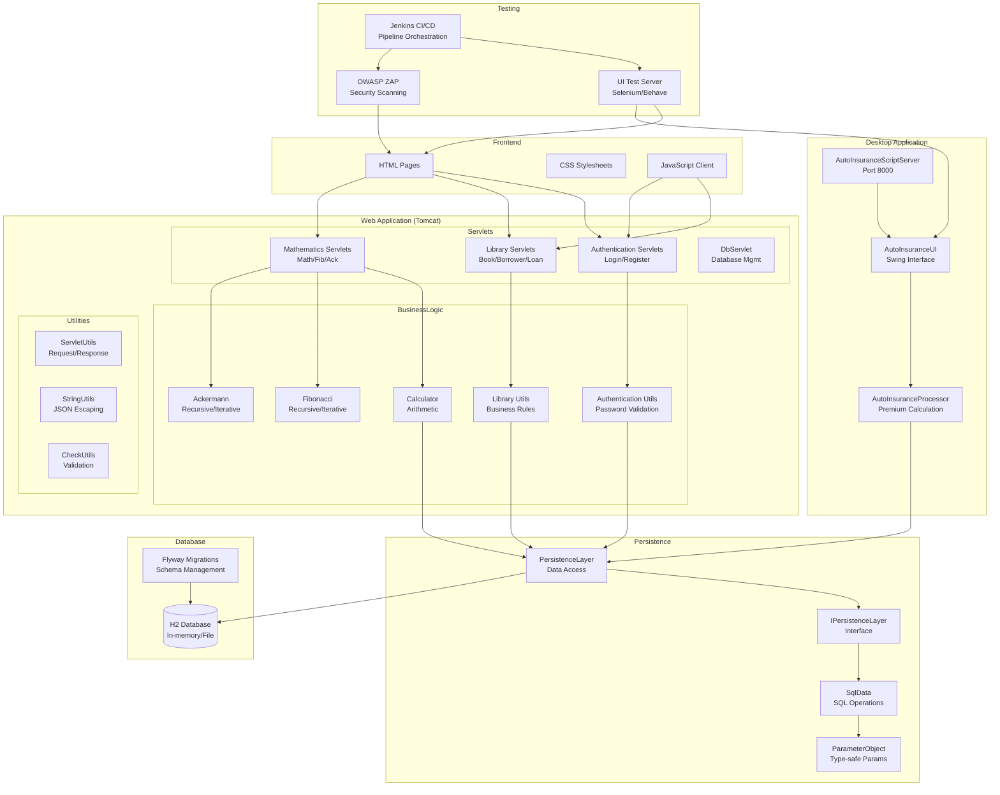

The component boundaries follow a layered architecture with clear separation between presentation (Frontend/Desktop), business logic (WebApp services), and data access (Persistence layer). Communication patterns are primarily request-response via HTTP for web interactions and custom TCP socket protocol for desktop automation. The persistence layer provides a unified data access abstraction that all business domains depend on, while mathematics services remain stateless computational components.