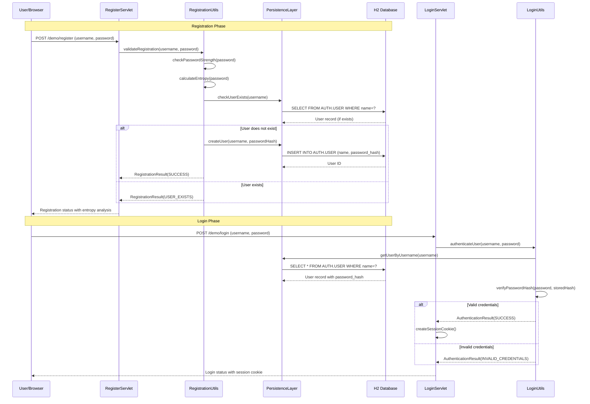
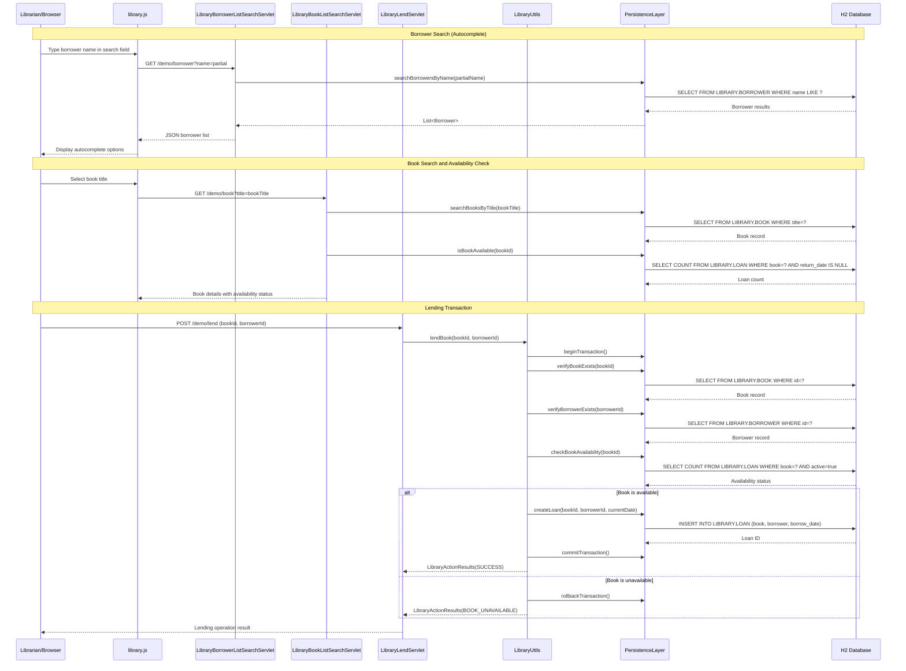
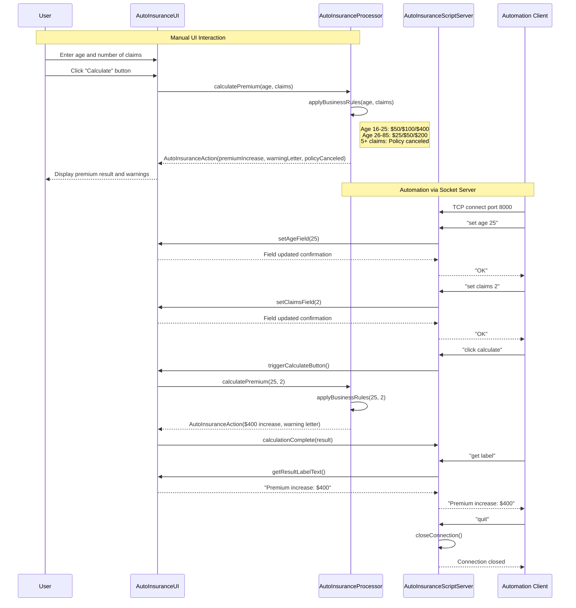
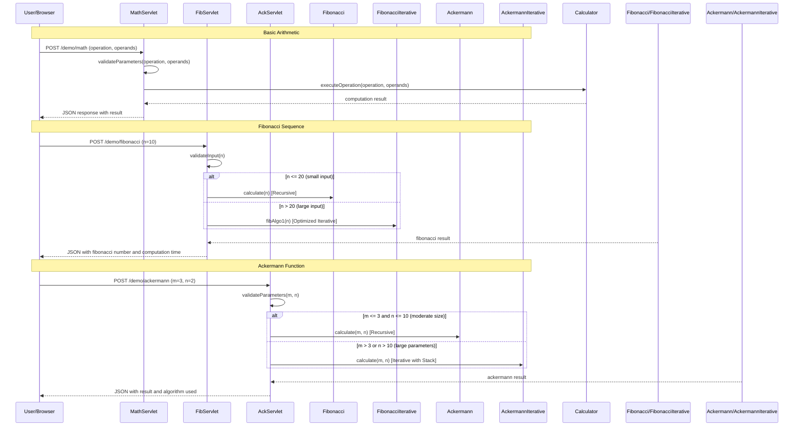
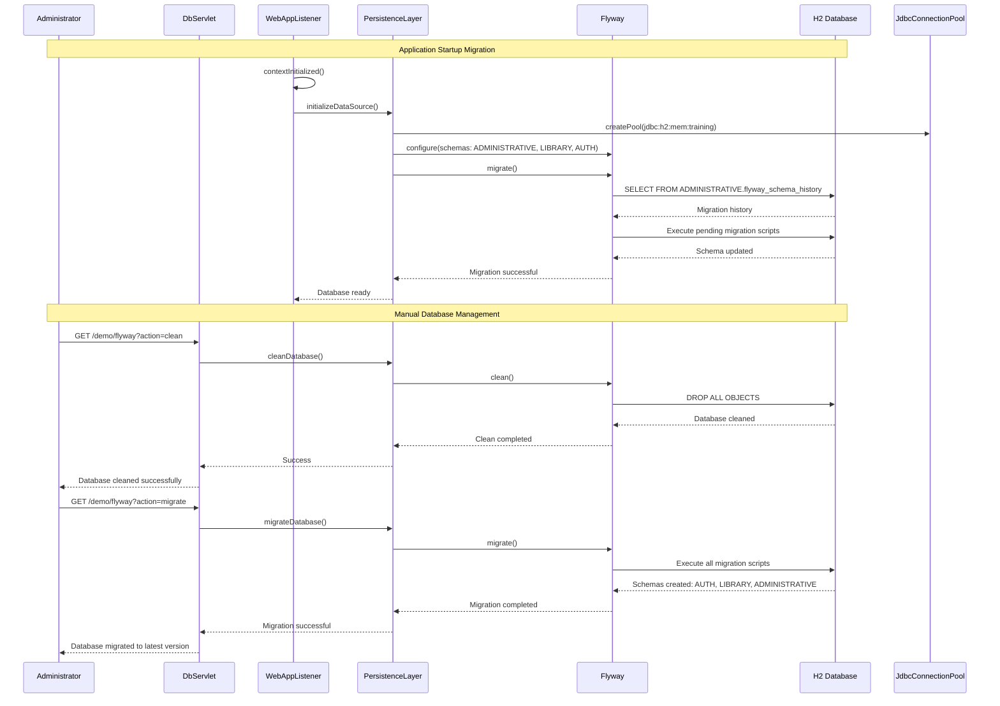
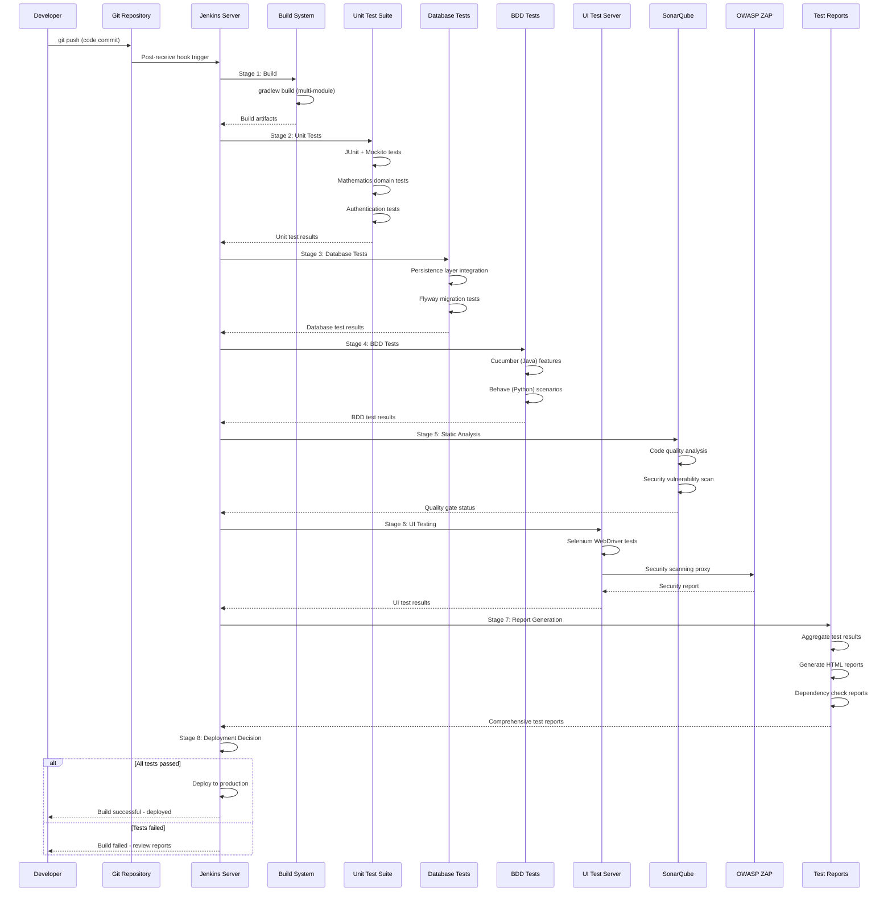
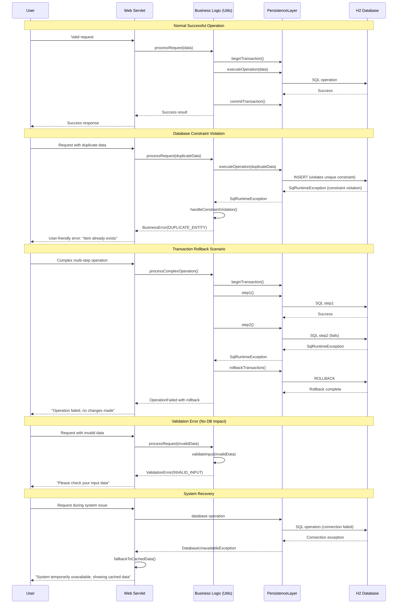

# Dynamic Interaction Flows and Sequence Diagrams

## Workflow 1: User Registration and Authentication

### Description
Complete user registration and login workflow with password validation and credential storage. This workflow demonstrates synchronous REST communication with database transactions and password strength analysis.

### Communication Patterns
- Synchronous REST API calls
- Database transactions with prepared statements
- Password entropy calculation (synchronous)
- Session management via cookies

## Workflow 2: Library Book Lending Process

### Description
Complete book lending workflow including borrower search, book availability check, and loan creation. Demonstrates complex business rules with database transactions.

### Communication Patterns
- REST API calls with JSON responses
- Database transactions with referential integrity
- Client-side autocomplete via AJAX
- Synchronous data validation

## Workflow 3: Auto Insurance Premium Calculation

### Description
Desktop application workflow for insurance premium calculation with UI automation support via socket server. Demonstrates Swing UI interactions and custom TCP protocol.

### Communication Patterns
- Desktop UI events (Swing)
- Custom TCP socket protocol
- Business rule processing
- Synchronous calculation responses

## Workflow 4: Mathematical Computation Services

### Description
Mathematical function computation workflow showing different algorithm implementations (recursive vs iterative) and their performance characteristics.

### Communication Patterns
- REST API calls
- Stateless computation services
- Algorithm selection based on input size
- Performance-optimized implementations

## Workflow 5: Database Migration and Management

### Description
Database schema migration and management workflow using Flyway, including both automated startup migrations and manual administrative operations.

### Communication Patterns
- RESTful administrative endpoints
- Database migration framework (Flyway)
- Connection pooling management
- Transactional schema operations

## Workflow 6: CI/CD Testing Pipeline

### Description
End-to-end CI/CD testing workflow showing the complete testing pipeline from code commit to production deployment with multiple testing stages.

### Communication Patterns
- Jenkins pipeline orchestration
- Multi-stage testing coordination
- Cross-service integration testing
- Asynchronous test execution
- Event-driven reporting

## Workflow 7: Error Handling and Recovery Patterns

### Description
Comprehensive error handling workflow showing exception propagation, database transaction recovery, and user-friendly error responses across different system layers.

### Communication Patterns
- Exception propagation through layers
- Database transaction rollback
- Graceful degradation
- User-friendly error messaging

