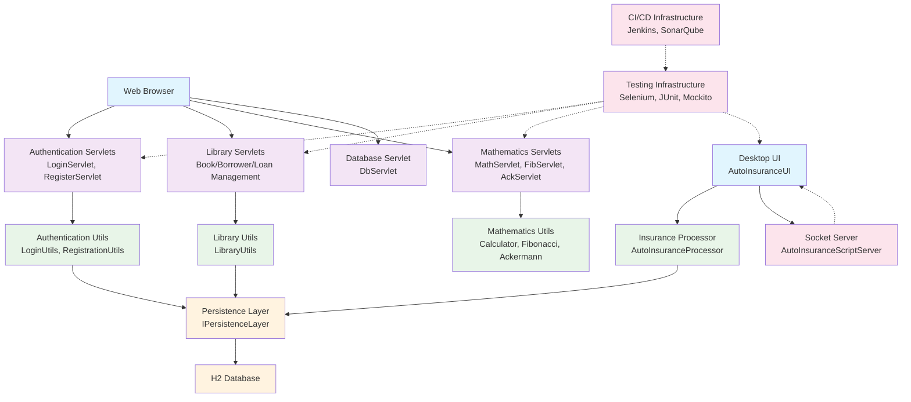

The component boundaries follow a layered architecture with clear domain separation: presentation (servlets), business logic (utils), and persistence layers. Communication patterns are primarily request-response via HTTP for web components and direct method calls for internal layers, with the persistence layer serving as a centralized data access abstraction. The desktop application operates independently with its own UI and business logic layers, connected via a custom socket protocol for automation.