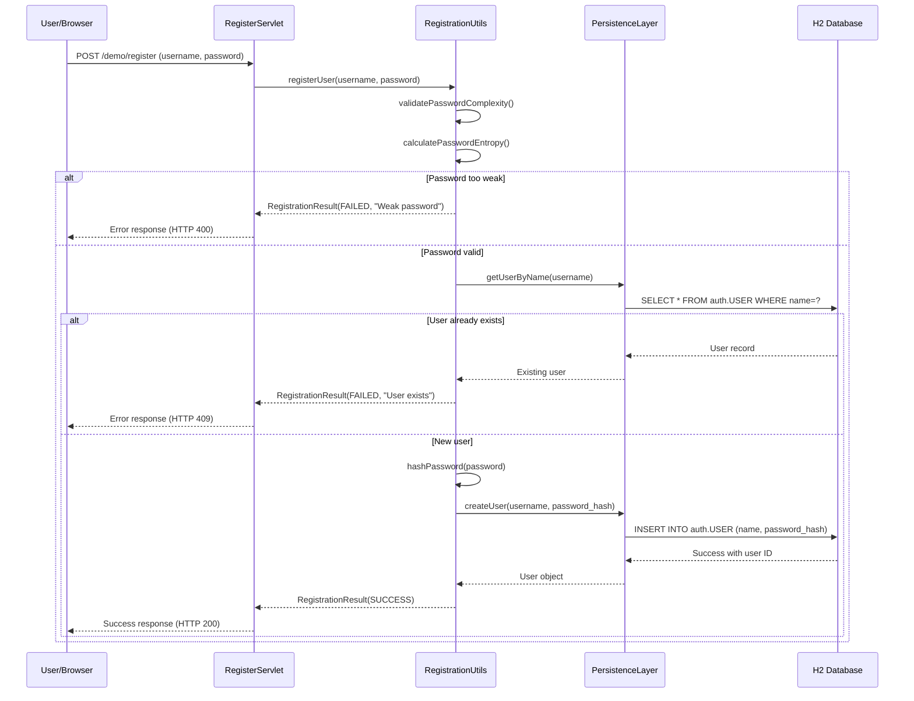
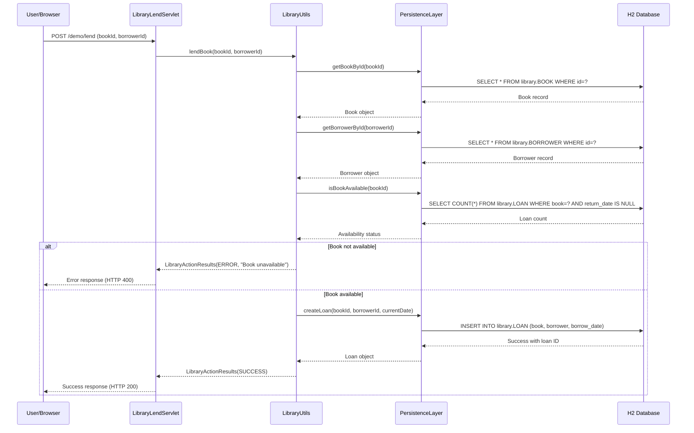
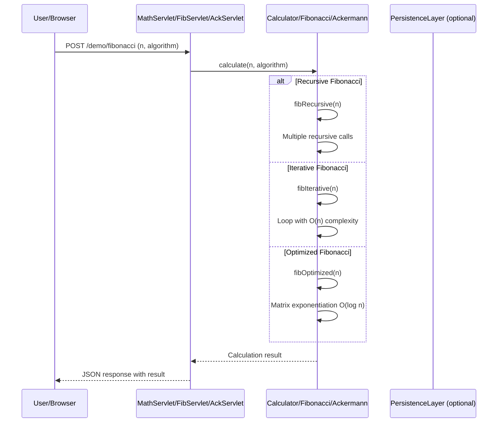
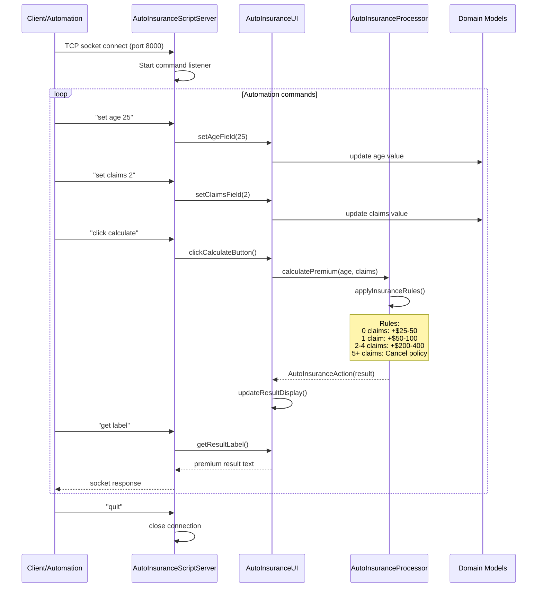
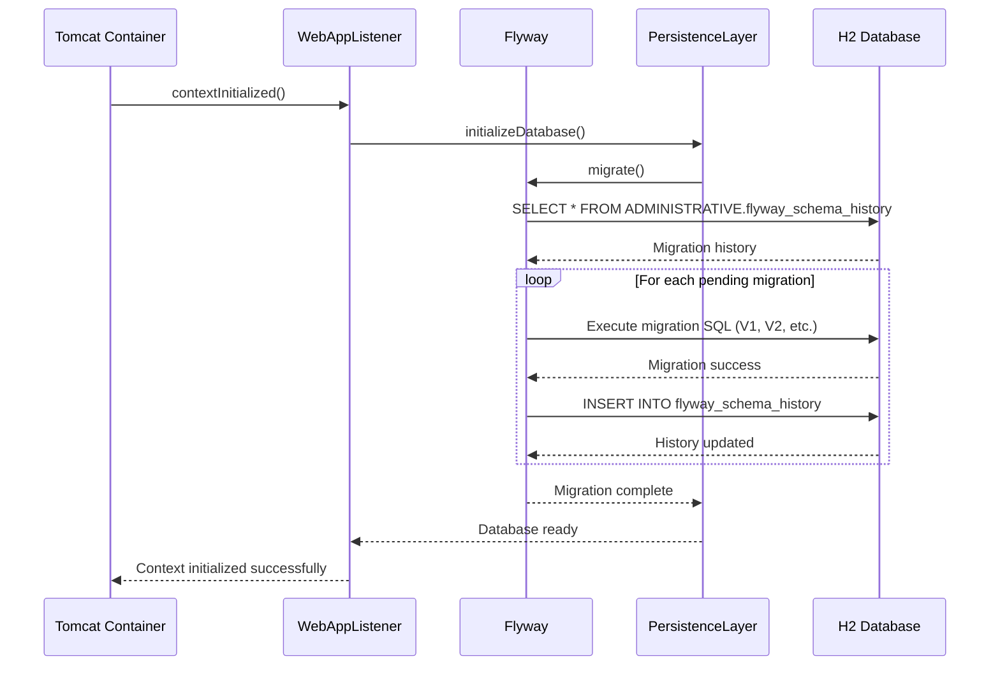
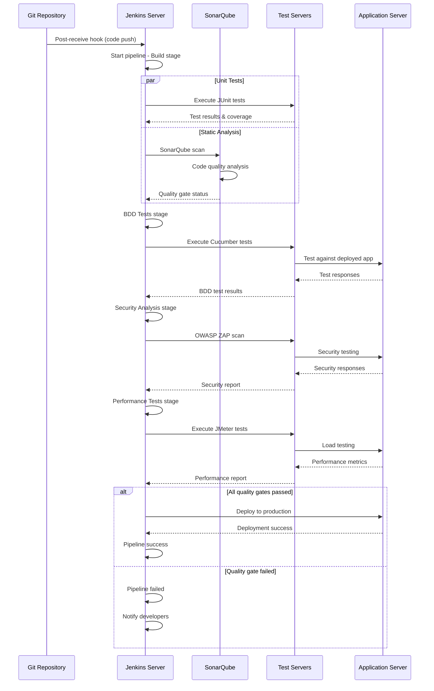
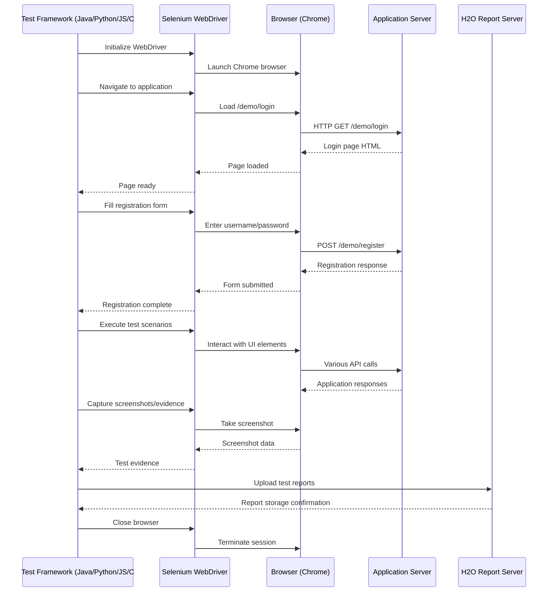
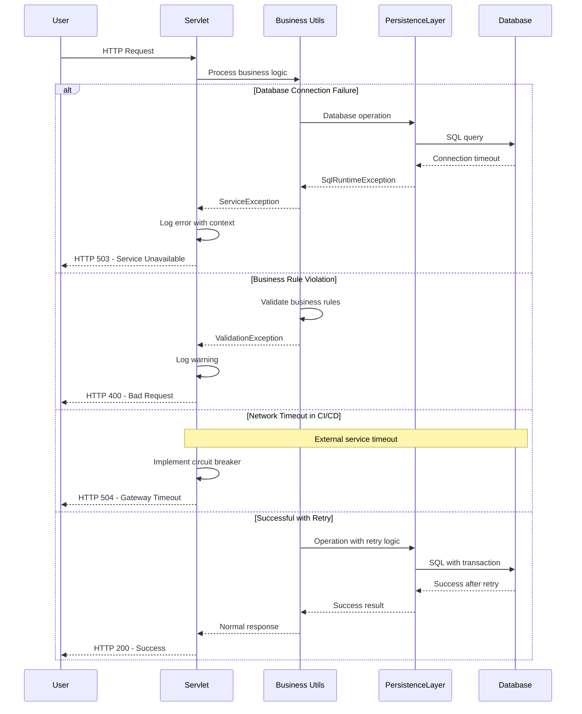

```markdown
# Dynamic Interaction Flows and Sequence Diagrams

## 1. User Registration Workflow

### Description
Complete user registration process including password validation, entropy analysis, and database persistence. Triggered when new user submits registration form.

**Communication Patterns**: REST API calls, database transactions, synchronous processing



## 2. Book Lending Workflow

### Description
Complete book lending process including availability checks, borrower validation, and loan tracking. Triggered when librarian lends book to borrower.

**Communication Patterns**: REST API calls, database transactions, business rule validation



## 3. Mathematical Computation Workflow

### Description
Complex mathematical computation (Fibonacci/Ackermann) with algorithm selection and performance optimization. Triggered when user requests mathematical calculation.

**Communication Patterns**: REST API calls, stateless computation, algorithm selection



## 4. Auto Insurance Premium Calculation Workflow

### Description
Desktop-based insurance premium calculation with socket automation interface. Triggered via Swing UI or automated socket commands.

**Communication Patterns**: Socket communication, desktop UI events, business rule processing



## 5. Database Migration Workflow

### Description
Automated database schema migration process using Flyway, triggered on application startup or via management endpoint.

**Communication Patterns**: Event-driven startup, database transactions, version management



## 6. CI/CD Pipeline Execution Workflow

### Description
Complete continuous integration and deployment pipeline with quality gates, testing stages, and security scanning.

**Communication Patterns**: Event-driven pipeline, REST API calls, asynchronous processing



## 7. Cross-Browser UI Testing Workflow

### Description
Multi-language UI testing framework executing Selenium tests across different technology stacks with centralized reporting.

**Communication Patterns**: Selenium WebDriver, REST API testing, asynchronous test execution



## 8. Error Handling and Recovery Patterns

### Description
Comprehensive error handling across service boundaries including database failures, validation errors, and network issues.

**Communication Patterns**: Exception propagation, transaction rollback, graceful degradation


```