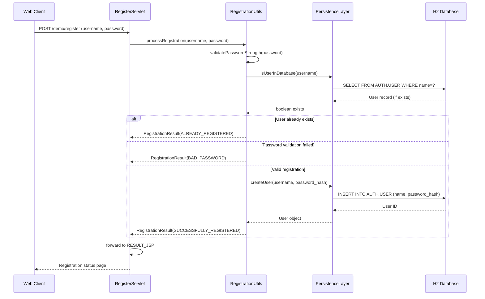
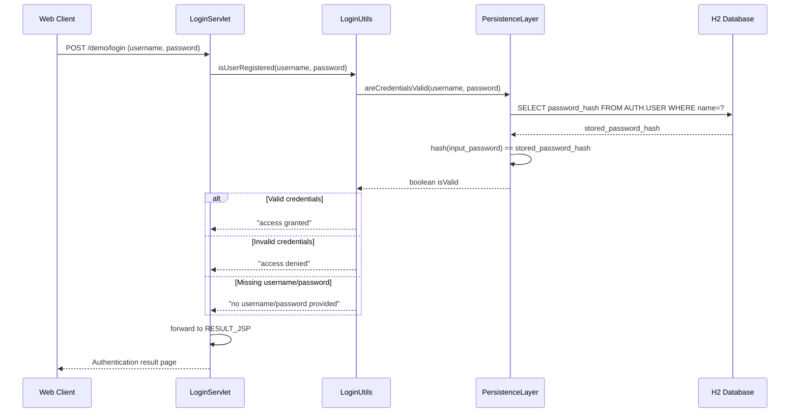
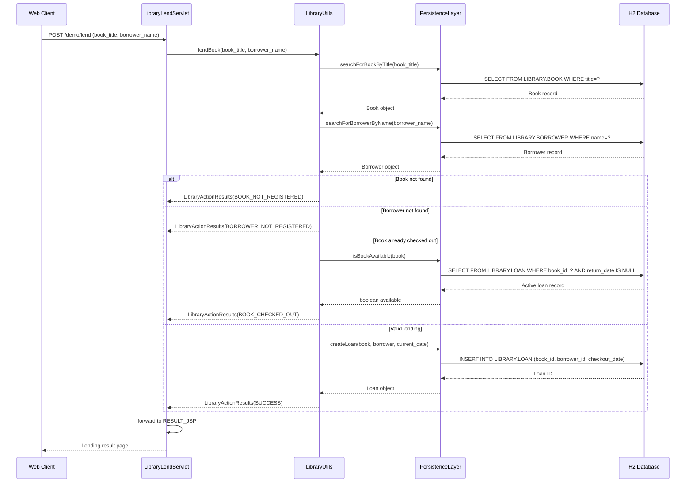
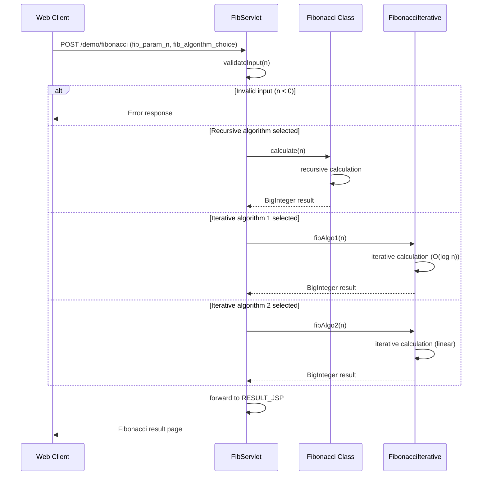
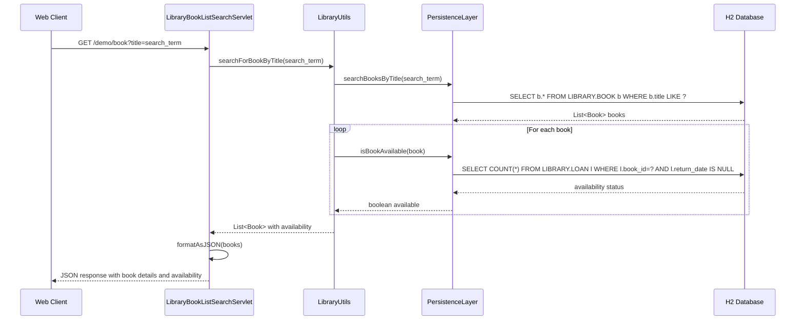
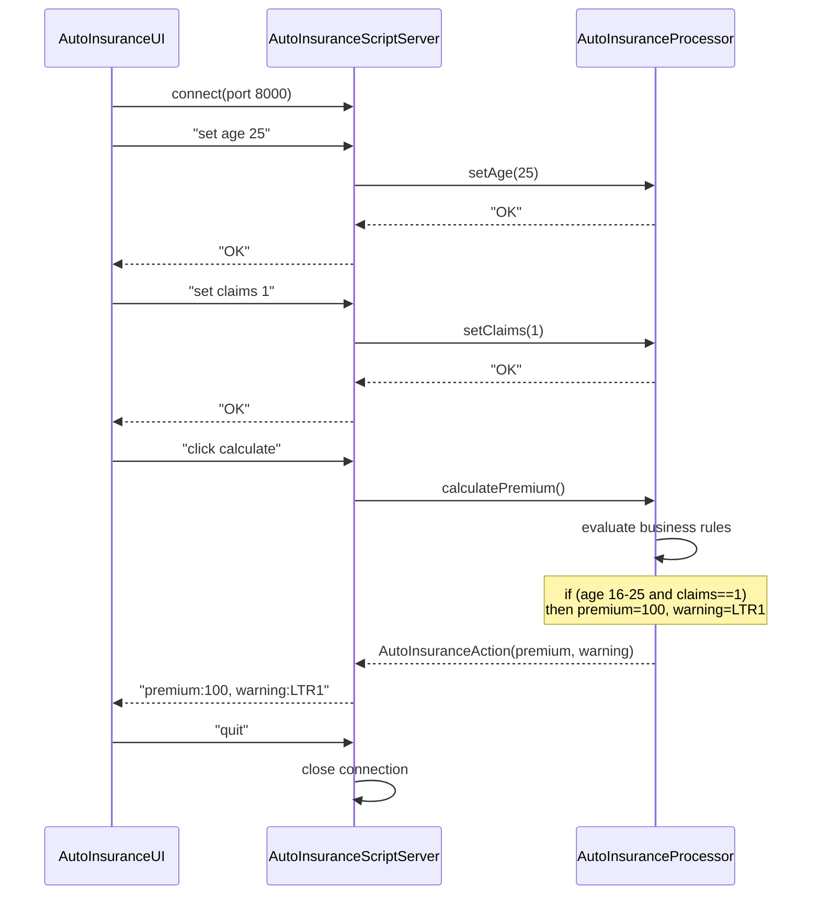
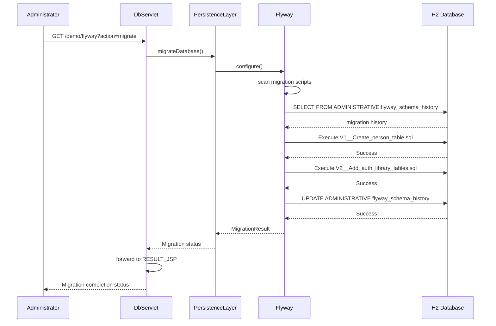
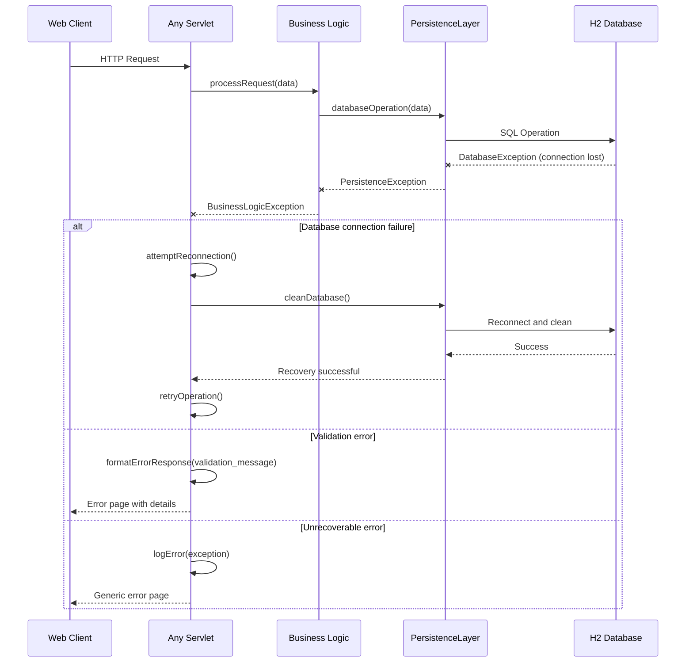
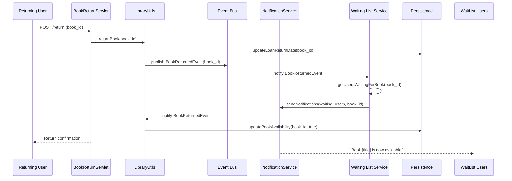

```markdown
# Dynamic Interaction Flows for Demo Application

## 1. User Registration Workflow

### Purpose & Triggers
New user registration through the registration form. Validates password strength, checks for existing users, and creates new user account.

### Communication Patterns
- Synchronous HTTP POST request
- Database transactions for user validation and creation
- Password entropy calculation service

### Sequence Diagram


## 2. User Authentication Workflow

### Purpose & Triggers
User login process validating credentials against stored user data.

### Communication Patterns
- Synchronous HTTP POST request
- Database query for credential validation
- SHA-256 password hash comparison

### Sequence Diagram


## 3. Book Lending Workflow

### Purpose & Triggers
Complete book lending process including availability checks, borrower validation, and loan creation.

### Communication Patterns
- Synchronous HTTP POST request
- Multiple database transactions
- Business logic validation for availability

### Sequence Diagram


## 4. Fibonacci Calculation Workflow

### Purpose & Triggers
Mathematical computation of Fibonacci sequence with algorithm selection.

### Communication Patterns
- Synchronous HTTP POST request
- Stateless computation (no database interaction)
- Algorithm selection and execution

### Sequence Diagram


## 5. Book Search and Availability Workflow

### Purpose & Triggers
Search for books by title and check availability status.

### Communication Patterns
- Synchronous HTTP GET request
- Database queries with JOIN operations
- JSON response formatting

### Sequence Diagram


## 6. Auto Insurance Premium Calculation Workflow

### Purpose & Triggers
Desktop application insurance premium calculation via socket communication.

### Communication Patterns
- Socket-based TCP communication
- Text-based command/response protocol
- Business rule evaluation

### Sequence Diagram


## 7. Database Migration Workflow

### Purpose & Triggers
Database schema updates and cleanup operations via Flyway migrations.

### Communication Patterns
- Synchronous HTTP GET request
- Flyway migration execution
- Database schema modifications

### Sequence Diagram


## 8. Error Handling and Recovery Pattern

### Purpose & Triggers
System-wide error handling for database failures and validation errors.

### Communication Patterns
- Exception propagation
- Transaction rollback
- Graceful degradation

### Sequence Diagram


## 9. Event-Driven Book Availability Notification

### Purpose & Triggers
Hypothetical event-driven extension for notifying when checked-out books become available.

### Communication Patterns
- Asynchronous event publication
- Database trigger simulation
- Event consumer processing

### Sequence Diagram


## Communication Pattern Summary

| Workflow | Primary Pattern | Data Flow | Error Handling |
|----------|-----------------|-----------|----------------|
| User Registration | Synchronous HTTP + DB Transaction | Client → Servlet → Business → DB | Validation errors, duplicate user |
| Authentication | Synchronous HTTP + Credential Validation | Client → Servlet → Auth Logic → DB | Invalid credentials, missing data |
| Book Lending | Synchronous HTTP + Multi-Table Transaction | Client → Servlet → Library Logic → DB | Availability checks, validation |
| Fibonacci Calc | Stateless Computation | Client → Servlet → Algorithm | Input validation, overflow |
| Book Search | Query + Response | Client → Servlet → DB → JSON | Empty results, DB errors |
| Insurance Calc | Socket Protocol | Desktop → Socket Server → Business | Protocol errors, invalid data |
| DB Migration | Administrative Operation | Admin → Servlet → Flyway → DB | Migration failures, rollback |
| Error Recovery | Exception Propagation | All layers → Error handler | Reconnection, graceful degradation |
```