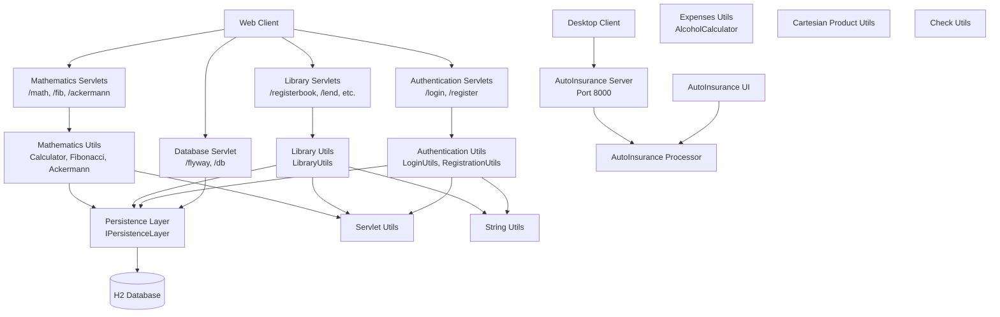

The component boundaries follow a classic layered architecture with clear separation between presentation (Servlets), business logic (Utils classes), and data access (PersistenceLayer) layers. Communication patterns are primarily synchronous HTTP for web interactions and direct method calls between layers, with the persistence layer serving as a shared dependency across all business domains. The desktop application operates independently with its own socket-based communication protocol.