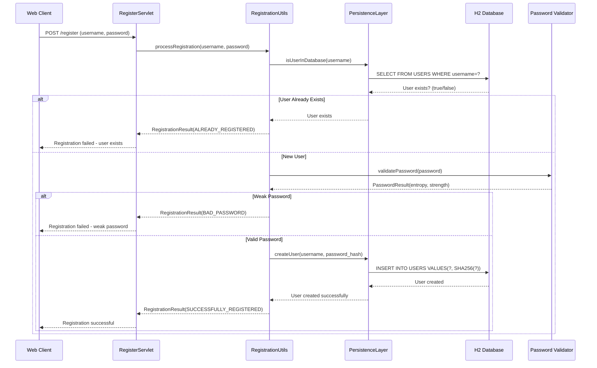
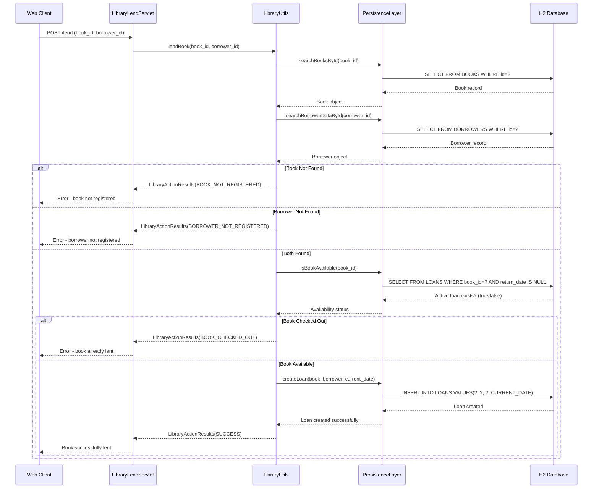
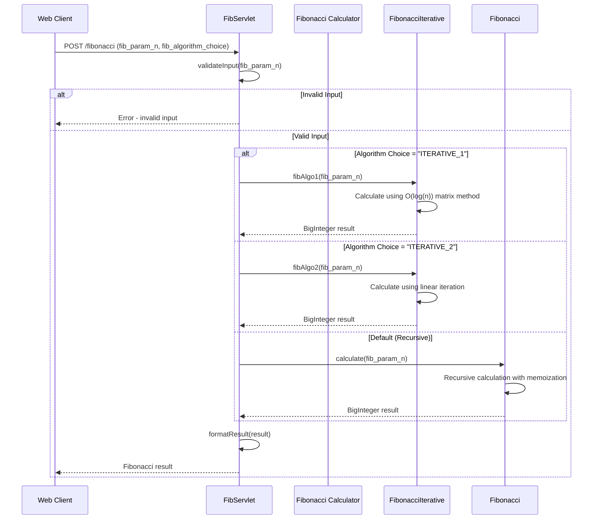
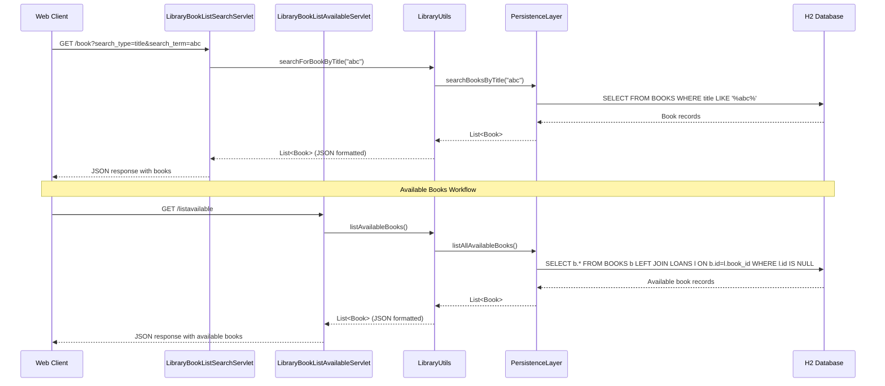
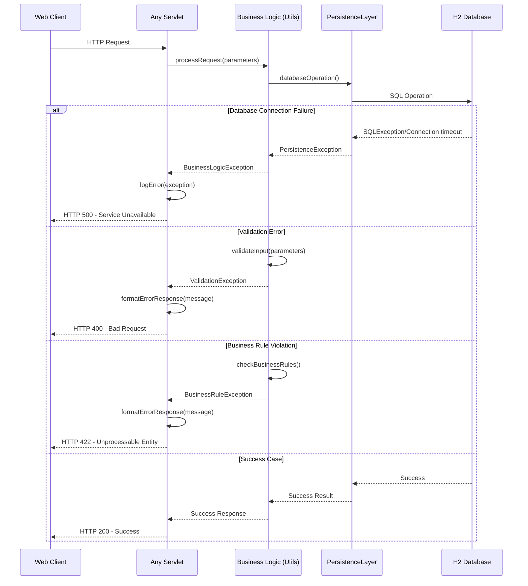
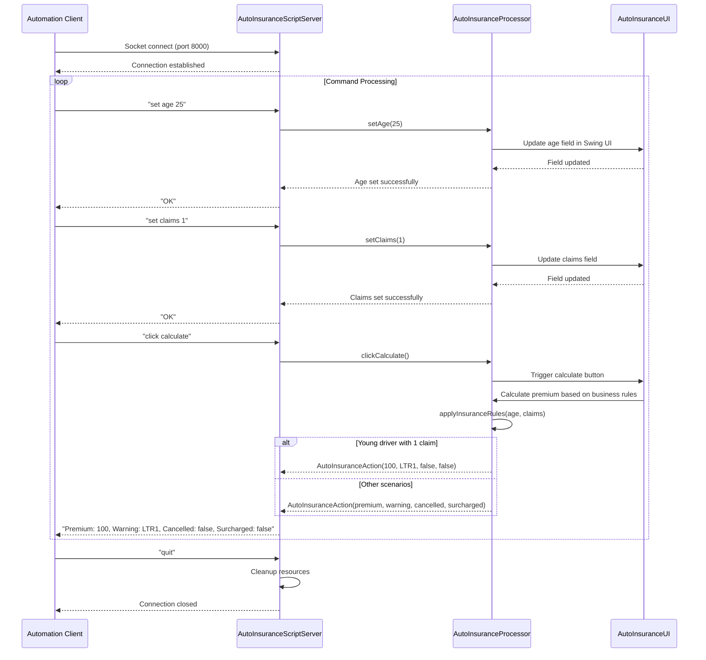
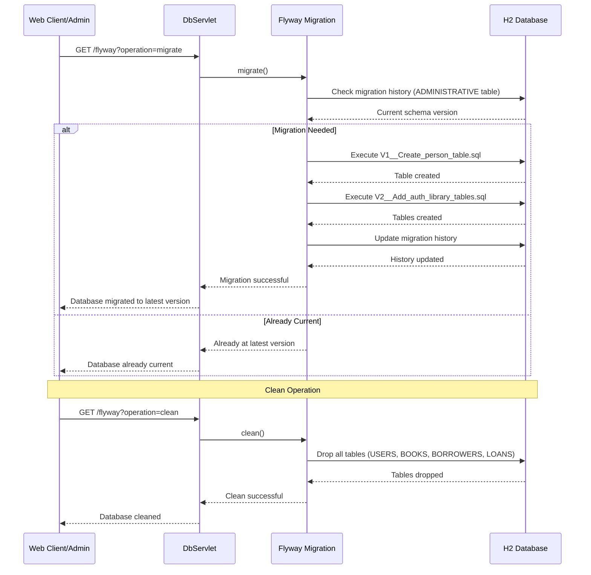

```markdown
# Dynamic Interaction Flows and Sequence Diagrams

## Workflow 1: User Registration

### Description
**Purpose**: Register a new user with password validation and duplicate checking
**Triggers**: HTTP POST request to `/register` endpoint with username and password
**Communication Patterns**: Synchronous HTTP, database transactions, password entropy analysis



## Workflow 2: Book Lending Process

### Description
**Purpose**: Lend a book to a registered borrower with availability validation
**Triggers**: HTTP POST request to `/lend` endpoint with book_id and borrower_id
**Communication Patterns**: Synchronous HTTP, database transactions, business rule validation



## Workflow 3: Fibonacci Calculation with Algorithm Selection

### Description
**Purpose**: Calculate Fibonacci sequence using multiple algorithm implementations
**Triggers**: HTTP POST request to `/fibonacci` with parameter n and algorithm choice
**Communication Patterns**: Synchronous HTTP, computational algorithms, input validation



## Workflow 4: Book Search and Availability Listing

### Description
**Purpose**: Search for books and list available books with filtering options
**Triggers**: HTTP GET requests to `/book`, `/borrower`, and `/listavailable` endpoints
**Communication Patterns**: Synchronous HTTP, database queries, JSON response formatting



## Workflow 5: Error Handling and Recovery Patterns

### Description
**Purpose**: Handle various error scenarios including database failures, validation errors, and business rule violations
**Triggers**: Exception conditions during normal workflow execution
**Communication Patterns**: Exception propagation, error response formatting, database rollback



## Workflow 6: Desktop Application Automation

### Description
**Purpose**: Automate desktop insurance application through socket-based command protocol
**Triggers**: Socket connection on port 8000 with text commands
**Communication Patterns**: Socket communication, synchronous command/response, UI automation



## Workflow 7: Database Migration and Maintenance

### Description
**Purpose**: Manage database schema migrations and maintenance operations
**Triggers**: HTTP GET request to `/flyway` endpoint with operation parameter
**Communication Patterns**: Synchronous HTTP, Flyway migration tool, database DDL operations

