```mermaid
graph TB
    %% Web Layer Components
    MathServlet[MathServlet]
    FibServlet[FibServlet]
    AckServlet[AckServlet]
    LibraryServlet[LibraryServlets]
    LoginServlet[LoginServlet]
    RegisterServlet[RegisterServlet]
    DbServlet[DbServlet]
    
    %% Business Logic Layer
    Calculator[Calculator]
    Fibonacci[Fibonacci]
    FibonacciIterative[FibonacciIterative]
    Ackermann[Ackermann]
    LibraryUtils[LibraryUtils]
    LoginUtils[LoginUtils]
    RegistrationUtils[RegistrationUtils]
    AutoInsuranceProcessor[AutoInsuranceProcessor]
    
    %% Persistence Layer
    PersistenceLayer[PersistenceLayer]
    IPersistenceLayer[IPersistenceLayer]
    SqlData[SqlData]
    
    %% Domain Models
    Book[Book]
    Borrower[Borrower]
    Loan[Loan]
    User[User]
    
    %% Database
    H2DB[(H2 Database)]
    
    %% Desktop Application
    AutoInsuranceUI[AutoInsuranceUI]
    
    %% Communication Flows
    MathServlet --> Calculator
    FibServlet --> Fibonacci
    FibServlet --> FibonacciIterative
    AckServlet --> Ackermann
    LibraryServlet --> LibraryUtils
    LoginServlet --> LoginUtils
    RegisterServlet --> RegistrationUtils
    
    %% Business Logic to Persistence
    Calculator --> PersistenceLayer
    LibraryUtils --> PersistenceLayer
    LoginUtils --> PersistenceLayer
    RegistrationUtils --> PersistenceLayer
    AutoInsuranceProcessor --> PersistenceLayer
    
    %% Persistence to Database
    PersistenceLayer --> H2DB
    PersistenceLayer -.-> IPersistenceLayer
    
    %% Domain Object Usage
    LibraryUtils --> Book
    LibraryUtils --> Borrower
    LibraryUtils --> Loan
    LoginUtils --> User
    RegistrationUtils --> User
    
    %% Desktop Application Flow
    AutoInsuranceUI --> AutoInsuranceProcessor
    
    %% Helper Utilities (Background Services)
    WebAppListener[WebAppListener]
    ServletUtils[ServletUtils]
    WebAppListener --> PersistenceLayer

```

The component boundaries follow a classic layered architecture with clear separation between presentation (Servlets), business logic (Utils classes), and data access (PersistenceLayer) layers. Communication patterns primarily use direct method calls within the JVM, with servlets delegating to business logic classes that coordinate domain objects and persistence operations. The persistence layer serves as a central abstraction point for all database interactions, implementing a micro-ORM pattern that supports multiple business domains through a unified interface.