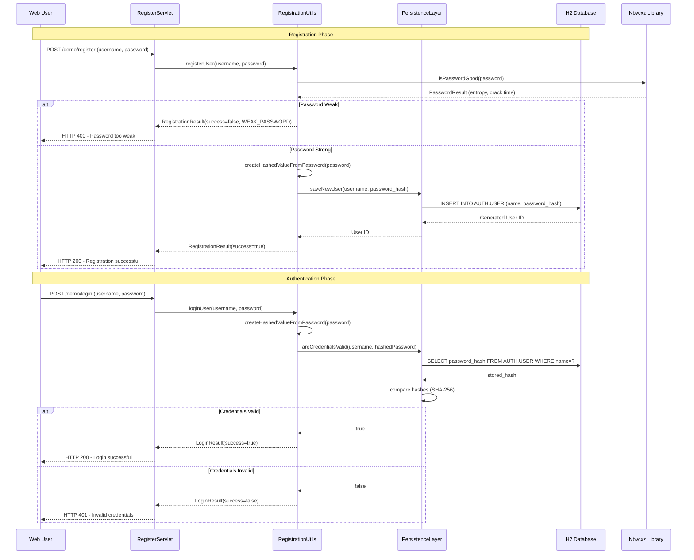
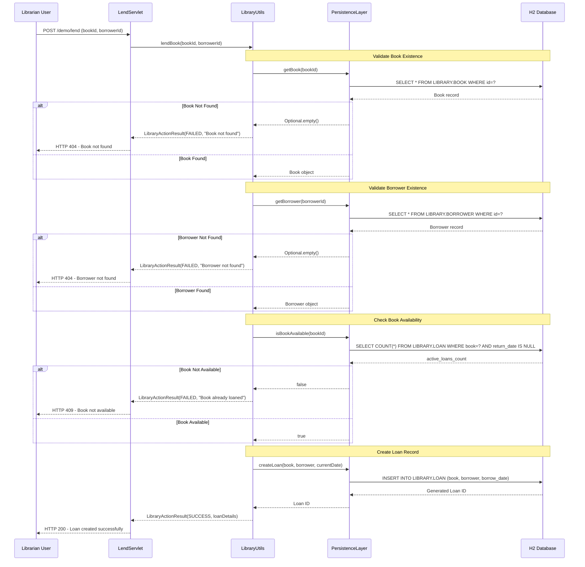
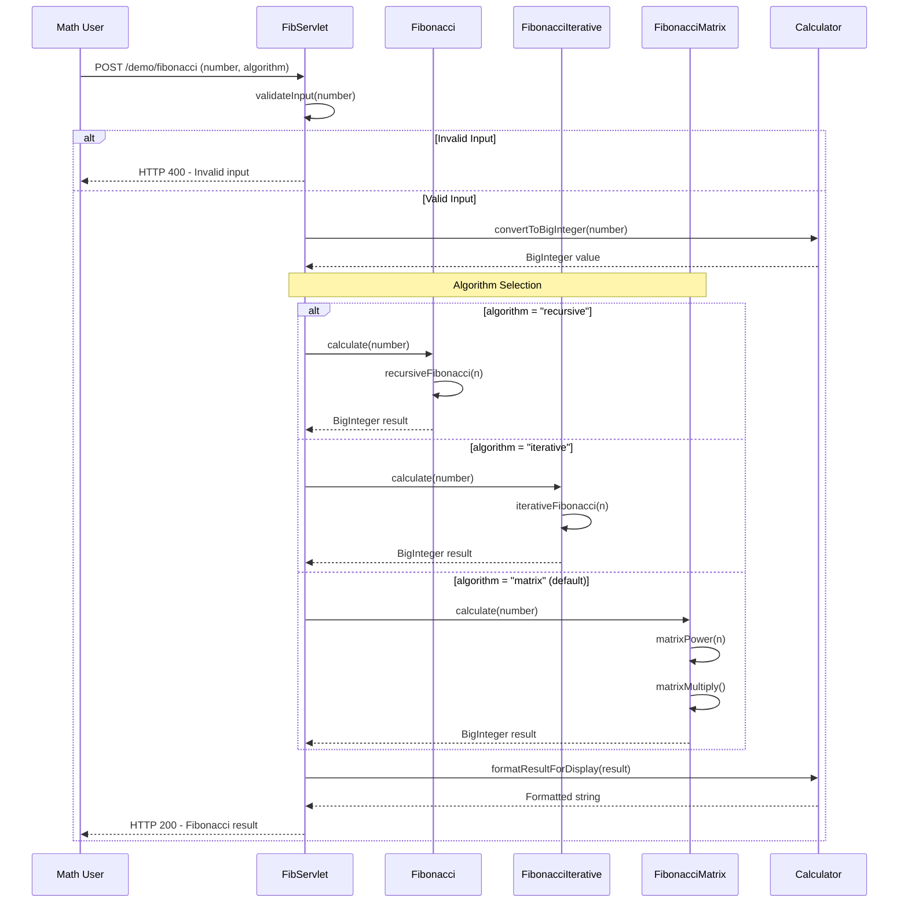
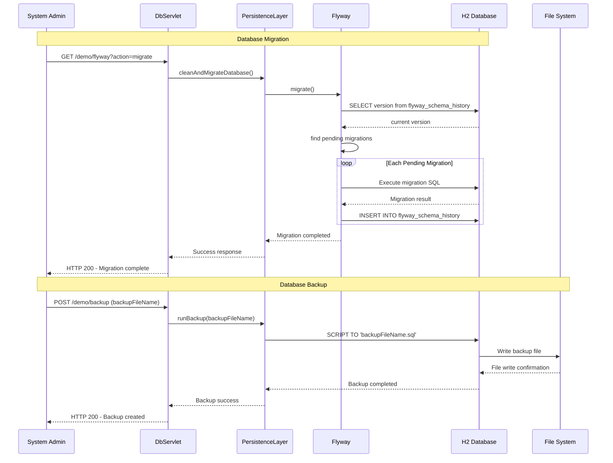
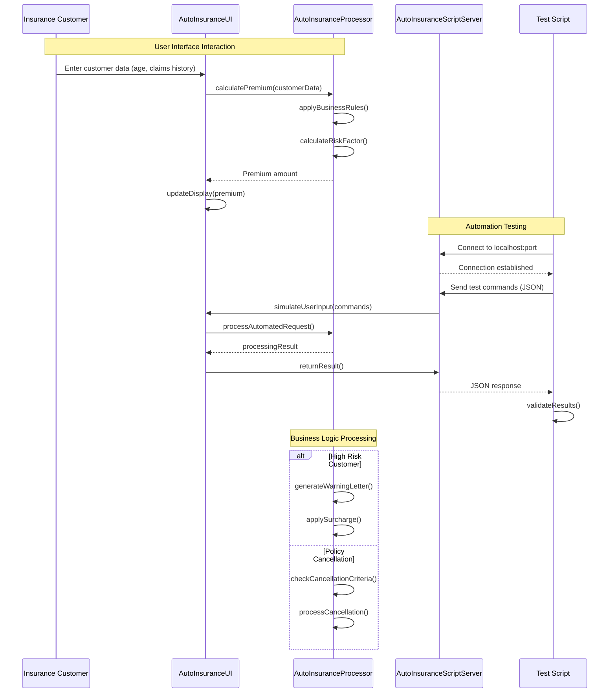
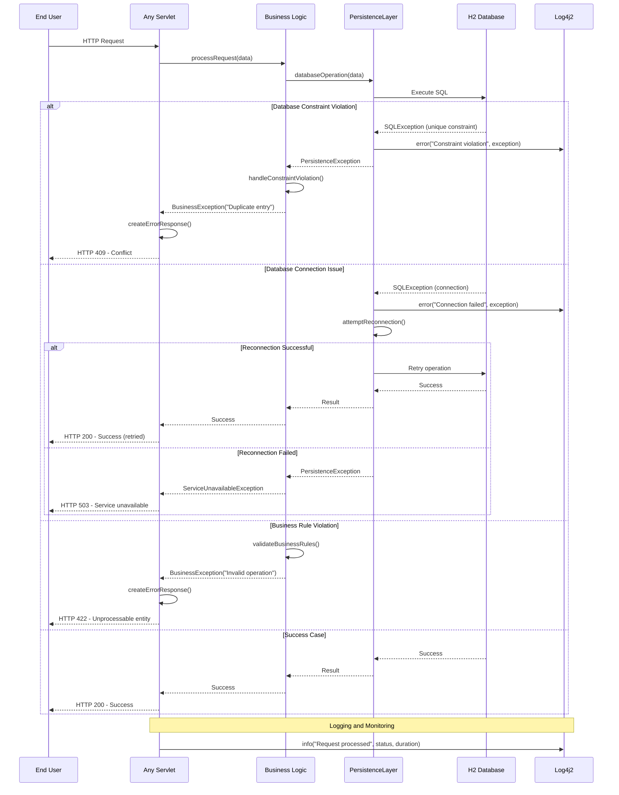

```markdown
# Dynamic Interaction Flows - Coveros Demo Application

## Workflow 1: User Registration and Authentication

### Description
Complete user registration and authentication workflow including password validation, secure storage, and credential verification. Demonstrates the security domain with password strength analysis using entropy calculations.

### Sequence Diagram


## Workflow 2: Library Book Lending Process

### Description
Complete book lending workflow demonstrating library management domain interactions. Shows book availability checking, borrower validation, and loan creation with business rule enforcement.

### Sequence Diagram


## Workflow 3: Fibonacci Calculation with Multiple Algorithms

### Description
Mathematical computation workflow showing three different Fibonacci algorithm implementations with performance characteristics. Demonstrates algorithm selection and large number handling with BigInteger.

### Sequence Diagram


## Workflow 4: Database Migration and Backup Process

### Description
Database management workflow showing Flyway migration execution and database backup operations. Demonstrates application lifecycle management and persistence layer coordination.

### Sequence Diagram


## Workflow 5: Auto Insurance Processing (Desktop Application)

### Description
Desktop application workflow showing Swing UI interactions with business logic processing and socket-based automation. Demonstrates multi-tier desktop application architecture.

### Sequence Diagram


## Workflow 6: Error Handling and Recovery Patterns

### Description
Comprehensive error handling workflow showing exception propagation, database constraint violations, and recovery mechanisms across different domains.

### Sequence Diagram


## Communication Patterns Summary

### Synchronous Communication
- **REST API Calls**: HTTP requests between clients and servlets
- **Database Transactions**: JDBC calls with immediate responses
- **Direct Method Calls**: Within JVM for business logic
- **Socket Communication**: Desktop automation with request-response

### Asynchronous Patterns
- **Event-Driven UI**: Swing event handling
- **Background Processing**: Insurance calculation threads
- **Database Migrations**: Flyway execution during startup

### Data Flow Characteristics
- **Request-Response**: Most web interactions
- **CRUD Operations**: Library and authentication domains
- **Computational Intensive**: Mathematical algorithms
- **Batch Processing**: Database backups and migrations
```