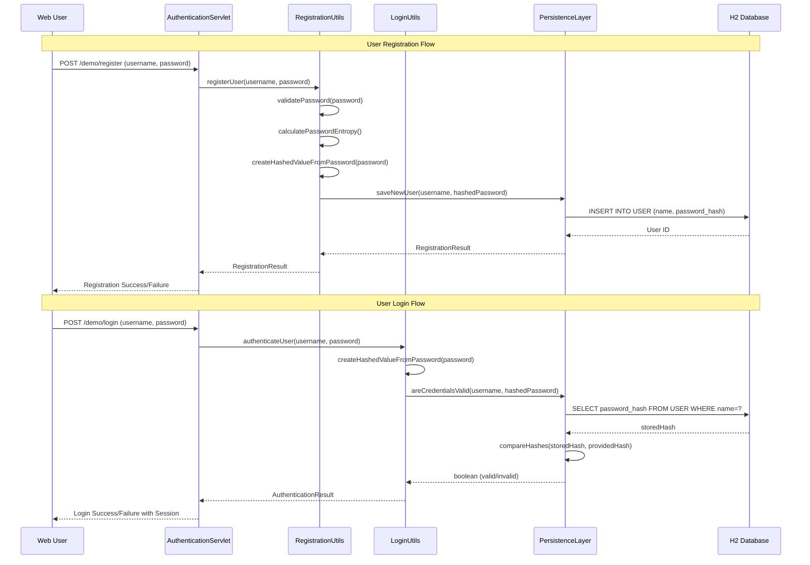
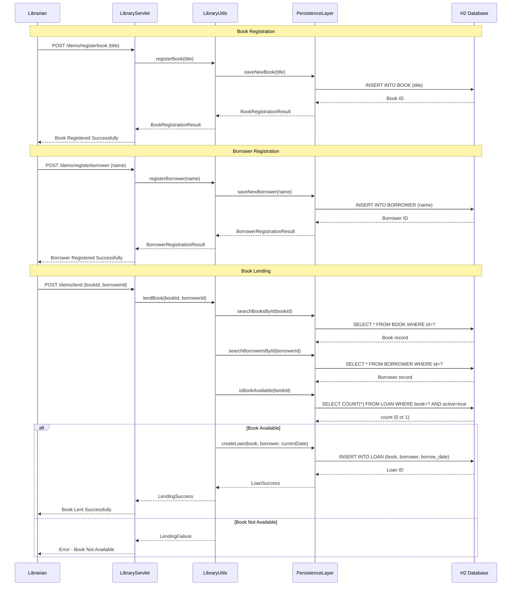
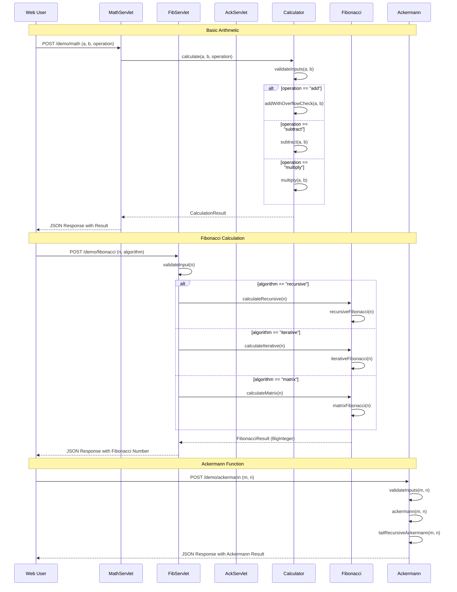
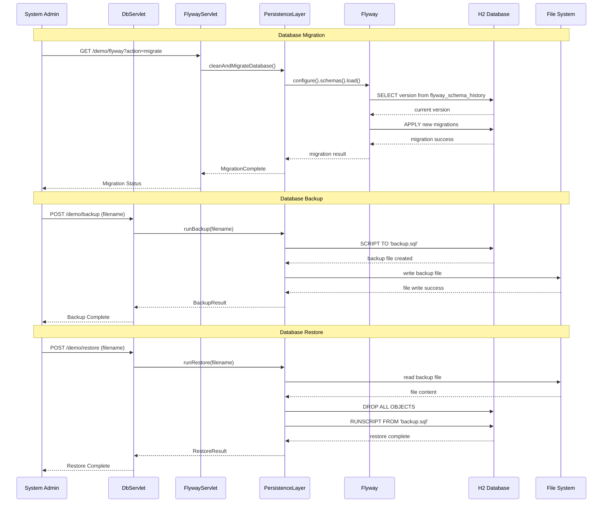
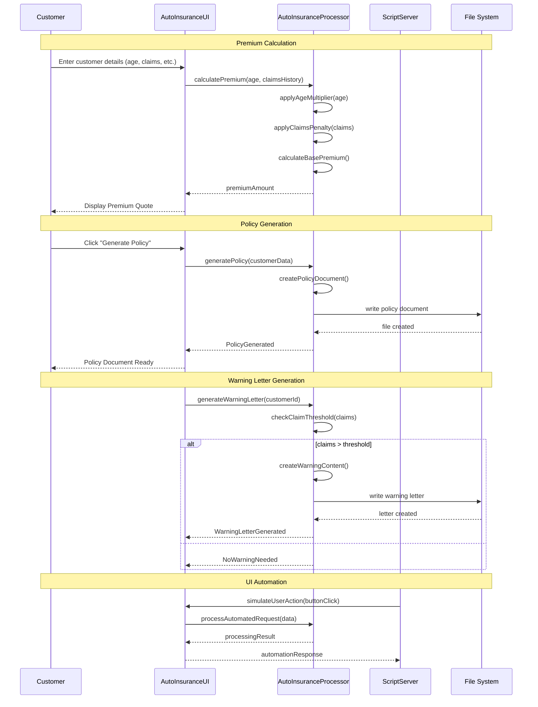
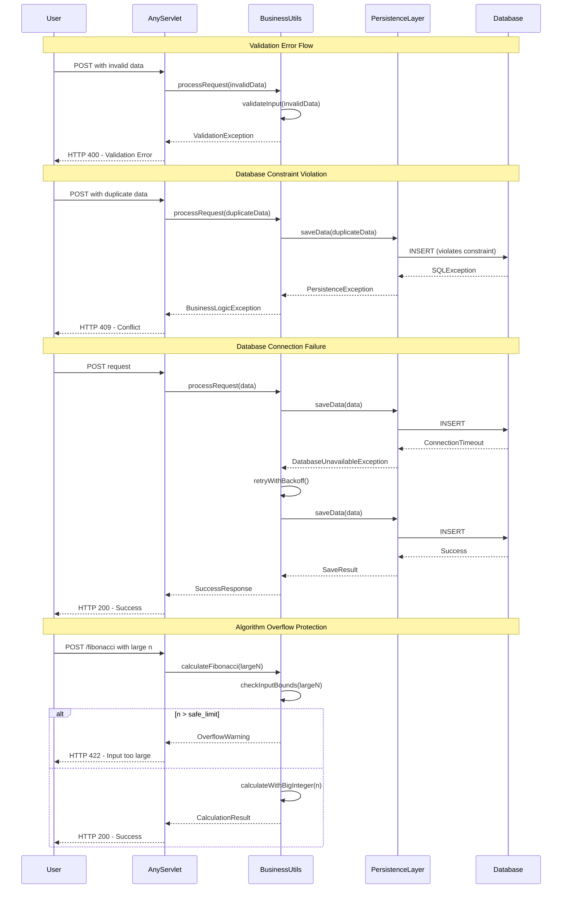

```markdown
# Dynamic Interaction Flows and Sequence Diagrams

## Workflow 1: User Authentication Flow

### Description
Complete user authentication workflow including registration, login, and credential validation. This workflow demonstrates the password strength validation and secure authentication process.

### Communication Patterns
- Synchronous REST API calls
- Database transactions with JDBC
- SHA-256 password hashing
- Session management



## Workflow 2: Library Book Lending Process

### Description
Complete book lending workflow including book and borrower registration, availability checking, and loan creation. Demonstrates business rule enforcement and transaction management.

### Communication Patterns
- Synchronous REST API calls
- Database transactions with constraints
- Business logic validation
- JSON serialization for responses



## Workflow 3: Mathematical Calculation Pipeline

### Description
Mathematical operation workflow demonstrating different algorithm implementations and error handling for large number calculations. Shows both basic arithmetic and complex recursive functions.

### Communication Patterns
- Synchronous REST API calls
- Algorithm selection based on parameters
- BigInteger handling for overflow protection
- Stateless computation



## Workflow 4: Database Migration and Backup Process

### Description
System administration workflow for database migrations, backups, and schema management using Flyway. Demonstrates database lifecycle management.

### Communication Patterns
- Synchronous REST API calls
- Flyway migration commands
- File system operations for backups
- Transactional schema updates



## Workflow 5: Insurance Processing Desktop Application

### Description
Desktop application workflow for insurance premium calculation and policy management. Demonstrates Swing UI interactions with backend business logic.

### Communication Patterns
- Swing UI event handling
- In-process method calls
- Business logic computation
- File I/O for document generation



## Workflow 6: Error Handling and Recovery Patterns

### Description
Comprehensive error handling workflow showing exception propagation, validation failures, and recovery mechanisms across different domains.

### Communication Patterns
- Exception propagation
- Validation error responses
- Transaction rollback
- Graceful degradation

