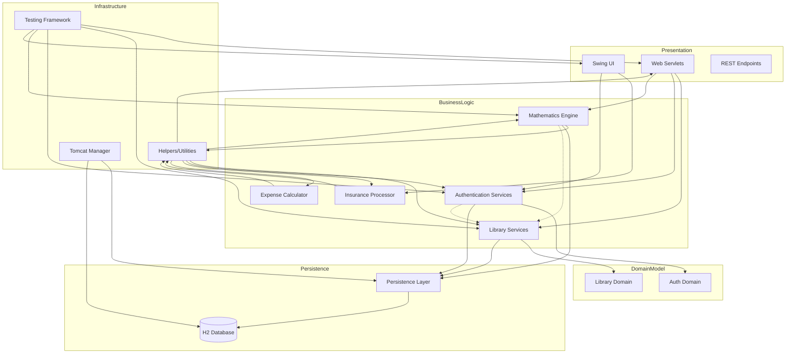

```markdown
1. **Mermaid Diagram:**



2. **Rationale:**

The component boundaries follow a layered architecture with clear separation between presentation, business logic, domain models, and persistence. Communication patterns primarily use direct method calls within layers, with the persistence layer abstracted through the IPersistenceLayer interface. The helpers package provides cross-cutting utilities used by all other components, while the domain objects ensure type-safe data transfer between layers through immutable patterns.
```