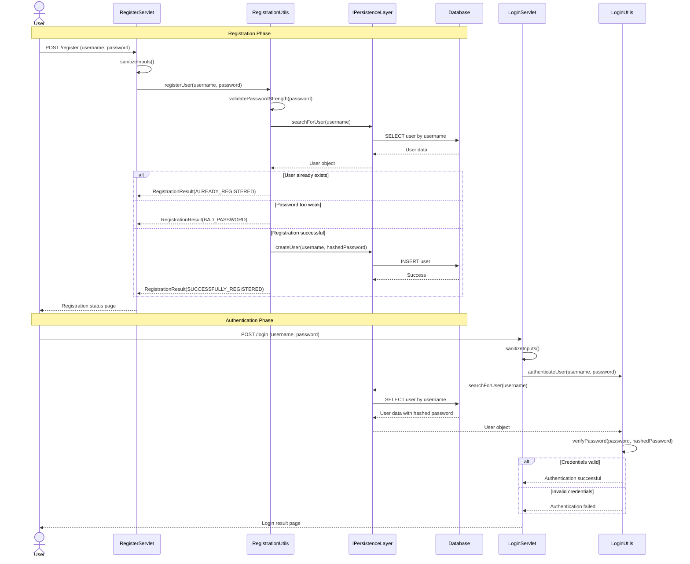
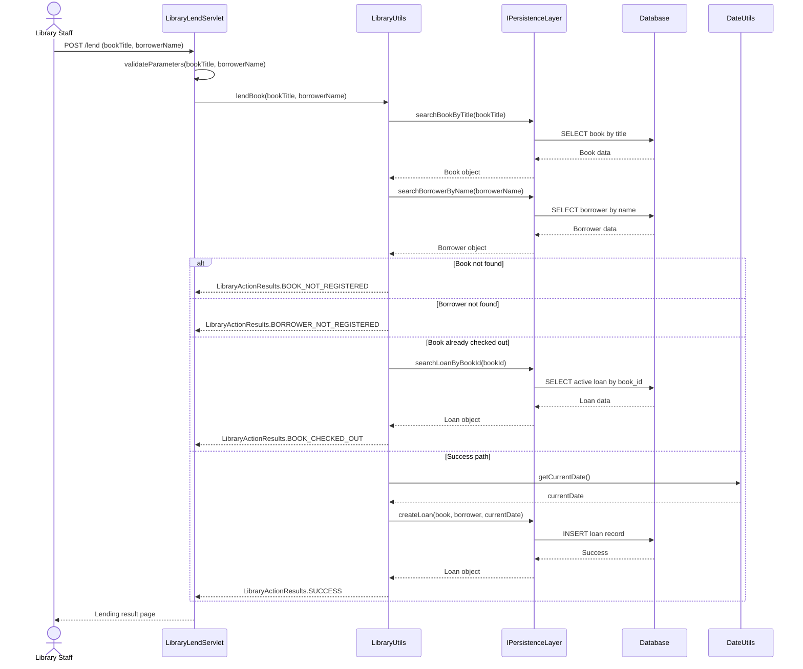
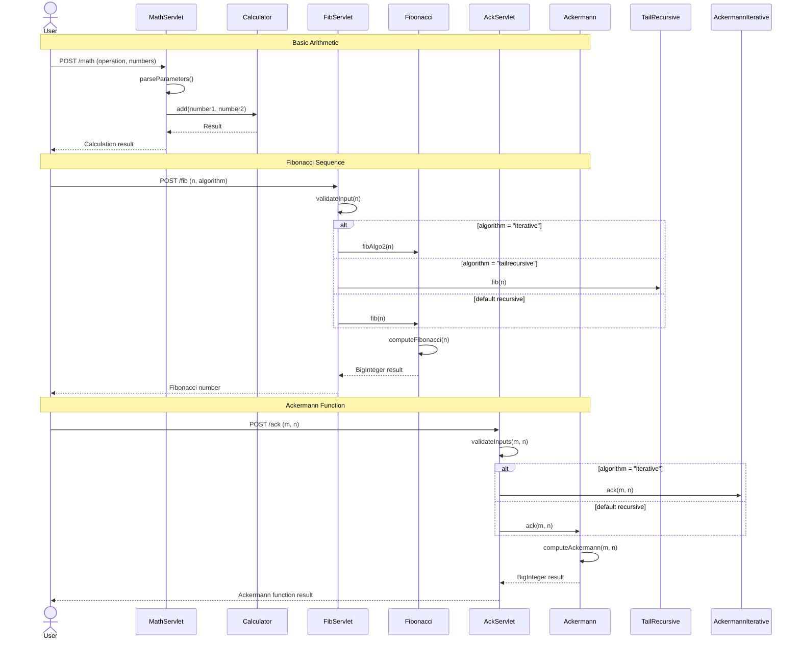
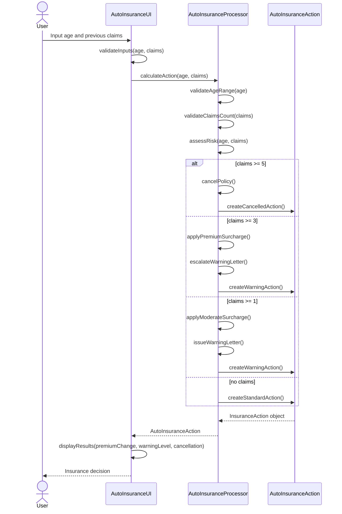
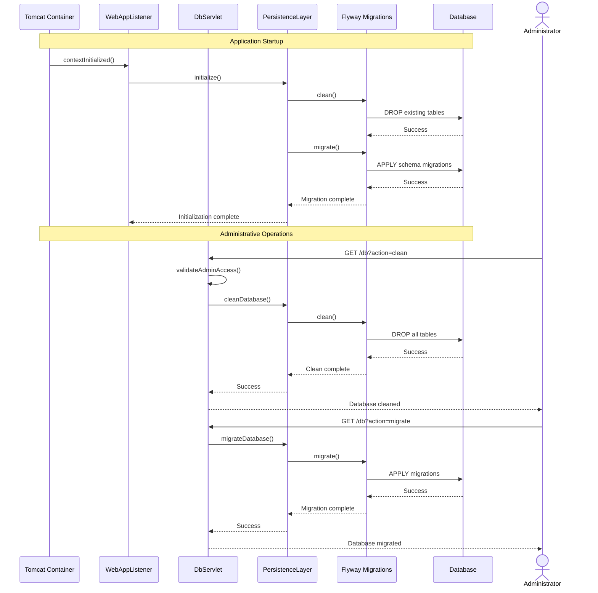
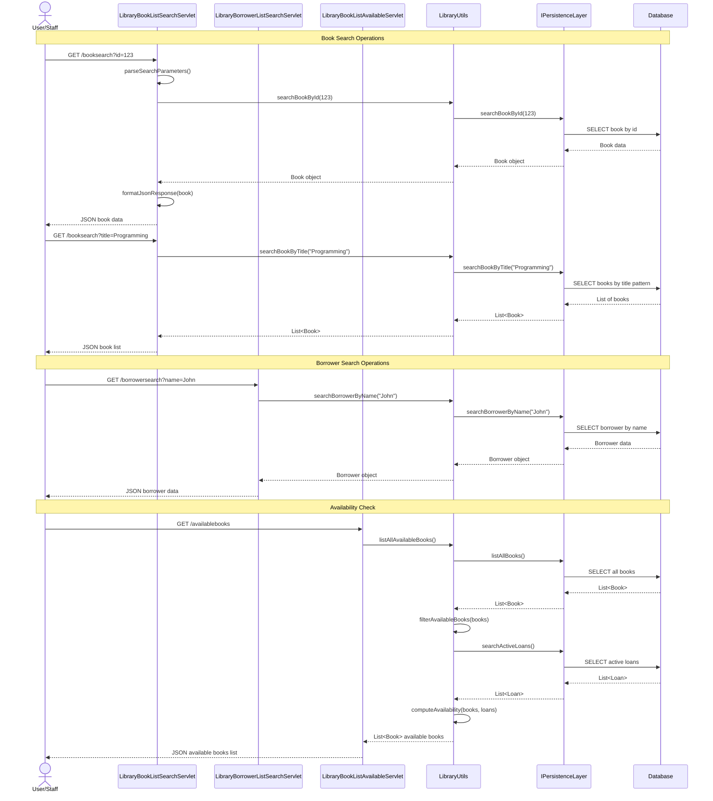
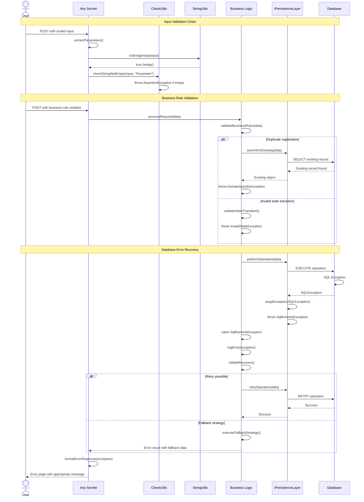

```markdown
# Dynamic Interaction Flows and Sequence Diagrams

## Workflow 1: User Registration and Authentication

### Description
This workflow handles new user registration and subsequent authentication within the library management system. It ensures secure user onboarding with password strength validation and prevents duplicate registrations.

**Triggers**: User submits registration form with username and password
**Communication Patterns**: Synchronous REST calls, database transactions, password entropy validation



## Workflow 2: Book Lending (Check-out) Process

### Description
This workflow manages the complete book lending lifecycle, including borrower validation, book availability checking, and loan record creation with date tracking.

**Triggers**: Library staff initiates book check-out for registered borrower
**Communication Patterns**: Synchronous REST calls, database transactions, date arithmetic



## Workflow 3: Mathematical Computation Service

### Description
This workflow demonstrates educational mathematical computations (Fibonacci, Ackermann) through web interfaces, showcasing different algorithm implementations and computational efficiency.

**Triggers**: User requests mathematical computation via web form
**Communication Patterns**: Synchronous REST calls, algorithm processing, BigInteger operations



## Workflow 4: Auto Insurance Risk Assessment

### Description
This workflow processes auto insurance applications by evaluating risk factors based on driver age and claim history, determining premium adjustments and policy actions.

**Triggers**: User submits insurance application with age and claims data
**Communication Patterns**: Synchronous method calls, risk matrix evaluation, policy decision logic



## Workflow 5: Database Initialization and Migration

### Description
This workflow manages database state during application startup and schema evolution, ensuring data integrity and supporting development/testing workflows.

**Triggers**: Tomcat application startup or administrative database operation
**Communication Patterns**: Event-driven lifecycle, synchronous database operations, Flyway migrations



## Workflow 6: Comprehensive Library Search Operations

### Description
This workflow handles multiple search patterns for library resources including books, borrowers, and availability status, supporting both administrative and patron use cases.

**Triggers**: User searches for books or borrowers using various criteria
**Communication Patterns**: Synchronous REST calls, database queries, JSON response formatting



## Workflow 7: Error Handling and Recovery Patterns

### Description
This workflow demonstrates the comprehensive error handling and recovery mechanisms throughout the system, including input validation, database error recovery, and exception propagation.

**Triggers**: Various error conditions during system operations
**Communication Patterns**: Exception propagation, validation chains, error response formatting



## Communication Patterns Summary

### Synchronous Communication
- **REST API Calls**: All servlet endpoints use synchronous HTTP request-response patterns
- **Database Transactions**: Direct synchronous database operations with prepared statements
- **Method Invocations**: Internal service layer calls between components

### Asynchronous Patterns
- **Event Listeners**: Tomcat lifecycle events for database initialization
- **Background Processing**: Mathematical computations that may run asynchronously for large inputs

### Data Flow Patterns
- **Immutable Data Transfer**: Domain objects flow between layers without modification
- **Parameter Validation Chains**: Multi-layer validation from presentation to persistence
- **Status-Based Communication**: Standardized result objects for consistent error handling

### Error Handling Strategies
- **Defensive Programming**: Comprehensive input validation at all layers
- **Exception Wrapping**: Database exceptions converted to runtime exceptions
- **Recovery Mechanisms**: Retry logic and fallback strategies for database operations
```