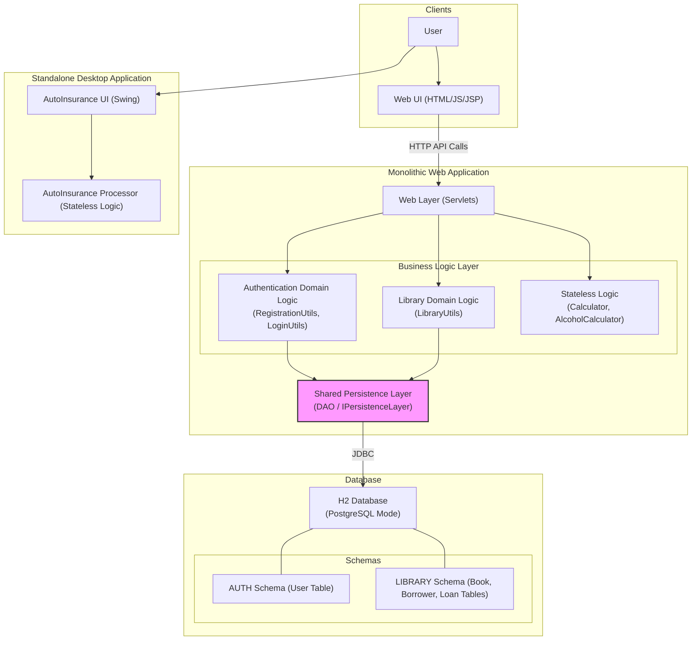

```markdown


The diagram illustrates a classic N-Tier monolithic architecture where distinct business domains (Authentication, Library) are logically separated in code but are tightly coupled through a single, shared persistence layer. This centralized Data Access Object (DAO) acts as a bottleneck and the primary point of contention,funneling all database interactions through a single component to logically separated schemas within one database instance.
```