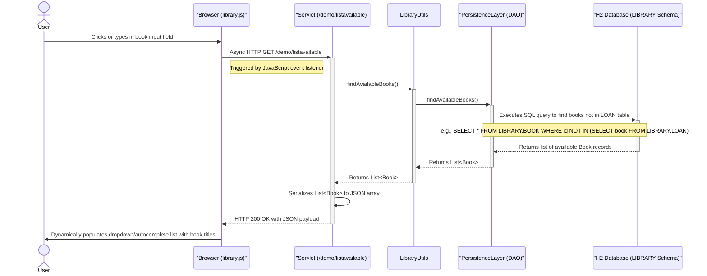
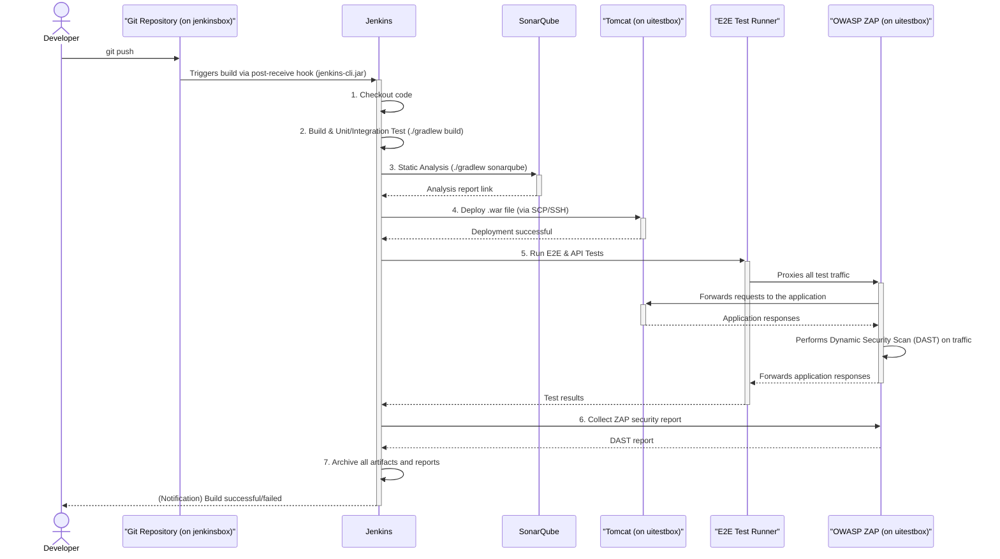

### 1. User Registration Workflow

#### Workflow Description
**Purpose**: To register a new user (librarian) in the system. The process includes strong password validation to ensure security.
**Trigger**: A user submits the registration form from the web interface.
**Communication Patterns**:
-   **Client-Server**: Synchronous HTTP POST request from the browser to the backend servlet.
-   **Internal**: Direct Java method calls between the Servlet, Business Logic (Utils), and Persistence layers.
-   **Database**: JDBC calls encapsulated by the Persistence Layer, executing an `INSERT` statement within a transaction.

#### Sequence Diagram

```mermaid
sequenceDiagram
    actor User
    participant Browser
    participant RegisterServlet
    participant RegistrationUtils
    participant Nbvcxz as "Nbvcxz Library"
    participant PersistenceLayer as "PersistenceLayer (DAO)"
    participant H2Database as "H2 Database (AUTH Schema)"

    User->>Browser: Enters username and password, clicks "Register"
    Browser->>+RegisterServlet: HTTP POST /demo/register (username, password)

    RegisterServlet->>+RegistrationUtils: saveUser(username, password)
    RegistrationUtils->>+Nbvcxz: estimateTimeTOCrack(password)
    Nbvcxz-->>-RegistrationUtils: Returns strength estimation

    alt Password is Strong
        RegistrationUtils->>RegistrationUtils: Hash password (SHA-256)
        RegistrationUtils->>+PersistenceLayer: saveNewUser(username, hashedPassword)
        PersistenceLayer->>+H2Database: Executes SQL INSERT INTO AUTH.USER
        H2Database-->>-PersistenceLayer: Returns success (e.g., new user ID)
        PersistenceLayer-->>-RegistrationUtils: Returns RegistrationResult(SUCCESS)
        RegistrationUtils-->>-RegisterServlet: Returns RegistrationResult(SUCCESS)
        RegisterServlet->>-Browser: HTTP 200 OK (Renders success page)
        Browser->>User: Displays "Registration Successful" message
    else Password is Weak
        RegistrationUtils-->>-RegisterServlet: Returns RegistrationResult(FAILURE, "Password too weak")
        RegisterServlet->>-Browser: HTTP 200 OK (Renders error page)
        Browser->>User: Displays "Password is too weak" error
    end
```

### 2. User Login Workflow

#### Workflow Description
**Purpose**: To authenticate an existing user and establish a session.
**Trigger**: A user submits the login form.
**Communication Patterns**:
-   **Client-Server**: Synchronous HTTP POST request.
-   **Internal**: Direct Java method calls.
-   **Database**: JDBC calls executing a `SELECT` statement to retrieve the user's stored password hash for comparison.

#### Sequence Diagram

```mermaid
sequenceDiagram
    actor User
    participant Browser
    participant LoginServlet
    participant LoginUtils
    participant PersistenceLayer as "PersistenceLayer (DAO)"
    participant H2Database as "H2 Database (AUTH Schema)"

    User->>Browser: Enters username and password, clicks "Login"
    Browser->>+LoginServlet: HTTP POST /demo/login (username, password)

    LoginServlet->>+LoginUtils: checkLogin(username, password)
    LoginUtils->>LoginUtils: Hash submitted password (SHA-256)
    LoginUtils->>+PersistenceLayer: getUser(username)
    PersistenceLayer->>+H2Database: Executes SQL SELECT password_hash FROM AUTH.USER WHERE name = ?
    H2Database-->>-PersistenceLayer: Returns stored password hash

    alt User exists and password matches
        PersistenceLayer-->>LoginUtils: Returns user data with hash
        LoginUtils->>LoginUtils: Compares submitted hash with stored hash
        LoginUtils-->>-LoginServlet: Returns LoginResult(SUCCESS)
        note right of LoginServlet: Session would be created here
        LoginServlet->>-Browser: HTTP 200 OK (Renders logged-in page)
        Browser->>User: Displays "Welcome" message
    else User not found or password incorrect
        PersistenceLayer-->>LoginUtils: Returns null or empty result
        LoginUtils-->>-LoginServlet: Returns LoginResult(FAILURE)
        LoginServlet->>-Browser: HTTP 200 OK (Renders error page)
        Browser->>User: Displays "Invalid credentials" error
    end
```

### 3. Book Lending Workflow

#### Workflow Description
**Purpose**: To record a loan, associating an available book with a registered borrower. This involves multiple validation checks.
**Trigger**: A librarian submits the "Lend Book" form.
**Communication Patterns**:
-   **Client-Server**: Synchronous HTTP POST request.
-   **Internal**: Direct Java method calls.
-   **Database**: Multiple `SELECT` queries for validation followed by an `INSERT` statement. This sequence should ideally be wrapped in a single database transaction.

#### Sequence Diagram

```mermaid
sequenceDiagram
    actor Librarian
    participant Browser
    participant LibraryLendServlet
    participant LibraryUtils
    participant PersistenceLayer as "PersistenceLayer (DAO)"
    participant H2Database as "H2 Database (LIBRARY Schema)"

    Librarian->>Browser: Selects book and borrower, clicks "Lend"
    Browser->>+LibraryLendServlet: HTTP POST /demo/lend (book, borrower)

    LibraryLendServlet->>+LibraryUtils: lendBook(bookTitle, borrowerName)
    note over LibraryUtils, H2Database: Business transaction begins
    LibraryUtils->>+PersistenceLayer: searchForLoanByBook(book)
    PersistenceLayer->>+H2Database: SELECT * FROM LIBRARY.LOAN WHERE book = ?
    H2Database-->>-PersistenceLayer: Returns empty (book is available)
    PersistenceLayer-->>-LibraryUtils: Returns no existing loan

    opt Book is available
        LibraryUtils->>+PersistenceLayer: getBook(bookTitle)
        PersistenceLayer->>H2Database: SELECT id FROM LIBRARY.BOOK WHERE title = ?
        H2Database-->>PersistenceLayer: Returns book_id
        PersistenceLayer-->>-LibraryUtils: Returns Book object

        LibraryUtils->>+PersistenceLayer: getBorrower(borrowerName)
        PersistenceLayer->>H2Database: SELECT id FROM LIBRARY.BORROWER WHERE name = ?
        H2Database-->>PersistenceLayer: Returns borrower_id
        PersistenceLayer-->>-LibraryUtils: Returns Borrower object

        LibraryUtils->>+PersistenceLayer: createLoan(book, borrower)
        PersistenceLayer->>+H2Database: INSERT INTO LIBRARY.LOAN (book, borrower, borrow_date) VALUES (?, ?, NOW())
        H2Database-->>-PersistenceLayer: Returns success
        PersistenceLayer-->>-LibraryUtils: Loan created successfully
        LibraryUtils-->>-LibraryLendServlet: Returns success message
        LibraryLendServlet->>-Browser: HTTP 200 OK (Renders success page)
        Browser->>Librarian: Displays "Book Lent Successfully"
    else Book is already on loan
        LibraryUtils-->>-LibraryLendServlet: Returns error "Book is already checked out"
        LibraryLendServlet->>-Browser: HTTP 200 OK (Renders error page)
        Browser->>Librarian: Displays error message
    end
```

### 4. UI Autocomplete for Available Books

#### Workflow Description
**Purpose**: To provide the user with a dynamic list of available books as they interact with the UI, improving usability.
**Trigger**: A user focuses on or types in the "book" input field on the library page.
**Communication Patterns**:
-   **Client-Server**: Asynchronous JavaScript (AJAX/Fetch) HTTP GET request from the browser to a dedicated JSON endpoint.
-   **Internal**: Direct Java method calls.
-   **Database**: A `SELECT` query to fetch all books not currently associated with a loan.

#### Sequence Diagram



### 5. CI/CD Pipeline Workflow

#### Workflow Description
**Purpose**: To automate the build, test, analysis, and deployment of the web application upon code changes.
**Trigger**: A developer pushes new code to the central Git repository.
**Communication Patterns**:
-   **Event-Driven**: A `git post-receive` hook acts as an event trigger.
-   **Remote Execution**: Jenkins uses CLI/SSH to execute commands on different servers.
-   **API Calls**: Jenkins communicates with the SonarQube server via its API.
-   **Proxying**: E2E tests are routed through the OWASP ZAP proxy for security scanning.

#### Sequence Diagram

