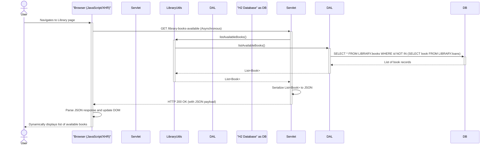
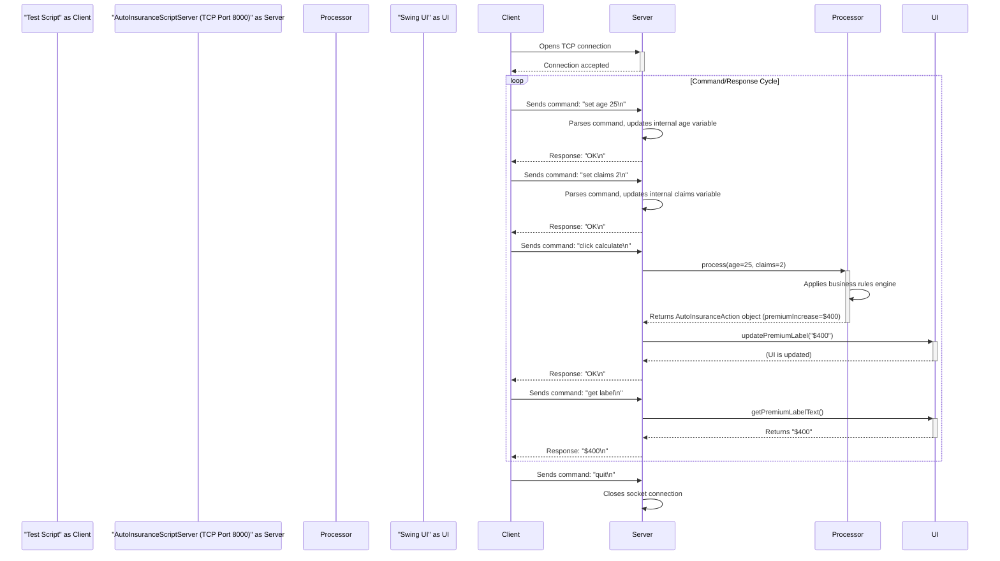

### 1. New User Registration Workflow

*   **Workflow Purpose and Triggers**: This workflow handles the creation of a new user in the system. It is triggered when a user submits their desired username and password via a registration form on the web application. The process includes critical business logic for password strength validation and ensuring username uniqueness.

*   **Communication Patterns**: The flow is initiated by a synchronous **HTTP POST** request from the client. All subsequent interactions within the monolith are synchronous Java method calls. The process culminates in a database transaction involving a **SELECT** (to check for existence) and an **INSERT** (to create the user) executed via JDBC.

```mermaid
sequenceDiagram
    actor User
    participant Browser
    participant RegisterServlet
    participant RegistrationUtils
    participant "Nbvcxz Library" as Lib
    participant IPersistenceLayer as DAL
    participant "H2 Database" as DB

    User->>+Browser: Submits registration form (username, password)
    Browser->>+RegisterServlet: POST /register
    
    RegisterServlet->>+RegistrationUtils: registerUser(username, password)
    
    RegistrationUtils->>+Lib: isPasswordGood(password)
    Lib-->>-RegistrationUtils: PasswordResult (strength, meetsCriteria)
    
    alt Password is too weak
        RegistrationUtils-->>-RegisterServlet: RegistrationResult(status=PASSWORD_TOO_WEAK)
        RegisterServlet-->>-Browser: HTTP 400 Bad Request (Error message)
        Browser-->>-User: Display "Password is too weak"
    else Password is OK
        RegistrationUtils->>+DAL: searchForUserByName(username)
        DAL->>+DB: SELECT id FROM AUTH.users WHERE name = ?
        DB-->>-DAL: (Returns user or null)
        DAL-->>-RegistrationUtils: User object (or null)
        
        alt Username already exists
            RegistrationUtils-->>-RegisterServlet: RegistrationResult(status=USER_ALREADY_EXISTS)
            RegisterServlet-->>-Browser: HTTP 409 Conflict (Error message)
            Browser-->>-User: Display "Username is taken"
        else Username is unique
            RegistrationUtils->>RegistrationUtils: hashPassword(password) with SHA-256
            RegistrationUtils->>+DAL: saveNewUser(username, hashedPassword)
            DAL->>+DB: INSERT INTO AUTH.users (name, hash) VALUES (?, ?)
            DB-->>-DAL: (Success)
            DAL-->>-RegistrationUtils: (Success)
            RegistrationUtils-->>-RegisterServlet: RegistrationResult(status=SUCCESS)
            RegisterServlet-->>-Browser: HTTP 201 Created (Success message)
            Browser-->>-User: Display "Registration Successful"
        end
    end
```

### 2. Book Lending Transaction Workflow

*   **Workflow Purpose and Triggers**: This workflow captures the core business process of lending a book to a borrower. It is triggered when a librarian or user submits a form specifying the book title and borrower name. The system enforces several business rules: the book must exist, the borrower must be registered, and the book cannot already be on loan.

*   **Communication Patterns**: The flow begins with a synchronous **HTTP POST** request. The business logic layer performs a series of synchronous, sequential database lookups (**SELECT** queries via JDBC) for validation. If all validations pass, a final **INSERT** statement is executed to create the loan record. These database operations constitute a single logical transaction.

```mermaid
sequenceDiagram
    actor User
    participant Browser
    participant LibraryLendServlet
    participant LibraryUtils
    participant IPersistenceLayer as DAL
    participant "H2 Database" as DB

    User->>+Browser: Submits lend form (book title, borrower name)
    Browser->>+LibraryLendServlet: POST /lend
    
    LibraryLendServlet->>+LibraryUtils: lendBook(title, borrowerName)
    
    note over LibraryUtils, DB: Start of Lending Business Logic Transaction
    
    LibraryUtils->>+DAL: searchBooksBy(title)
    DAL->>+DB: SELECT * FROM LIBRARY.books WHERE title = ?
    DB-->>-DAL: Book record
    DAL-->>-LibraryUtils: Book object

    LibraryUtils->>+DAL: searchBorrowerDataByName(borrowerName)
    DAL->>+DB: SELECT * FROM LIBRARY.borrowers WHERE name = ?
    DB-->>-DAL: Borrower record
    DAL-->>-LibraryUtils: Borrower object

    LibraryUtils->>+DAL: searchForLoanBy(book)
    DAL->>+DB: SELECT * FROM LIBRARY.loans WHERE book = ?
    DB-->>-DAL: (Returns empty set if not on loan)
    DAL-->>-LibraryUtils: Loan object (or null)

    alt Validation Fails (e.g., book already checked out)
        LibraryUtils-->>-LibraryLendServlet: LibraryActionResults.BOOK_CHECKED_OUT
        LibraryLendServlet-->>-Browser: HTTP 409 Conflict (Error message)
        Browser-->>-User: Display error (e.g., "Book is already on loan")
    else All validations pass
        LibraryUtils->>+DAL: createLoan(book, borrower)
        DAL->>+DB: INSERT INTO LIBRARY.loans (book, borrower, checkout_date) VALUES (?, ?, NOW())
        DB-->>-DAL: (Success)
        DAL-->>-LibraryUtils: (Success)
        LibraryUtils-->>-LibraryLendServlet: LibraryActionResults.SUCCESS
        LibraryLendServlet-->>-Browser: HTTP 200 OK (Success message)
        Browser-->>-User: Display "Book lent successfully"
    end
```

### 3. Asynchronous Search for Available Books

*   **Workflow Purpose and Triggers**: This workflow provides a list of all books that are not currently on loan. It is triggered by a client-side script (`XMLHttpRequest`) when the user loads the library page, enabling a dynamic and responsive user interface without a full page reload.

*   **Communication Patterns**: This demonstrates a client-driven asynchronous pattern. The browser sends an **asynchronous HTTP GET** request. The backend synchronously queries the database (**SELECT** with a subquery or join via JDBC) to find available books. The server then returns a data payload (e.g., JSON), which the client-side JavaScript uses to render the UI.



### 4. Database Reset via Admin Endpoint

*   **Workflow Purpose and Triggers**: This is a crucial administrative and testing workflow. It allows an automated process (like a CI/CD pipeline or a test suite) to reset the database to a clean, known state before a test run. It is triggered by an HTTP GET request to a dedicated administrative endpoint.

*   **Communication Patterns**: An external system (Test Client) sends a synchronous **HTTP GET** request. The system uses the **Flyway** library to perform database schema manipulations (**DROP**, **CREATE**, **INSERT**) directly via JDBC. This is a powerful but potentially destructive operation intended for non-production environments.

```mermaid
sequenceDiagram
    participant "Test Client (e.g., Behave)" as Client
    participant DbServlet
    participant IPersistenceLayer as DAL
    participant "Flyway Library" as Flyway
    participant "H2 Database" as DB

    Client->>+DbServlet: GET /flyway?action=clean_migrate
    
    note over DbServlet: Default action is clean then migrate
    DbServlet->>+DAL: cleanAndMigrateDatabase()
    
    DAL->>+Flyway: clean()
    Flyway->>+DB: Executes DROP statements on all tables (users, books, etc.)
    DB-->>-Flyway: (Success)
    Flyway-->>-DAL: (Clean Complete)
    
    DAL->>+Flyway: migrate()
    Flyway->>Flyway: Reads SQL migration scripts (e.g., V2__*.sql)
    Flyway->>+DB: Executes CREATE TABLE and other DDL/DML statements from scripts
    DB-->>-Flyway: (Success)
    Flyway-->>-DAL: (Migration Complete)
    
    DAL-->>-DbServlet: (Success)
    DbServlet-->>-Client: HTTP 200 OK
```

### 5. Remote Control of Desktop App for Testing

*   **Workflow Purpose and Triggers**: This workflow illustrates how the otherwise isolated Java Swing desktop application can be controlled and tested programmatically. It is triggered by a test script connecting to a custom TCP socket server running within the application.

*   **Communication Patterns**: This is a classic example of **event-driven interaction over a TCP socket**. The communication is asynchronous and message-based, using a simple, stateful, text-based protocol. The test script sends command messages, and the server responds, modifying the application's state and querying its UI components in a step-by-step manner.

