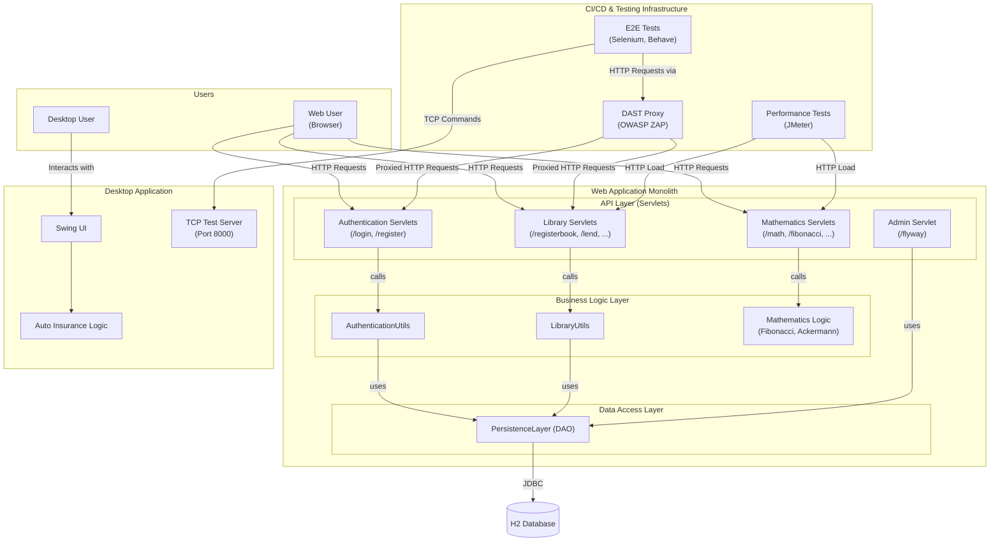

```markdown


The diagram illustrates a system composed of a 3-tier monolithic web application and a separate, standalone desktop application. Within the monolith, logically distinct domains like Authentication and Library are tightly coupled by communicating through a single Data Access Object (DAO) to a shared H2 database, representing a classic layered architecture. The CI/CD pipeline components interact with both applications for comprehensive automated testing, using HTTP for the web monolith and a custom TCP protocol for the desktop client.
```