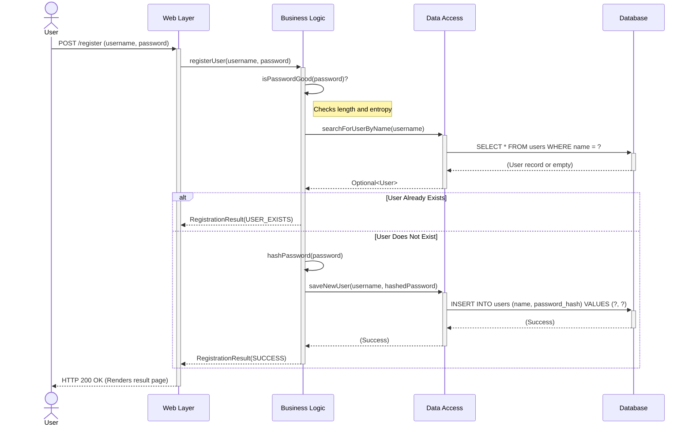
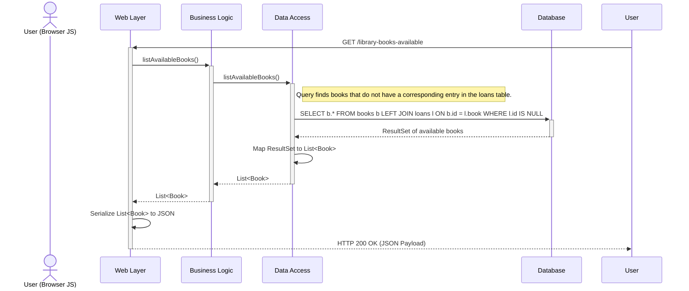
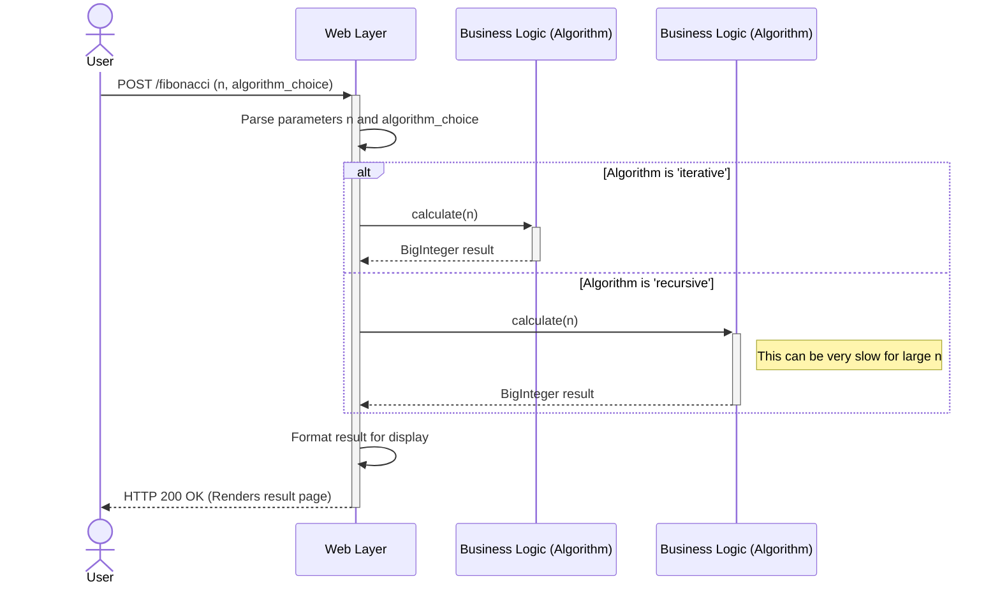

### 1. User Registration Workflow

This workflow describes the process of a new user creating an account. It includes validation for password strength and checks for existing usernames to prevent duplicates.

-   **Trigger**: User submits the registration form via an HTTP POST request to the `/register` endpoint.
-   **Communication Patterns**: Synchronous REST call (HTTP POST), internal Java method calls, JDBC database transaction (SELECT then INSERT).



### 2. User Login Workflow

This workflow details the process of an existing user authenticating with the system. It handles both successful and failed login attempts.

-   **Trigger**: User submits the login form via an HTTP POST request to the `/login` endpoint.
-   **Communication Patterns**: Synchronous REST call (HTTP POST), internal Java method calls, JDBC database query.

```mermaid
sequenceDiagram
    actor User
    participant LoginServlet as Web Layer
    participant LoginUtils as Business Logic
    participant PersistenceLayer as Data Access
    participant Database

    User->>+LoginServlet: POST /login (username, password)
    LoginServlet->>+LoginUtils: isUserRegistered(username, password)
    LoginUtils->>+PersistenceLayer: areCredentialsValid(username, password)
    
    PersistenceLayer->>+Database: SELECT password_hash FROM users WHERE name = ?
    Database-->>-PersistenceLayer: (Hashed password or empty)
    
    alt User Found
        PersistenceLayer->>PersistenceLayer: hash(provided_password)
        PersistenceLayer->>PersistenceLayer: compare(hashed_provided_password, db_hash)
        
        alt Passwords Match
            PersistenceLayer-->>LoginUtils: true
        else Passwords Do Not Match
            PersistenceLayer-->>LoginUtils: false
        end

    else User Not Found
        PersistenceLayer-->>LoginUtils: false
    end
    
    LoginUtils-->>-LoginServlet: boolean (isAuthenticated)
    
    alt Authentication Successful
        LoginServlet-->>-User: HTTP 200 OK (Renders "Access Granted")
    else Authentication Failed
        LoginServlet-->>-User: HTTP 200 OK (Renders "Access Denied")
    end

```

### 3. Lend a Book Workflow

This is a critical business transaction that involves multiple validation steps before a book can be loaned to a borrower. It demonstrates complex data interactions and error handling.

-   **Trigger**: A user submits a form to lend a specific book to a specific borrower via a POST to `/lend`.
-   **Communication Patterns**: Synchronous REST call (HTTP POST), sequential internal method calls, and multiple JDBC queries that form a single business transaction.

```mermaid
sequenceDiagram
    actor User
    participant LibraryLendServlet as Web Layer
    participant LibraryUtils as Business Logic
    participant PersistenceLayer as Data Access
    participant Database

    User->>+LibraryLendServlet: POST /lend (bookTitle, borrowerName)
    LibraryLendServlet->>+LibraryUtils: lendBook(bookTitle, borrowerName)

    note over LibraryUtils: Begin Business Transaction
    
    LibraryUtils->>+PersistenceLayer: searchBooksByTitle(bookTitle)
    PersistenceLayer->>+Database: SELECT * FROM books WHERE title = ?
    Database-->>-PersistenceLayer: (Book record or empty)
    PersistenceLayer-->>-LibraryUtils: Optional<Book>

    alt Book Not Found
        LibraryUtils-->>LibraryLendServlet: LibraryActionResults.BOOK_NOT_REGISTERED
        LibraryLendServlet-->>-User: HTTP 200 OK (Error Message)
    else Book Found
        LibraryUtils->>+PersistenceLayer: searchBorrowerDataByName(borrowerName)
        PersistenceLayer->>+Database: SELECT * FROM borrowers WHERE name = ?
        Database-->>-PersistenceLayer: (Borrower record or empty)
        PersistenceLayer-->>-LibraryUtils: Optional<Borrower>

        alt Borrower Not Found
            LibraryUtils-->>LibraryLendServlet: LibraryActionResults.BORROWER_NOT_REGISTERED
            LibraryLendServlet-->>-User: HTTP 200 OK (Error Message)
        else Borrower Found
            LibraryUtils->>+PersistenceLayer: searchForLoanByBook(book)
            PersistenceLayer->>+Database: SELECT * FROM loans WHERE book_id = ?
            Database-->>-PersistenceLayer: (Loan record or empty)
            PersistenceLayer-->>-LibraryUtils: Optional<Loan>
            
            alt Book Already On Loan
                LibraryUtils-->>LibraryLendServlet: LibraryActionResults.BOOK_CHECKED_OUT
                LibraryLendServlet-->>-User: HTTP 200 OK (Error Message)
            else Book is Available
                LibraryUtils->>+PersistenceLayer: createLoan(book, borrower, currentDate)
                PersistenceLayer->>+Database: INSERT INTO loans (book, borrower, borrow_date) VALUES (?, ?, ?)
                Database-->>-PersistenceLayer: (Success)
                PersistenceLayer-->>-LibraryUtils: (Success)
                LibraryUtils-->>-LibraryLendServlet: LibraryActionResults.SUCCESS
                LibraryLendServlet-->>-User: HTTP 200 OK (Success Message)
            end
        end
    end

```

### 4. List Available Books Workflow

This flow shows a read-only operation where the client requests a list of all books that are not currently checked out.

-   **Trigger**: User's browser makes an asynchronous GET request to `/library-books-available`.
-   **Communication Patterns**: Asynchronous XHR/Fetch call from client, Synchronous REST call (HTTP GET), internal method calls, single complex JDBC query.



### 5. Stateless Computation Workflow (Fibonacci)

This diagram illustrates a purely computational, stateless workflow that has no interaction with the persistence layer. It highlights how different domains within the monolith can have vastly different interaction patterns.

-   **Trigger**: User submits a form to calculate a Fibonacci number via POST to `/fibonacci`.
-   **Communication Patterns**: Synchronous REST call (HTTP POST), internal method calls. No database or external service interaction.

