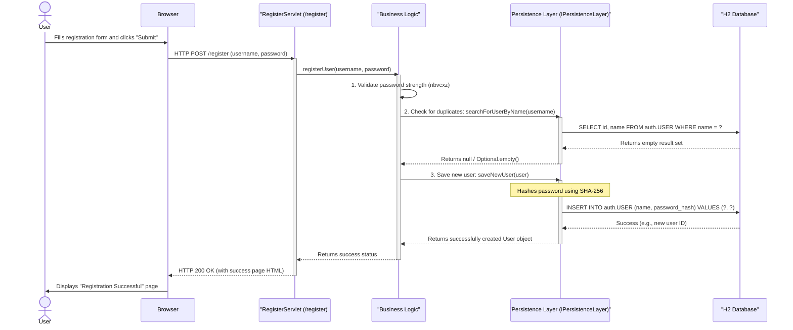
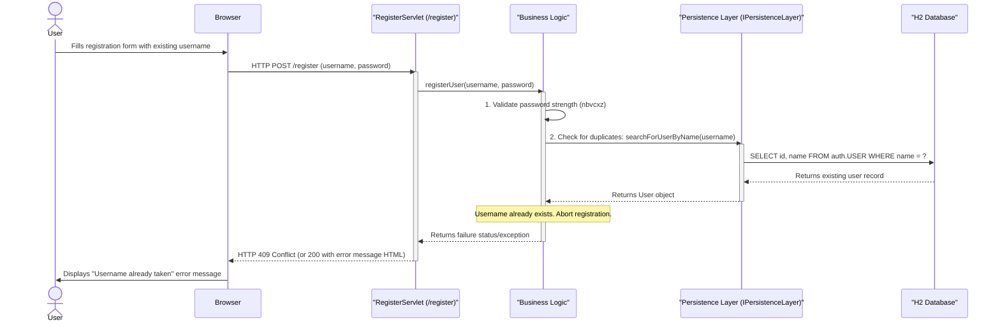
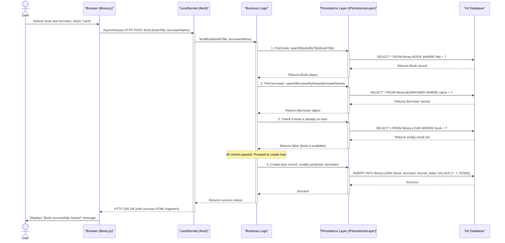
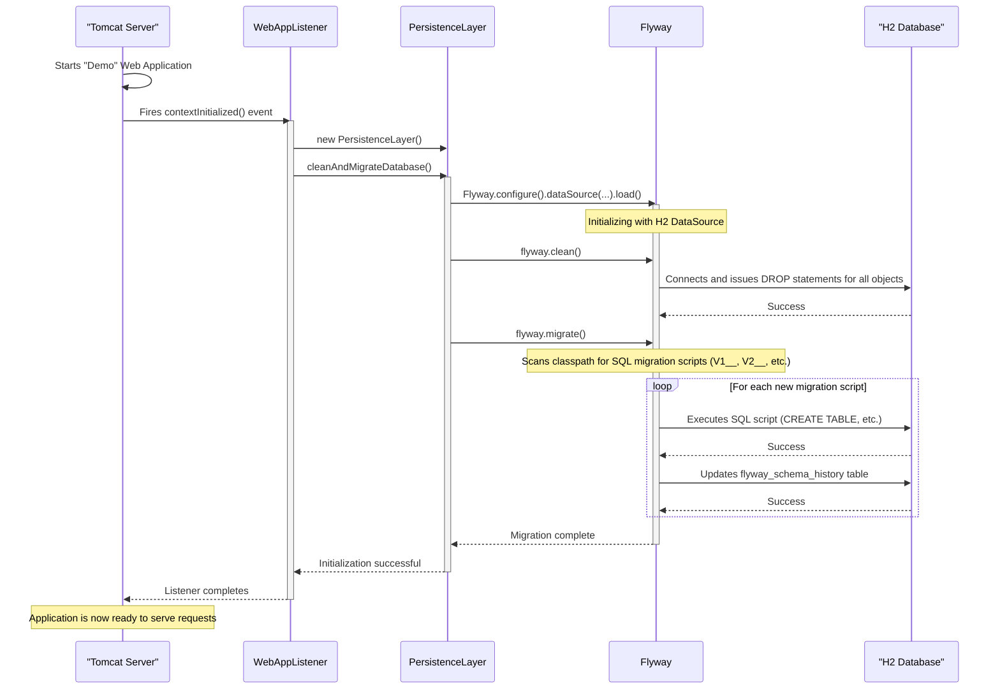

### 1. Successful User Registration

This workflow describes the process of a new user successfully creating an account. The trigger is the user submitting the registration form. It demonstrates input validation, duplicate checking, and secure password hashing.

-   **Workflow Purpose & Trigger**: To create a new user account. Triggered by a user submitting the registration form via an HTTP POST request.
-   **Communication Patterns**:
    -   Synchronous HTTP POST for form submission.
    -   Internal synchronous Java method calls between layers.
    -   Repository Pattern (`IPersistenceLayer`) abstracting data access.
    -   Direct JDBC calls to the database for reads and writes.

### 2. Failed User Registration (Username Exists)

This diagram shows the error handling path for the user registration workflow when the chosen username is already taken.

-   **Workflow Purpose & Trigger**: To handle a registration attempt with a non-unique username. Triggered by a user submitting the form with an existing username.
-   **Communication Patterns**: The patterns are the same as the successful registration, but this flow demonstrates the system's error handling and recovery path by preventing duplicate entries.

### 3. Lending a Book

This workflow illustrates the process of a librarian lending a book to a borrower. It involves fetching multiple entities, checking business rules (e.g., book availability), and creating a new loan record.

-   **Workflow Purpose & Trigger**: To record a book loan. Triggered by a librarian submitting the "lend" form on the library page.
-   **Communication Patterns**:
    -   Asynchronous HTTP POST (AJAX) initiated by `catalog.js`.
    -   Synchronous Java method calls.
    -   Repository Pattern (`IPersistenceLayer`).
    -   A business transaction involving multiple database reads before a final write (INSERT).

### 4. Dynamic UI Population on Library Page

This diagram shows how the frontend JavaScript dynamically fetches data from the backend to render UI components based on the number of available books. This is an example of a client-side rendering pattern.

-   **Workflow Purpose & Trigger**: To dynamically build the user interface for book selection based on application state. Triggered by the browser loading the `library.html` page.
-   **Communication Patterns**:
    -   Asynchronous HTTP GET (AJAX) for data fetching.
    -   JSON data exchange between backend and frontend.
    -   Client-side logic for dynamic UI rendering.

```mermaid
sequenceDiagram
    actor User
    participant Browser as "Browser (library.js)"
    participant ListAvailableServlet as "Servlet (/listavailable)"
    participant LibraryUtils as "Business Logic"
    participant PersistenceLayer as "Persistence Layer (IPersistenceLayer)"
    participant H2Database as "H2 Database"

    User->>Browser: Navigates to library.html
    note over Browser: On page load, library.js executes
    Browser->>ListAvailableServlet: Asynchronous HTTP GET /listavailable

    activate ListAvailableServlet
    ListAvailableServlet->>LibraryUtils: listAvailableBooks()
    activate LibraryUtils

    LibraryUtils->>PersistenceLayer: listAvailableBooks()
    activate PersistenceLayer

    PersistenceLayer->>H2Database: SELECT * FROM library.BOOK WHERE id NOT IN (SELECT book FROM library.LOAN)
    H2Database-->>PersistenceLayer: Returns list of available book records
    PersistenceLayer-->>LibraryUtils: Returns List<Book>
    deactivate PersistenceLayer

    LibraryUtils-->>ListAvailableServlet: Returns List<Book>
    deactivate LibraryUtils

    note over ListAvailableServlet: Serializes List<Book> to JSON
    ListAvailableServlet-->>Browser: HTTP 200 OK (with JSON payload)
    deactivate ListAvailableServlet

    activate Browser
    note over Browser: AJAX callback function is executed
    Browser->>Browser: 1. Parse JSON response
    Browser->>Browser: 2. Count number of books in the list
    alt Book count is 0
        Browser->>User: Renders a disabled input field
    else 1 <= Book count <= 9
        Browser->>User: Renders an HTML <select> dropdown with book titles
    else Book count >= 10
        Browser->>User: Renders an input field with autocomplete functionality
    end
    deactivate Browser
```

### 5. Application Startup and Database Migration

This sequence illustrates the system-level process that occurs when the application starts up in the Tomcat server. It shows how the `WebAppListener` uses Flyway to ensure the database schema is in a clean, consistent, and up-to-date state.

-   **Workflow Purpose & Trigger**: To initialize the application state, specifically the database schema. Triggered by the deployment or startup of the web application in the Servlet Container (Tomcat).
-   **Communication Patterns**:
    -   Event-Driven interaction (Tomcat lifecycle events).
    -   Direct Java method calls.
    -   Interaction with the Flyway library API.
    -   Direct JDBC for schema manipulation by Flyway.

