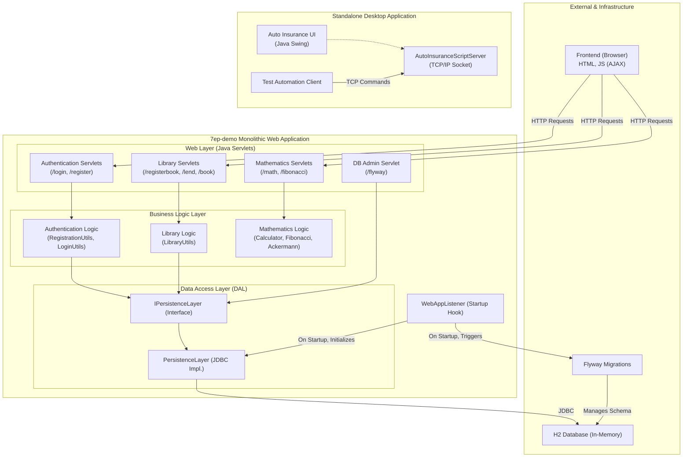

```markdown


The system is a layered monolith where the frontend browser interacts via HTTP with a web layer of Java Servlets. These servlets delegate requests to distinct business logic components (Authentication, Library, Math), which in turn interact with the database exclusively through a central `IPersistenceLayer` repository interface, cleanly separating business rules from data access. A completely decoupled Java Swing desktop application also exists, featuring its own TCP/IP server for test automation, highlighting a clear boundary from the main web application.
```