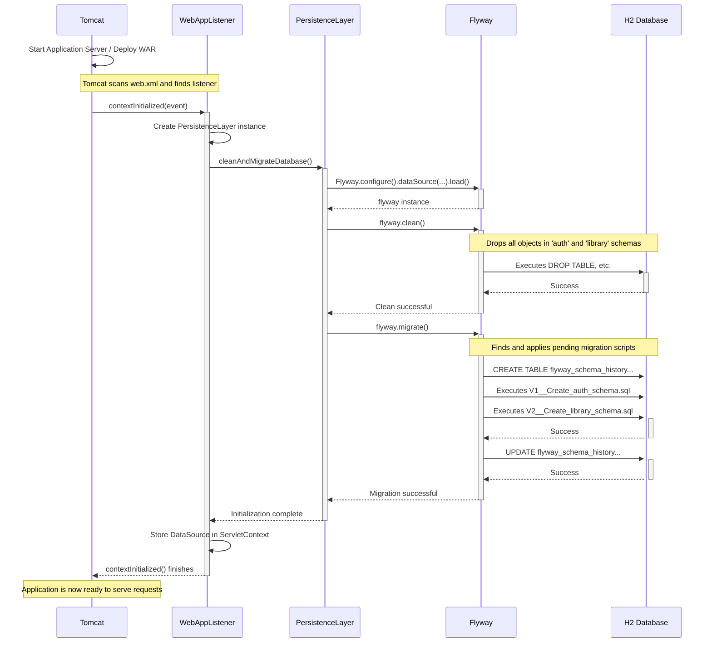

### 1. New User Registration Workflow

This workflow describes the process of a new user creating an account. The system validates the input, checks for duplicate usernames, ensures the password meets security standards, and persists the new user to the database.

- **Trigger**: User submits the registration form via an HTTP POST request to `/register`.
- **Communication Patterns**:
  - **Synchronous HTTP**: The browser sends a `POST` request and waits for a response.
  - **Direct Method Calls**: Servlets call business logic classes, which in turn call the persistence layer.
  - **Database Transactions**: The persistence layer executes SQL queries against the database.

```mermaid
sequenceDiagram
    actor User as User (Browser)
    participant Tomcat
    participant RegisterServlet
    participant RegistrationUtils
    participant PersistenceLayer
    participant H2_DB as H2 Database

    User->>+Tomcat: POST /register (username, password)
    Tomcat->>+RegisterServlet: doPost(req, res)
    RegisterServlet->>+RegistrationUtils: registerUser(username, password)

    RegistrationUtils->>RegistrationUtils: Validate password strength (nbvcxz)
    alt Password is weak
        RegistrationUtils-->>-RegisterServlet: throw WeakPasswordException
        RegisterServlet-->>-Tomcat: Send 400 Bad Request (Error message)
        Tomcat-->>-User: Show "Password too weak" page
    end

    RegistrationUtils->>+PersistenceLayer: searchForUserByName(username)
    PersistenceLayer->>+H2_DB: SELECT * FROM AUTH.USER WHERE NAME = ?
    H2_DB-->>-PersistenceLayer: Returns 0 rows
    PersistenceLayer-->>-RegistrationUtils: null (user does not exist)

    alt Username already exists
        %% This block would execute if H2_DB returned 1 row instead
        RegistrationUtils-->>-RegisterServlet: throw UserRegistrationException("User exists")
        RegisterServlet-->>-Tomcat: Send 409 Conflict (Error message)
        Tomcat-->>-User: Show "Username taken" page
    else User is new and password is valid
        RegistrationUtils->>+PersistenceLayer: saveNewUser(username, password)
        PersistenceLayer->>PersistenceLayer: Hash password (SHA-256)
        PersistenceLayer->>+H2_DB: INSERT INTO AUTH.USER (NAME, PASSWORD_HASH) VALUES (?, ?)
        H2_DB-->>-PersistenceLayer: Success (1 row inserted)
        PersistenceLayer-->>-RegistrationUtils: User object
        RegistrationUtils-->>-RegisterServlet: "User registered successfully"
        RegisterServlet-->>-Tomcat: Send 302 Redirect to /login
        Tomcat-->>-User: Redirect to Login Page
    end

```

### 2. Lend a Book Workflow

This workflow outlines the process of a librarian lending a book to a borrower. The system validates that both the book and borrower exist and that the book is currently available before creating a loan record.

- **Trigger**: Librarian submits the "lend book" form via an HTTP POST request to `/lend`.
- **Communication Patterns**:
  - **Synchronous HTTP**: The browser sends a `POST` request.
  - **Direct Method Calls**: `LibraryLendServlet` -> `LibraryUtils` -> `PersistenceLayer`.
  - **Database Queries**: Multiple `SELECT` queries for validation followed by an `INSERT` to create the loan.

```mermaid
sequenceDiagram
    actor Librarian as Librarian (Browser)
    participant Tomcat
    participant LibraryLendServlet
    participant LibraryUtils
    participant PersistenceLayer
    participant H2_DB as H2 Database

    Librarian->>+Tomcat: POST /lend (bookTitle, borrowerName)
    Tomcat->>+LibraryLendServlet: doPost(req, res)
    LibraryLendServlet->>+LibraryUtils: lendBook(bookTitle, borrowerName)

    Note over LibraryUtils, PersistenceLayer: Find book and borrower IDs first
    LibraryUtils->>+PersistenceLayer: searchBooksByTitle(bookTitle)
    PersistenceLayer->>+H2_DB: SELECT ID, TITLE FROM LIBRARY.BOOK WHERE TITLE = ?
    H2_DB-->>-PersistenceLayer: Book record (ID=1, Title='The Great Gatsby')
    PersistenceLayer-->>-LibraryUtils: Book object

    LibraryUtils->>+PersistenceLayer: searchBorrowersByName(borrowerName)
    PersistenceLayer->>+H2_DB: SELECT ID, NAME FROM LIBRARY.BORROWER WHERE NAME = ?
    H2_DB-->>-PersistenceLayer: Borrower record (ID=4, Name='Jane Doe')
    PersistenceLayer-->>-LibraryUtils: Borrower object

    Note over LibraryUtils, PersistenceLayer: Check if book is already on loan
    LibraryUtils->>+PersistenceLayer: isBookLoaned(bookId=1)
    PersistenceLayer->>+H2_DB: SELECT 1 FROM LIBRARY.LOAN WHERE BOOK = ?
    H2_DB-->>-PersistenceLayer: 0 rows (book is available)
    PersistenceLayer-->>-LibraryUtils: false

    alt Book is already checked out
        %% This block executes if the previous query returned 1 row
        LibraryUtils-->>-LibraryLendServlet: throw BookUnavailableException
        LibraryLendServlet-->>-Tomcat: Send 409 Conflict (Error Message)
        Tomcat-->>-Librarian: Show "Book is not available" page
    else Book is available
        LibraryUtils->>+PersistenceLayer: createLoan(book, borrower)
        PersistenceLayer->>+H2_DB: INSERT INTO LIBRARY.LOAN (BOOK, BORROWER, BORROW_DATE) VALUES (?, ?, NOW())
        H2_DB-->>-PersistenceLayer: Success (1 row inserted)
        PersistenceLayer-->>-LibraryUtils: Loan object
        LibraryUtils-->>-LibraryLendServlet: "Loan created successfully"
        LibraryLendServlet-->>-Tomcat: Send 200 OK (Success Message)
        Tomcat-->>-Librarian: Show "Loan Successful" page
    end
```

### 3. Dynamic UI Population on Library Page

This workflow shows how the client-side JavaScript on the library page dynamically fetches data from the backend to render the user interface. This demonstrates an event-driven, client-side data fetching pattern using AJAX.

- **Trigger**: User navigates to the `library.html` page in their browser.
- **Communication Patterns**:
  - **Asynchronous AJAX (XHR)**: The client-side JavaScript makes non-blocking `GET` requests to backend endpoints.
  - **JSON Data Exchange**: The backend responds with JSON-formatted data for the client to parse.
  - **Event-Driven**: The entire flow is triggered by the browser's page load event.

```mermaid
sequenceDiagram
    actor User as User (Browser)
    participant JavaScript as JavaScript (library.js)
    participant Tomcat
    participant LibraryServlets
    participant PersistenceLayer
    participant H2_DB as H2 Database

    User->>+Tomcat: GET /library.html
    Tomcat-->>-User: Serves library.html and library.js

    Note over User, JavaScript: Browser renders page, onload event triggers JS

    JavaScript->>JavaScript: Page loaded, start populating UI elements

    par Fetch Available Books
        JavaScript->>+Tomcat: Async GET /listavailable
        Tomcat->>+LibraryServlets: doGet(req, res)
        LibraryServlets->>+PersistenceLayer: listAvailableBooks()
        PersistenceLayer->>+H2_DB: SELECT ... FROM LIBRARY.BOOK WHERE ID NOT IN (SELECT BOOK FROM LIBRARY.LOAN)
        H2_DB-->>-PersistenceLayer: List of Book records
        PersistenceLayer-->>-LibraryServlets: List<Book>
        LibraryServlets->>LibraryServlets: Serialize List<Book> to JSON
        LibraryServlets-->>-Tomcat: 200 OK, Response with JSON body
        Tomcat-->>-JavaScript: [{"id":1, "title":"Book A"}, ...]
    and Fetch All Borrowers
        JavaScript->>+Tomcat: Async GET /borrower
        Tomcat->>+LibraryServlets: doGet(req, res)
        LibraryServlets->>+PersistenceLayer: listBorrowers()
        PersistenceLayer->>+H2_DB: SELECT * FROM LIBRARY.BORROWER
        H2_DB-->>-PersistenceLayer: List of Borrower records
        PersistenceLayer-->>-LibraryServlets: List<Borrower>
        LibraryServlets->>LibraryServlets: Serialize List<Borrower> to JSON
        LibraryServlets-->>-Tomcat: 200 OK, Response with JSON body
        Tomcat-->>-JavaScript: [{"id":1, "name":"Borrower A"}, ...]
    end

    JavaScript->>JavaScript: Process AJAX responses
    JavaScript->>JavaScript: Check count of books and borrowers
    alt If count is 1-9
        JavaScript->>User: Render <select> dropdowns with options
    else If count is 10+
        JavaScript->>User: Render <input> text fields for autocomplete
    else Count is 0
        JavaScript->>User: Render disabled input fields
    end
```



### 4. Application Startup and Database Initialization

This workflow illustrates the system's automated process for initializing the database when the application starts up. It uses a `ServletContextListener` to trigger a Flyway migration, ensuring a clean and consistent database state on every deployment.

- **Trigger**: Tomcat application server starts or deploys the web application.
- **Communication Patterns**:
  - **Event-Driven**: The process is initiated by a lifecycle event (`contextInitialized`) from the Servlet container.
  - **Direct Method Calls**: The listener directly invokes the persistence layer's initialization logic.
  - **JDBC**: Flyway uses JDBC to connect to the database and execute its schema management SQL scripts.

