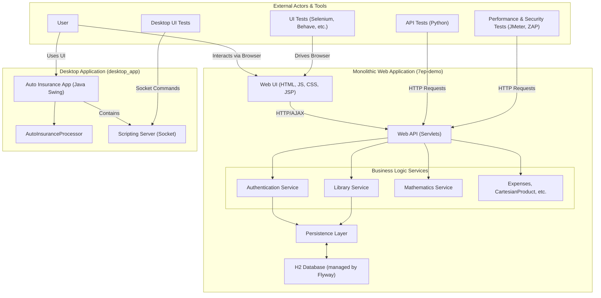

The system comprises a monolithic Java web application and a distinct Java Swing desktop application. The web application follows a layered architecture where a browser-based UI communicates via HTTP with servlets that orchestrate domain-specific business logic (e.g., Library, Authentication), all utilizing a central persistence layer to interact with an H2 database. The separate desktop application is self-contained and exposes a socket-based server, enabling remote control for automated UI testing.