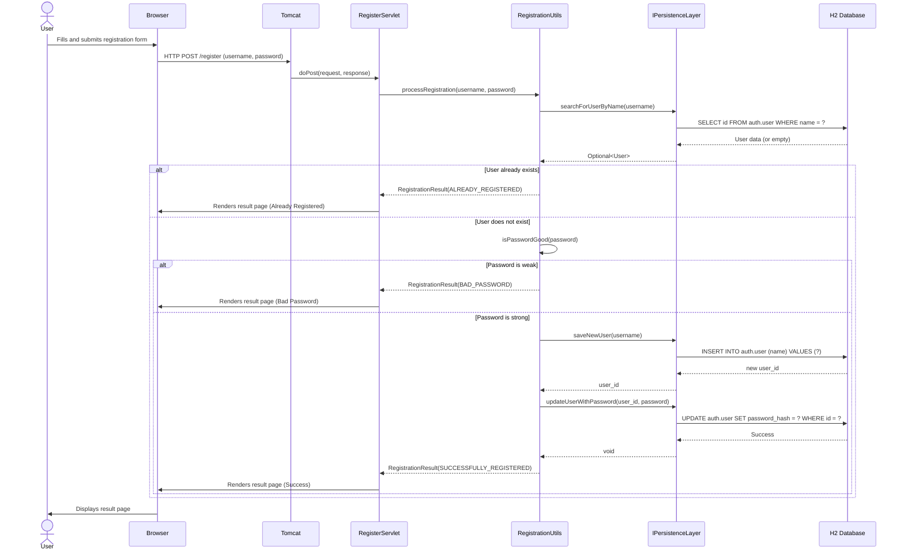
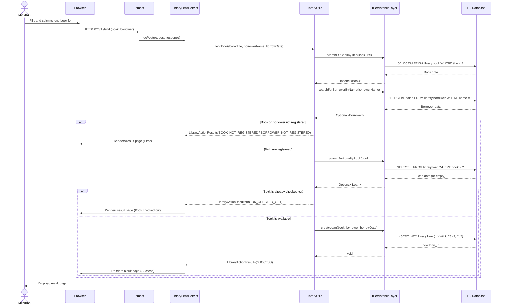
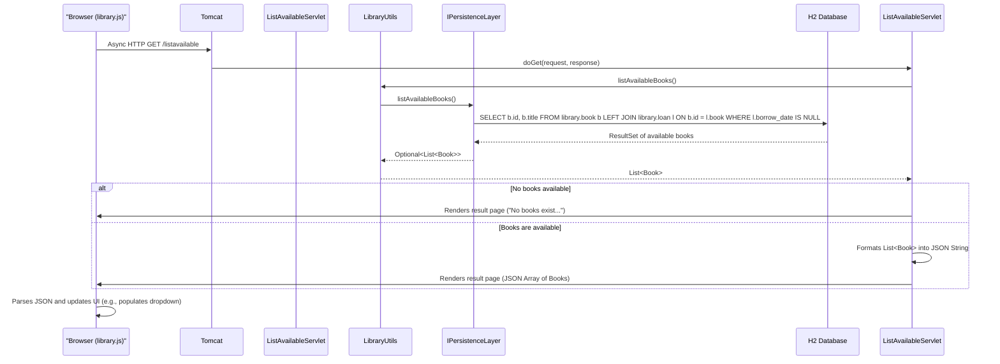
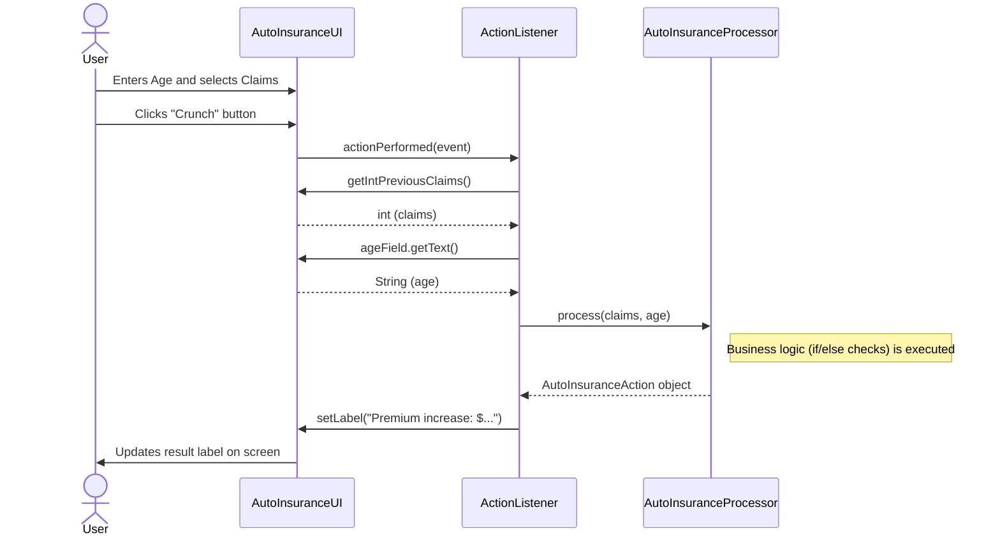
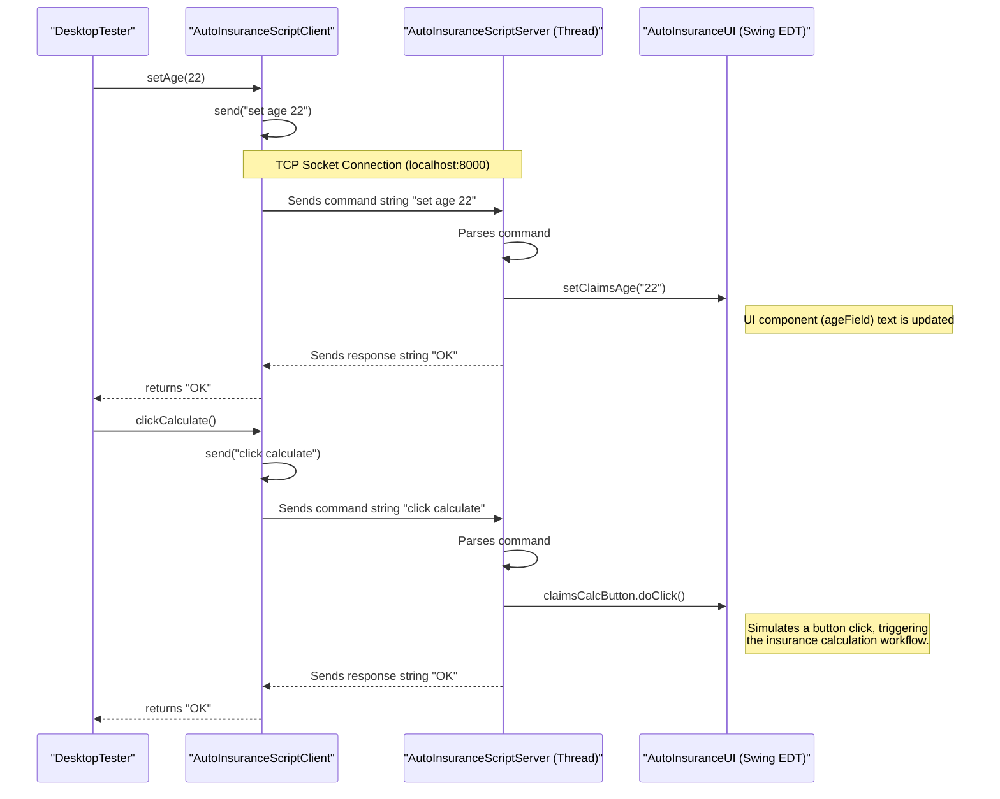

### 1. Web App: New User Registration

**Workflow Purpose and Trigger:**
This workflow allows a new user to create an account in the system. It is triggered when a user fills out the registration form on the `library.html` page and submits it, sending an HTTP POST request to the `/register` endpoint. The system validates the input, checks for existing usernames, assesses password strength, and persists the new user to the database if all checks pass.

**Communication Patterns:**
- **Client-Server:** Synchronous HTTP POST request from the browser to the web server.
- **Internal:** Synchronous Java method calls between the Servlet, business logic (`RegistrationUtils`), and persistence layers.
- **Data Persistence:** Synchronous JDBC calls within a database transaction to the H2 database.

### 2. Web App: Lend a Book

**Workflow Purpose and Trigger:**
This workflow allows a librarian to lend a registered book to a registered borrower. It is triggered when the librarian fills out the "Borrow a book" form on `library.html` and submits it, sending an HTTP POST to the `/lend` endpoint. The system validates that the book and borrower exist and that the book is currently available before creating a new loan record.

**Communication Patterns:**
- **Client-Server:** Synchronous HTTP POST from the browser.
- **Internal:** Synchronous Java method calls between layers.
- **Data Persistence:** Synchronous JDBC SELECT and INSERT queries to the H2 database.

### 3. Web App: API Call to List Available Books

**Workflow Purpose and Trigger:**
This workflow provides a RESTful API endpoint for clients to retrieve a list of all books that are not currently loaned out. It's triggered by an HTTP GET request to the `/listavailable` endpoint. This is used by the `library.js` script to populate autocomplete/dropdown UI elements dynamically.

**Communication Patterns:**
- **Client-Server:** Asynchronous HTTP GET (AJAX) from browser JavaScript.
- **Internal:** Synchronous Java method calls.
- **Data Persistence:** Synchronous JDBC SELECT query with a JOIN to the H2 database.

### 4. Desktop App: Calculate Auto Insurance Premium

**Workflow Purpose and Trigger:**
This workflow calculates an auto insurance premium adjustment based on the number of previous claims and the driver's age. It is triggered when a user clicks the "Crunch" button in the Java Swing `AutoInsuranceUI`. This is a self-contained, synchronous process within a single application.

**Communication Patterns:**
- **UI Interaction:** Synchronous Java Swing Event (ActionListener).
- **Internal:** Synchronous Java method calls within the same process.
- **Data Persistence:** None. This is a pure computational workflow.

### 5. Desktop App: Remote UI Automation via Socket Server

**Workflow Purpose and Trigger:**
This workflow allows an external test script to remotely control the `AutoInsuranceUI` for automated testing. It is triggered when a client (`AutoInsuranceScriptClient`) sends a command string over a TCP socket connection. An embedded server (`AutoInsuranceScriptServer`) running in a background thread within the desktop app processes the command and manipulates the UI components directly.

**Communication Patterns:**
- **Client-Server:** Synchronous request/response over a TCP socket.
- **Internal:** Inter-thread communication within the desktop application process (Test Thread -> UI Main Thread). UI updates are handled by calling Swing component methods.
- **Event-Driven:** The `AutoInsuranceScriptServer` runs in a loop, waiting for incoming socket connections and data events.

