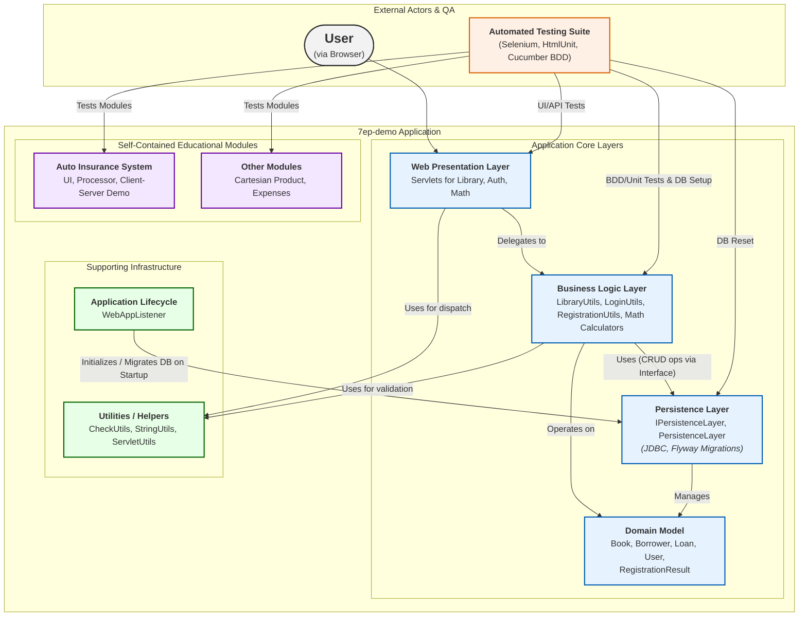

The system employs a classic layered architecture where a Web Presentation Layer (Servlets) handles HTTP requests and delegates operations to a cohesive Business Logic Layer. This layer, in turn, interacts with an abstracted Persistence Layer for all data storage and retrieval, ensuring a clear separation of concerns. All components rely on a central Domain Model for data representation and are rigorously validated by a comprehensive, multi-level automated testing suite.