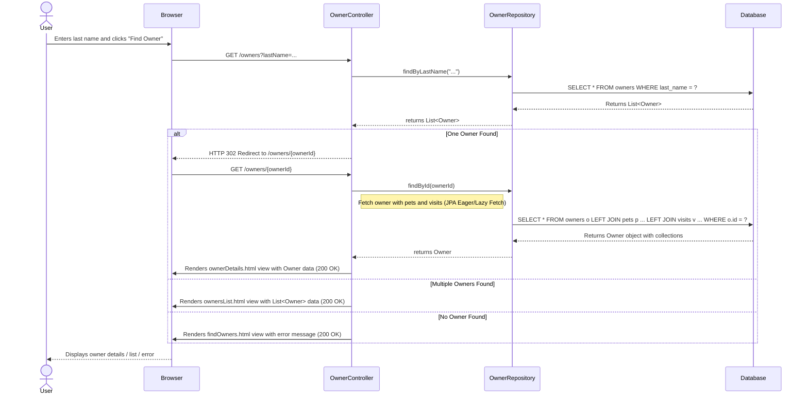
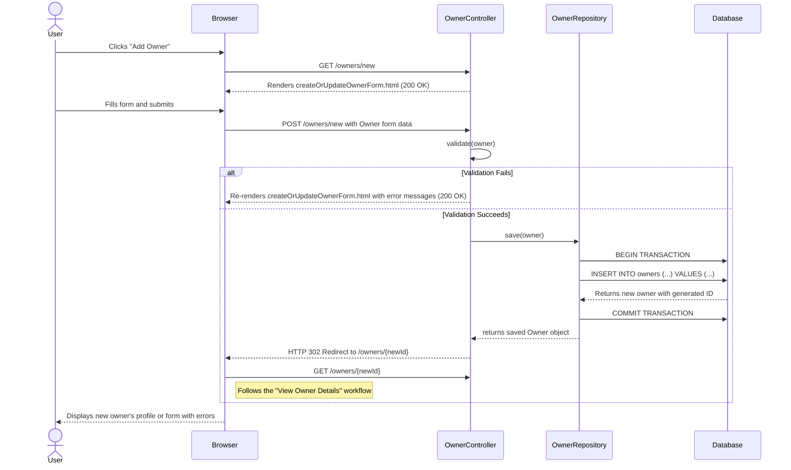
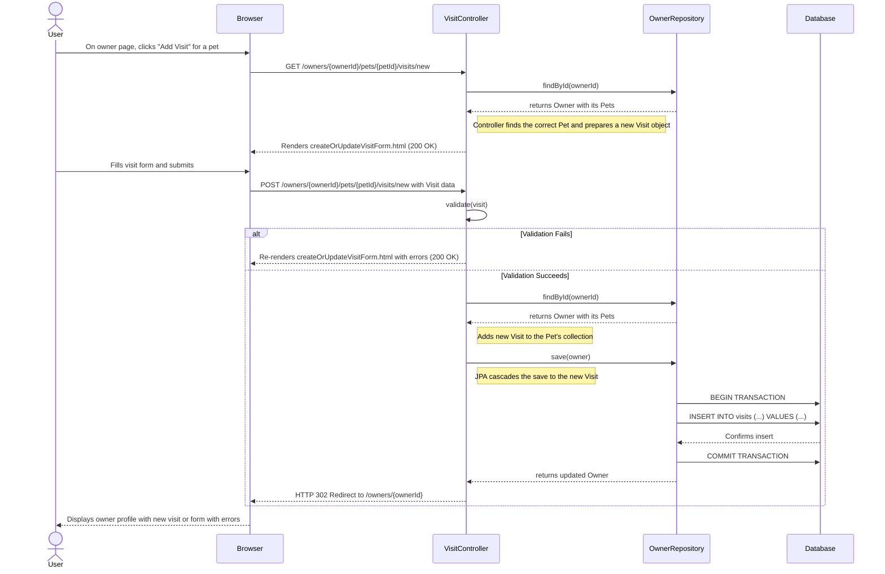
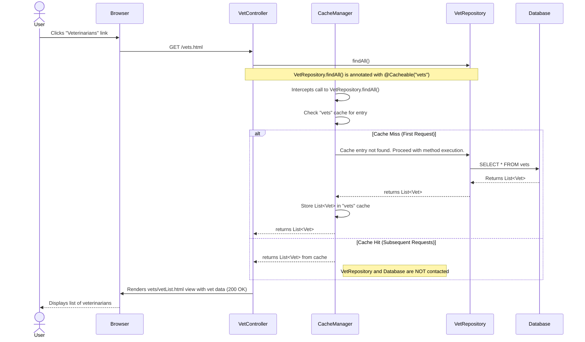
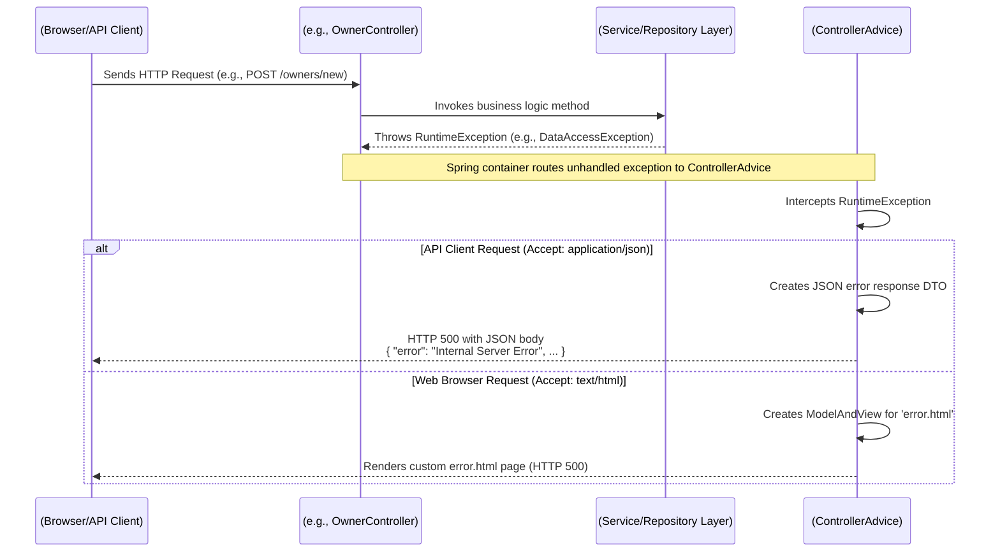

### 1. Find and View Owner Details Workflow

**Description:**
This workflow describes the process of a clinic staff member searching for a pet owner by their last name and then viewing their detailed profile. The system handles cases where one, multiple, or no owners are found. The detailed view includes the owner's information, a list of their pets, and each pet's medical visit history.

**Triggers:**
- User submits the "Find owners" form.

**Communication Patterns:**
- **Synchronous:** The entire flow is synchronous, initiated by user HTTP requests.
- **REST/HTTP:** User interaction is managed via GET requests to the `OwnerController`.
- **Database Transactions:** Data retrieval is handled through read-only transactions via Spring Data JPA (`OwnerRepository`).



---

### 2. Add a New Owner Workflow

**Description:**
This workflow details the process of registering a new pet owner. The user navigates to a creation form, fills in the owner's details, and submits the form. The system validates the input and, if successful, saves the new owner to the database and redirects the user to the newly created owner's profile.

**Triggers:**
- User clicks the "Add Owner" button/link.
- User submits the new owner form.

**Communication Patterns:**
- **Synchronous:** A standard request-response web flow.
- **REST/HTTP:** The workflow uses GET to display the form and POST to submit the new data.
- **Database Transactions:** A write transaction is used to persist the new `Owner` entity.
- **Server-Side Validation:** JSR-303 Bean Validation is used to ensure data integrity before persistence.



---

### 3. Add a New Pet to an Owner Workflow

**Description:**
This flow captures how a clinic staff member adds a new pet to an existing owner's record. The process starts from the owner's detail page, involves filling out a pet information form (including selecting a pet type), server-side validation, and persisting the new pet in relation to its owner.

**Triggers:**
- User clicks "Add New Pet" on an owner's detail page.

**Communication Patterns:**
- **Synchronous:** Standard request-response web flow.
- **REST/HTTP:** GET for the form, POST for the submission.
- **Server-Side Validation:** A custom `PetValidator` and JSR-303 annotations are used to check for required fields and business rules (e.g., unique pet name per owner).
- **Database Transactions:** A write transaction saves the new `Pet`, typically cascaded from saving the parent `Owner` entity.

```mermaid
sequenceDiagram
    actor User
    participant Browser
    participant PetController
    participant PetValidator
    participant OwnerRepository
    participant PetTypeRepository
    participant Database

    User->>Browser: On owner details page, clicks "Add New Pet"
    Browser->>PetController: GET /owners/{ownerId}/pets/new
    PetController->>OwnerRepository: findById(ownerId)
    OwnerRepository-->>PetController: returns Owner
    PetController->>PetTypeRepository: findPetTypes()
    PetTypeRepository-->>PetController: returns Collection<PetType>
    PetController-->>Browser: Renders createOrUpdatePetForm.html with PetTypes (200 OK)

    User->>Browser: Fills pet form and submits
    Browser->>PetController: POST /owners/{ownerId}/pets/new with Pet data
    PetController->>PetValidator: validate(pet)
    alt Validation Fails
        PetValidator-->>PetController: returns validation errors
        PetController->>PetTypeRepository: findPetTypes() (to re-populate form)
        PetTypeRepository-->>PetController: returns Collection<PetType>
        PetController-->>Browser: Re-renders createOrUpdatePetForm.html with errors (200 OK)
    else Validation Succeeds
        PetValidator-->>PetController: returns no errors
        PetController->>OwnerRepository: findById(ownerId)
        OwnerRepository-->>PetController: returns Owner
        PetController->>OwnerRepository: owner.addPet(pet); save(owner)
        Note right of PetController: JPA cascades the save to the new Pet
        OwnerRepository->>Database: BEGIN TRANSACTION
        OwnerRepository->>Database: INSERT INTO pets (...) VALUES (...)
        Database-->>OwnerRepository: Confirms insert
        OwnerRepository->>Database: COMMIT TRANSACTION
        OwnerRepository-->>PetController: returns updated Owner
        PetController-->>Browser: HTTP 302 Redirect to /owners/{ownerId}
    end
    Browser-->>User: Displays owner profile with new pet or form with errors
```

---

### 4. Add a New Medical Visit Workflow

**Description:**
This workflow outlines the process of recording a new medical visit for a specific pet. Starting from the owner's detail page, the user initiates the action for a particular pet, fills in the visit details (date and description), and submits the information. The system validates and saves the visit, linking it to the correct pet.

**Triggers:**
- User clicks "Add Visit" for a specific pet.

**Communication Patterns:**
- **Synchronous:** Standard web request-response cycle.
- **REST/HTTP:** GET to display the form, POST to submit the new visit data.
- **Database Transactions:** A write transaction persists the new `Visit` entity, cascaded from the owner/pet.
- **Server-Side Validation:** Bean Validation on the `Visit` entity ensures required fields are present.



---

### 5. View Veterinarian List with Caching Workflow

**Description:**
This workflow shows how the system displays the list of veterinarians. It highlights the use of a caching mechanism to improve performance. On the first request, the data is fetched from the database and stored in a cache. Subsequent requests for the same data are served directly from the cache, avoiding unnecessary database queries.

**Triggers:**
- User navigates to the "Veterinarians" page.

**Communication Patterns:**
- **Synchronous:** Standard HTTP GET request.
- **In-Memory Caching:** Spring's `@Cacheable` annotation intercepts method calls to the repository.
- **Database Transaction:** A read-only transaction is used only on a cache miss.
- **REST/HTTP:** The controller also provides a JSON/XML endpoint for API consumers, which would follow the same caching logic.



---

### 6. System Error Handling Workflow

**Description:**
This workflow illustrates the system's robust error handling pattern. When an unexpected runtime exception occurs during a request, a global exception handler (`@ControllerAdvice`) intercepts it. It then provides a different response based on the client type: a structured JSON error for API clients and a user-friendly HTML error page for web browser users.

**Triggers:**
- An unhandled `RuntimeException` is thrown during request processing.

**Communication Patterns:**
- **Exception Handling:** Centralized exception handling using a Spring `@ControllerAdvice`.
- **AOP:** The controller advice acts as an aspect that wraps controller methods.
- **Content Negotiation:** The handler inspects the `Accept` header to differentiate between API and browser clients.
- **REST/HTTP:** Responds with a 500 Internal Server Error status code.

