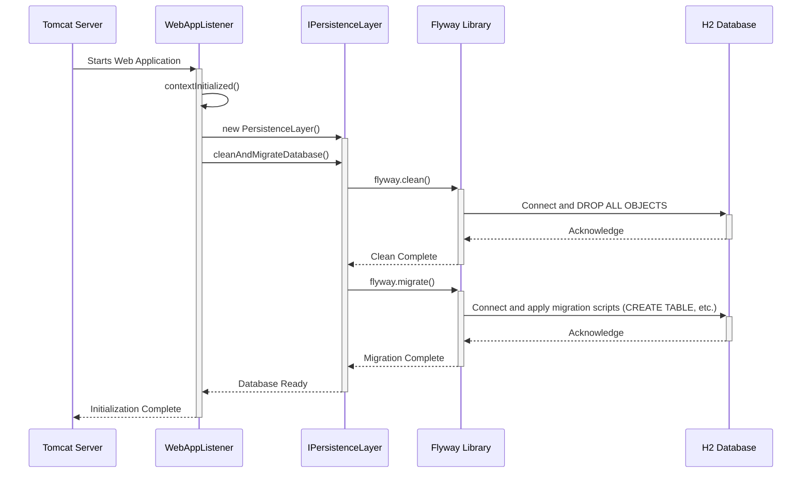
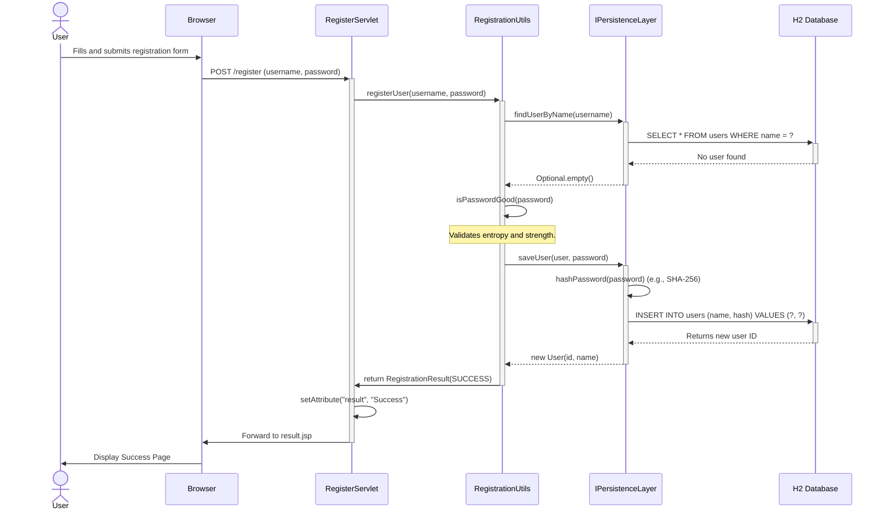
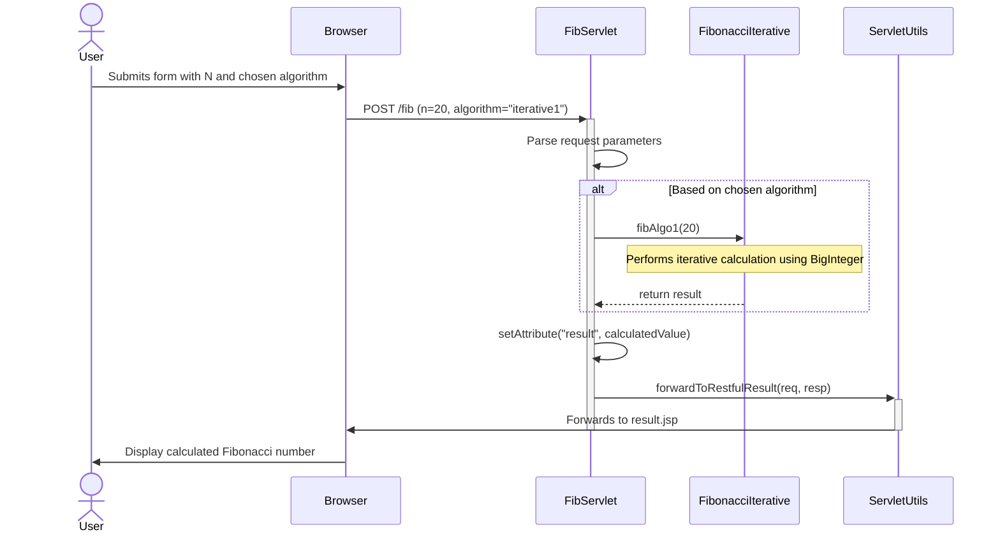

### 1. Application Startup and Database Migration

-   **Workflow Purpose and Triggers**: This workflow is triggered when the web application is started by the Tomcat server. Its purpose is to initialize the application environment, ensuring the database schema is clean and migrated to the latest version using Flyway. This provides a consistent and predictable state for every application run, which is critical for a demonstration and testing-focused system.
-   **Communication Patterns**: This flow is initiated by a Java EE Application Lifecycle Event (`ServletContextListener`). It involves direct synchronous method calls between the listener and the persistence layer, which in turn uses JDBC to communicate with the H2 database via the Flyway library.



### 2. New User Registration (Successful)

-   **Workflow Purpose and Triggers**: This workflow is triggered when a new user submits the registration form through their web browser. Its purpose is to create a new user account, provided the username is unique and the password meets the required strength criteria.
-   **Communication Patterns**: The flow starts with an HTTP POST request. Interactions are synchronous and follow a layered architecture: the Servlet (Controller) calls a utility class (Service), which in turn calls the persistence layer (DAO). The persistence layer uses JDBC for database operations, and data is passed using primitive types and domain objects (`User`, `RegistrationResult`).



### 3. User Login (Successful)

-   **Workflow Purpose and Triggers**: Triggered when an existing user submits their credentials via the login form. The purpose is to authenticate the user and grant them access to the system.
-   **Communication Patterns**: This workflow uses an HTTP POST request for credential submission. It involves synchronous, direct method calls from the `LoginServlet` to `LoginUtils`, and then to the `PersistenceLayer`. The persistence layer securely validates credentials by hashing the submitted password and comparing it against the stored hash in the H2 database via a JDBC query.

```mermaid
sequenceDiagram
    actor User
    participant Browser
    participant LoginServlet
    participant LoginUtils
    participant PersistenceLayer as IPersistenceLayer
    participant H2 as H2 Database

    User ->> Browser: Enters credentials and submits login form
    Browser ->>+ LoginServlet: POST /login (username, password)
    
    LoginServlet ->>+ LoginUtils: isUserRegistered(username, password)
    LoginUtils ->>+ PersistenceLayer: isUserPasswordCorrect(username, password)
    
    PersistenceLayer ->>+ H2: SELECT hash FROM users WHERE name = ?
    H2 -->>- PersistenceLayer: Returns stored password hash
    
    PersistenceLayer ->> PersistenceLayer: hashPassword(password)
    Note over PersistenceLayer: Hashes submitted password with SHA-256.
    PersistenceLayer ->> PersistenceLayer: compareHashes()
    Note over PersistenceLayer: Compares submitted hash with stored hash.
    
    PersistenceLayer -->>- LoginUtils: return true
    LoginUtils -->>- LoginServlet: return true
    deactivate LoginUtils
    
    LoginServlet ->> LoginServlet: Log successful authentication
    Note over LoginServlet: Creates session (implied)
    LoginServlet ->> Browser: Forward to library.html
    deactivate LoginServlet
    
    Browser ->> User: Display main library page
```

### 4. Lend a Book (Check-out)

-   **Workflow Purpose and Triggers**: This workflow is triggered when a librarian uses the system to lend a book to a registered borrower. It validates that the book is available and the borrower is registered, then records the loan transaction.
-   **Communication Patterns**: The process begins with an HTTP POST request. The `LibraryLendServlet` orchestrates the operation by making a synchronous call to `LibraryUtils`. `LibraryUtils` enforces business rules by making a series of synchronous calls to the `PersistenceLayer` to fetch book and borrower data, check book availability, and finally save the new loan record. All database interactions are via JDBC.

```mermaid
sequenceDiagram
    actor Librarian
    participant Browser
    participant LibraryLendServlet
    participant LibraryUtils
    participant PersistenceLayer as IPersistenceLayer
    participant H2 as H2 Database

    Librarian ->> Browser: Submits "Lend Book" form (book title, borrower name)
    Browser ->>+ LibraryLendServlet: POST /lend
    
    LibraryLendServlet ->>+ LibraryUtils: lendBook(bookTitle, borrowerName)
    
    alt Validate Inputs
        LibraryUtils ->>+ PersistenceLayer: findBookByTitle(bookTitle)
        PersistenceLayer -->>- LibraryUtils: Book object
        
        LibraryUtils ->>+ PersistenceLayer: findBorrowerByName(borrowerName)
        PersistenceLayer -->>- LibraryUtils: Borrower object
        
        LibraryUtils ->>+ PersistenceLayer: isBookLoaned(book.id)
        PersistenceLayer ->>+ H2: SELECT * FROM loans WHERE book_id = ? AND return_date IS NULL
        H2 -->>- PersistenceLayer: No active loan found
        PersistenceLayer -->>- LibraryUtils: return false
    end
    
    LibraryUtils ->> LibraryUtils: Create new Loan(book, borrower, checkoutDate)
    
    LibraryUtils ->>+ PersistenceLayer: saveLoan(newLoan)
    PersistenceLayer ->>+ H2: INSERT INTO loans (...) VALUES (...)
    H2 -->>- PersistenceLayer: Acknowledge success
    PersistenceLayer -->>- LibraryUtils: Saved Loan object
    
    LibraryUtils -->>- LibraryLendServlet: return LibraryActionResults.SUCCESS
    deactivate LibraryUtils
    
    LibraryLendServlet ->> Browser: Forward to success page
    deactivate LibraryLendServlet
    
    Browser ->> Librarian: Display "Loan Successful" message
```

### 5. Error Handling: Attempting to Lend an Unavailable Book

-   **Workflow Purpose and Triggers**: This flow demonstrates the system's error handling. It's triggered when a librarian attempts to lend a book that is already checked out. The purpose is to prevent the transaction and provide clear feedback.
-   **Communication Patterns**: The communication pattern is identical to the successful "Lend a Book" workflow up to the point of validation. It uses synchronous HTTP and method calls. The key is the early return from the `LibraryUtils` service layer with a specific error enum (`BOOK_CHECKED_OUT`) after a database check confirms the book's unavailability.

```mermaid
sequenceDiagram
    actor Librarian
    participant Browser
    participant LibraryLendServlet
    participant LibraryUtils
    participant PersistenceLayer as IPersistenceLayer
    participant H2 as H2 Database

    Librarian ->> Browser: Submits form to lend an already-loaned book
    Browser ->>+ LibraryLendServlet: POST /lend
    
    LibraryLendServlet ->>+ LibraryUtils: lendBook(bookTitle, borrowerName)
    
    LibraryUtils ->>+ PersistenceLayer: findBookByTitle(bookTitle)
    PersistenceLayer -->>- LibraryUtils: Book object
    
    LibraryUtils ->>+ PersistenceLayer: findBorrowerByName(borrowerName)
    PersistenceLayer -->>- LibraryUtils: Borrower object
    
    LibraryUtils ->>+ PersistenceLayer: isBookLoaned(book.id)
    PersistenceLayer ->>+ H2: SELECT * FROM loans WHERE book_id = ? AND return_date IS NULL
    H2 -->>- PersistenceLayer: Active loan record found
    PersistenceLayer -->>- LibraryUtils: return true
    
    Note right of LibraryUtils: Book is already checked out. Abort operation.
    LibraryUtils -->>- LibraryLendServlet: return LibraryActionResults.BOOK_CHECKED_OUT
    deactivate LibraryUtils
    
    LibraryLendServlet ->> LibraryLendServlet: setAttribute("error", "Book is already checked out")
    LibraryLendServlet ->> Browser: Forward to result page with error
    deactivate LibraryLendServlet
    
    Browser ->> Librarian: Display Error Message
```

### 6. Perform a Mathematical Calculation (Educational Module)

-   **Workflow Purpose and Triggers**: This workflow is part of the educational system, triggered when a user requests a mathematical calculation (e.g., Fibonacci) via a web form. Its purpose is to perform the computation and display the result, demonstrating algorithmic logic.
-   **Communication Patterns**: This is a stateless, computation-heavy workflow initiated by an HTTP POST. The `FibServlet` directly calls a static utility method in a mathematical helper class (`FibonacciIterative`). There is no interaction with the persistence layer. Communication is entirely synchronous within the application's business logic layer, followed by a standard servlet forward to the view.

