```mermaid
graph TB
    subgraph "Frontend Layer"
        JSP[JSP Files: result.jsp, restfulresult.jsp]
        Static[Static HTML/CSS/JS]
        SPA[SPA Components: library.js, catalog.js]
    end

    subgraph "Web Layer"
        LoginServlet[LoginServlet]
        RegisterServlet[RegisterServlet]
        MathServlet[MathServlet]
        FibServlet[FibServlet]
        AckServlet[AckServlet]
        LibraryServlets[Library Servlets]
        DbServlet[DbServlet]
        AlcoholCalc[AlcoholCalculator]
    end

    subgraph "Business Logic"
        LoginUtils[LoginUtils]
        RegistrationUtils[RegistrationUtils]
        LibraryUtils[LibraryUtils]
        Calculator[Calculator]
        Fibonacci[Fibonacci]
        Ackermann[Ackermann]
        AutoInsuranceProcessor[AutoInsuranceProcessor]
    end

    subgraph "Persistence Layer"
        IPersistence[IPersistenceLayer]
        PersistenceImpl[PersistenceLayer]
        SqlData[SqlData]
        ParameterObject[ParameterObject]
    end

    subgraph "Database"
        H2[(H2 Database)]
        Flyway[Flyway Migrations]
    end

    subgraph "Desktop Application"
        AutoInsuranceUI[AutoInsuranceUI - Swing]
        ScriptServer[AutoInsuranceScriptServer]
    end

    subgraph "Testing Infrastructure"
        UnitTests[Unit Tests: JUnit]
        IntegrationTests[Integration Tests]
        BDDTests[BDD: Cucumber]
        UITests[UI Tests: Selenium]
        APITests[API Tests]
        PerformanceTests[Performance: JMeter]
    end

    subgraph "CI/CD & Quality"
        Jenkins[Jenkins Pipeline]
        SonarQube[SonarQube Analysis]
        OWASP[OWASP ZAP Security]
        JaCoCo[JaCoCo Coverage]
    end

    %% Web Layer Connections
    Static --> LoginServlet
    Static --> RegisterServlet
    Static --> MathServlet
    Static --> LibraryServlets
    Static --> DbServlet

    %% Servlet to Business Logic
    LoginServlet --> LoginUtils
    RegisterServlet --> RegistrationUtils
    LibraryServlets --> LibraryUtils
    MathServlet --> Calculator
    FibServlet --> Fibonacci
    AckServlet --> Ackermann
    AlcoholCalc --> Calculator

    %% Business Logic to Persistence
    LoginUtils --> IPersistence
    RegistrationUtils --> IPersistence
    LibraryUtils --> IPersistence
    DbServlet --> Flyway

    %% Persistence Implementation
    IPersistence --> PersistenceImpl
    PersistenceImpl --> SqlData
    SqlData --> ParameterObject
    SqlData --> H2

    %% Database Migrations
    Flyway --> H2

    %% Response Rendering
    LoginServlet --> JSP
    RegisterServlet --> JSP
    MathServlet --> JSP
    LibraryServlets --> JSP

    %% Desktop App
    AutoInsuranceUI --> AutoInsuranceProcessor
    ScriptServer --> AutoInsuranceUI
    AutoInsuranceProcessor --> Calculator

    %% Testing Connections
    UnitTests --> LoginUtils
    UnitTests --> LibraryUtils
    IntegrationTests --> PersistenceImpl
    BDDTests --> LoginServlet
    BDDTests --> LibraryServlets
    UITests --> Static
    APITests --> LoginServlet
    APITests --> LibraryServlets
    PerformanceTests --> LibraryServlets

    %% CI/CD Pipeline
    Jenkins --> UnitTests
    Jenkins --> IntegrationTests
    Jenkins --> BDDTests
    Jenkins --> UITests
    Jenkins --> SonarQube
    Jenkins --> OWASP
    Jenkins --> JaCoCo
```

The diagram reflects a classic layered architecture where the web layer (servlets) handles HTTP requests and delegates to domain-specific business logic components. The persistence layer abstracts database operations through a custom micro-ORM, with Flyway managing schema migrations. The desktop insurance application operates independently with its own UI and socket-based test interface. All components are covered by a comprehensive testing pyramid integrated into a Jenkins CI/CD pipeline with quality gates for code analysis, security scanning, and performance testing.