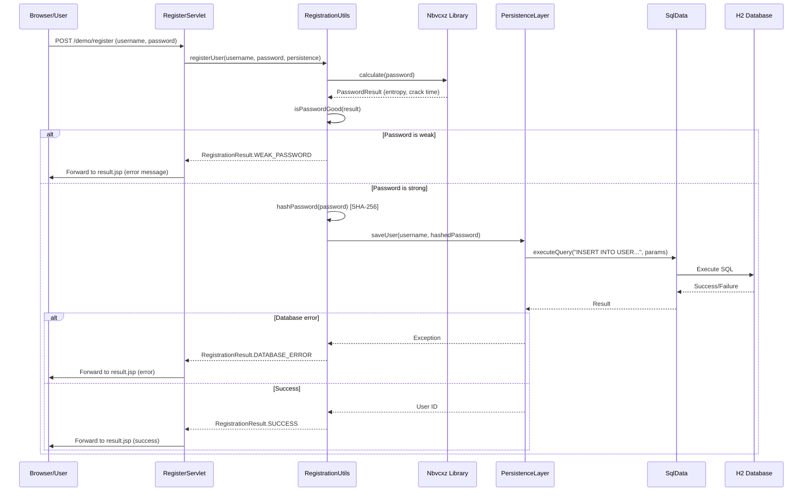
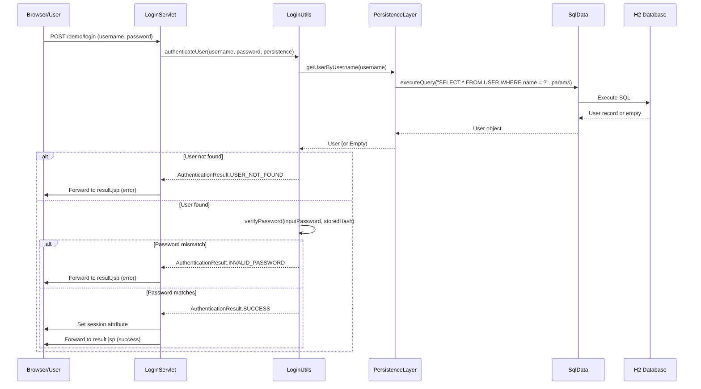
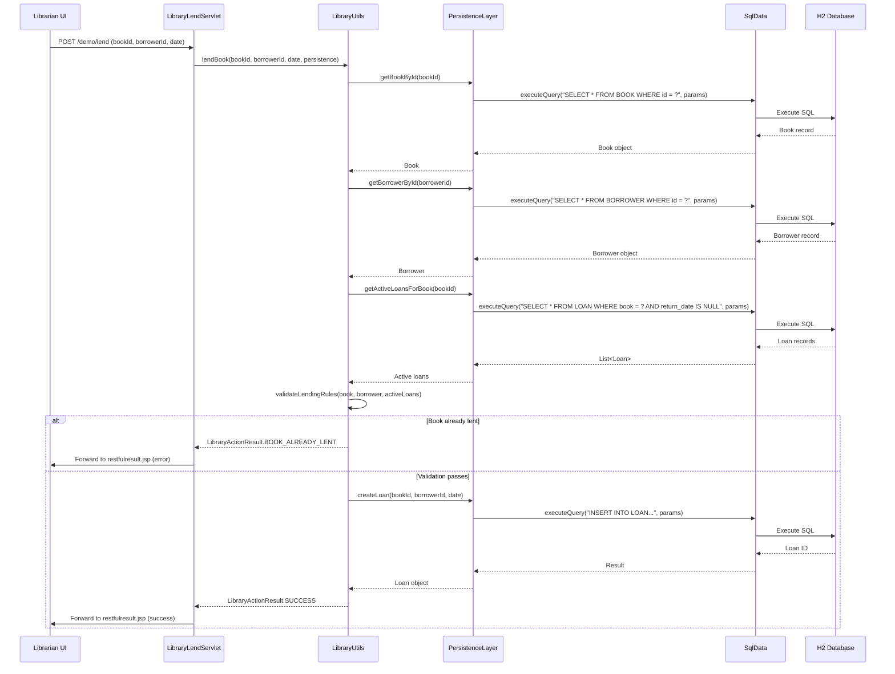
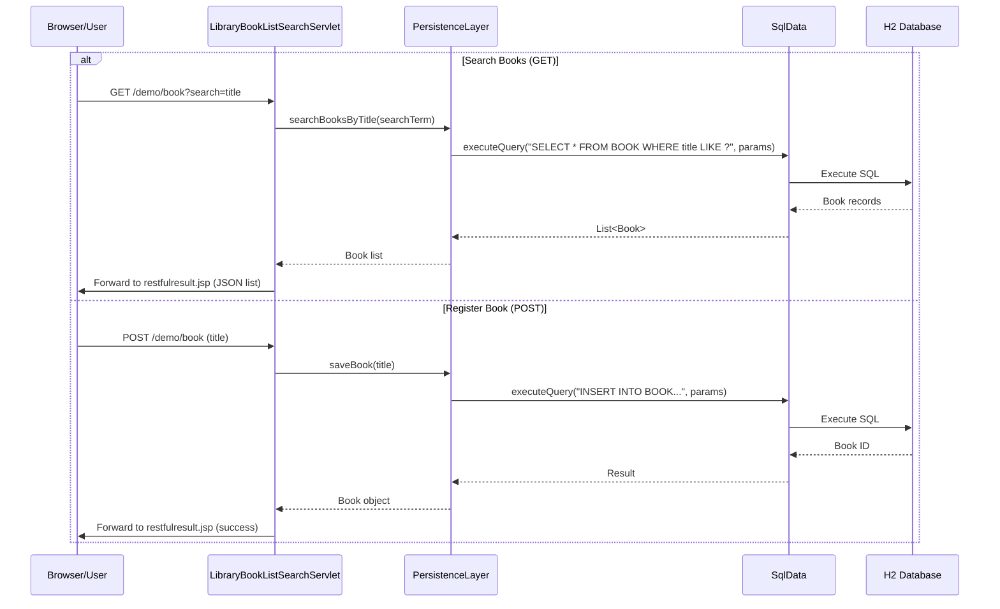
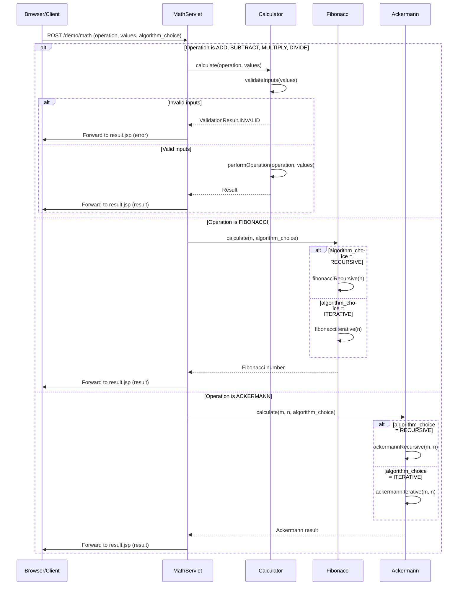
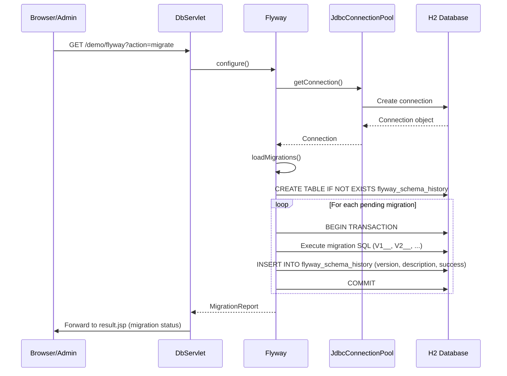
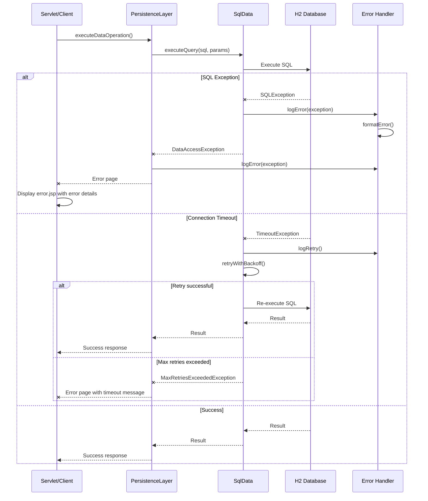
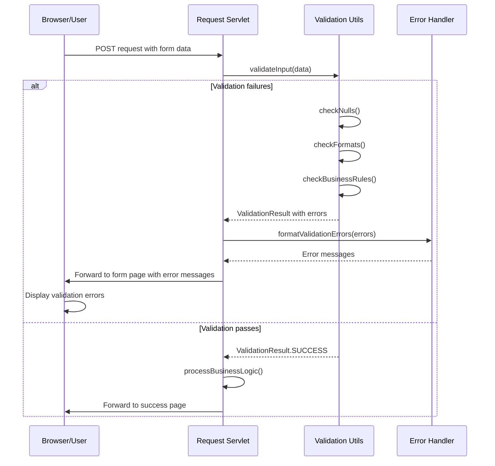
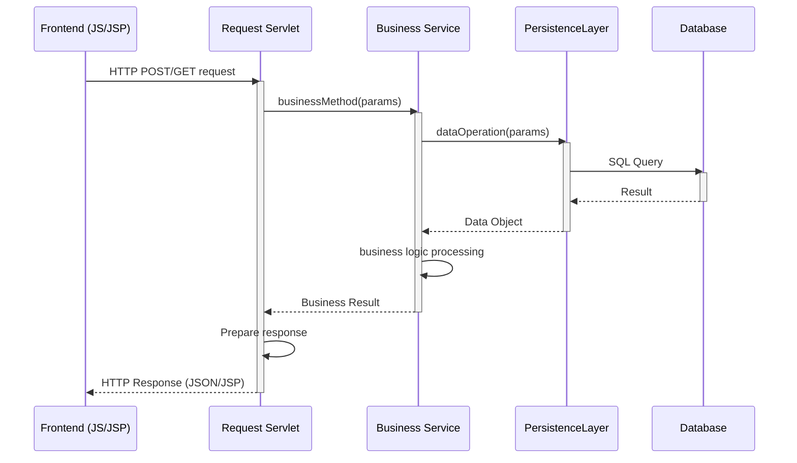
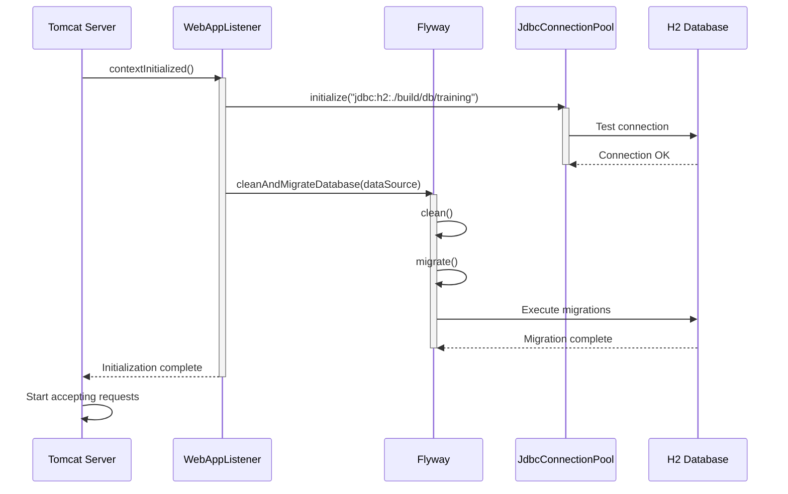

# User Authentication Workflows

## User Registration Workflow

## User Login Workflow

# Library Management Workflows

## Book Lending Workflow

## Book Registration and Search Workflow

# Mathematics Service Workflow

# Database Migration Workflow

# Error Handling and Recovery Patterns

## Database Error Handling Pattern

## Validation Error Pattern

# Cross-Cutting Communication Patterns

## Synchronous REST Communication Pattern

## Application Initialization and Startup Pattern

