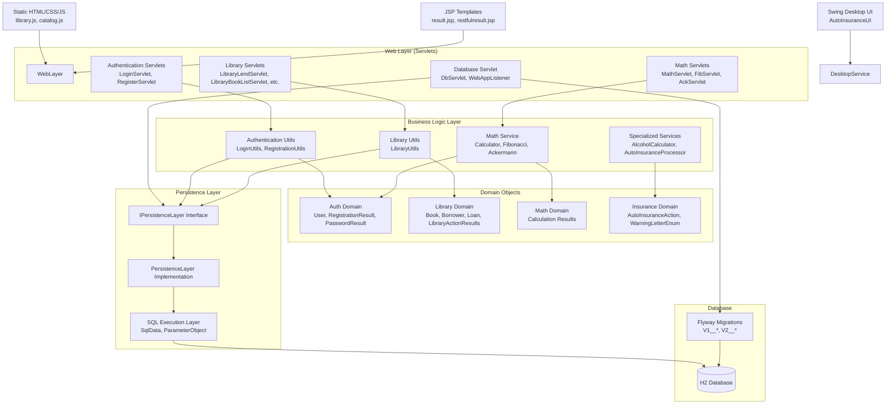

The architecture follows a layered pattern with clear separation between web presentation, business logic, and data persistence. Component boundaries align with business domains (authentication, library management, mathematics), each with dedicated servlets, utilities, and domain objects. Communication flows synchronously from servlets through business logic to the persistence layer, with the database abstracted behind an interface that enables clean separation of concerns.