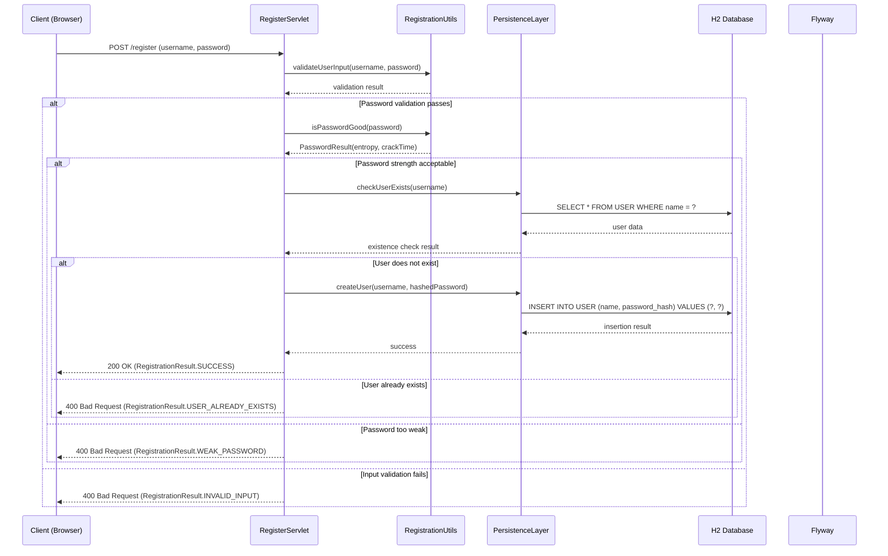
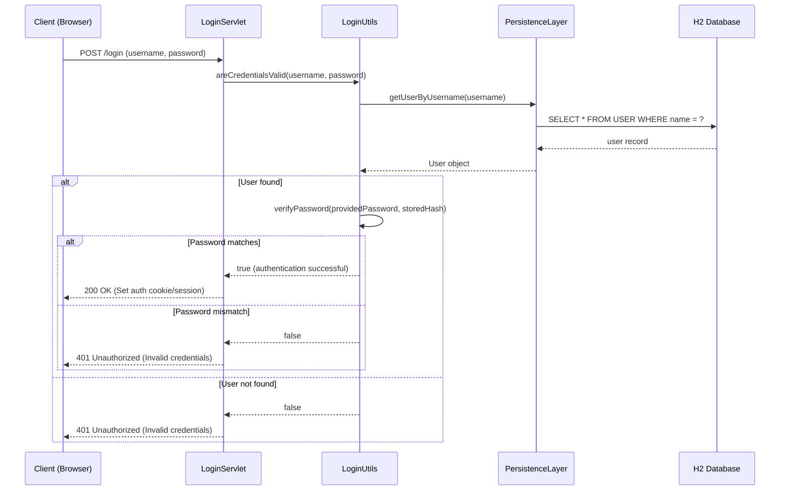
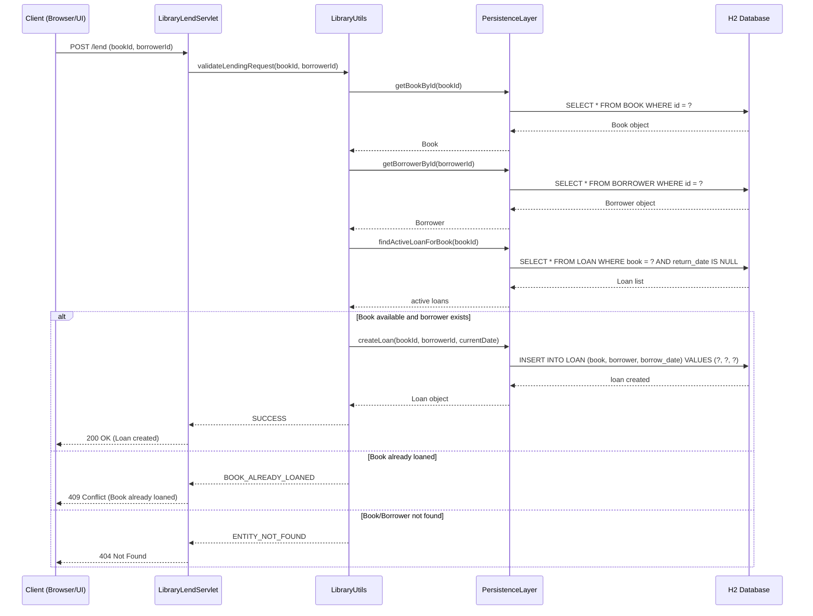
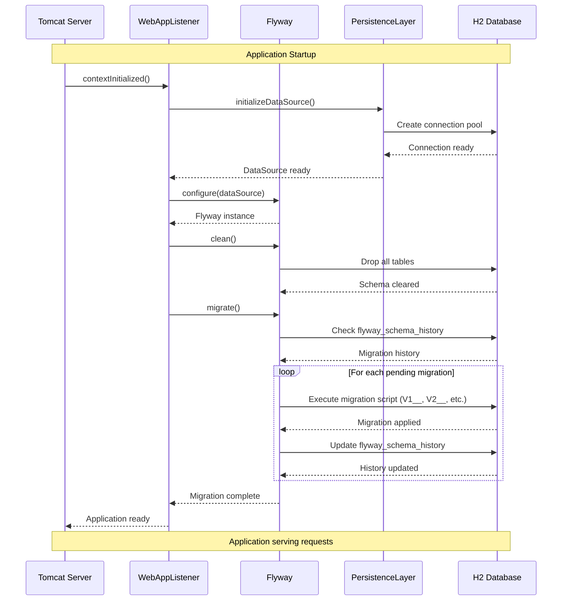
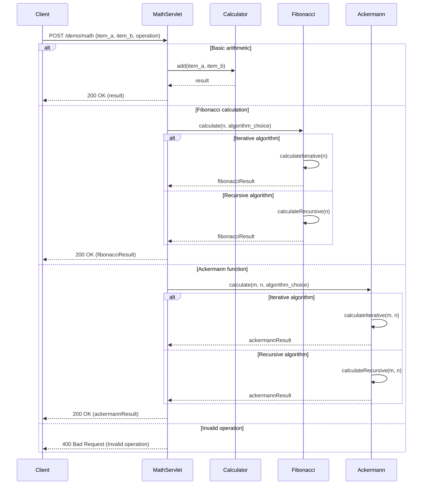
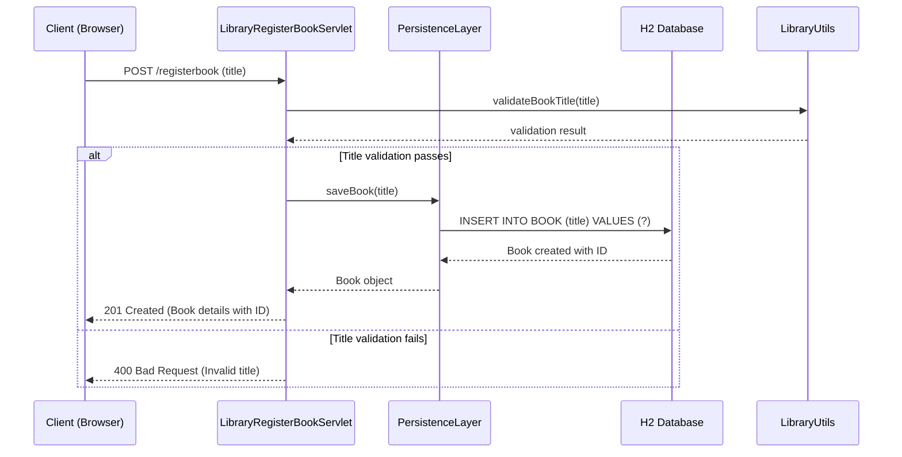
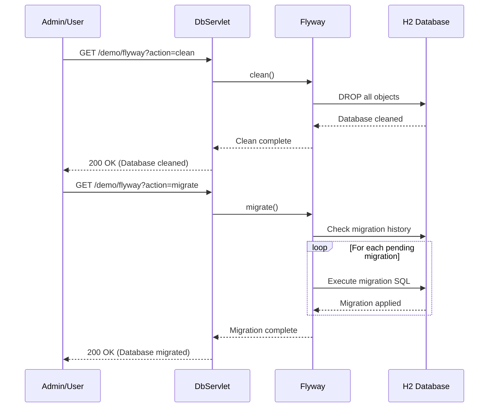
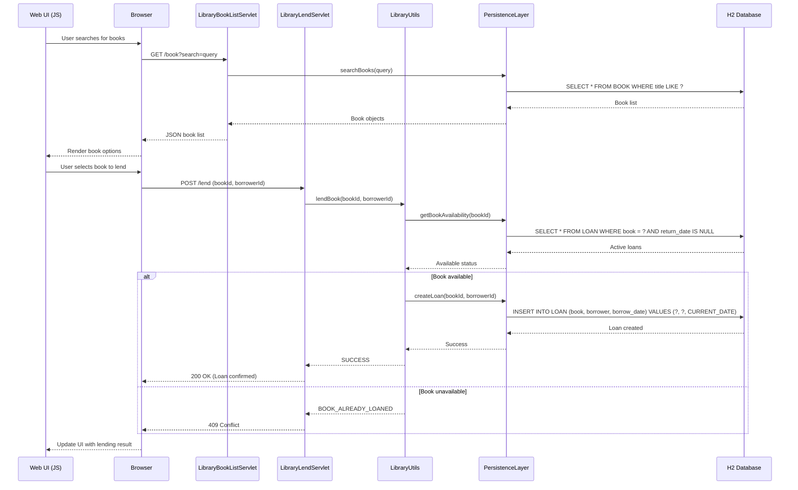

# User Registration Workflow

## User Login Authentication Workflow

## Book Lending Workflow

## Database Migration Workflow (Application Startup)

## Mathematical Calculation Workflow

## Book Registration Workflow

## Database Maintenance via HTTP API

## Full Library Search and Lend Workflow
