```mermaid
graph TB
    %% Web Layer
    Client[Client/Browser] -->|HTTP Requests| Servlets[Servlet Layer]
    Servlets --> LoginServlet
    Servlets --> RegisterServlet
    Servlets --> LibraryRegisterBookServlet
    Servlets --> LibraryRegisterBorrowerServlet
    Servlets --> LibraryLendServlet
    Servlets --> LibraryBookListSearchServlet
    Servlets --> LibraryBorrowerListSearchServlet
    Servlets --> LibraryBookListAvailableServlet
    Servlets --> MathServlet
    Servlets --> FibServlet
    Servlets --> AckServlet
    Servlets --> DbServlet
    
    %% Authentication Service
    LoginServlet --> LoginUtils
    RegisterServlet --> RegistrationUtils
    LoginUtils --> IPersistenceLayer
    RegistrationUtils --> IPersistenceLayer
    RegistrationUtils --> SharedUtils[Shared Utilities]
    
    %% Library Management Service
    LibraryRegisterBookServlet --> LibraryUtils
    LibraryRegisterBorrowerServlet --> LibraryUtils
    LibraryLendServlet --> LibraryUtils
    LibraryBookListSearchServlet --> LibraryUtils
    LibraryBorrowerListSearchServlet --> LibraryUtils
    LibraryBookListAvailableServlet --> LibraryUtils
    LibraryUtils --> IPersistenceLayer
    LibraryUtils --> SharedUtils
    
    %% Mathematics Service
    MathServlet --> Calculator
    FibServlet --> Fibonacci
    AckServlet --> Ackermann
    Calculator --> SharedUtils
    Fibonacci --> SharedUtils
    Ackermann --> SharedUtils
    
    %% Desktop Application Module
    AutoInsuranceUI[AutoInsuranceUI] --> AutoInsuranceProcessor
    AutoInsuranceScriptServer --> AutoInsuranceProcessor
    AutoInsuranceProcessor --> AutoInsuranceAction[AutoInsuranceAction]
    
    %% Persistence Layer
    IPersistenceLayer --> PersistenceLayer
    PersistenceLayer --> SqlData
    SqlData --> H2Database[H2 Database]
    DbServlet --> IPersistenceLayer
    
    %% Database Schema
    H2Database --> UserTable[USER Table]
    H2Database --> BookTable[BOOK Table]
    H2Database --> BorrowerTable[BORROWER Table]
    H2Database --> LoanTable[LOAN Table]
    
    %% Shared Utilities
    SharedUtils --> StringUtils
    SharedUtils --> CheckUtils
    SharedUtils --> DateUtils
    SharedUtils --> ServletUtils
    
    %% Web Infrastructure
    WebAppListener --> Servlets
    Servlets --> ResultJSP[result.jsp]
    Servlets --> RestfulResultJSP[restfulresult.jsp]
    
    %% Domain Objects
    LoginUtils --> User[User Domain]
    RegistrationUtils --> User
    LibraryUtils --> Book[Book Domain]
    LibraryUtils --> Borrower[Borrower Domain]
    LibraryUtils --> Loan[Loan Domain]
```

The component boundaries are organized around distinct business domains (authentication, library management, mathematics) with clear separation of concerns. Communication flows primarily through the servlet layer handling HTTP requests, delegating to domain-specific utilities that interact with a shared persistence layer, while maintaining a common set of shared utilities for cross-cutting concerns.