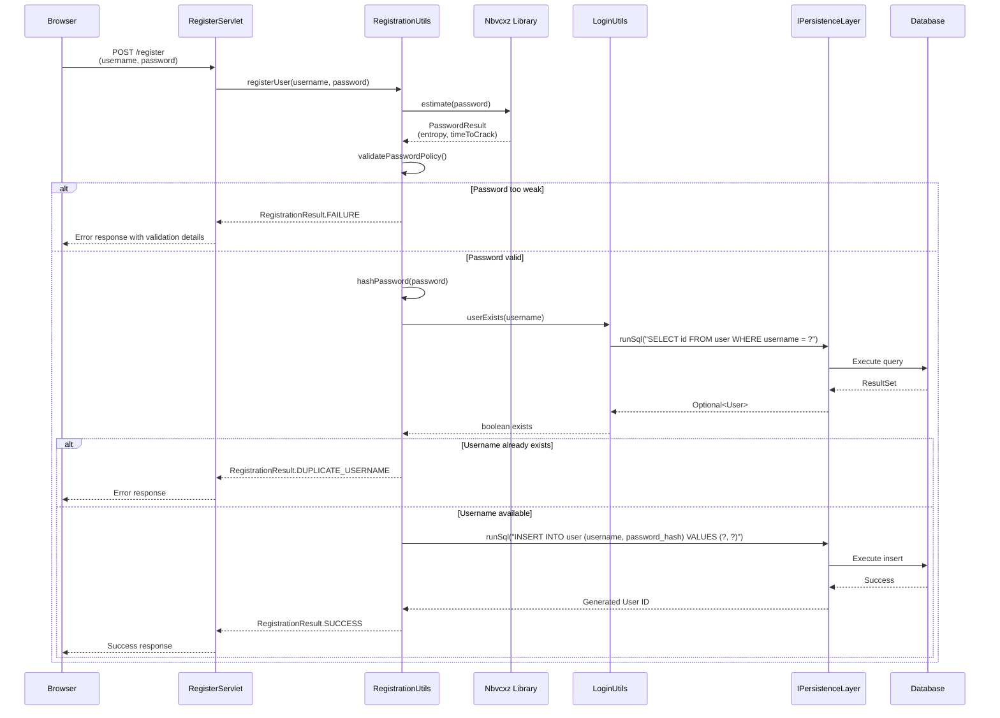
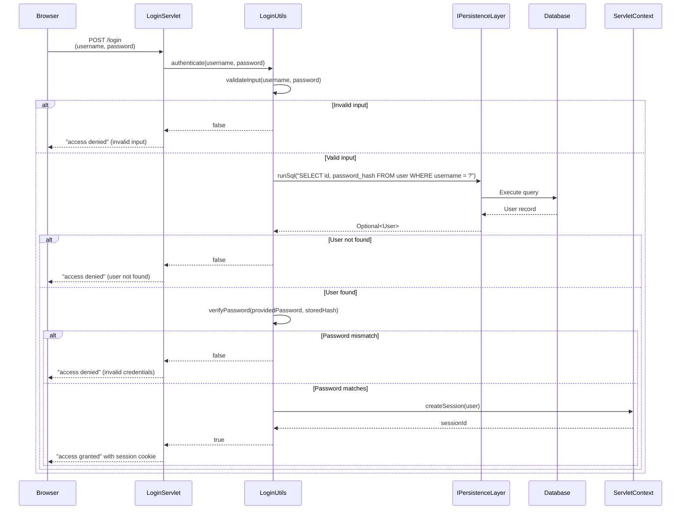
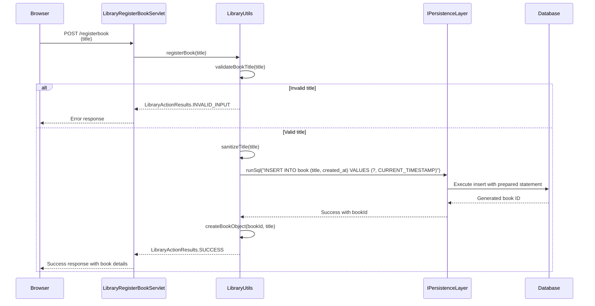
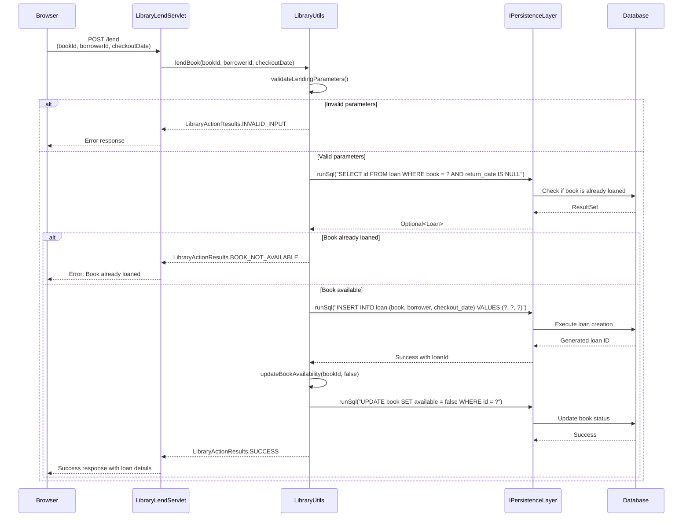
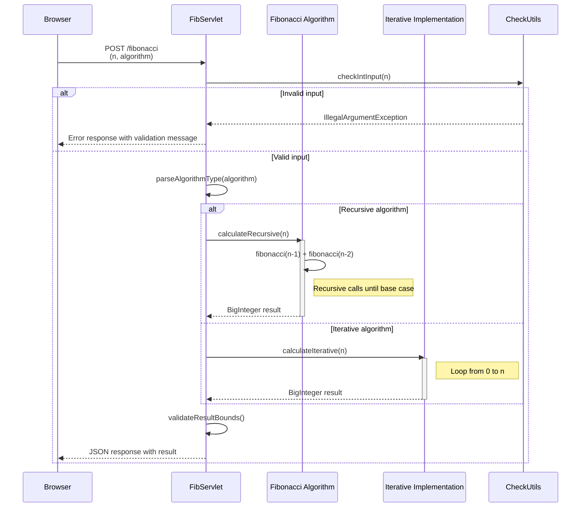
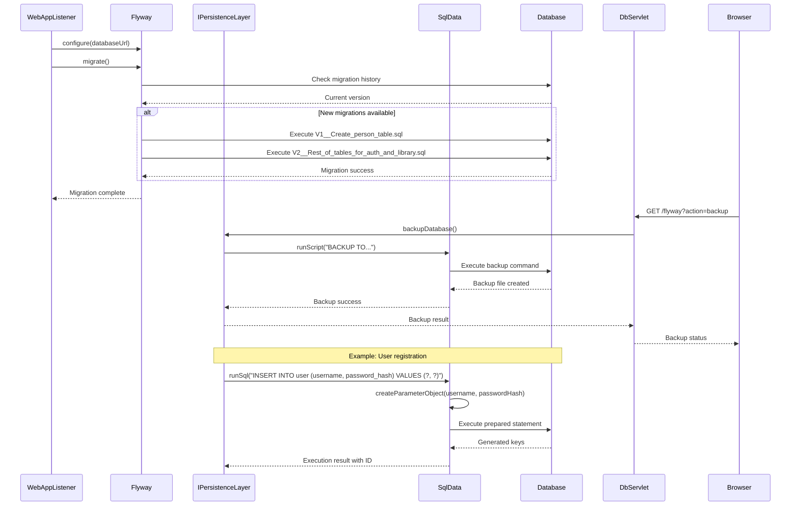
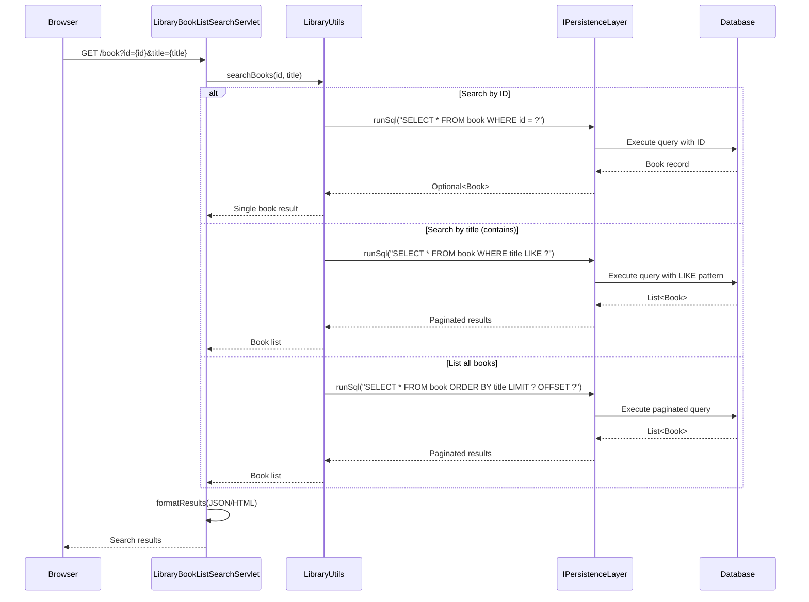
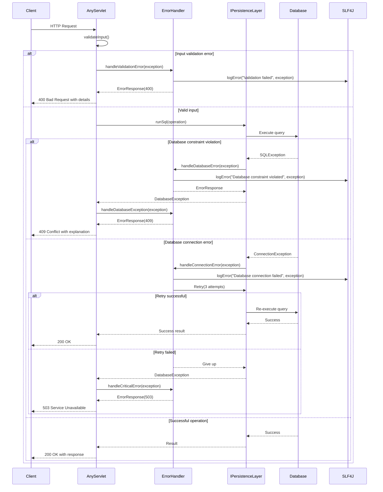

## 1. User Registration Workflow

**Purpose**: New user account creation with secure password validation and duplicate prevention.  
**Triggers**: User submits registration form with username and password.  
**Communication Patterns**: Synchronous REST POST, database transactions, password hashing, validation via third-party library.

---

## 2. User Authentication Workflow

**Purpose**: User identity verification and session establishment.  
**Triggers**: User submits login credentials.  
**Communication Patterns**: Synchronous REST POST, database query, session management, password verification.

---

## 3. Book Registration Workflow

**Purpose**: Adding new books to the library catalog.  
**Triggers**: Librarian submits book registration form.  
**Communication Patterns**: Synchronous REST POST, database transaction, input validation and sanitization.

---

## 4. Book Lending Workflow

**Purpose**: Processing book checkout with availability verification and loan tracking.  
**Triggers**: Librarian processes book checkout for a borrower.  
**Communication Patterns**: Synchronous REST POST, multiple database transactions, consistency checks.

---

## 5. Fibonacci Calculation Workflow

**Purpose**: Computing Fibonacci sequence using user-selected algorithm.  
**Triggers**: User requests Fibonacci calculation with parameters.  
**Communication Patterns**: Synchronous REST POST, algorithm selection, input validation, big integer arithmetic.

---

## 6. Database Migration and Persistence Workflow

**Purpose**: Database schema management, migration execution, and persistence operations.  
**Triggers**: Application startup (migrations), admin operations (backup/restore), CRUD operations.  
**Communication Patterns**: Database transactions, schema migrations, prepared statements, connection management.

---

## 7. Book Search and Catalog Browsing Workflow

**Purpose**: Searching and browsing the library catalog with multiple search criteria.  
**Triggers**: User performs book search or browses catalog.  
**Communication Patterns**: Synchronous REST GET, database queries with pagination, flexible search criteria.

---

## 8. Error Handling and Recovery Workflow

**Purpose**: Centralized error handling with logging, retry mechanisms, and appropriate HTTP status codes.  
**Triggers**: Any system error or exception during request processing.  
**Communication Patterns**: Exception handling, retry logic, error logging, user-friendly error responses.