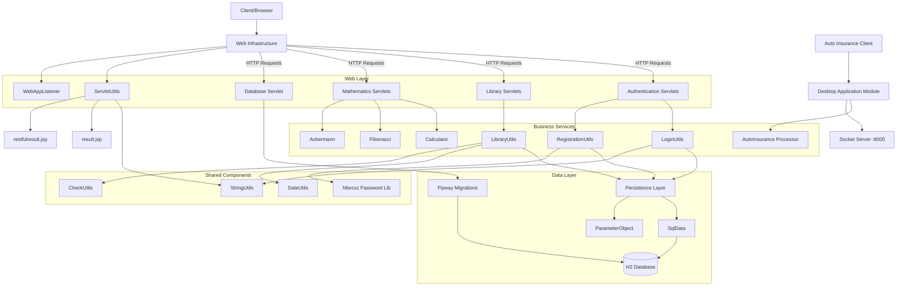

The component boundaries are organized by domain responsibility with clear separation between web handling, business logic, and data persistence. Communication follows a layered pattern where servlets handle HTTP requests and delegate to service utilities for business operations, which in turn interact with the centralized persistence layer. The architecture uses synchronous request/response flows with the persistence layer as the only shared dependency across services, making it a natural extraction point for microservice decomposition.