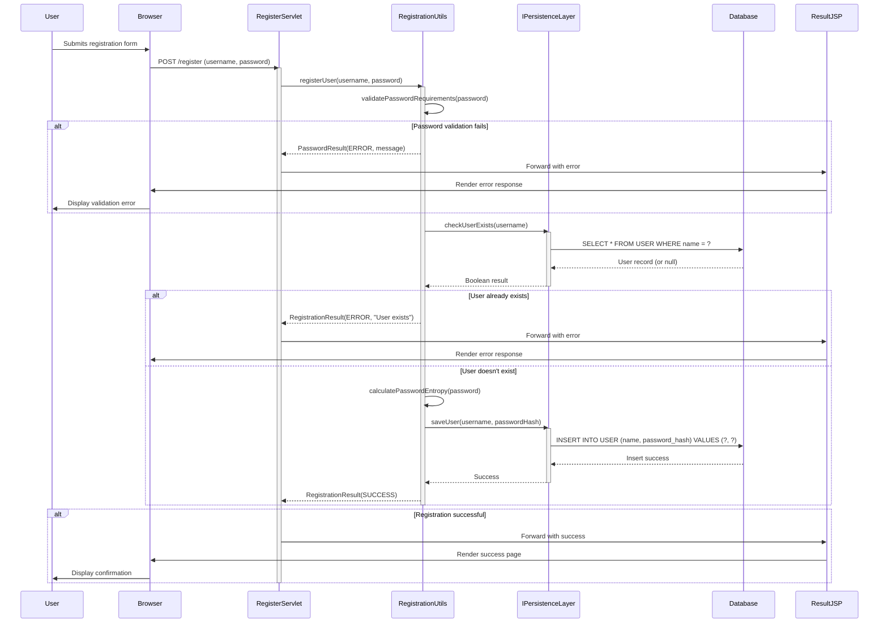
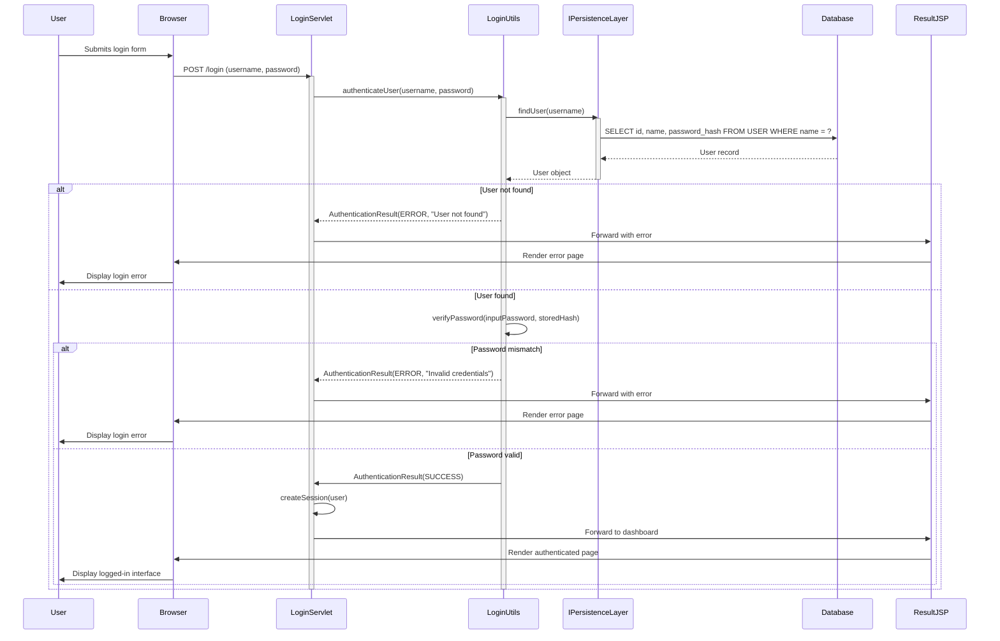
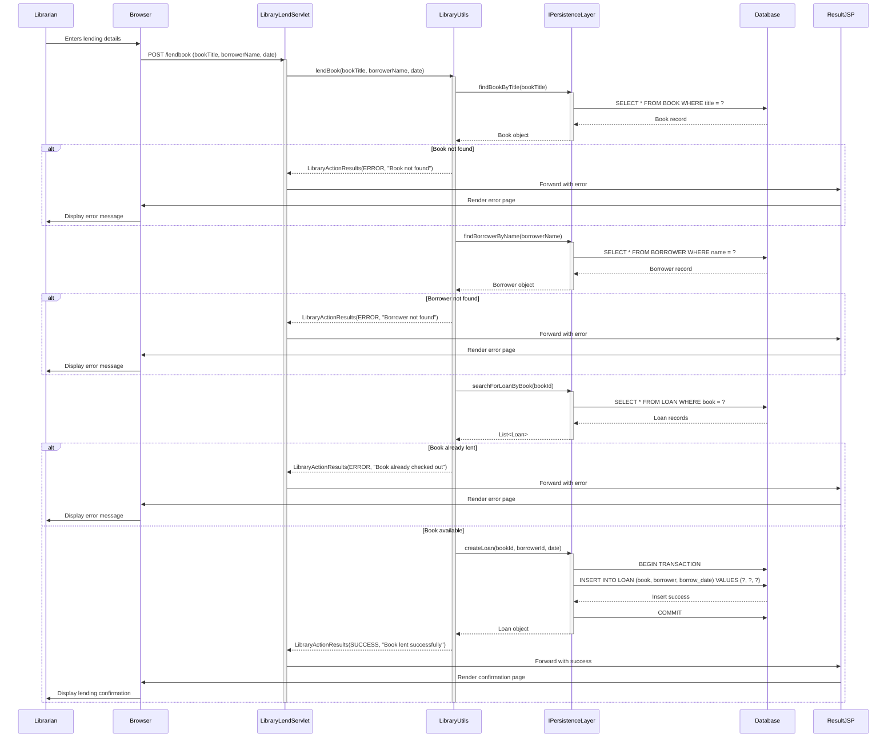
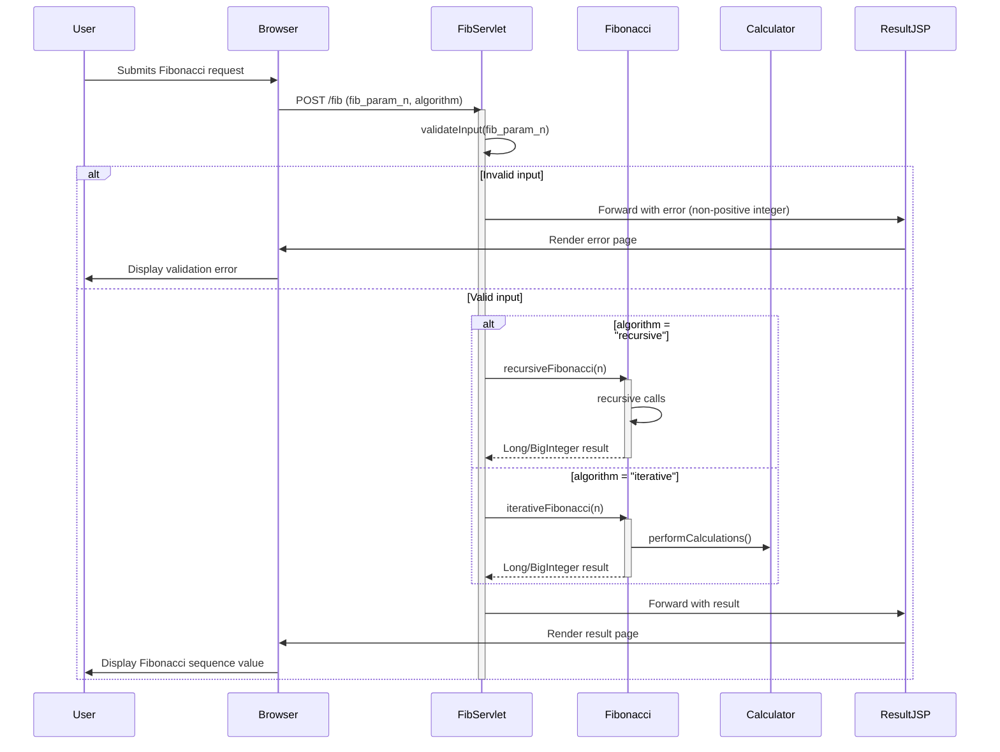
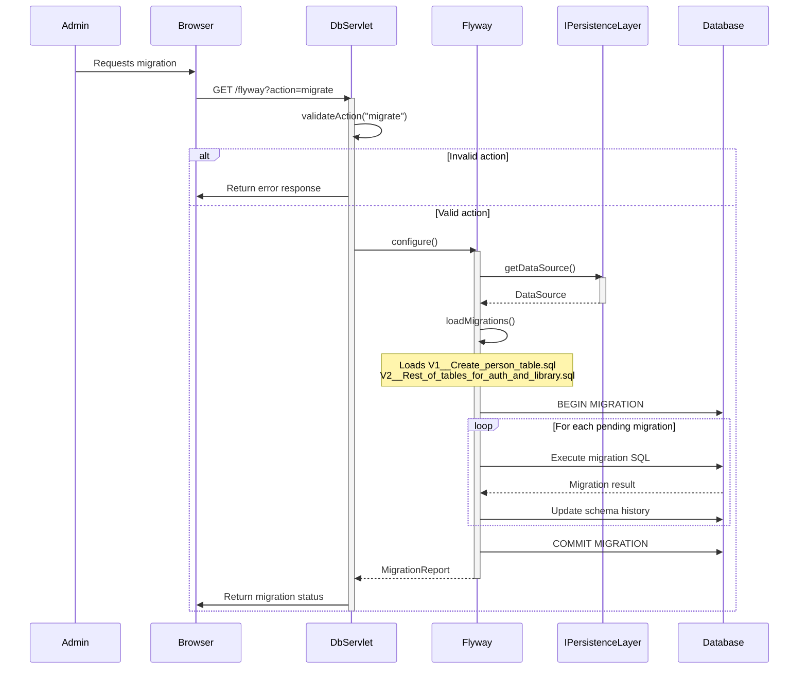
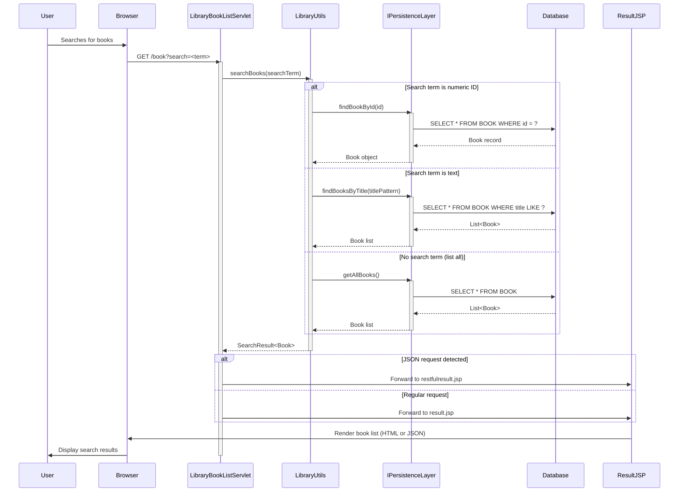

## User Registration Workflow

**Description:** The user registration workflow handles new user creation with password strength validation, duplicate checking, and secure password storage. The flow uses synchronous HTTP requests, validates input entropy requirements (12+ chars with complexity), checks for existing users in the database, and stores hashed passwords. Communication pattern: REST POST endpoint → Business validation → Database transaction → JSP response.

---

## User Authentication Workflow

**Description:** Authentication workflow validates user credentials against stored hashes. Uses synchronous HTTP POST for login, retrieves user by username from database, verifies password hashes, creates HTTP session on success, and redirects to appropriate view. Communication pattern: REST POST → Database query → Password verification → Session management → JSP redirect.

---

## Book Lending Workflow

**Description:** The book lending workflow handles the checkout process with validation for book/borrower existence and availability. Uses synchronous HTTP POST, performs multiple database queries to validate entities, checks current loans to prevent duplicate lending, creates loan records within transactions, and provides detailed status feedback. Communication pattern: REST POST → Multiple DB queries → Transaction → JSP response.

---

## Fibonacci Computation Workflow

**Description:** Stateless mathematical computation workflow that calculates Fibonacci sequences using either recursive or iterative algorithms. Validates integer input bounds (32-bit limits), delegates to appropriate algorithm implementation, uses BigInteger for large results, and renders results via JSP. Communication pattern: REST POST → Input validation → Algorithm execution → Direct response (no DB).

---

## Database Migration Workflow

**Description:** Database migration workflow managed by Flyway for schema versioning. Triggered via HTTP GET with action parameter, validates migration state, applies pending SQL scripts in order, updates schema history table, and provides migration feedback. Communication pattern: HTTP GET → Flyway orchestration → Sequential SQL execution → Status response. Error handling includes transaction rollback on failure.

---

## Book Search Workflow

**Description:** Book search workflow supporting ID lookup, title search, and full listing with dual response formats. Handles different search patterns (exact ID, title contains, all books), uses parameterized SQL queries, detects request type for HTML/JSON responses via different JSPs, and returns structured book data. Communication pattern: HTTP GET → Conditional DB queries → Flexible rendering.