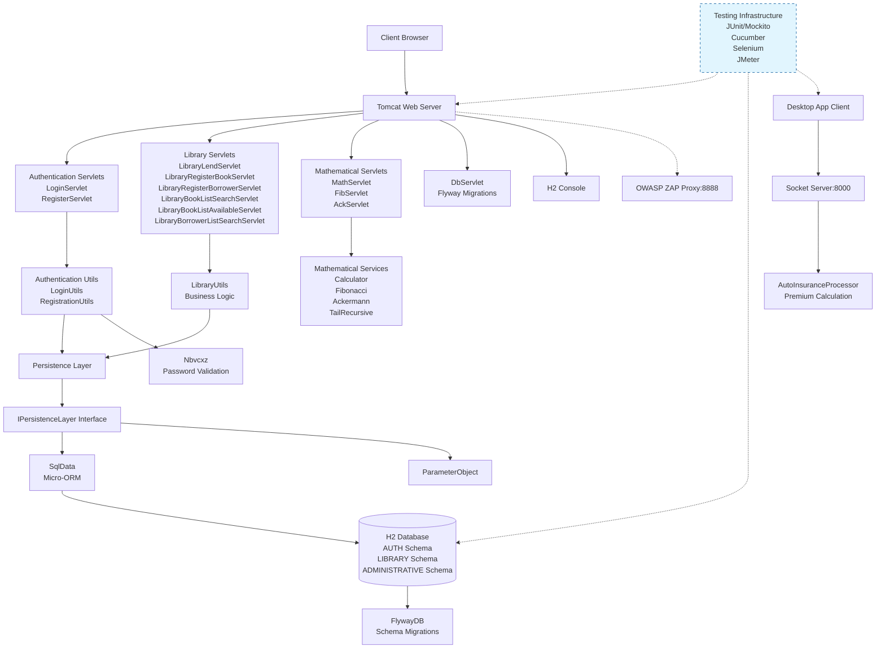

# Component Architecture Diagram

## Rationale

The architecture follows a layered pattern with clear separation of concerns: presentation layer (servlets) handles HTTP requests, business logic layer (utils) contains domain-specific operations, and persistence layer manages data access through a DAO pattern. Communication flows vertically from client to database, with horizontal integration through external security and testing components, while the desktop application uses socket-based communication to maintain independence from the web tier.