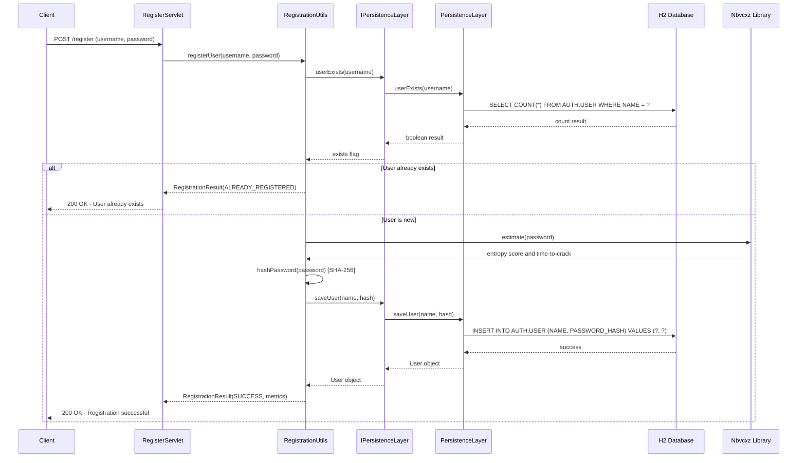
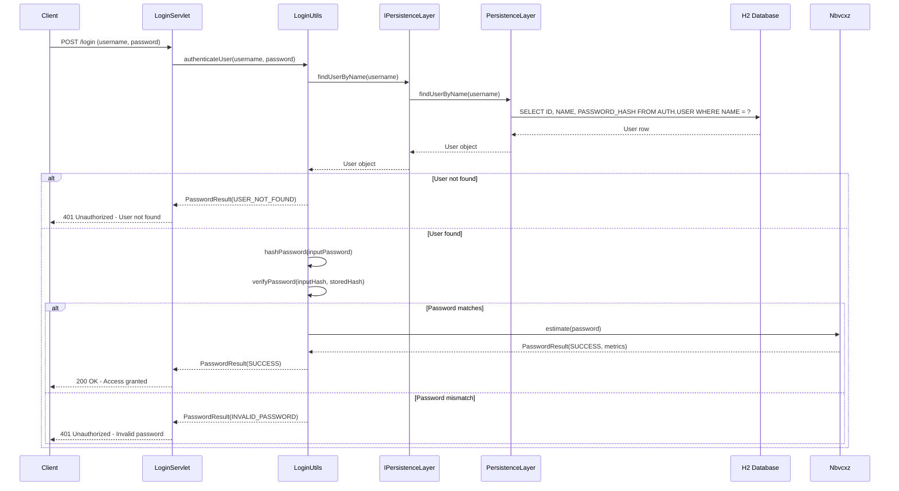
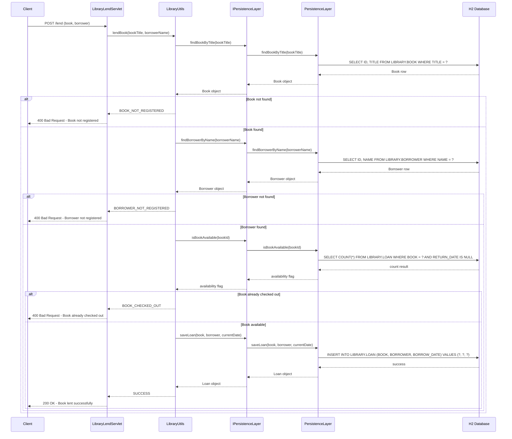
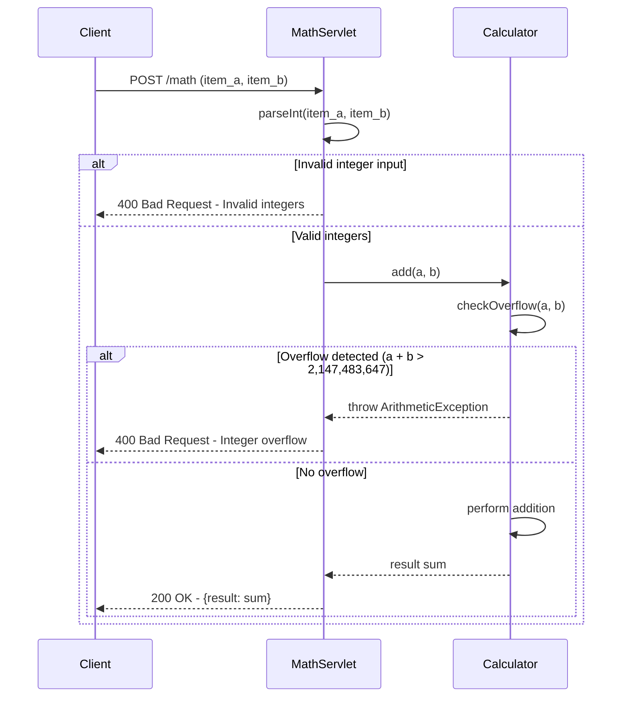
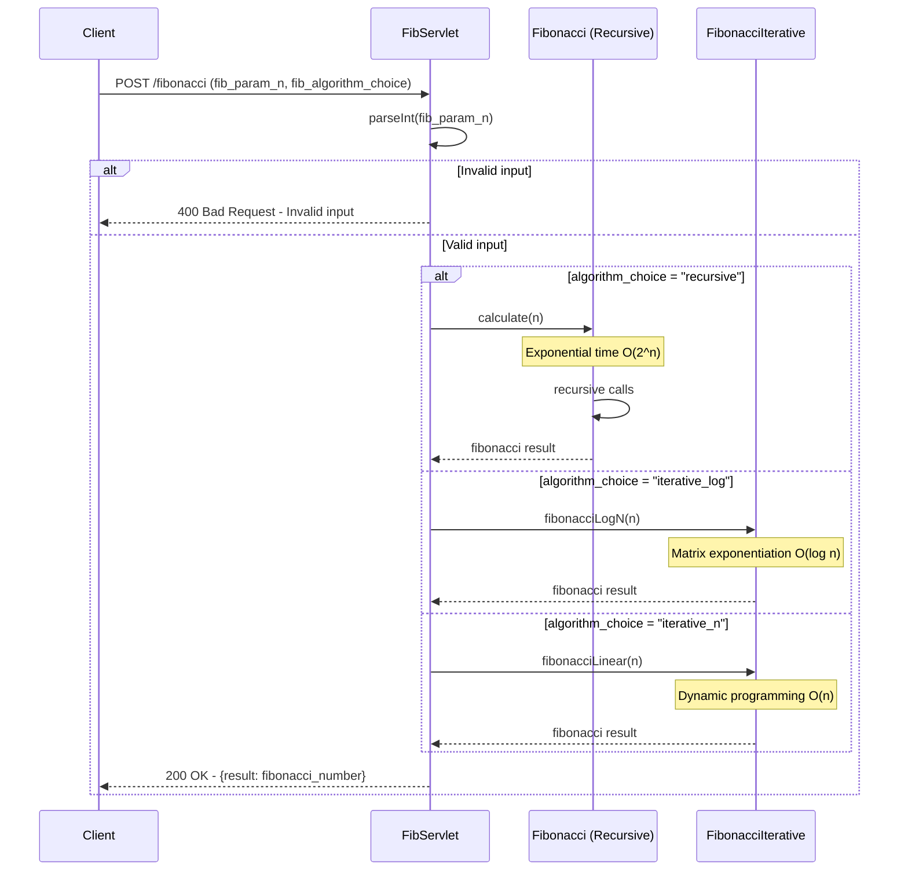
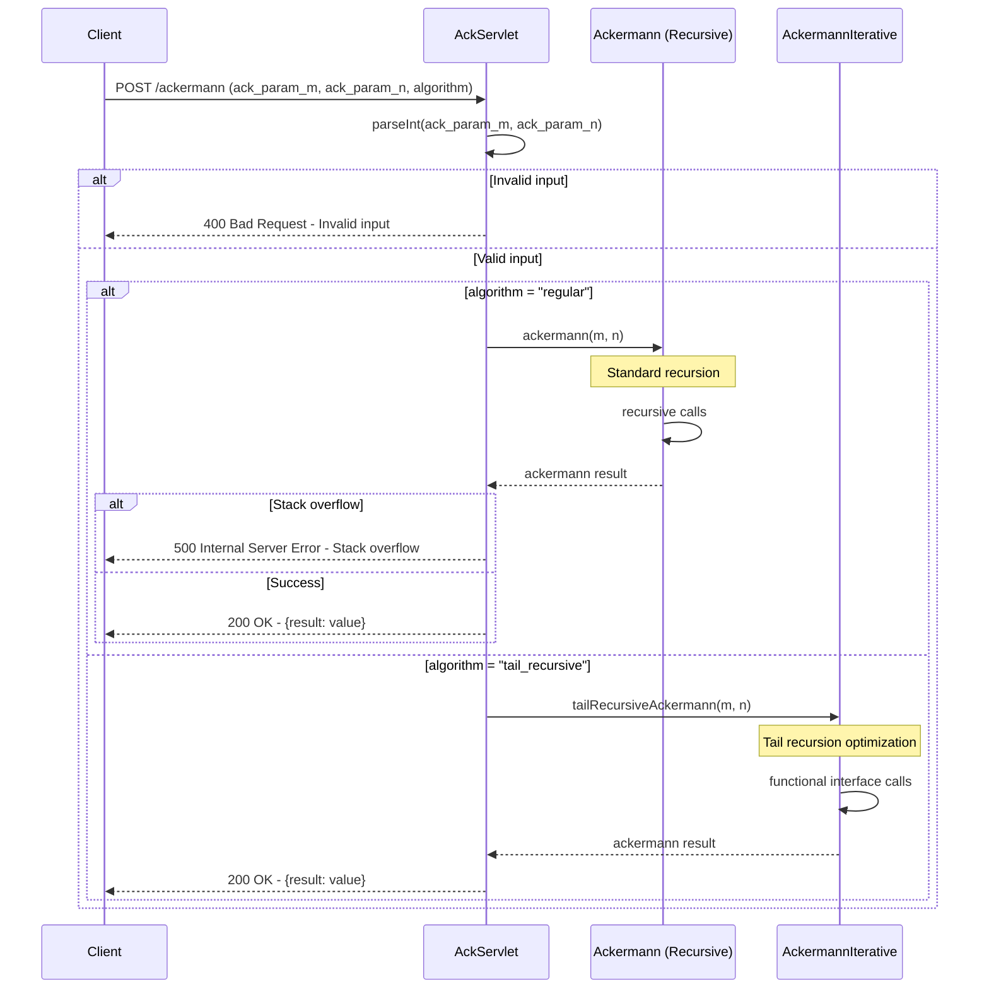
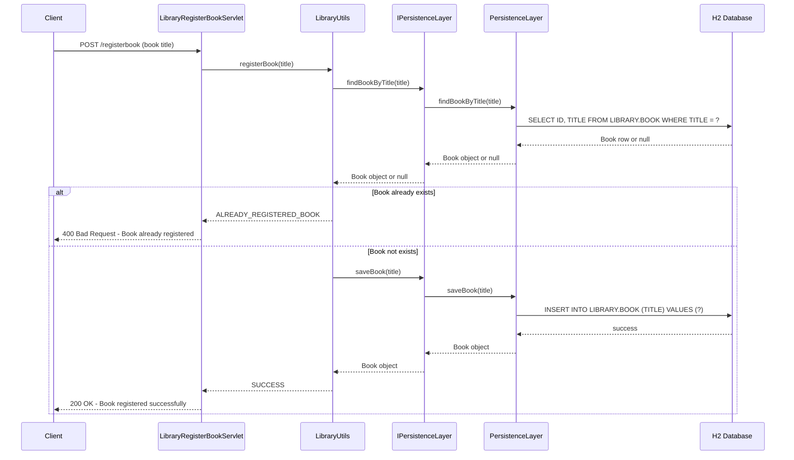
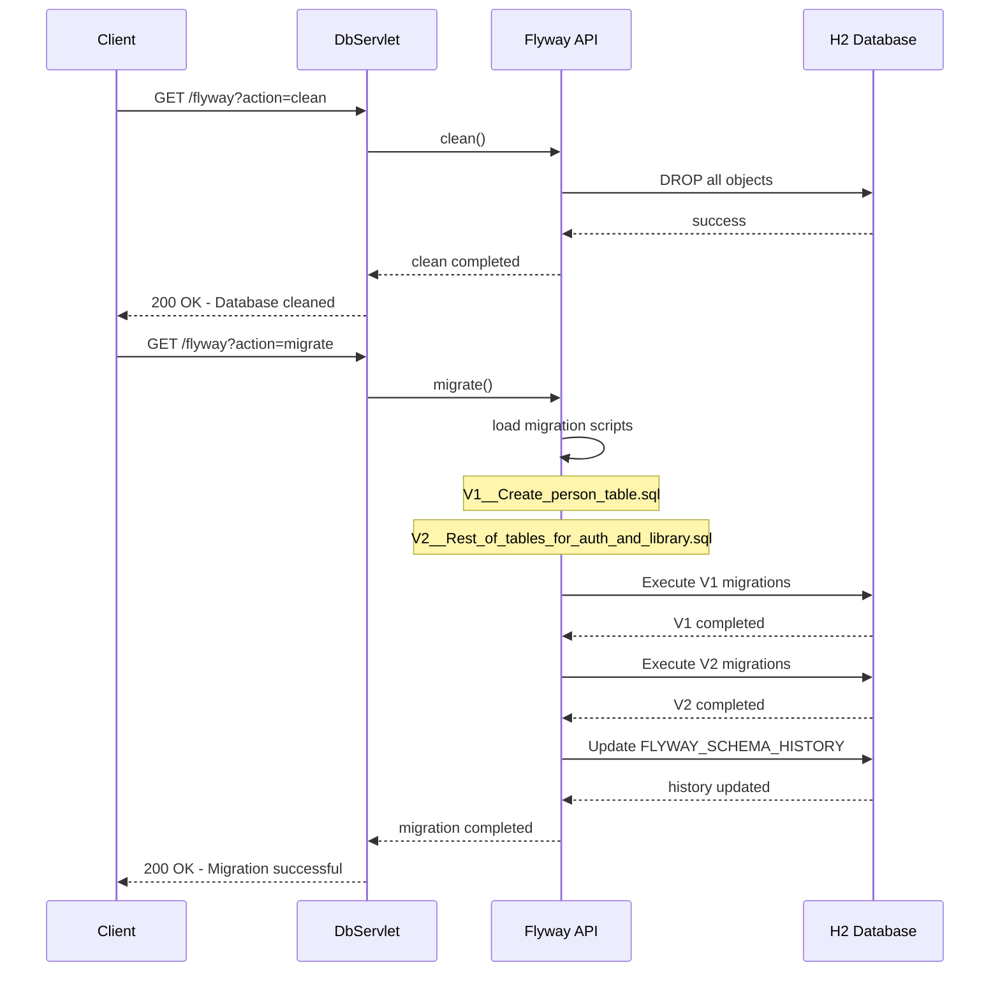
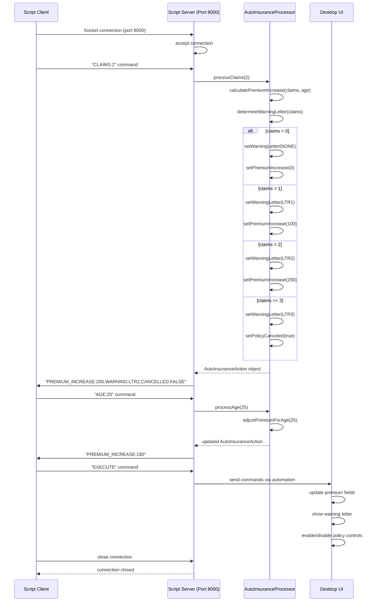
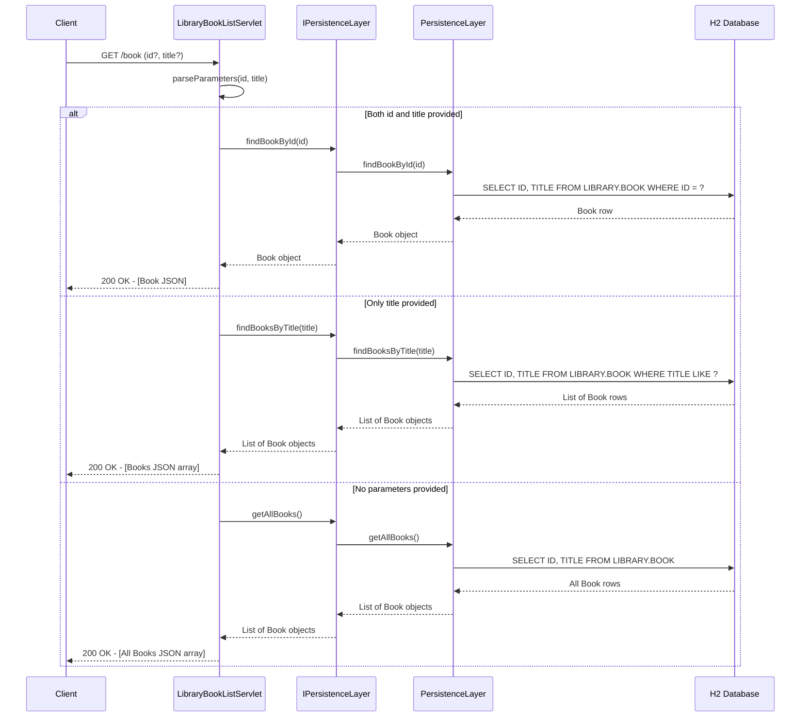

# User Registration Workflow

# User Login Workflow

# Book Lending Workflow

# Mathematical Calculation Workflow

# Fibonacci Calculation Workflow

# Ackermann Function Workflow

# Book Registration Workflow

# Database Migration Workflow

# Insurance Processing Workflow (Desktop)

# Book Search Workflow
