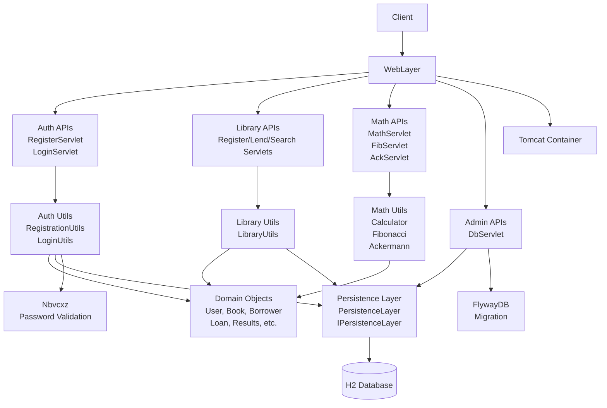

The component boundaries are organized following the layered architecture pattern, with clear separation between the presentation layer (servlets handling HTTP requests), business logic layer (utils containing domain rules), and persistence layer (database operations). Communication flows downward through the layers, with servlets delegating to appropriate utility classes, which in turn interact with the shared persistence layer for data operations, while external integrations provide specialized functionality like password validation and database migration.