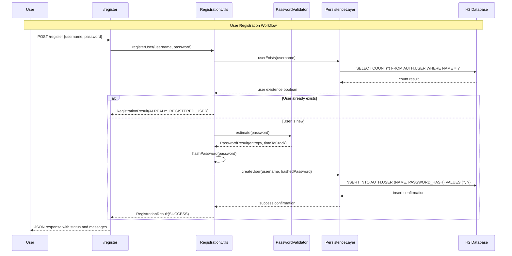
```mermaid
sequenceDiagram
    participant User
    participant RegisterServlet as /register
    participant RegistrationUtils
    participant Nbvcxz as PasswordValidator
    participant PersistenceLayer as IPersistenceLayer
    participant H2DB as H2 Database

    Note over User,H2DB: User Registration Workflow
    User->>RegisterServlet: POST /register {username, password}
    RegisterServlet->>RegistrationUtils: registerUser(username, password)
    
    RegistrationUtils->>PersistenceLayer: userExists(username)
    PersistenceLayer->>H2DB: SELECT COUNT(*) FROM AUTH.USER WHERE NAME = ?
    H2DB-->>PersistenceLayer: count result
    PersistenceLayer-->>RegistrationUtils: user existence boolean
    
    alt User already exists
        RegistrationUtils-->>RegisterServlet: RegistrationResult(ALREADY_REGISTERED_USER)
    else User is new
        RegistrationUtils->>Nbvcxz: estimate(password)
        Nbvcxz-->>RegistrationUtils: PasswordResult(entropy, timeToCrack)
        
        RegistrationUtils->>RegistrationUtils: hashPassword(password)
        RegistrationUtils->>PersistenceLayer: createUser(username, hashedPassword)
        PersistenceLayer->>H2DB: INSERT INTO AUTH.USER (NAME, PASSWORD_HASH) VALUES (?, ?)
        H2DB-->>PersistenceLayer: insert confirmation
        PersistenceLayer-->>RegistrationUtils: success confirmation
        RegistrationUtils-->>RegisterServlet: RegistrationResult(SUCCESS)
    end
    
    RegisterServlet-->>User: JSON response with status and messages
```

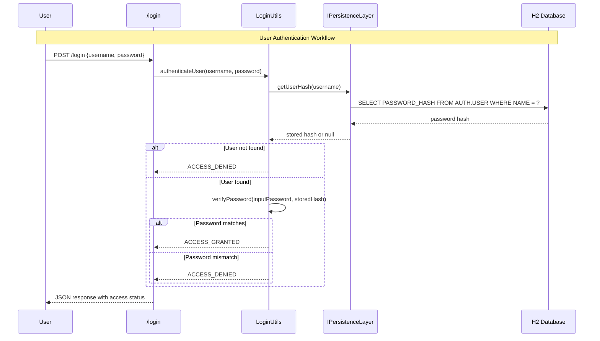
```mermaid
sequenceDiagram
    participant User
    participant LoginServlet as /login
    participant LoginUtils
    participant PersistenceLayer as IPersistenceLayer
    participant H2DB as H2 Database

    Note over User,H2DB: User Authentication Workflow
    User->>LoginServlet: POST /login {username, password}
    LoginServlet->>LoginUtils: authenticateUser(username, password)
    
    LoginUtils->>PersistenceLayer: getUserHash(username)
    PersistenceLayer->>H2DB: SELECT PASSWORD_HASH FROM AUTH.USER WHERE NAME = ?
    H2DB-->>PersistenceLayer: password hash
    PersistenceLayer-->>LoginUtils: stored hash or null
    
    alt User not found
        LoginUtils-->>LoginServlet: ACCESS_DENIED
    else User found
        LoginUtils->>LoginUtils: verifyPassword(inputPassword, storedHash)
        
        alt Password matches
            LoginUtils-->>LoginServlet: ACCESS_GRANTED
        else Password mismatch
            LoginUtils-->>LoginServlet: ACCESS_DENIED
        end
    end
    
    LoginServlet-->>User: JSON response with access status
```

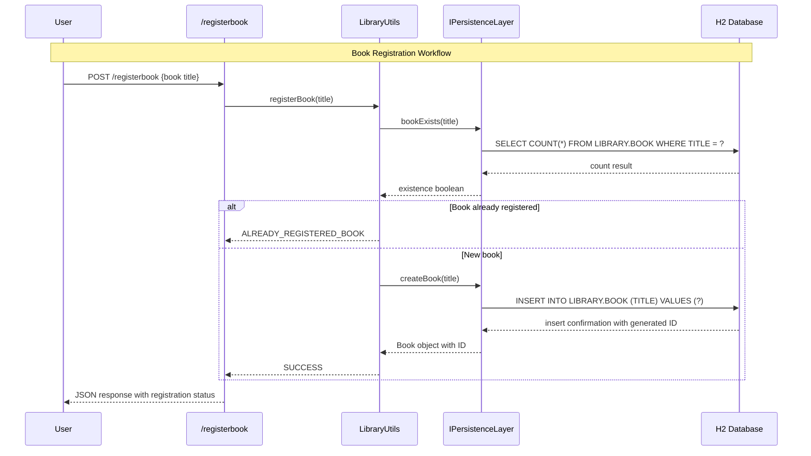
```mermaid
sequenceDiagram
    participant User
    participant LibraryBookServlet as /registerbook
    participant LibraryUtils
    participant PersistenceLayer as IPersistenceLayer
    participant H2DB as H2 Database

    Note over User,H2DB: Book Registration Workflow
    User->>LibraryBookServlet: POST /registerbook {book title}
    LibraryBookServlet->>LibraryUtils: registerBook(title)
    
    LibraryUtils->>PersistenceLayer: bookExists(title)
    PersistenceLayer->>H2DB: SELECT COUNT(*) FROM LIBRARY.BOOK WHERE TITLE = ?
    H2DB-->>PersistenceLayer: count result
    PersistenceLayer-->>LibraryUtils: existence boolean
    
    alt Book already registered
        LibraryUtils-->>LibraryBookServlet: ALREADY_REGISTERED_BOOK
    else New book
        LibraryUtils->>PersistenceLayer: createBook(title)
        PersistenceLayer->>H2DB: INSERT INTO LIBRARY.BOOK (TITLE) VALUES (?)
        H2DB-->>PersistenceLayer: insert confirmation with generated ID
        PersistenceLayer-->>LibraryUtils: Book object with ID
        LibraryUtils-->>LibraryBookServlet: SUCCESS
    end
    
    LibraryBookServlet-->>User: JSON response with registration status
```

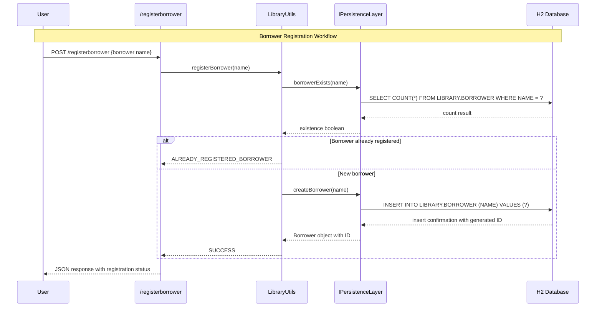
```mermaid
sequenceDiagram
    participant User
    participant LibraryBorrowerServlet as /registerborrower
    participant LibraryUtils
    participant PersistenceLayer as IPersistenceLayer
    participant H2DB as H2 Database

    Note over User,H2DB: Borrower Registration Workflow
    User->>LibraryBorrowerServlet: POST /registerborrower {borrower name}
    LibraryBorrowerServlet->>LibraryUtils: registerBorrower(name)
    
    LibraryUtils->>PersistenceLayer: borrowerExists(name)
    PersistenceLayer->>H2DB: SELECT COUNT(*) FROM LIBRARY.BORROWER WHERE NAME = ?
    H2DB-->>PersistenceLayer: count result
    PersistenceLayer-->>LibraryUtils: existence boolean
    
    alt Borrower already registered
        LibraryUtils-->>LibraryBorrowerServlet: ALREADY_REGISTERED_BORROWER
    else New borrower
        LibraryUtils->>PersistenceLayer: createBorrower(name)
        PersistenceLayer->>H2DB: INSERT INTO LIBRARY.BORROWER (NAME) VALUES (?)
        H2DB-->>PersistenceLayer: insert confirmation with generated ID
        PersistenceLayer-->>LibraryUtils: Borrower object with ID
        LibraryUtils-->>LibraryBorrowerServlet: SUCCESS
    end
    
    LibraryBorrowerServlet-->>User: JSON response with registration status
```

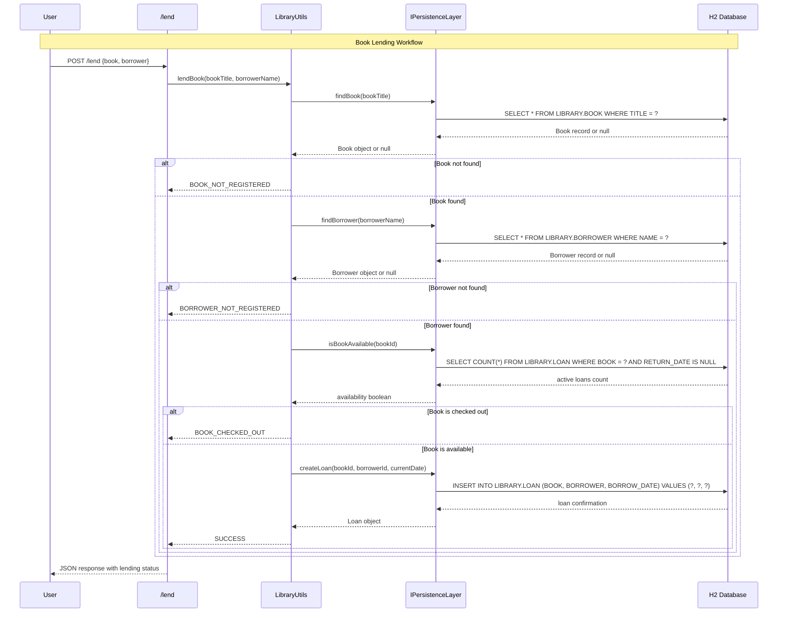
```mermaid
sequenceDiagram
    participant User
    participant LibraryLendServlet as /lend
    participant LibraryUtils
    participant PersistenceLayer as IPersistenceLayer
    participant H2DB as H2 Database

    Note over User,H2DB: Book Lending Workflow
    User->>LibraryLendServlet: POST /lend {book, borrower}
    LibraryLendServlet->>LibraryUtils: lendBook(bookTitle, borrowerName)
    
    LibraryUtils->>PersistenceLayer: findBook(bookTitle)
    PersistenceLayer->>H2DB: SELECT * FROM LIBRARY.BOOK WHERE TITLE = ?
    H2DB-->>PersistenceLayer: Book record or null
    PersistenceLayer-->>LibraryUtils: Book object or null
    
    alt Book not found
        LibraryUtils-->>LibraryLendServlet: BOOK_NOT_REGISTERED
    else Book found
        LibraryUtils->>PersistenceLayer: findBorrower(borrowerName)
        PersistenceLayer->>H2DB: SELECT * FROM LIBRARY.BORROWER WHERE NAME = ?
        H2DB-->>PersistenceLayer: Borrower record or null
        PersistenceLayer-->>LibraryUtils: Borrower object or null
        
        alt Borrower not found
            LibraryUtils-->>LibraryLendServlet: BORROWER_NOT_REGISTERED
        else Borrower found
            LibraryUtils->>PersistenceLayer: isBookAvailable(bookId)
            PersistenceLayer->>H2DB: SELECT COUNT(*) FROM LIBRARY.LOAN WHERE BOOK = ? AND RETURN_DATE IS NULL
            H2DB-->>PersistenceLayer: active loans count
            PersistenceLayer-->>LibraryUtils: availability boolean
            
            alt Book is checked out
                LibraryUtils-->>LibraryLendServlet: BOOK_CHECKED_OUT
            else Book is available
                LibraryUtils->>PersistenceLayer: createLoan(bookId, borrowerId, currentDate)
                PersistenceLayer->>H2DB: INSERT INTO LIBRARY.LOAN (BOOK, BORROWER, BORROW_DATE) VALUES (?, ?, ?)
                H2DB-->>PersistenceLayer: loan confirmation
                PersistenceLayer-->>LibraryUtils: Loan object
                LibraryUtils-->>LibraryLendServlet: SUCCESS
            end
        end
    end
    
    LibraryLendServlet-->>User: JSON response with lending status
```

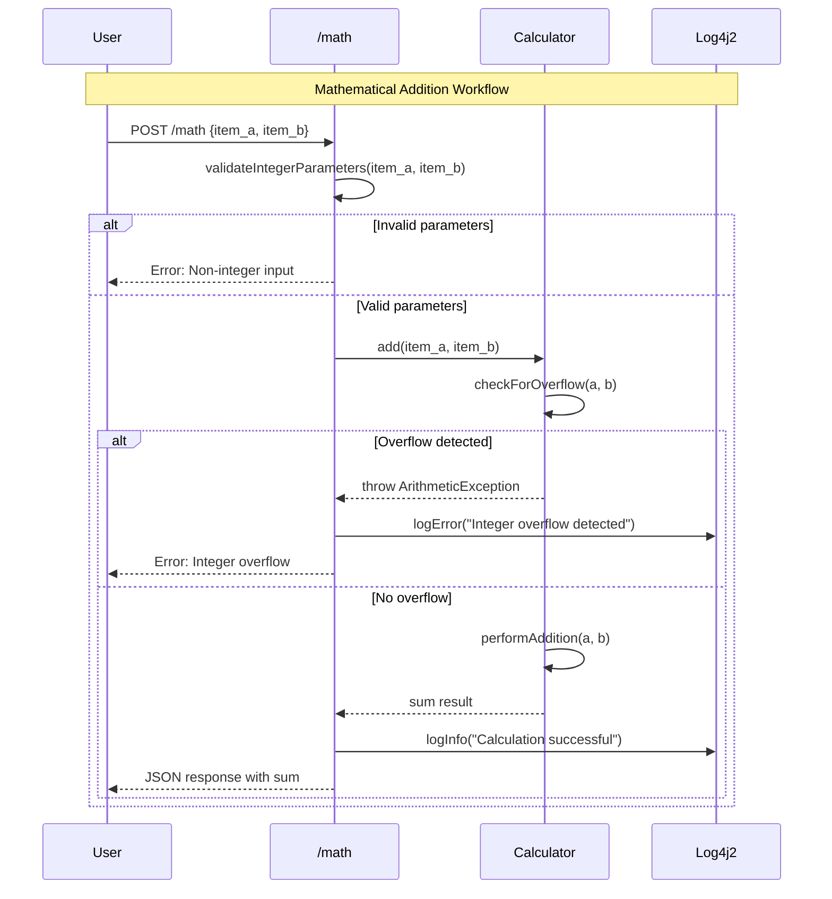
```mermaid
sequenceDiagram
    participant User
    participant MathServlet as /math
    participant Calculator
    participant Logger as Log4j2

    Note over User,Logger: Mathematical Addition Workflow
    User->>MathServlet: POST /math {item_a, item_b}
    MathServlet->>MathServlet: validateIntegerParameters(item_a, item_b)
    
    alt Invalid parameters
        MathServlet-->>User: Error: Non-integer input
    else Valid parameters
        MathServlet->>Calculator: add(item_a, item_b)
        Calculator->>Calculator: checkForOverflow(a, b)
        
        alt Overflow detected
            Calculator-->>MathServlet: throw ArithmeticException
            MathServlet->>Logger: logError("Integer overflow detected")
            MathServlet-->>User: Error: Integer overflow
        else No overflow
            Calculator->>Calculator: performAddition(a, b)
            Calculator-->>MathServlet: sum result
            MathServlet->>Logger: logInfo("Calculation successful")
            MathServlet-->>User: JSON response with sum
        end
    end
```

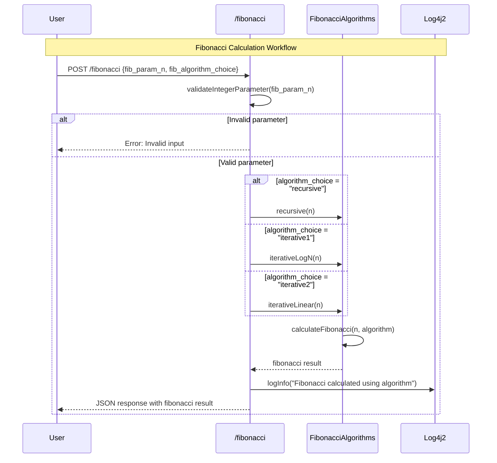
```mermaid
sequenceDiagram
    participant User
    participant FibServlet as /fibonacci
    participant Fibonacci as FibonacciAlgorithms
    participant Logger as Log4j2

    Note over User,Logger: Fibonacci Calculation Workflow
    User->>FibServlet: POST /fibonacci {fib_param_n, fib_algorithm_choice}
    FibServlet->>FibServlet: validateIntegerParameter(fib_param_n)
    
    alt Invalid parameter
        FibServlet-->>User: Error: Invalid input
    else Valid parameter
        alt algorithm_choice = "recursive"
            FibServlet->>Fibonacci: recursive(n)
        else algorithm_choice = "iterative1"
            FibServlet->>Fibonacci: iterativeLogN(n)
        else algorithm_choice = "iterative2"
            FibServlet->>Fibonacci: iterativeLinear(n)
        end
        
        Fibonacci->>Fibonacci: calculateFibonacci(n, algorithm)
        Fibonacci-->>FibServlet: fibonacci result
        FibServlet->>Logger: logInfo("Fibonacci calculated using algorithm")
        FibServlet-->>User: JSON response with fibonacci result
    end
```

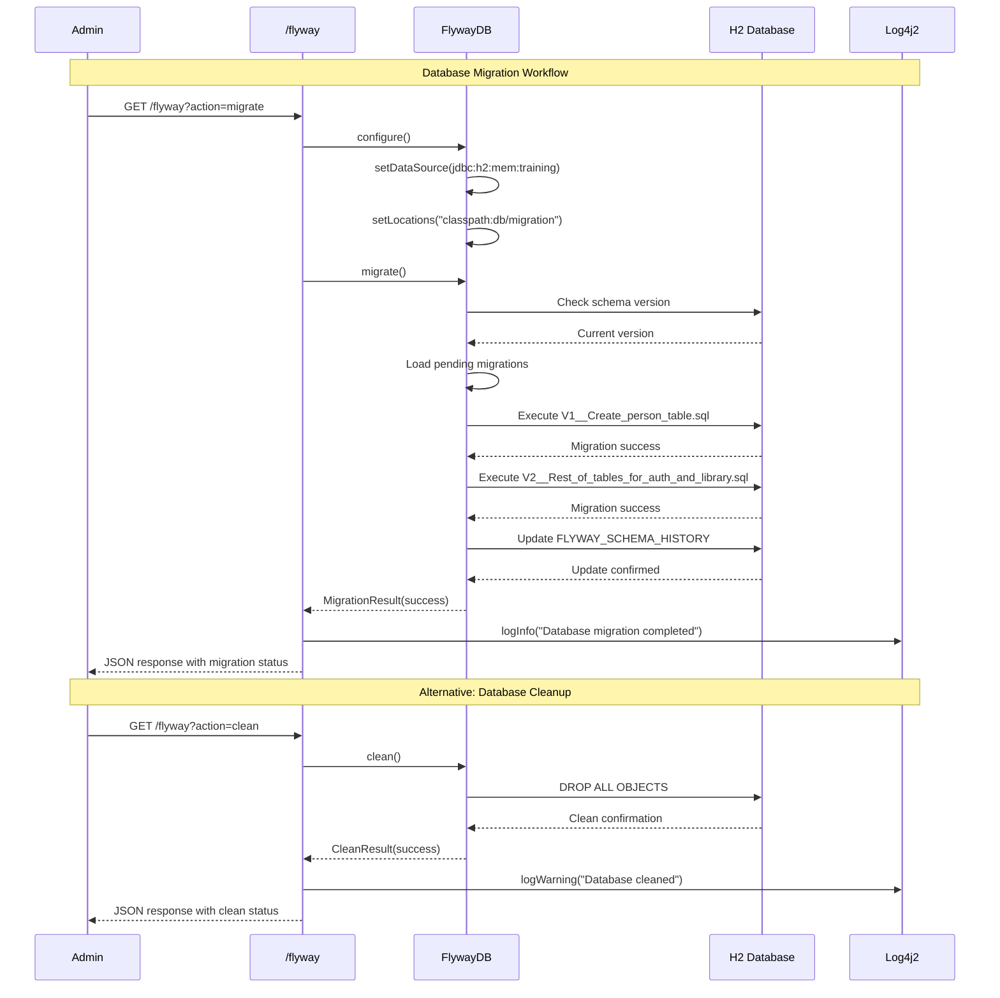
```mermaid
sequenceDiagram
    participant Admin
    participant DbServlet as /flyway
    participant Flyway as FlywayDB
    participant H2DB as H2 Database
    participant Logger as Log4j2

    Note over Admin,Logger: Database Migration Workflow
    Admin->>DbServlet: GET /flyway?action=migrate
    DbServlet->>Flyway: configure()
    Flyway->>Flyway: setDataSource(jdbc:h2:mem:training)
    Flyway->>Flyway: setLocations("classpath:db/migration")
    
    DbServlet->>Flyway: migrate()
    Flyway->>H2DB: Check schema version
    H2DB-->>Flyway: Current version
    Flyway->>Flyway: Load pending migrations
    Flyway->>H2DB: Execute V1__Create_person_table.sql
    H2DB-->>Flyway: Migration success
    Flyway->>H2DB: Execute V2__Rest_of_tables_for_auth_and_library.sql
    H2DB-->>Flyway: Migration success
    Flyway->>H2DB: Update FLYWAY_SCHEMA_HISTORY
    H2DB-->>Flyway: Update confirmed
    Flyway-->>DbServlet: MigrationResult(success)
    DbServlet->>Logger: logInfo("Database migration completed")
    DbServlet-->>Admin: JSON response with migration status
    
    Note over Admin,Logger: Alternative: Database Cleanup
    Admin->>DbServlet: GET /flyway?action=clean
    DbServlet->>Flyway: clean()
    Flyway->>H2DB: DROP ALL OBJECTS
    H2DB-->>Flyway: Clean confirmation
    Flyway-->>DbServlet: CleanResult(success)
    DbServlet->>Logger: logWarning("Database cleaned")
    DbServlet-->>Admin: JSON response with clean status
```

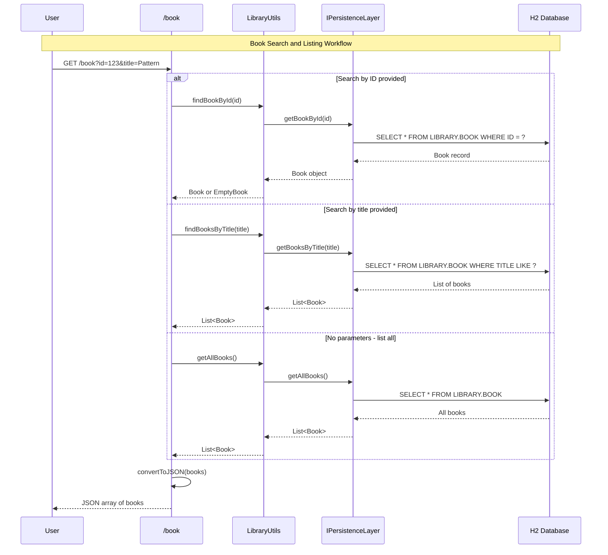
```mermaid
sequenceDiagram
    participant User
    participant BookListServlet as /book
    participant LibraryUtils
    participant PersistenceLayer as IPersistenceLayer
    participant H2DB as H2 Database

    Note over User,H2DB: Book Search and Listing Workflow
    User->>BookListServlet: GET /book?id=123&title=Pattern
    
    alt Search by ID provided
        BookListServlet->>LibraryUtils: findBookById(id)
        LibraryUtils->>PersistenceLayer: getBookById(id)
        PersistenceLayer->>H2DB: SELECT * FROM LIBRARY.BOOK WHERE ID = ?
        H2DB-->>PersistenceLayer: Book record
        PersistenceLayer-->>LibraryUtils: Book object
        LibraryUtils-->>BookListServlet: Book or EmptyBook
    else Search by title provided
        BookListServlet->>LibraryUtils: findBooksByTitle(title)
        LibraryUtils->>PersistenceLayer: getBooksByTitle(title)
        PersistenceLayer->>H2DB: SELECT * FROM LIBRARY.BOOK WHERE TITLE LIKE ?
        H2DB-->>PersistenceLayer: List of books
        PersistenceLayer-->>LibraryUtils: List<Book>
        LibraryUtils-->>BookListServlet: List<Book>
    else No parameters - list all
        BookListServlet->>LibraryUtils: getAllBooks()
        LibraryUtils->>PersistenceLayer: getAllBooks()
        PersistenceLayer->>H2DB: SELECT * FROM LIBRARY.BOOK
        H2DB-->>PersistenceLayer: All books
        PersistenceLayer-->>LibraryUtils: List<Book>
        LibraryUtils-->>BookListServlet: List<Book>
    end
    
    BookListServlet->>BookListServlet: convertToJSON(books)
    BookListServlet-->>User: JSON array of books
```

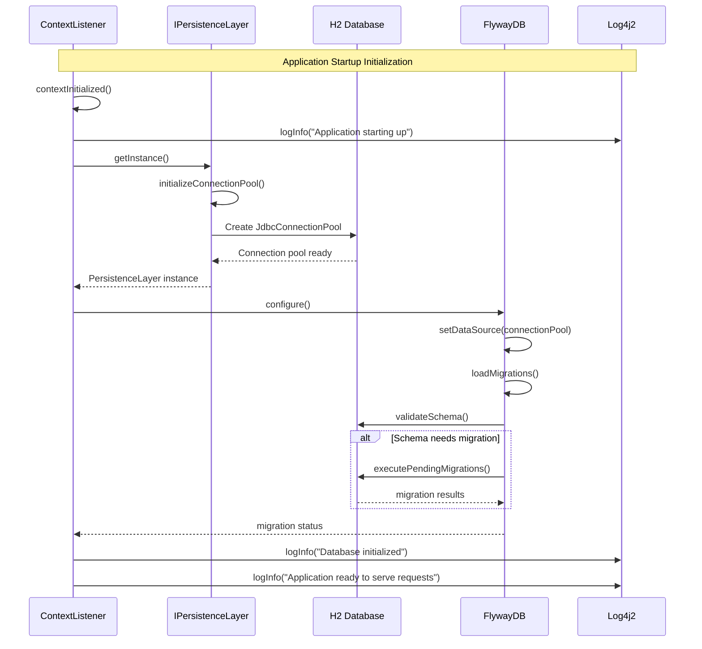
```mermaid
sequenceDiagram
    participant WebAppListener as ContextListener
    participant PersistenceLayer as IPersistenceLayer
    participant H2DB as H2 Database
    participant Flyway as FlywayDB
    participant Logger as Log4j2

    Note over WebAppListener,Logger: Application Startup Initialization
    WebAppListener->>WebAppListener: contextInitialized()
    WebAppListener->>Logger: logInfo("Application starting up")
    
    WebAppListener->>PersistenceLayer: getInstance()
    PersistenceLayer->>PersistenceLayer: initializeConnectionPool()
    PersistenceLayer->>H2DB: Create JdbcConnectionPool
    H2DB-->>PersistenceLayer: Connection pool ready
    PersistenceLayer-->>WebAppListener: PersistenceLayer instance
    
    WebAppListener->>Flyway: configure()
    Flyway->>Flyway: setDataSource(connectionPool)
    Flyway->>Flyway: loadMigrations()
    Flyway->>H2DB: validateSchema()
    
    alt Schema needs migration
        Flyway->>H2DB: executePendingMigrations()
        H2DB-->>Flyway: migration results
    end
    
    Flyway-->>WebAppListener: migration status
    WebAppListener->>Logger: logInfo("Database initialized")
    WebAppListener->>Logger: logInfo("Application ready to serve requests")
```

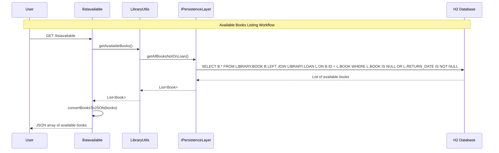
```mermaid
sequenceDiagram
    participant User
    participant AvailableBooksServlet as /listavailable
    participant LibraryUtils
    participant PersistenceLayer as IPersistenceLayer
    participant H2DB as H2 Database

    Note over User,H2DB: Available Books Listing Workflow
    User->>AvailableBooksServlet: GET /listavailable
    AvailableBooksServlet->>LibraryUtils: getAvailableBooks()
    
    LibraryUtils->>PersistenceLayer: getAllBooksNotOnLoan()
    PersistenceLayer->>H2DB: SELECT B.* FROM LIBRARY.BOOK B LEFT JOIN LIBRARY.LOAN L ON B.ID = L.BOOK WHERE L.BOOK IS NULL OR L.RETURN_DATE IS NOT NULL
    H2DB-->>PersistenceLayer: List of available books
    PersistenceLayer-->>LibraryUtils: List<Book>
    LibraryUtils-->>AvailableBooksServlet: List<Book>
    
    AvailableBooksServlet->>AvailableBooksServlet: convertBooksToJSON(books)
    AvailableBooksServlet-->>User: JSON array of available books
```

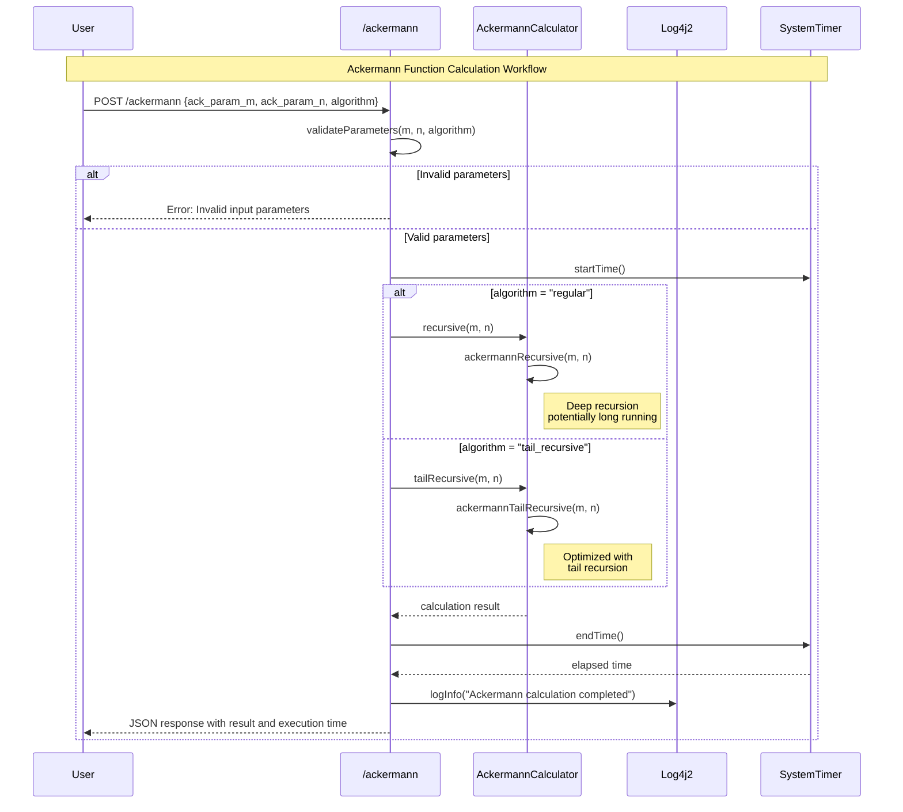
```mermaid
sequenceDiagram
    participant User
    participant AckServlet as /ackermann
    participant Ackermann as AckermannCalculator
    participant Logger as Log4j2
    participant Timer as SystemTimer

    Note over User,Timer: Ackermann Function Calculation Workflow
    User->>AckServlet: POST /ackermann {ack_param_m, ack_param_n, algorithm}
    AckServlet->>AckServlet: validateParameters(m, n, algorithm)
    
    alt Invalid parameters
        AckServlet-->>User: Error: Invalid input parameters
    else Valid parameters
        AckServlet->>Timer: startTime()
        
        alt algorithm = "regular"
            AckServlet->>Ackermann: recursive(m, n)
            Ackermann->>Ackermann: ackermannRecursive(m, n)
            Note right of Ackermann: Deep recursion<br/>potentially long running
        else algorithm = "tail_recursive"
            AckServlet->>Ackermann: tailRecursive(m, n)
            Ackermann->>Ackermann: ackermannTailRecursive(m, n)
            Note right of Ackermann: Optimized with<br/>tail recursion
        end
        
        Ackermann-->>AckServlet: calculation result
        AckServlet->>Timer: endTime()
        Timer-->>AckServlet: elapsed time
        
        AckServlet->>Logger: logInfo("Ackermann calculation completed")
        AckServlet-->>User: JSON response with result and execution time
    end
```