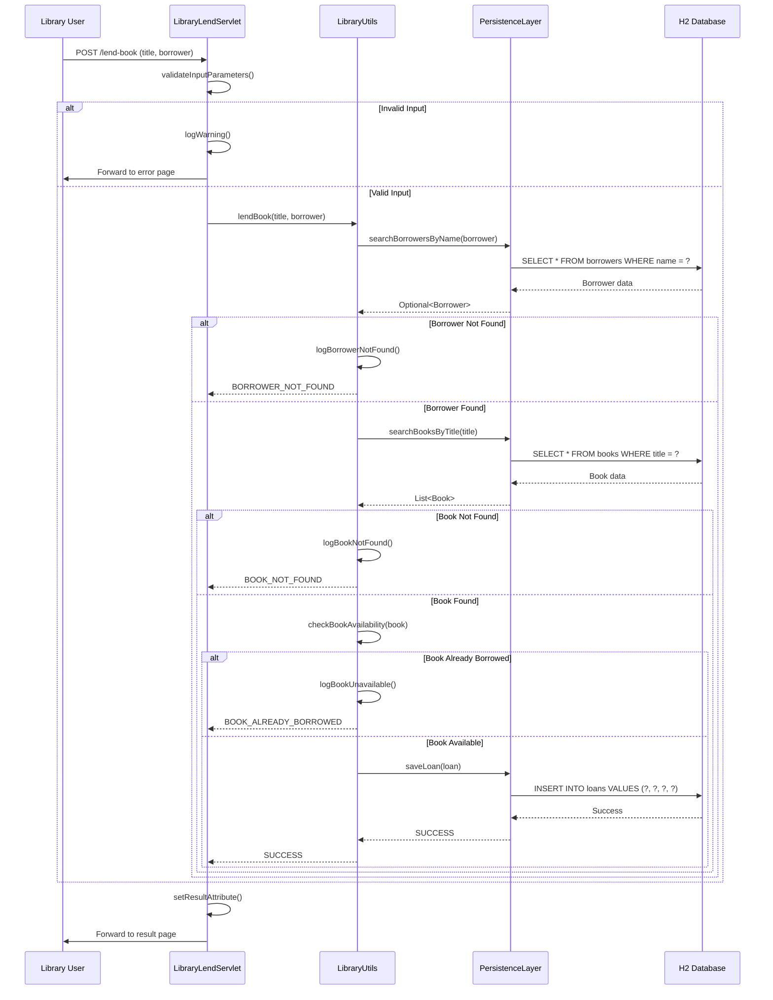
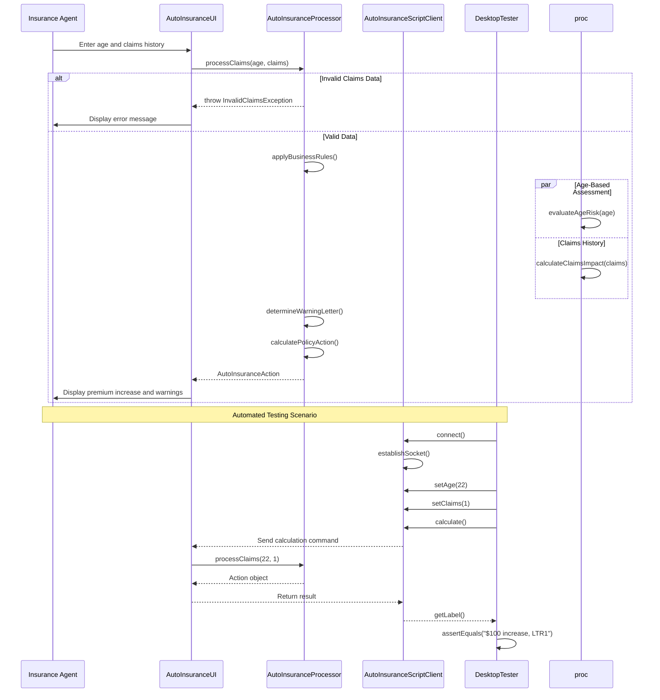
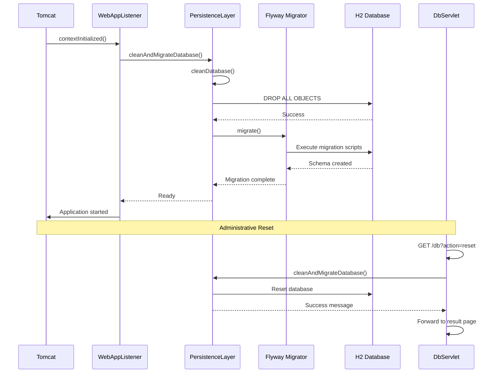
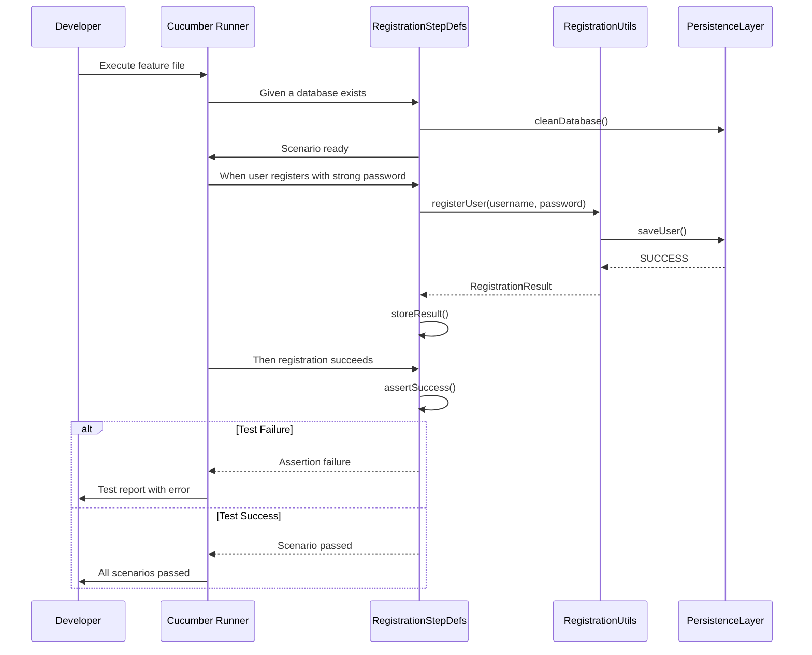
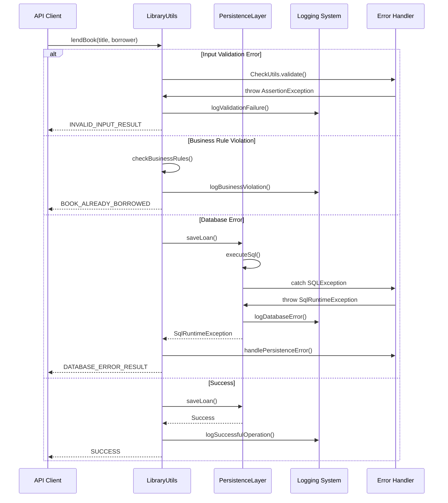

## 1. Book Lending Workflow



**Description**: The core library circulation workflow enabling registered borrowers to check out available books. Triggered by web form submission or API call for lending operations.

**Communication Patterns**:
- **Synchronous HTTP**: Servlet handles POST requests
- **Database Transactions**: ACID operations for loan creation
- **Layered Architecture**: Clean separation between web, service, and persistence layers
- **Error Handling**: Comprehensive validation at each layer with specific result codes

---

## 2. User Registration with Password Security

```mermaid
sequenceDiagram
    participant User as New Borrower
    participant WebApp as RegisterServlet
    participant Utils as RegistrationUtils
    participant SecLib as Nbvcxz (Security Lib)
    participant Persist as PersistenceLayer
    participant DB as H2 Database

    User->>WebApp: POST /register (username, password)
    WebApp->>WebApp: extractCredentials()
    alt Missing Credentials
        WebApp->>User: Forward with error message
    else Valid Input
        WebApp->>Utils: registerUser(username, password)
        Utils->>SecLib: estimate(password)
        SecLib-->>Utils: PasswordResult(entropy, crackTime)
        
        Weak Password Check
        alt INSUFFICIENT_ENTROPY
            Utils-->>WebApp: BAD_PASSWORD
        else Strong Password
            Utils->>Persist: searchUsersByUsername(username)
            Persist->>DB: SELECT * FROM users WHERE username = ?
            DB-->>Persist: User data
            Persist-->>Utils: Optional<User>
            
            Duplicate Check
            alt User Exists
                Utils-->>WebApp: ALREADY_REGISTERED
            else User Not Exists
                Utils->>Persist: saveUser(user)
                Persist->>DB: INSERT INTO users VALUES (?, ?, ?)
                DB-->>Persist: Success
                Persist-->>Utils: SUCCESS
                Utils-->>WebApp: SUCCESSFULLY_REGISTERED
            end
        end
    end
    
    WebApp->>User: Forward to appropriate result page
```

**Description**: Secure borrower registration workflow with entropy-based password validation. Ensures strong credentials while preventing duplicate accounts.

**Communication Patterns**:
- **Synchronous Validation**: Real-time password strength analysis
- **Security Integration**: Nbvcxz library for entropy calculations
- **Database Constraints**: Unique username enforcement
- **Event Logging**: Comprehensive audit trail for security

---

## 3. Multi-Algorithm Mathematics Computation

```mermaid
sequenceDiagram
    participant User as Student
    participant WebApp as FibServlet
    participant Processor as FibonacciIterative
    participant TailUtil as TailRecursive
    participant WebApp2 as AckServlet
    participant AckProc as AckermannIterative

    User->>WebApp: POST /fib (n, algo)
    WebApp->>WebApp: parseParameters()
    
    alt Algorithm Selection
    opt Fast Doubling (fibAlgo1)
        WebApp->>Processor: fibAlgo1(n)
        Processor->>Processor: matrixExponentiation()
        Processor-->>WebApp: BigInteger result
    else Iterative (fibAlgo2)
        WebApp->>Processor: fibAlgo2(n)
        Processor->>Processor: loopIteration()
        Processor-->>WebApp: BigInteger result
    end
    
    WebApp->>User: Forward with result

    Note over User, AckProc: Later: Ackermann Calculation
    
    User->>WebApp2: POST /ack (m, n, type)
    alt Tail Recursive (stack-safe)
        WebApp2->>AckProc: calculateIterative(m, n)
        AckProc->>TailUtil: tailie(init, iter, pred, final)
        TailUtil->>TailUtil: streamIterations()
        TailUtil-->>AckProc: BigInteger result
    else Classic Recursive
        WebApp2->>AckProc: calculateRecursive(m, n)
        AckProc->>AckProc: recursiveCalls()
        AckProc-->>WebApp2: BigInteger result
    end
    
    WebApp2->>User: Forward with result
```

**Description**: Educational module demonstrating algorithm complexity comparisons through web-accessible mathematical computations with multiple implementation strategies.

**Communication Patterns**:
- **Algorithm Selection**: User chooses between recursive/iterative implementations
- **Stack Safety**: Tail recursion optimization for deep recursions
- **Big Integer Handling**: Arbitrary precision arithmetic
- **Performance Demonstration**: Visualizing complexity differences

---

## 4. Auto Insurance Risk Assessment



**Description**: Insurance premium calculation system demonstrating business rule processing with both GUI and automated testing interfaces.

**Communication Patterns**:
- **Socket Communication**: Remote scripting capability for automation
- **Business Rule Engine**: Complex conditional logic processing
- **Error Boundaries**: Custom exceptions for invalid inputs
- **Testing Abstraction**: DesktopTester provides clean API for automation

---

## 5. Database Initialization and Recovery



**Description**: Critical infrastructure workflow ensuring proper database state during application startup and administrative resets. Essential for maintaining consistency across deployments.

**Communication Patterns**:
- **Lifecycle Hooks**: ServletContextListener integration
- **Database Migrations**: Flyway version-controlled schema management
- **Administrative Interface**: Web-based database control
- **Idempotent Operations**: Safe repeated execution

---

## 6. Behavior-Driven Test Execution



**Description**: Automated testing workflow demonstrating Behavior-Driven Development practices with living documentation through executable specifications.

**Communication Patterns**:
- **Gherkin Execution**: Natural language test scenarios
- **Glue Code**: Step definitions bridging language and implementation
- **Test Isolation**: Database cleanup between scenarios
- **Assertion Verification**: Comprehensive validation of outcomes

---

## Error Handling and Recovery Patterns



**Description**: Cross-cutting error handling strategy ensuring graceful degradation and proper recovery throughout the system.

**Communication Patterns**:
- **Exception Translation**: Converting low-level exceptions to domain-specific
- **Defensive Programming**: Input validation at boundaries
- **Comprehensive Logging**: Audit trails for all operations
- **Graceful Degradation**: Meaningful error responses to clients