## Workflow 1: User Registration (POST /demo/register)

Purpose and triggers:
- Purpose: Register a new user with password policy and uniqueness checks.
- Trigger: User submits register form on library.html or POSTs to /demo/register.

Communication patterns:
- Synchronous HTTP request/response (Browser → Servlet).
- In-process calls (Servlet → Business utils → Persistence).
- JDBC queries/inserts (Persistence → H2 DB).
- JSP forwarding (Servlet → result.jsp).
- No transactions; auto-commit per statement.

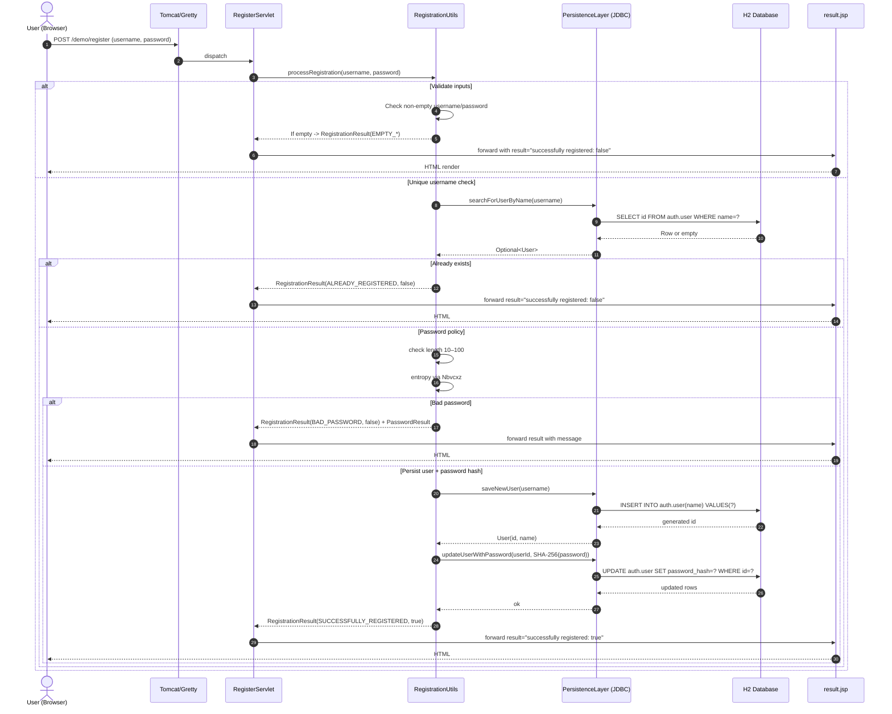

---

## Workflow 2: User Login (POST /demo/login)

Purpose and triggers:
- Purpose: Validate credentials and grant/deny access.
- Trigger: User submits login form or POSTs to /demo/login.

Communication patterns:
- Synchronous HTTP request/response (Browser → Servlet).
- In-process method calls.
- JDBC SELECT for credential verification.
- JSP forwarding (result.jsp).

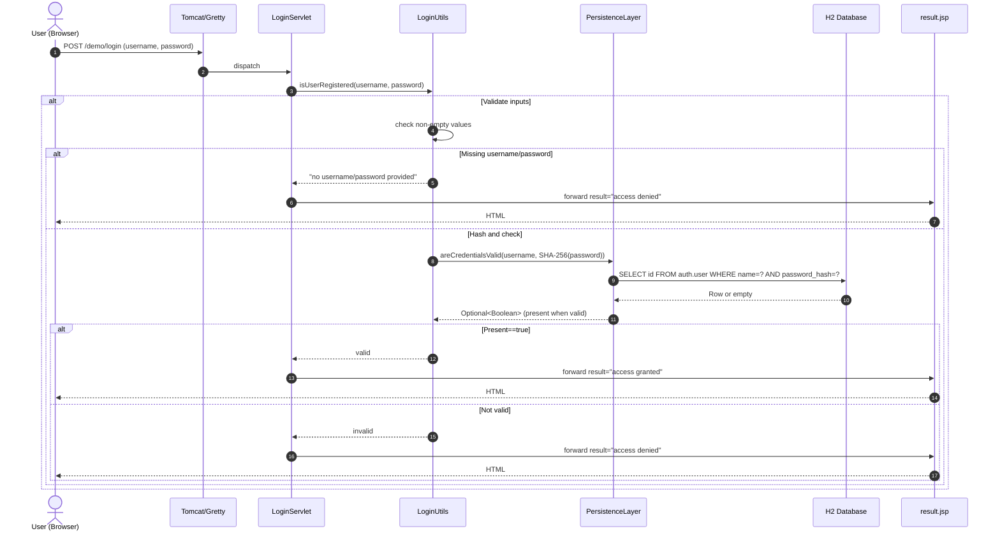

---

## Workflow 3: Library Registration (Books and Borrowers)

Purpose and triggers:
- Purpose: Add books and borrowers to the catalog.
- Trigger: User submits forms on library.html or POSTs to /demo/registerbook or /demo/registerborrower.

Communication patterns:
- Synchronous HTTP.
- In-process business logic.
- JDBC insert/select checks.
- JSP forwarding.

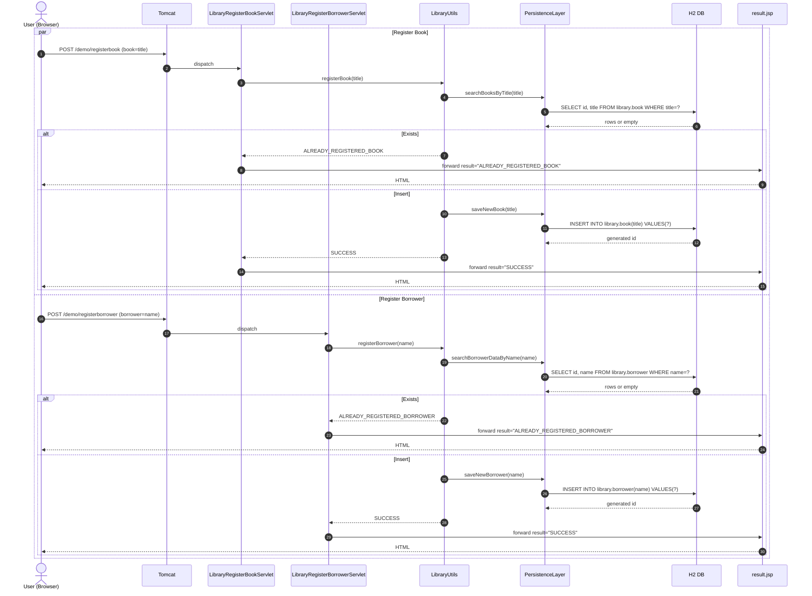

---

## Workflow 4: Lending a Book (POST /demo/lend) with UI Prefetch

Purpose and triggers:
- Purpose: Lend a book to a borrower if both exist and book not already checked out.
- Trigger: User selects borrower/book via dynamic UI, then POSTs to /demo/lend.

Communication patterns:
- Asynchronous AJAX (prefetch lists).
- Synchronous HTTP for lending.
- In-process logic with multiple DB reads/writes.
- JSP forwarding.

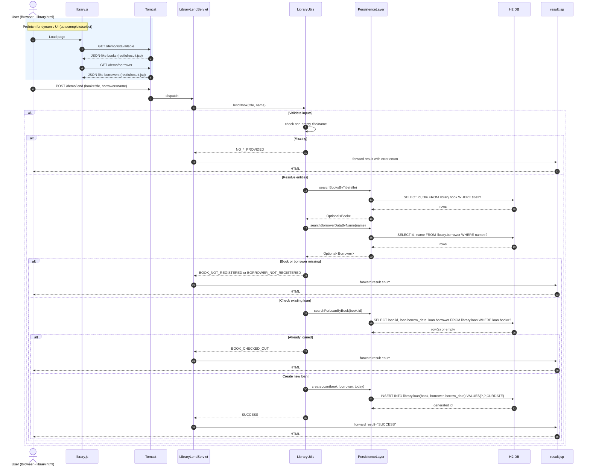

---

## Workflow 5: Catalog Search (GET /demo/book and /demo/borrower)

Purpose and triggers:
- Purpose: List all or search by id/title (book) or id/name (borrower).
- Trigger: GET requests from endpointcatalog.html or tests.

Communication patterns:
- Synchronous HTTP.
- In-process logic.
- JDBC selects.
- JSP forwarding (restfulresult.jsp) with JSON-like arrays.

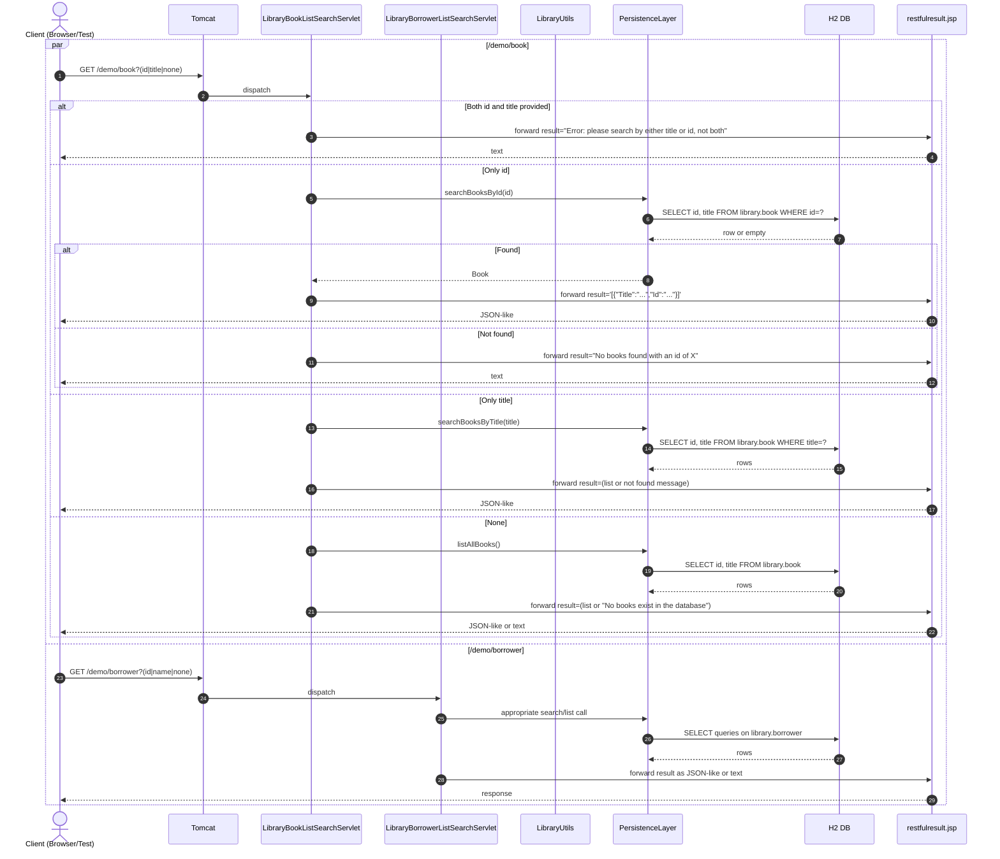

---

## Workflow 6: List Available Books Semantics (GET /demo/listavailable) and UI Autocomplete

Purpose and triggers:
- Purpose: Provide list of “available” books (currently: never-loaned).
- Trigger: library.js AJAX to populate dropdown/autocomplete; manual GET.

Communication patterns:
- Asynchronous AJAX GETs.
- In-process logic.
- JDBC SELECT with LEFT JOIN.
- JSP forwarding (restfulresult.jsp).

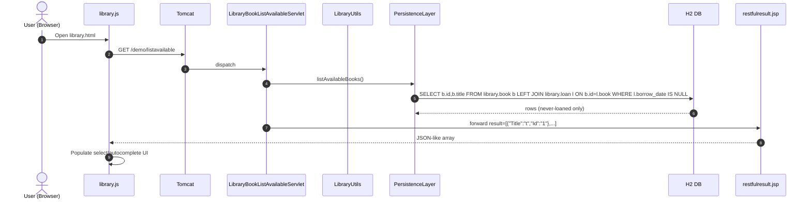

---

## Workflow 7: Mathematics Operations (POST /demo/math, /demo/fibonacci, /demo/ackermann)

Purpose and triggers:
- Purpose: Perform computations with input validation.
- Trigger: Forms on endpointcatalog.html or POSTs.

Communication patterns:
- Synchronous HTTP.
- In-process algorithm execution (CPU-bound).
- No persistence.
- JSP forwarding (restfulresult.jsp).

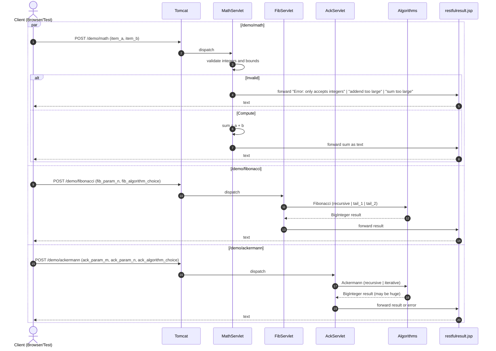

---

## Workflow 8: Database Admin via Flyway (GET /demo/flyway)

Purpose and triggers:
- Purpose: Clean and migrate the database schemas for reproducible state in tests/dev.
- Trigger: Manual click from library.html or automated test setup.

Communication patterns:
- Synchronous HTTP.
- In-process calls to IPersistenceLayer → Flyway.
- JDBC DDL execution via Flyway.
- JSP forwarding.

```mermaid
sequenceDiagram
  autonumber
  actor Op as Operator/Test
  participant T as Tomcat
  participant DBS as DbServlet (/flyway)
  participant PL as PersistenceLayer
  participant F as Flyway (embedded)
  participant DB as H2 Database
  participant JSP as result.jsp

  Op->>T: GET /demo/flyway?action=(clean|migrate|default)
  T->>DBS: dispatch
  alt action=clean
    DBS->>PL: cleanDatabase()
    PL->>F: flyway.clean()
    F->>DB: DROP SCHEMA ADMINISTRATIVE|AUTH|LIBRARY CASCADE
    DB-->>F: ok
  else action=migrate
    DBS->>PL: migrateDatabase()
    PL->>F: flyway.migrate()
    F->>DB: CREATE SCHEMAS + CREATE TABLES + INSERT Flyway history
    DB-->>F: ok
  else default
    DBS->>PL: cleanAndMigrateDatabase()
    PL->>F: clean(); migrate()
    F->>DB: execute DDL/DML
  end
  DBS->>JSP: forward result="DB cleaned/migrated/reset"
  JSP-->>Op: HTML
```

---

## Workflow 9: Error Handling and Recovery Patterns

Purpose and triggers:
- Purpose: Illustrate validation errors and DB/runtime failures across endpoints.
- Trigger: Bad inputs or DB exceptions.

Communication patterns:
- Synchronous HTTP.
- In-process validation leading to error strings.
- Unchecked SQL exceptions propagate to container (500) if uncaught.

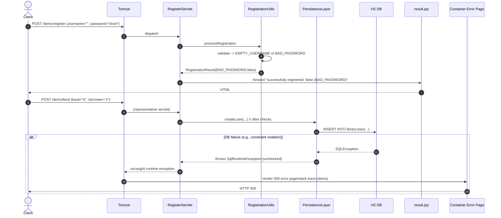

---

## Workflow 10: CI/CD and Security Scanning Pipeline (Git → Jenkins → ZAP → App)

Purpose and triggers:
- Purpose: Build, test, scan, and deploy the application; route API/UI tests through ZAP proxy.
- Trigger: Git push to bare repo triggers Jenkins job via CLI.

Communication patterns:
- Event-driven trigger (Git hook → Jenkins CLI).
- Synchronous stages within Jenkins; external processes (Gradle, Tomcat deploy).
- HTTP traffic proxied through ZAP (9888) during tests.
- Artifacts and reports published to H2O web server.

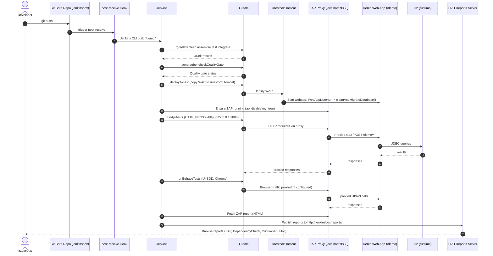

---

## Workflow 11: Desktop Auto-Insurance TCP Automation

Purpose and triggers:
- Purpose: Drive Swing UI via a TCP script server to test insurance business logic.
- Trigger: Automation client connects and issues commands.

Communication patterns:
- Synchronous TCP commands over localhost:8000.
- In-process rules evaluation (AutoInsuranceProcessor).
- Text protocol responses.

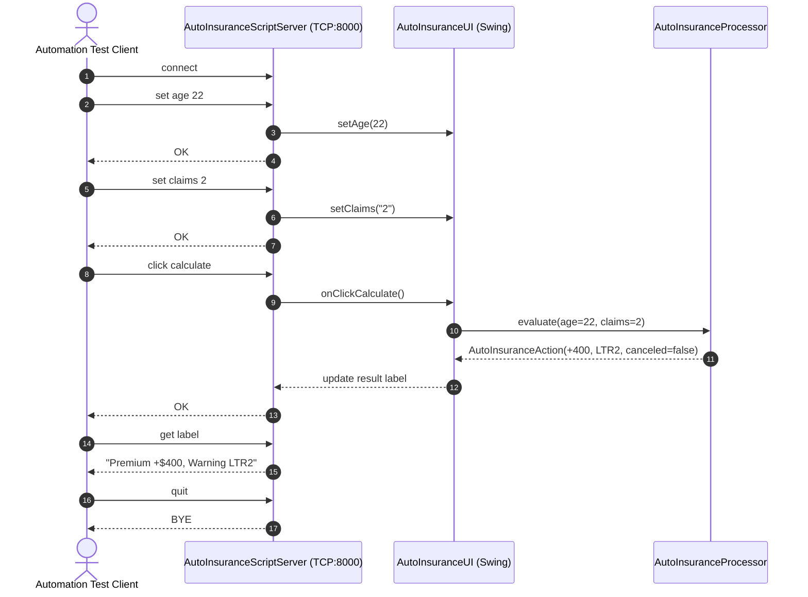

---

## Workflow 12: H2 Console Access (GET /demo/console)

Purpose and triggers:
- Purpose: Developer opens H2 console to inspect DB (dev-only).
- Trigger: Click link in library.html or manual navigation.

Communication patterns:
- Synchronous HTTP to servlet-mapped H2 console.
- JDBC connections from console to H2 (mem or file).

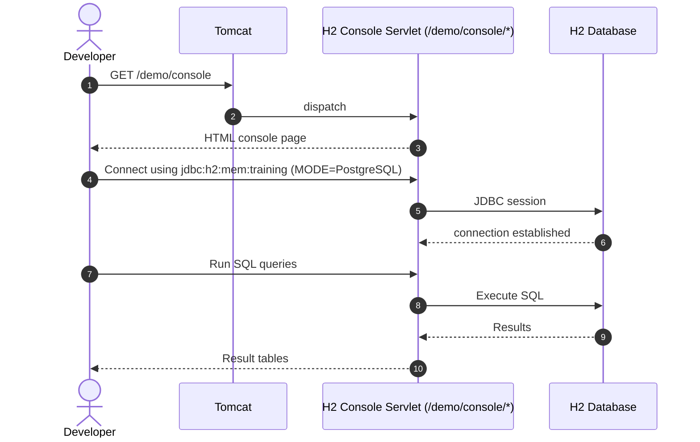

---

## Notes on Communication and Data Flow Patterns

- Synchronous HTTP:
  - All web app endpoints are classic servlet request/response.
  - Rendering via JSP (result.jsp, restfulresult.jsp) after setting request attributes.

- In-process calls:
  - Servlets delegate to Business Utils (RegistrationUtils, LoginUtils, LibraryUtils), which call PersistenceLayer.

- JDBC access:
  - PersistenceLayer uses prepared statements via H2 JdbcConnectionPool.
  - No explicit transactions; auto-commit true; multi-step operations (e.g., registration then password update) are not atomic.

- Asynchronous interactions:
  - Front-end library.js uses AJAX to prefetch lists.
  - CI/CD trigger from Git hook to Jenkins is event-driven.
  - ZAP proxy intermediates HTTP traffic during tests.

- Error handling:
  - Validation errors returned as human-readable strings or enums.
  - SQLExceptions wrapped into unchecked SqlRuntimeException; uncaught exceptions surface as HTTP 500 responses.
  - Input parsing errors (e.g., non-integer) return explicit “Error: …” messages.

- Data flow highlights:
  - Registration persists user then updates password hash by id.
  - Lending reads book and borrower, checks loan existence, inserts loan with current date.
  - List available uses LEFT JOIN + WHERE l.borrow_date IS NULL (never-loaned semantics).