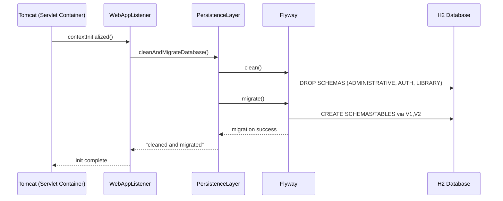
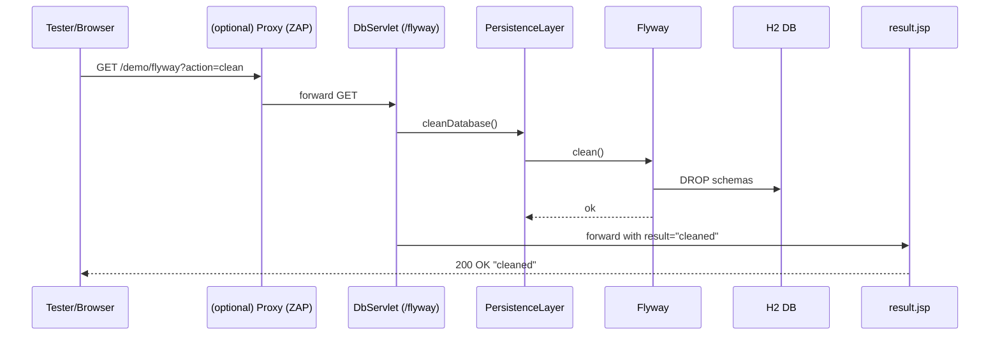
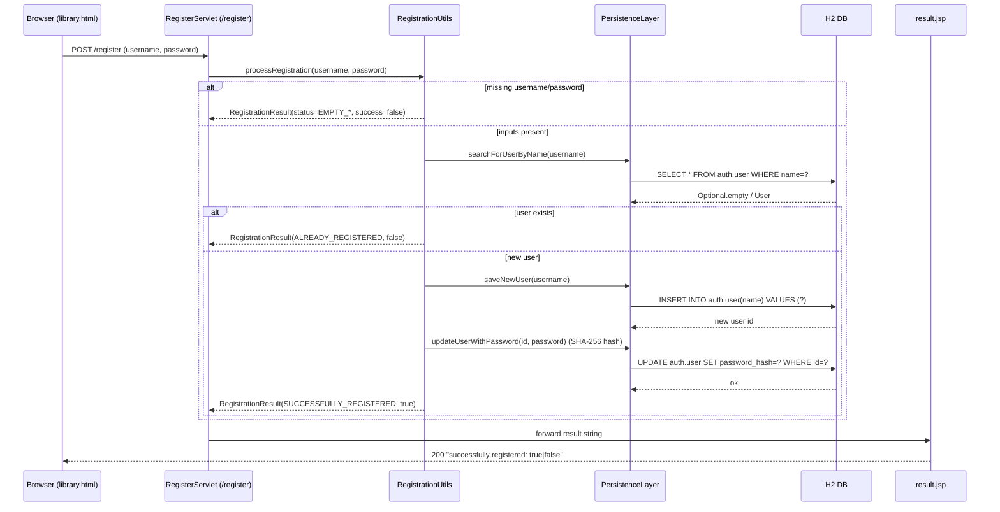
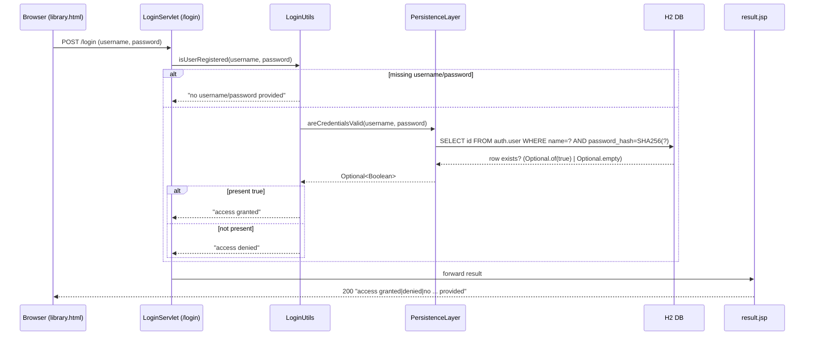
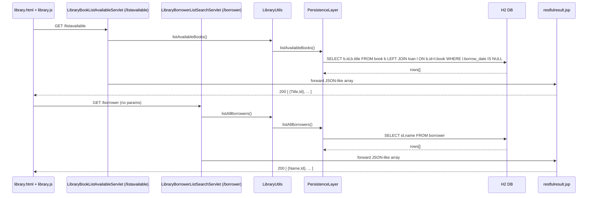
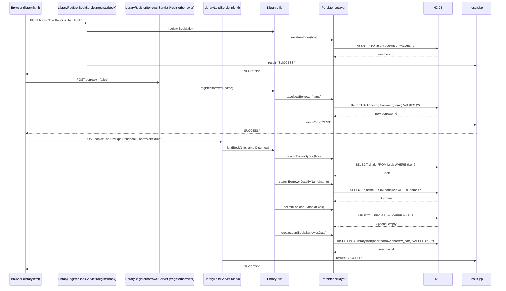
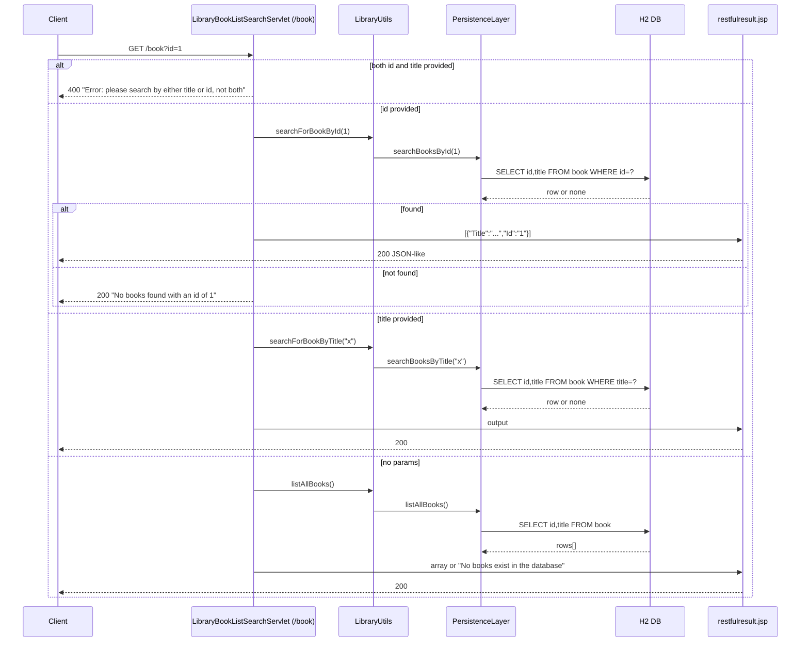
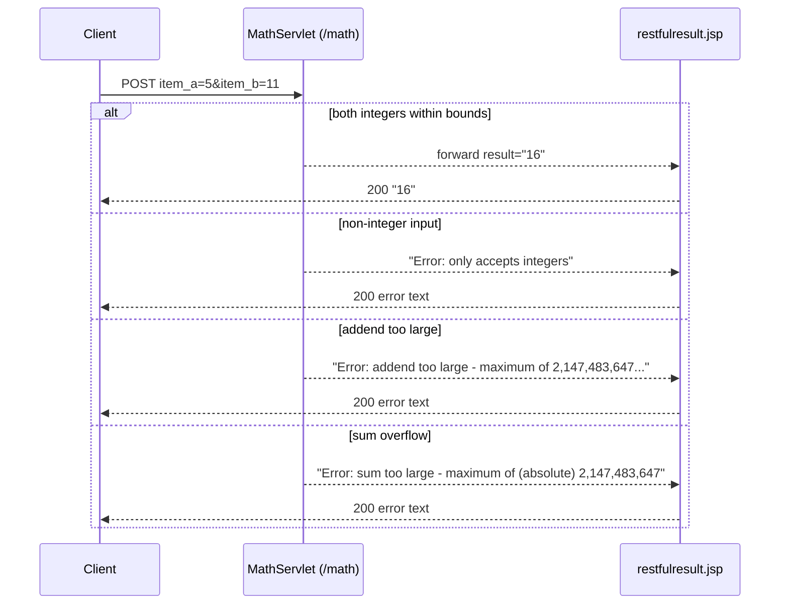
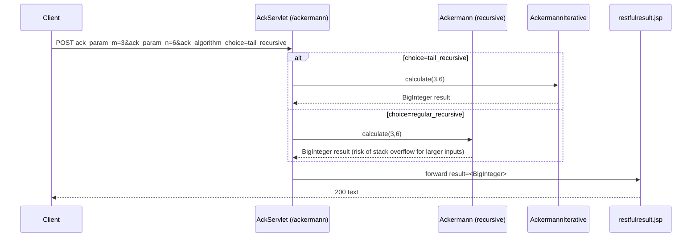

# Runtime Interaction Flows and Sequence Diagrams

## 1) App startup: DB clean-and-migrate (event-driven)

Purpose and trigger
- Ensures a known schema on deployment/start.
- Trigger: Servlet container initializes the web app (ServletContextInitialized).

Communication patterns
- Event-driven listener -> in-process method calls -> JDBC to H2; Flyway migration.
- No HTTP involved.



Error handling
- Flyway/SQL exceptions bubble as runtime errors; startup fails fast (logs).


## 2) Admin DB reset via /flyway endpoint

Purpose and trigger
- Test and demo convenience to reset DB on demand.
- Trigger: GET /demo/flyway?action=clean|migrate|<empty>.

Communication patterns
- HTTP GET -> servlet -> in-process call -> JDBC via Flyway; response via JSP.



Error handling
- On unknown action, servlet defaults to cleanAndMigrate; errors rendered as plain text via JSP.


## 3) User registration

Purpose and trigger
- Create a new user with password quality enforcement.
- Trigger: POST /demo/register.

Communication patterns
- HTTP POST -> servlet -> business utils -> persistence (SELECT, INSERT, UPDATE) -> JSP.



Error handling
- Password policy failure yields BAD_PASSWORD with entropy feedback.
- SQL exceptions wrapped in SqlRuntimeException; servlet returns failure text.


## 4) User login

Purpose and trigger
- Authenticate an existing user.
- Trigger: POST /demo/login.

Communication patterns
- HTTP POST -> servlet -> utils -> persistence SELECT -> JSP.



Error handling
- Missing inputs handled with explicit messages.
- DB errors -> runtime exception -> error page/logs.


## 5) Library UI prefill (AJAX): available books and borrowers

Purpose and trigger
- Improve UX by pre-populating lending controls.
- Trigger: library.js on page load/change.

Communication patterns
- Async XHR (GET) from browser -> servlet -> utils -> persistence SELECT -> JSP (raw text array).



Error handling
- Empty DB -> "No books/borrowers exist in the database" strings.


## 6) Librarian flow: register book, register borrower, lend book

Purpose and trigger
- End-to-end circulation: add entities and lend.
- Trigger: POSTs from library.html forms.

Communication patterns
- HTTP POSTs -> servlets -> business utils -> persistence INSERT/SELECT/INSERT -> JSP.



Error handling
- If book or borrower missing: BOOK_NOT_REGISTERED/BORROWER_NOT_REGISTERED.
- If loan already exists: BOOK_CHECKED_OUT.
- Empty inputs: NO_BOOK_TITLE_PROVIDED/NO_BORROWER_PROVIDED.


## 7) Library search books (by id or title) with validation

Purpose and trigger
- Search or list books for UI/admin.
- Trigger: GET /demo/book?id=.. or title=.. (or none to list all).

Communication patterns
- HTTP GET -> servlet -> utils -> persistence SELECT -> JSP.



Error handling
- id parse failure -> "Error: could not parse the book id as an integer".


## 8) Math addition with validation and overflow checks

Purpose and trigger
- Teaching/demo endpoint to add two integers with bounds checking.
- Trigger: POST /demo/math.

Communication patterns
- HTTP POST -> servlet -> validation/compute -> JSP.



Error handling
- Purely input/overflow checks; no DB effects.


## 9) Ackermann compute with algorithm selection

Purpose and trigger
- Demonstrate heavy recursion vs tail-recursive iterative algorithm.
- Trigger: POST /demo/ackermann.

Communication patterns
- HTTP POST -> servlet -> algorithm function -> JSP.



Error handling
- Forward exceptions logged; invalid params lead to generic error text.


## 10) Desktop AutoInsurance calculation via TCP automation

Purpose and trigger
- Demonstrate desktop UI automation and business rules.
- Trigger: Test client connects to port 8000 and issues commands.

Communication patterns
- TCP text protocol (synchronous request/response) -> UI/controller -> processor.

```mermaid
sequenceDiagram
  participant Tester as Desktop Tester (Client)
  participant Server as AutoInsuranceScriptServer (TCP:8000)
  participant UI as AutoInsuranceUI (Swing)
  participant Proc as AutoInsuranceProcessor

  Tester->>Server: connect
  Tester->>Server: set age 22
  Server->>UI: setAge(22)
  Server-->>Tester: OK
  Tester->>Server: set claims 1
  Server->>UI: setClaims(1)
  Server-->>Tester: OK
  Tester->>Server: click calculate
  Server->>UI: clickCalculate()
  UI->>Proc: compute(claims=1, age=22)
  Proc-->>UI: AutoInsuranceAction(+$100, LTR1, not canceled)
  UI-->>Server: updateLabel("Premium increase: $100 ...")
  Server-->>Tester: OK
  Tester->>Server: get label
  Server-->>Tester: "Premium increase: $100 ..."
  Tester->>Server: quit
  Server-->>Tester: OK; close
```

Error handling
- Invalid commands/params -> "FAILURE".
- Business rule errors produce isError=true; label reflects appropriate message.


## 11) CI/CD pipeline: push-to-deploy-test with proxied security tests

Purpose and trigger
- Full DevSecOps feedback loop from commit to deployed-and-tested app.
- Trigger: git push to bare repo on jenkinsbox (post-receive hook).

Communication patterns
- Event (Git hook) -> Jenkins CLI -> pipeline steps (Gradle tasks, REST to ZAP, deploy to Tomcat), tests via HTTP proxied through ZAP.

```mermaid
sequenceDiagram
  participant Dev as Developer
  participant Git as Bare Git Repo (jenkinsbox)
  participant Hook as post-receive Hook
  participant Jnk as Jenkins
  participant Gradle as Gradle Tasks
  participant Sonar as SonarQube
  participant Tomcat as Tomcat (uitestbox)
  participant ZAP as ZAP Proxy
  participant Tests as API/UI Test Runners
  participant App as Demo App (/demo)

  Dev->>Git: git push
  Git->>Hook: trigger
  Hook->>Jnk: jenkins-cli build demo
  Jnk->>Gradle: clean assemble test integrate bdd
  Gradle-->>Jnk: JUnit results
  Jnk->>Gradle: sonarqube
  Gradle->>Sonar: analysis; quality gate
  Sonar-->>Jnk: gate status
  Jnk->>Gradle: deployToTest (copy WAR)
  Gradle->>Tomcat: deploy WAR; restart app
  Jnk->>Gradle: waitForHeartBeat
  Jnk->>ZAP: clear session (HTTP)
  Jnk->>Tests: run API/UI (HTTP_PROXY=http://localhost:9888)
  Tests->>ZAP: proxied HTTP
  ZAP->>App: HTTP requests (/demo endpoints)
  App-->>ZAP: responses
  ZAP-->>Tests: responses
  Jnk->>Gradle: runPerfTests (JMeter)
  Gradle->>App: load
  Jnk->>ZAP: pull HTML report
  ZAP-->>Jnk: report.html
  Jnk-->>Dev: pipeline results + links
```

Error handling
- Failing unit/integration/quality gate halts pipeline.
- Heartbeat/deploy failure stops downstream tests; logs archived.
- ZAP proxy unreachable -> tests fallback or fail depending on stage configuration.