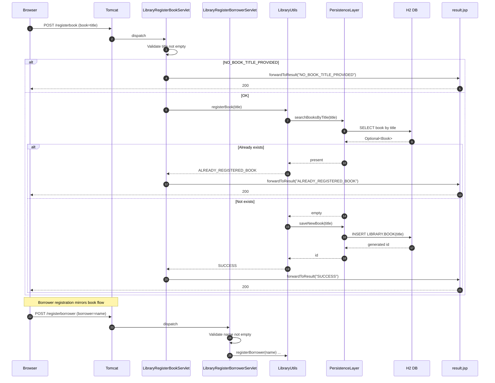
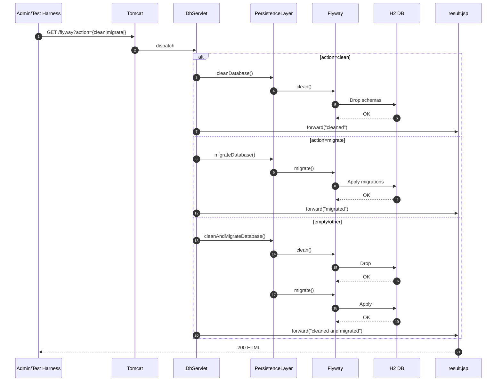

# Workflow 0: Application startup and database migration

Purpose and trigger
- Purpose: Ensure a known clean schema on app start for deterministic behavior and tests.
- Trigger: Tomcat context initialization event.

Communication patterns
- Event: ServletContextListener (contextInitialized)
- In-process synchronous calls
- JDBC to H2 via PersistenceLayer
- Flyway migrations

```mermaid
sequenceDiagram
  autonumber
  participant TC as Tomcat
  participant WL as WebAppListener (@WebListener)
  participant PL as PersistenceLayer (JDBC/H2)
  participant FW as Flyway
  participant DB as H2 Database (ADMINISTRATIVE, AUTH, LIBRARY)

  TC->>WL: contextInitialized()
  note right of WL: Event-driven callback

  WL->>PL: cleanAndMigrateDatabase()
  PL->>FW: clean()
  FW->>DB: Drop all objects in schemas
  DB-->>FW: OK

  PL->>FW: migrate()
  FW->>DB: Apply migrations V1, V2...
  DB-->>FW: OK

  FW-->>PL: Migration success
  PL-->>WL: Success
  WL-->>TC: Initialization complete

  note over PL,DB: JDBC prepared statements; autocommit defaults
```


# Workflow 1: User registration (/register)

Purpose and trigger
- Purpose: Register a new user with password quality enforcement.
- Trigger: Browser submits POST /register form from library.html.

Communication patterns
- HTTP: POST /register (form-encoded)
- In-process synchronous calls (Servlet -> Utils -> PersistenceLayer)
- External library call: password entropy (nbvcxz)
- JDBC to H2
- JSP forward to result.jsp

```mermaid
sequenceDiagram
  autonumber
  participant B as Browser
  participant T as Tomcat
  participant RS as RegisterServlet
  participant RU as RegistrationUtils
  participant PQ as Password Quality Lib (nbvcxz)
  participant PL as PersistenceLayer (JDBC/H2)
  participant DB as H2 DB
  participant JSP as result.jsp

  B->>T: POST /register (username, password)
  T->>RS: dispatch request
  RS->>RS: Validate presence (username, password)
  alt Missing username or password
    RS->>JSP: forwardToResult("no username/password provided")
    JSP-->>B: 200 HTML ("no ... provided")
  else Inputs present
    RS->>RU: processRegistration(username, password)
    RU->>PQ: isPasswordGood(password)
    alt BAD_PASSWORD (entropy/length/etc.)
      PQ-->>RU: PasswordResult(INSUFFICIENT_ENTROPY/...)
      RU-->>RS: RegistrationResult(BAD_PASSWORD, metrics)
      RS->>JSP: forwardToResult(pretty RegistrationResult)
      JSP-->>B: 200 HTML (includes entropy, crack times)
    else Password OK
      RU->>PL: searchForUserByName(username)
      PL->>DB: SELECT user by name
      DB-->>PL: Optional<User> empty or present
      alt Already registered
        PL-->>RU: User present
        RU-->>RS: RegistrationResult(ALREADY_REGISTERED)
        RS->>JSP: forwardToResult("ALREADY_REGISTERED")
        JSP-->>B: 200 HTML
      else Not registered
        PL-->>RU: User empty
        RU->>PL: saveNewUser(username)
        PL->>DB: INSERT AUTH.USER(name)
        DB-->>PL: generated userId
        PL-->>RU: userId
        RU->>RU: Hash password (SHA-256 hex, unsalted)
        RU->>PL: updateUserWithPassword(userId, passwordHash)
        PL->>DB: UPDATE AUTH.USER SET password_hash=...
        DB-->>PL: OK
        PL-->>RU: OK
        RU-->>RS: RegistrationResult(SUCCESSFULLY_REGISTERED)
        RS->>JSP: forwardToResult(pretty RegistrationResult)
        JSP-->>B: 200 HTML
      end
    end
  end
  note over RS,RU,PL: Synchronous in-process calls
  note over PL,DB: JDBC prepared statements; autocommit
```


# Workflow 2: User login (/login)

Purpose and trigger
- Purpose: Validate credentials for a registered user.
- Trigger: Browser submits POST /login form from library.html.

Communication patterns
- HTTP: POST /login
- In-process synchronous calls
- JDBC to H2
- JSP forward to result.jsp

```mermaid
sequenceDiagram
  autonumber
  participant B as Browser
  participant T as Tomcat
  participant LS as LoginServlet
  participant LU as LoginUtils
  participant PL as PersistenceLayer
  participant DB as H2 DB
  participant JSP as result.jsp

  B->>T: POST /login (username, password)
  T->>LS: dispatch
  LS->>LS: Validate presence (username, password)
  alt Missing username / password
    LS->>JSP: forwardToResult("no username/password provided")
    JSP-->>B: 200 HTML message
  else Inputs OK
    LS->>LU: isUserRegistered(username, password)
    LU->>PL: areCredentialsValid(username, password)
    PL->>DB: SELECT password_hash for user
    DB-->>PL: hash or no row
    alt User exists && hash matches (SHA-256)
      PL-->>LU: Optional<Boolean>(true)
      LU-->>LS: true
      LS->>JSP: forwardToResult("access granted")
      JSP-->>B: 200 HTML
    else No user or mismatch
      PL-->>LU: Optional<Boolean>(false or empty)
      LU-->>LS: false
      LS->>JSP: forwardToResult("access denied")
      JSP-->>B: 200 HTML
    end
  end
  note over LS,LU,PL: Synchronous; Optional to avoid nulls
```


# Workflow 3: Register a book (/registerbook) or borrower (/registerborrower)

Purpose and trigger
- Purpose: Add books and borrowers to the library catalog.
- Trigger: Librarian submits POST forms from library.html.

Communication patterns
- HTTP: POST /registerbook or /registerborrower
- In-process synchronous calls
- JDBC to H2
- JSP forward to result.jsp




# Workflow 4: Lend a book (/lend)

Purpose and trigger
- Purpose: Create a loan for a book to a borrower, enforcing availability and registration rules.
- Trigger: Librarian submits POST /lend (book title, borrower name) from library.html.

Communication patterns
- HTTP: POST /lend
- In-process synchronous calls
- JDBC to H2
- JSP forward to result.jsp

```mermaid
sequenceDiagram
  autonumber
  participant B as Browser
  participant T as Tomcat
  participant LLS as LibraryLendServlet
  participant LU as LibraryUtils
  participant PL as PersistenceLayer
  participant DB as H2 DB
  participant JSP as result.jsp

  B->>T: POST /lend (book, borrower)
  T->>LLS: dispatch
  LLS->>LLS: Validate presence (book, borrower); dateNow=java.sql.Date
  alt Missing input
    LLS->>JSP: forwardToResult("NO_BOOK_TITLE_PROVIDED" or "NO_BORROWER_PROVIDED")
    JSP-->>B: 200
  else Inputs OK
    LLS->>LU: lendBook(title, borrower, dateNow)
    LU->>PL: searchBooksByTitle(title)
    PL->>DB: SELECT LIBRARY.BOOK by title
    DB-->>PL: Optional<Book>
    alt Book not registered
      PL-->>LU: empty
      LU-->>LLS: BOOK_NOT_REGISTERED
      LLS->>JSP: forwardToResult("BOOK_NOT_REGISTERED")
      JSP-->>B: 200
    else Book present
      PL-->>LU: Book
      LU->>PL: searchBorrowerDataByName(borrower)
      PL->>DB: SELECT LIBRARY.BORROWER by name
      DB-->>PL: Optional<Borrower>
      alt Borrower not registered
        PL-->>LU: empty
        LU-->>LLS: BORROWER_NOT_REGISTERED
        LLS->>JSP: forwardToResult("BORROWER_NOT_REGISTERED")
        JSP-->>B: 200
      else Borrower present
        PL-->>LU: Borrower
        LU->>PL: searchForLoanByBook(Book)
        PL->>DB: SELECT LIBRARY.LOAN by book_id
        DB-->>PL: Optional<Loan>
        alt Book already checked out
          PL-->>LU: present
          LU-->>LLS: BOOK_CHECKED_OUT
          LLS->>JSP: forwardToResult("BOOK_CHECKED_OUT")
          JSP-->>B: 200
        else Available
          PL-->>LU: empty
          LU->>PL: createLoan(Book, Borrower, dateNow)
          PL->>DB: INSERT LIBRARY.LOAN(...)
          DB-->>PL: generated loan id
          PL-->>LU: id
          LU-->>LLS: SUCCESS
          LLS->>JSP: forwardToResult("SUCCESS")
          JSP-->>B: 200
        end
      end
    end
  end
  note over LU,PL: Null object pattern used for empties
  note over PL,DB: FK constraints; ON DELETE CASCADE
```


# Workflow 5: Search and list available books (/book, /listavailable) with dynamic UI

Purpose and trigger
- Purpose: Support catalog search and availability listing for lending UI (dropdown/autocomplete).
- Triggers:
  - Browser JS (library.js) issues XHR GET /listavailable to populate book choices.
  - Librarian searches via GET /book?id= or /book?title=.

Communication patterns
- HTTP: GET /listavailable or /book
- In-process synchronous calls
- JDBC to H2
- JSP forward to restfulresult.jsp (plain text/JSON-like)
- UI XHR (AJAX) and DOM updates

```mermaid
sequenceDiagram
  autonumber
  participant UI as Browser JS (library.js)
  participant T as Tomcat
  participant LAS as LibraryBookListAvailableServlet (/listavailable)
  participant LBS as LibraryBookListSearchServlet (/book)
  participant LU as LibraryUtils
  participant PL as PersistenceLayer
  participant DB as H2 DB
  participant RSP as restfulresult.jsp

  UI->>T: GET /listavailable
  T->>LAS: dispatch
  LAS->>LU: listAvailableBooks()
  LU->>PL: listAvailableBooks()
  PL->>DB: SELECT books not checked out
  DB-->>PL: List<Book> or empty
  alt No books exist
    PL-->>LU: Optional empty
    LAS->>RSP: forward("No books exist in the database")
    RSP-->>UI: 200 text/plain
  else Books found
    PL-->>LU: Optional<List<Book>>
    note over LAS: Build JSON fragments via Book.toOutputString<br/>with StringUtils.escapeForJson
    LAS->>RSP: forward([{"Title":"...","Id":"..."}, ...])
    RSP-->>UI: 200 application/json-like text
  end
  UI->>UI: render dropdown/autocomplete

  UI->>T: GET /book?title=War%20and%20Peace
  T->>LBS: dispatch
  LBS->>LBS: Validate only one of id/title; parse id if present
  alt Both id and title provided
    LBS->>RSP: forward("Error: please search by either title or id, not both")
    RSP-->>UI: 200
  else Title only
    LBS->>LU: searchForBookByTitle(title)
    LU->>PL: searchBooksByTitle(title)
    PL->>DB: SELECT book by title
    DB-->>PL: Optional<Book>
    alt No match
      PL-->>LU: empty
      LBS->>RSP: forward("No books found with a title of X")
      RSP-->>UI: 200
    else Match
      PL-->>LU: Book
      LBS->>RSP: forward([{"Title":"X","Id":"Y"}])
      RSP-->>UI: 200
    end
  end
```


# Workflow 6: Mathematics compute (Fibonacci) (/fibonacci)

Purpose and trigger
- Purpose: Compute Fibonacci numbers using selectable algorithms.
- Trigger: Browser submits POST /fibonacci from index.html, via catalog.js XHR.

Communication patterns
- HTTP: POST /fibonacci
- In-process compute (no DB)
- JSP forward to restfulresult.jsp

```mermaid
sequenceDiagram
  autonumber
  participant B as Browser / catalog.js
  participant T as Tomcat
  participant FS as FibServlet
  participant FI1 as Fibonacci (naive recursive)
  participant FI2 as FibonacciIterative (fast doubling)
  participant FI3 as FibonacciIterative (iterative BigInteger)
  participant RSP as restfulresult.jsp

  B->>T: POST /fibonacci (fib_param_n, fib_algorithm_choice)
  T->>FS: dispatch
  FS->>FS: Parse/validate inputs
  alt Invalid input (non-integer/out of range)
    FS->>RSP: forward(error string)
    RSP-->>B: 200
  else Valid
    alt Algorithm = regular_recursive/default_recursive
      FS->>FI1: calculate(n)
      FI1-->>FS: result (long)
    else Algorithm = tail_recursive_1
      FS->>FI2: fibAlgo1(n)
      FI2-->>FS: result (BigInteger)
    else Algorithm = tail_recursive_2
      FS->>FI3: fibAlgo2(n)
      FI3-->>FS: result (BigInteger)
    end
    FS->>RSP: forward(result as string)
    RSP-->>B: 200
  end
  note over FS: CPU-bound, synchronous; no persistence
```


# Workflow 7: Database admin reset (/flyway)

Purpose and trigger
- Purpose: Operational reset of DB (clean, migrate, or both) often used by tests.
- Trigger: Admin or test harness issues GET /flyway?action=...

Communication patterns
- HTTP: GET /flyway
- In-process synchronous calls
- Flyway + JDBC to H2
- JSP forward to result.jsp




# Workflow 8: Desktop Auto Insurance automation (TCP 8000)

Purpose and trigger
- Purpose: Drive Swing UI for automated tests; compute premium adjustments and possible letters.
- Trigger: Test client connects via TCP and issues commands.

Communication patterns
- TCP socket protocol (line-based commands)
- In-process synchronous calls (UI -> domain logic)
- No DB

```mermaid
sequenceDiagram
  autonumber
  participant C as Script Client (tests)
  participant SS as AutoInsuranceScriptServer (TCP 8000)
  participant UI as AutoInsuranceUI (Swing)
  participant P as AutoInsuranceProcessor (rules)

  C->>SS: connect
  C->>SS: set age 22
  SS->>UI: setAge(22)
  SS-->>C: OK

  C->>SS: set claims 1
  SS->>UI: setClaims(1)
  SS-->>C: OK

  C->>SS: click calculate
  SS->>UI: onClickCalculate()
  UI->>P: process(age=22, claims=1)
  P-->>UI: AutoInsuranceAction(+100, LTR1, cancel=false)
  UI->>UI: updateLabel("Increase: $100; Letter: LTR1")
  SS-->>C: OK

  C->>SS: get label
  SS-->>C: Increase: $100; Letter: LTR1

  alt Error in command/processing
    SS-->>C: FAILURE
  end

  C->>SS: quit
  SS-->>C: OK; close
```


# Cross-cutting error handling and recovery patterns

- Input validation (servlets): Presence checks for required parameters; numeric parsing with explicit error messages; early return via JSP/restful JSP.
- Business rule validation (Utils):
  - Authentication: IllegalArgumentException for empty username; password quality via nbvcxz; duplicate checks return ALREADY_REGISTERED.
  - Library: Empty title/name throws in Utils; non-registered entities map to BOOK_NOT_REGISTERED/BORROWER_NOT_REGISTERED; availability check prevents double-loans (BOOK_CHECKED_OUT).
- Persistence exceptions:
  - SQLExceptions wrapped as SqlRuntimeException by micro-ORM; not explicitly caught in servlets -> container returns 500; logged via SLF4J/Log4j2.
  - Referential integrity: ON DELETE CASCADE ensures loan cleanup when deleting books/borrowers.
- View rendering errors: ServletUtils.forwardToResult logs on failure.
- Deterministic state recovery: /flyway endpoint or WebAppListener clean+migrate on startup resets DB to known state.
- Security notes: Password hashing SHA-256 without salt/KDF (improvement opportunity); no authorization guards on endpoints (dev/demo context).


# Communication pattern summary (applies across workflows)

- Synchronous request/response:
  - Browser/JS -> HTTP -> Servlets -> Utils -> PersistenceLayer -> H2 DB -> JSP forward -> Browser.
  - Desktop tests -> TCP -> Script server -> UI -> Domain logic.
- No asynchronous messaging/brokers; event-driven only for container lifecycle (WebAppListener).
- Data flow:
  - Authentication: username/password -> entropy metrics -> optional User -> password hash (SHA-256 hex) -> DB.
  - Library: titles/names -> domain objects (null-object pattern) -> DB CRUD -> domain to JSON fragments via toOutputString with escaping.
  - Math: inputs -> algorithm selection -> numeric/string result (no persistence).
- Transactions: Implicit via JDBC autocommit; each servlet request results in one or more independent SQL operations; no explicit multi-statement transactions.