## Application Startup: DB Initialization via WebAppListener

Purpose and trigger
- Purpose: Ensure schemas/tables are clean and migrated on app start.
- Trigger: Tomcat initializes the web application context.

Communication patterns
- In-process method calls (ServletContextListener)
- JDBC calls executed by PersistenceLayer
- Flyway migration operations against H2

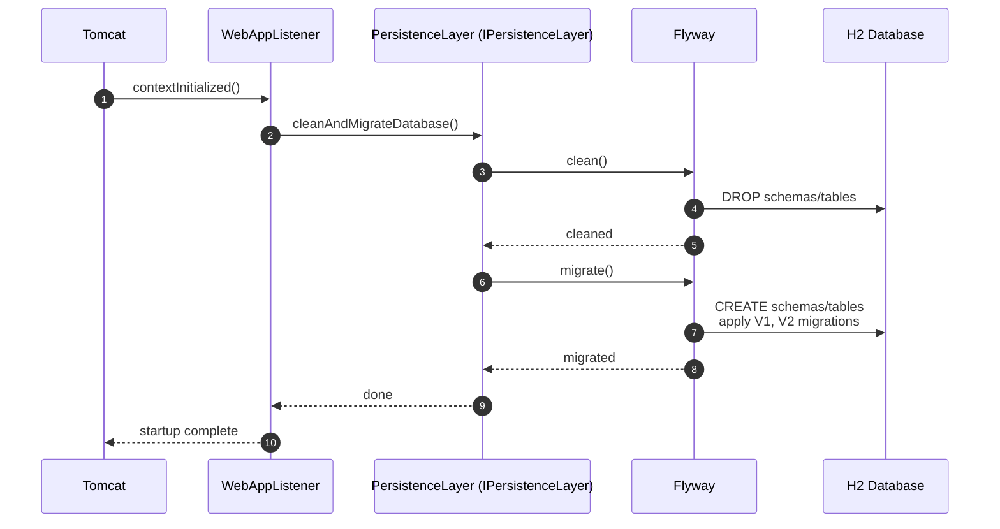

---

## Authentication: User Registration (POST /register)

Purpose and trigger
- Purpose: Register a new user with password policy and uniqueness checks.
- Trigger: Client submits username/password to /demo/register.

Communication patterns
- HTTP form POST -> Servlet
- In-process calls (RegistrationUtils -> IPersistenceLayer)
- JDBC inserts/updates into AUTH.USER
- JSP forward via ServletUtils to result.jsp

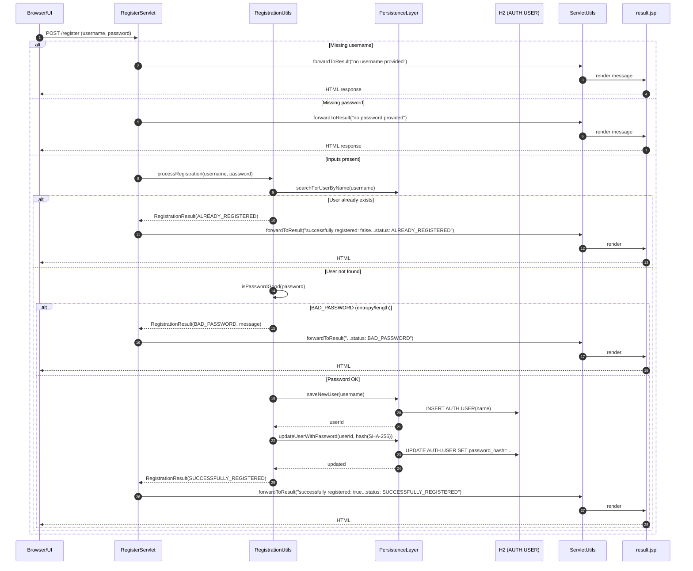

---

## Authentication: Login (POST /login)

Purpose and trigger
- Purpose: Authenticate user credentials.
- Trigger: Client submits username/password to /demo/login.

Communication patterns
- HTTP form POST -> Servlet
- In-process calls (LoginUtils -> IPersistenceLayer.areCredentialsValid)
- JDBC query against AUTH.USER
- JSP forward via ServletUtils to result.jsp

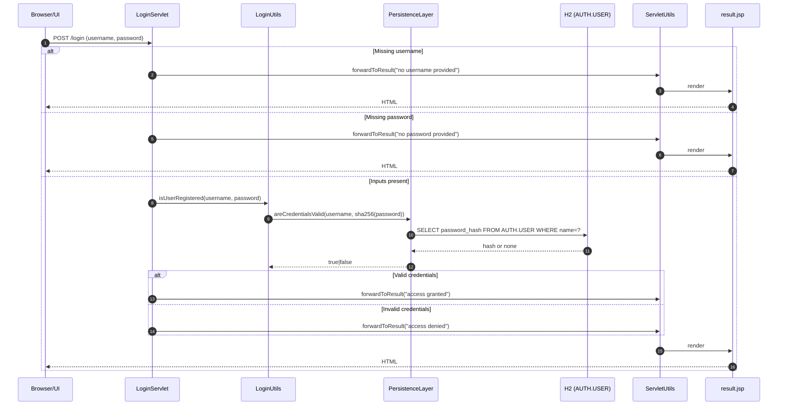

---

## Library: Register Book (POST /registerbook)

Purpose and trigger
- Purpose: Add a new book with uniqueness and input validation.
- Trigger: Client submits book title to /demo/registerbook.

Communication patterns
- HTTP POST -> Servlet
- In-process calls (LibraryUtils -> IPersistenceLayer)
- JDBC insert into LIBRARY.BOOK
- JSP forward (result.jsp)

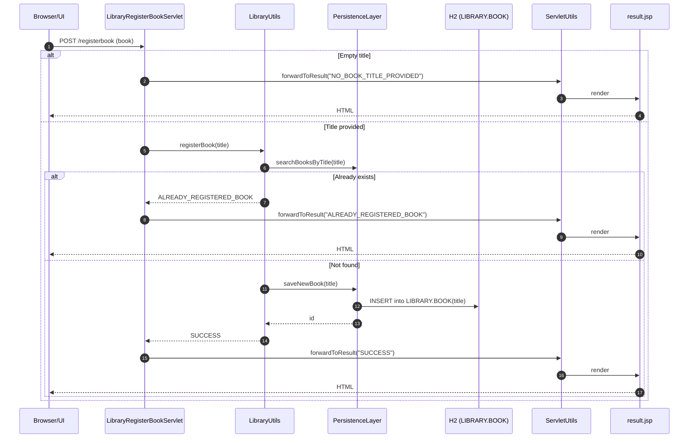

---

## Library: Register Borrower (POST /registerborrower)

Purpose and trigger
- Purpose: Add a new borrower with uniqueness and input validation.
- Trigger: Client submits name to /demo/registerborrower.

Communication patterns
- HTTP POST -> Servlet
- In-process calls (LibraryUtils -> IPersistenceLayer)
- JDBC insert into LIBRARY.BORROWER
- JSP forward (result.jsp)

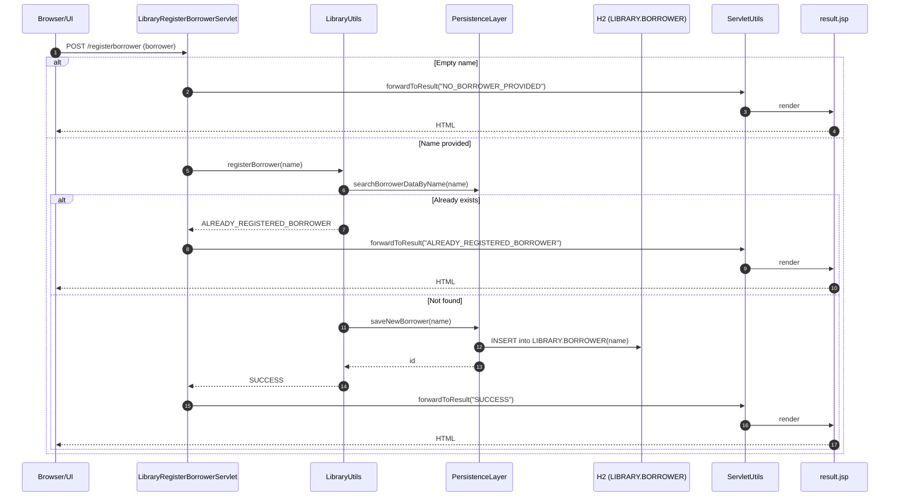

---

## Library: Lend Book (POST /lend)

Purpose and trigger
- Purpose: Create a loan if borrower and book exist and the book is available.
- Trigger: Client submits book and borrower to /demo/lend.

Communication patterns
- HTTP POST -> Servlet
- In-process calls (LibraryUtils -> IPersistenceLayer)
- JDBC: SELECTs for existence and loan status; INSERT into LIBRARY.LOAN
- JSP forward (result.jsp)

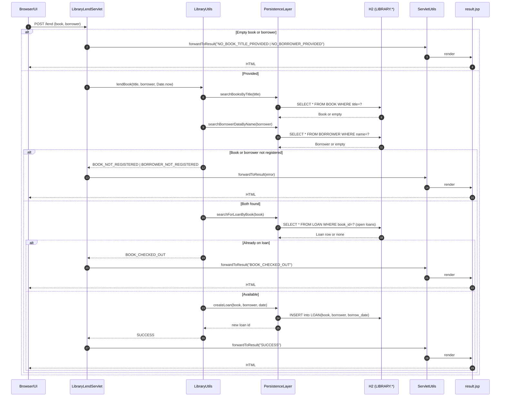

---

## Library: Search/List Books (GET /book) and Borrowers (GET /borrower)

Purpose and trigger
- Purpose: Retrieve entities by id/name/title or list all; support JSON output and human-readable errors.
- Trigger: Client requests GET /demo/book or /demo/borrower with query params.

Communication patterns
- HTTP GET -> Servlet
- In-process calls (LibraryUtils -> IPersistenceLayer)
- JDBC queries
- JSP forward to restfulresult.jsp (plain text/JSON)

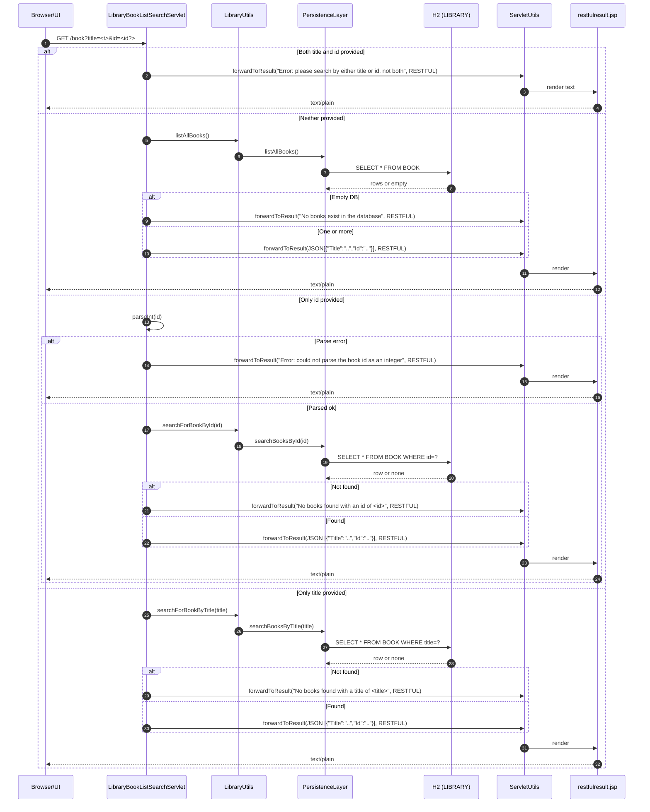

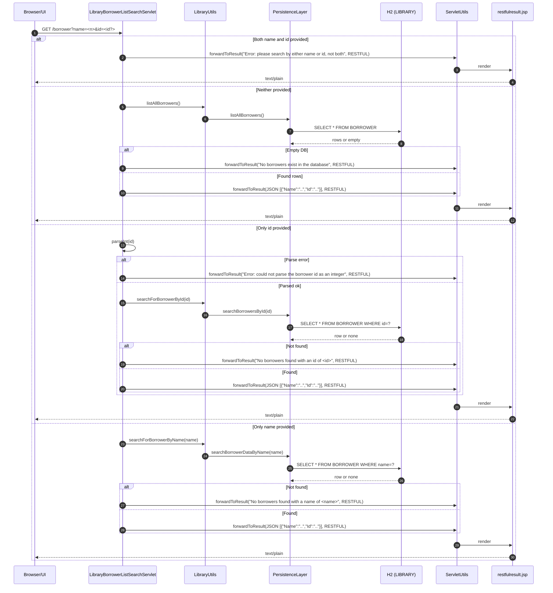

---

## Library: List Available Books (GET /listavailable)

Purpose and trigger
- Purpose: Return books not currently on loan for lending UI.
- Trigger: Client (library.js) requests /demo/listavailable.

Communication patterns
- HTTP GET -> Servlet
- In-process calls (LibraryUtils -> IPersistenceLayer.listAvailableBooks)
- JDBC query with join/anti-join
- JSP forward to restfulresult.jsp

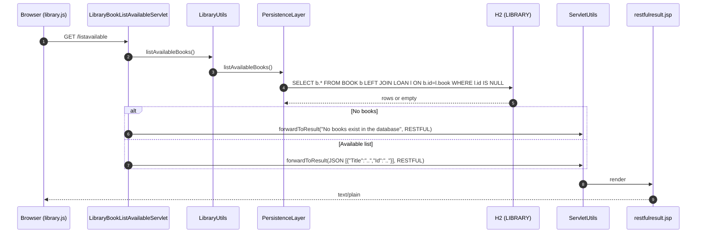

---

## Mathematics: Addition (POST /math)

Purpose and trigger
- Purpose: Sum two integers with input and overflow validation.
- Trigger: Client submits item_a and item_b to /demo/math.

Communication patterns
- HTTP POST -> Servlet
- In-process compute (Calculator)
- JSP forward to restfulresult.jsp

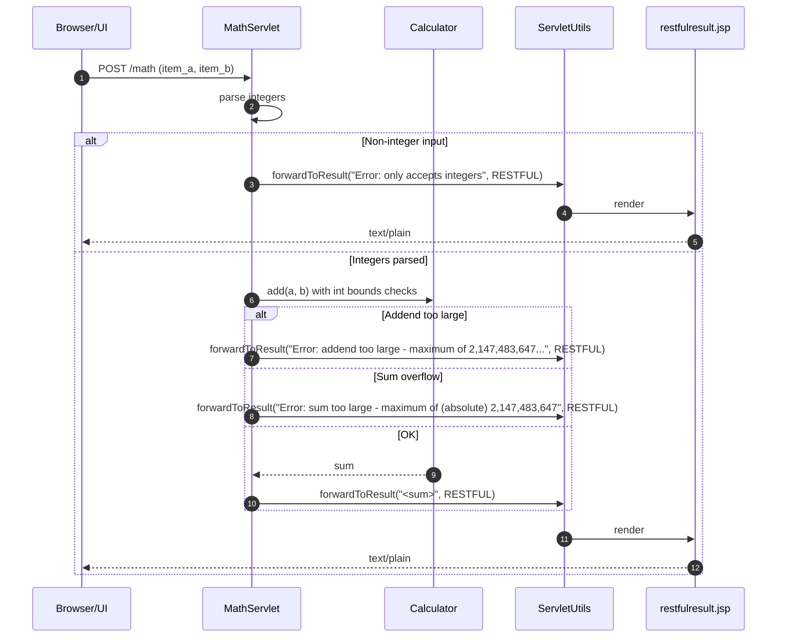

---

## Database Admin: Reset/Migrate via /flyway (GET)

Purpose and trigger
- Purpose: Admin/test endpoint to reset or migrate DB.
- Trigger: Client hits /demo/flyway?action=clean|migrate|[empty].

Communication patterns
- HTTP GET -> Servlet
- In-process calls (PersistenceLayer)
- Flyway clean/migrate against H2
- JSP forward to result.jsp

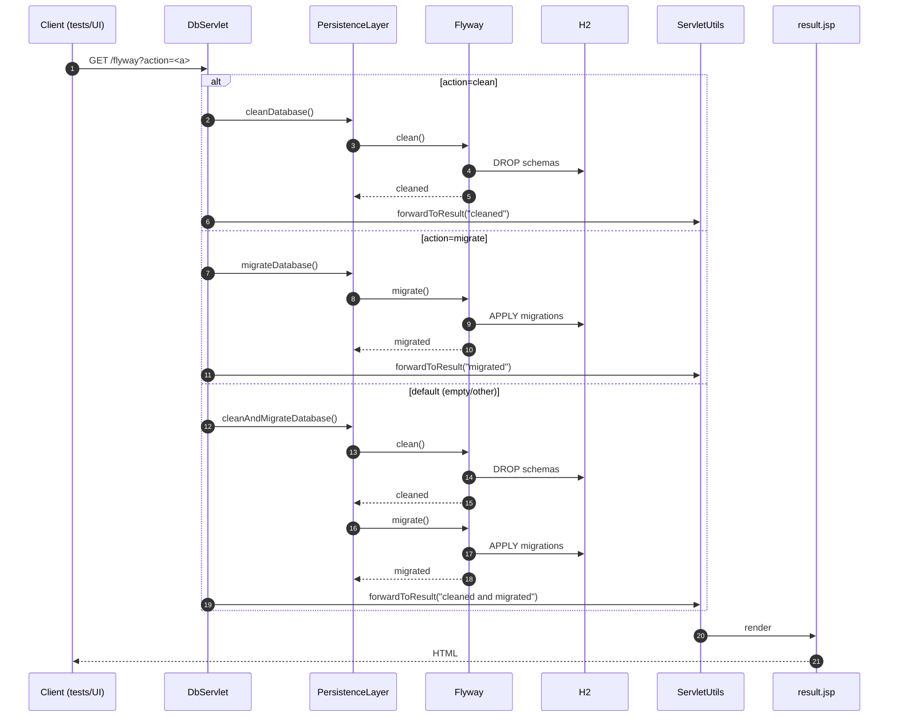

---

## Desktop Application: Auto Insurance UI Automation (TCP 8000)

Purpose and trigger
- Purpose: Drive Swing UI via socket protocol for automated tests and compute insurance action.
- Trigger: Test client connects and issues set/click/get commands.

Communication patterns
- TCP socket request/response (text protocol)
- Event-driven UI actions (Swing)
- In-process rule evaluation (AutoInsuranceProcessor)

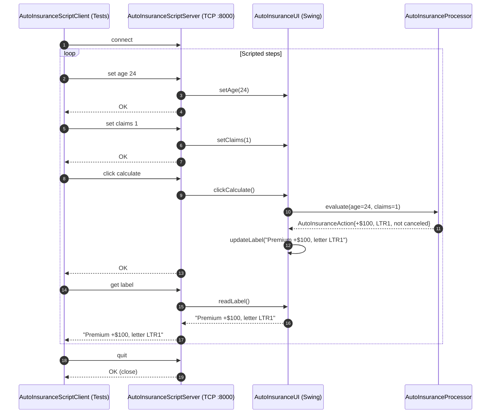

---

## Cross-cutting: Forwarding and Error Logging

Purpose and trigger
- Purpose: Standardize rendering responses and log errors on forward failures.
- Trigger: Any servlet forwards to JSP; dispatcher errors are logged.

Communication patterns
- In-process call to ServletUtils.forwardToResult
- Servlet container RequestDispatcher forwarding to JSP

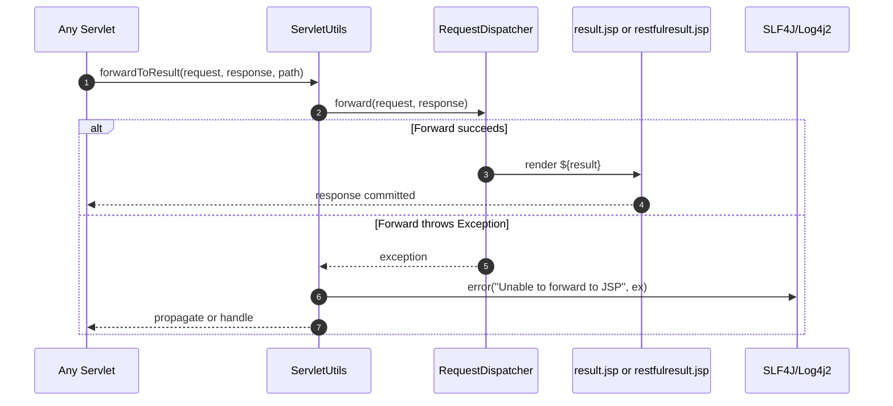

---

## Communication Summary per Workflow

- Registration/Login
  - Transport: HTTP POST (form-encoded)
  - Sync calls: Servlet -> Utils -> IPersistenceLayer -> JDBC/H2
  - Data: AUTH.USER (insert/update/query), SHA-256 hashing (no salt)
  - View: result.jsp

- Library (Register/Lend/Search/List)
  - Transport: HTTP (POST/GET)
  - Sync calls: Servlet -> LibraryUtils -> IPersistenceLayer -> JDBC/H2
  - Data: LIBRARY.BOOK, BORROWER, LOAN
  - Views: result.jsp (mutations), restfulresult.jsp (JSON)

- Math
  - Transport: HTTP POST
  - Pure compute: no DB
  - View: restfulresult.jsp

- DB Admin
  - Transport: HTTP GET
  - Sync calls: Servlet -> PersistenceLayer -> Flyway -> H2
  - View: result.jsp

- Desktop UI Automation
  - Transport: TCP socket (text protocol)
  - Event-driven UI -> Processor compute
  - Response: text strings (“OK”, values)

- Error handling patterns
  - Input validation at Servlet layer → immediate user-facing messages
  - Domain validation in Utils → enumerated outcomes and messages
  - Persistence exceptions wrapped (SqlRuntimeException); no explicit recovery besides test reset via /flyway
  - Forwarding failures logged via SLF4J; fallback is exception propagation (HTTP 500)