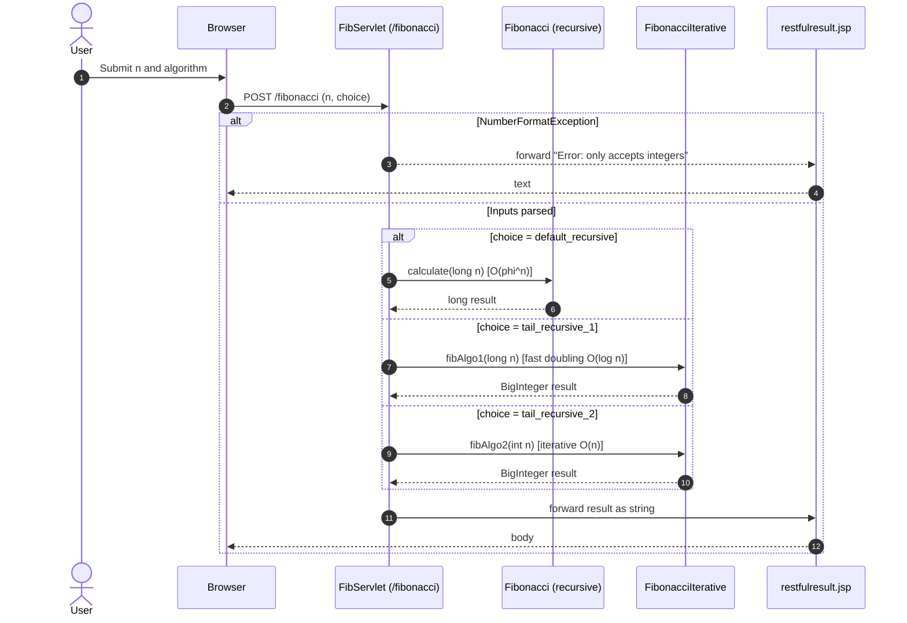
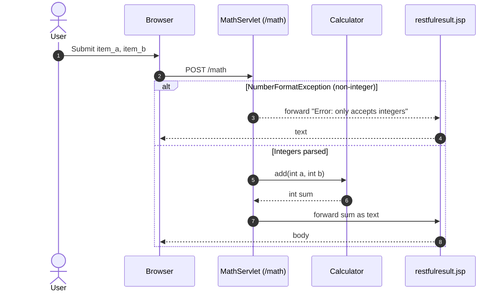

# Workflow 1: Application Startup and Database Migration

Purpose and trigger:
- Purpose: Initialize the in-memory H2 database schemas via Flyway so the app starts with a clean, known state.
- Trigger: Tomcat context initialization event (on application deploy/start).

Communication patterns:
- Event: ServletContextListener (WebAppListener) receives lifecycle event.
- In-process method calls: WebAppListener → PersistenceLayer → Flyway.
- Database: JDBC to H2; Flyway clean+migrate sequence; single-connection autocommit updates.

```mermaid
sequenceDiagram
autonumber
participant Tomcat as Tomcat Container
participant WebAppListener as WebAppListener (@WebListener)
participant Persistence as PersistenceLayer
participant Flyway as Flyway API
database H2 as H2 Database

Tomcat->>WebAppListener: contextInitialized()
WebAppListener->>Persistence: cleanAndMigrateDatabase()
activate Persistence
Persistence->>Flyway: clean()
activate Flyway
Flyway->>H2: DROP SCHEMA AUTH, LIBRARY (cascade)
Flyway-->>Persistence: cleaned
deactivate Flyway

Persistence->>Flyway: migrate()
activate Flyway
Flyway->>H2: CREATE SCHEMAS + TABLES\n(auth.user, library.book, borrower, loan)
Flyway-->>Persistence: migrated
deactivate Flyway

Persistence-->>WebAppListener: success
deactivate Persistence
WebAppListener-->>Tomcat: startup complete
Note over Tomcat,H2: Event-driven init; all calls are in-process and synchronous
```


# Workflow 2: User Registration

Purpose and trigger:
- Purpose: Create a new user with secure password policy enforcement and persist credentials.
- Trigger: Browser submits POST /register with username and password.

Communication patterns:
- REST over HTTP (synchronous): Browser → RegisterServlet.
- In-process: RegisterServlet → RegistrationUtils → (nbvcxz) → PersistenceLayer.
- Database: JDBC inserts and updates (autocommit).
- View rendering: JSP forward to result.jsp.

```mermaid
sequenceDiagram
autonumber
actor User
participant Browser
participant RegisterServlet as RegisterServlet (/register)
participant RegUtils as RegistrationUtils
participant Entropy as nbvcxz (entropy checker)
participant Persistence as PersistenceLayer
database H2 as H2
participant JSP as result.jsp

User->>Browser: Submit registration form
Browser->>RegisterServlet: POST /register (username, password)
RegisterServlet->>RegUtils: processRegistration(username, password)

alt Missing username or password
  RegUtils-->>RegisterServlet: RegistrationResult(EMPTY_*, BAD_PASSWORD)
  RegisterServlet->>JSP: forward with result
  JSP-->>Browser: HTML page with message
  Browser-->>User: Show validation error
else Provided username/password
  RegUtils->>Persistence: searchForUserByName(username)
  Persistence->>H2: SELECT id FROM auth.user WHERE name = ?
  H2-->>Persistence: row? (Optional<User>)
  Persistence-->>RegUtils: Optional<User>
  alt Already exists
    RegUtils-->>RegisterServlet: RegistrationResult(ALREADY_REGISTERED)
    RegisterServlet->>JSP: forward with result
    JSP-->>Browser: HTML
  else Not registered
    RegUtils->>Entropy: evaluate password strength
    Entropy-->>RegUtils: PasswordResult (entropy/feedback)
    alt Password too weak or length not in [10..100]
      RegUtils-->>RegisterServlet: RegistrationResult(BAD_PASSWORD, feedback)
      RegisterServlet->>JSP: forward with result
      JSP-->>Browser: HTML
    else Password OK
      RegUtils->>Persistence: saveNewUser(username)
      Persistence->>H2: INSERT INTO auth.user (name) VALUES (?)
      H2-->>Persistence: generated id
      Persistence-->>RegUtils: userId
      RegUtils->>Persistence: updateUserWithPassword(userId, password)
      Note right of Persistence: Hash password with SHA-256 (no salt/iterations)
      Persistence->>H2: UPDATE auth.user SET password_hash = ? WHERE id = ?
      H2-->>Persistence: updated
      Persistence-->>RegUtils: ok
      RegUtils-->>RegisterServlet: RegistrationResult(SUCCESSFULLY_REGISTERED)
      RegisterServlet->>JSP: forward with result
      JSP-->>Browser: HTML
    end
  end
end
```

Communication notes:
- Synchronous request/response.
- Password hashing in-process; policy via nbvcxz.
- DB operations are discrete statements (autocommit).


# Workflow 3: User Login

Purpose and trigger:
- Purpose: Validate user credentials for access check.
- Trigger: Browser submits POST /login (username, password).

Communication patterns:
- REST over HTTP (synchronous): Browser → LoginServlet.
- In-process: LoginServlet → LoginUtils → PersistenceLayer.
- Database: JDBC SELECT with hashed password comparison.
- View rendering: JSP forward to result.jsp.

```mermaid
sequenceDiagram
autonumber
actor User
participant Browser
participant LoginServlet as LoginServlet (/login)
participant LoginUtils as LoginUtils
participant Persistence as PersistenceLayer
database H2 as H2
participant JSP as result.jsp

User->>Browser: Submit login form
Browser->>LoginServlet: POST /login (username, password)
LoginServlet->>LoginUtils: isUserRegistered(username, password)

alt Missing username or password
  LoginUtils-->>LoginServlet: "no username provided" | "no password provided"
  LoginServlet->>JSP: forward with message
  JSP-->>Browser: HTML
else Inputs present
  LoginUtils->>Persistence: areCredentialsValid(username, password)
  Note right of Persistence: Hash password (SHA-256) then query
  Persistence->>H2: SELECT id FROM auth.user WHERE name=? AND password_hash=?
  H2-->>Persistence: row? (Optional<Boolean>=present when valid)
  Persistence-->>LoginUtils: Optional.of(true) | Optional.empty()
  alt Present (valid)
    LoginUtils-->>LoginServlet: "access granted"
  else Empty (invalid)
    LoginUtils-->>LoginServlet: "access denied"
  end
  LoginServlet->>JSP: forward with result
  JSP-->>Browser: HTML
end
```

Communication notes:
- Synchronous end-to-end.
- DB returns Optional semantics; absence signals invalid credentials.


# Workflow 4: Library UI Page Load with Dynamic Prefetch

Purpose and trigger:
- Purpose: On opening library.html, populate UI inputs with available books and borrowers using AJAX.
- Trigger: Browser loads /demo/library.html; library.js runs on load and issues XHRs to /listavailable and /borrower.

Communication patterns:
- HTTP GET (synchronous per request, initiated asynchronously by JS): Browser → Servlets.
- In-process: Servlets → LibraryUtils → PersistenceLayer.
- Database: JDBC SELECTs for books/borrowers.
- Rendering: restfulresult.jsp returns plain text/JSON-ish.

```mermaid
sequenceDiagram
autonumber
actor User
participant Browser
participant LibraryHTML as library.html
participant JS as library.js
participant ListAvailable as LibraryListAvailableServlet (/listavailable)
participant BorrowerAPI as BorrowerListServlet (/borrower)
participant LibUtils as LibraryUtils
participant Persistence as PersistenceLayer
database H2 as H2
participant RestJSP as restfulresult.jsp

User->>Browser: Navigate to /demo/library.html
Browser->>LibraryHTML: GET static page
LibraryHTML-->>Browser: HTML + script
Browser->>JS: onload()

par Prefetch available books
  JS->>ListAvailable: GET /listavailable
  ListAvailable->>LibUtils: listAvailableBooks()
  LibUtils->>Persistence: listAvailableBooks()
  Persistence->>H2: SELECT books LEFT JOIN loan WHERE borrow_date IS NULL
  H2-->>Persistence: rows
  Persistence-->>LibUtils: List<Book>
  LibUtils-->>ListAvailable: JSON-ish string
  ListAvailable->>RestJSP: forward with result
  RestJSP-->>JS: body: [ {"Title":"..","Id":".."}, ... ] or "No books exist..."
  JS->>JS: Render select/autocomplete per item count
and Prefetch borrowers
  JS->>BorrowerAPI: GET /borrower
  BorrowerAPI->>LibUtils: listAllBorrowers()
  LibUtils->>Persistence: listAllBorrowers()
  Persistence->>H2: SELECT id, name FROM library.borrower
  H2-->>Persistence: rows
  Persistence-->>LibUtils: List<Borrower>
  LibUtils-->>BorrowerAPI: JSON-ish string
  BorrowerAPI->>RestJSP: forward with result
  RestJSP-->>JS: body: [ {"Name":"..","Id":".."}, ... ]
  JS->>JS: Render select/autocomplete per item count
end

Note over JS,Browser: XHRs are initiated asynchronously; each request is sync HTTP/servlet processing
```

Communication notes:
- AJAX (asynchronous on client) with synchronous processing server-side.
- Plain text/JSON-ish responses via restfulresult.jsp.


# Workflow 5: Lend a Book

Purpose and trigger:
- Purpose: Lend a book to a borrower while enforcing business rules (existence, availability).
- Trigger: Browser submits POST /lend with book title and borrower name.

Communication patterns:
- REST over HTTP (synchronous): Browser → LibraryLendServlet.
- In-process: LibraryLendServlet → LibraryUtils → PersistenceLayer.
- Database: JDBC SELECTs for book/borrower and loan; INSERT loan.
- View rendering: JSP forward to result.jsp.

```mermaid
sequenceDiagram
autonumber
actor User
participant Browser
participant LendServlet as LibraryLendServlet (/lend)
participant LibUtils as LibraryUtils
participant Persistence as PersistenceLayer
database H2 as H2
participant JSP as result.jsp

User->>Browser: Submit "Lend" form
Browser->>LendServlet: POST /lend (book=title, borrower=name)
LendServlet->>LibUtils: lend(bookTitle, borrowerName)

LibUtils->>Persistence: searchBooksByTitle(title)
Persistence->>H2: SELECT id FROM library.book WHERE title=?
H2-->>Persistence: row? (Optional<Book>)
Persistence-->>LibUtils: Optional<Book>

alt Book not registered
  LibUtils-->>LendServlet: LibraryActionResults.BOOK_NOT_REGISTERED
  LendServlet->>JSP: forward with result
  JSP-->>Browser: HTML
else Book exists
  LibUtils->>Persistence: searchBorrowerDataByName(name)
  Persistence->>H2: SELECT id, name FROM library.borrower WHERE name=?
  H2-->>Persistence: row? (Optional<Borrower>)
  Persistence-->>LibUtils: Optional<Borrower>
  alt Borrower not registered
    LibUtils-->>LendServlet: LibraryActionResults.BORROWER_NOT_REGISTERED
    LendServlet->>JSP: forward
    JSP-->>Browser: HTML
  else Borrower exists
    LibUtils->>Persistence: searchForLoanByBook(book)
    Persistence->>H2: SELECT loan JOIN borrower WHERE loan.book=?
    H2-->>Persistence: row? (Optional<Loan>)
    Persistence-->>LibUtils: Optional<Loan>
    alt Already checked out
      LibUtils-->>LendServlet: LibraryActionResults.BOOK_CHECKED_OUT
      LendServlet->>JSP: forward
      JSP-->>Browser: HTML
    else Available
      LibUtils->>Persistence: createLoan(book, borrower, now())
      Persistence->>H2: INSERT INTO library.loan (book, borrower, borrow_date)
      H2-->>Persistence: generated id
      Persistence-->>LibUtils: loanId
      LibUtils-->>LendServlet: LibraryActionResults.SUCCESS
      LendServlet->>JSP: forward
      JSP-->>Browser: HTML
    end
  end
end

opt DB error (e.g., constraint/connection)
  Persistence-->>LibUtils: throws SqlRuntimeException
  LibUtils-->>LendServlet: exception propagates
  LendServlet-->>Browser: HTTP 500 (container default)
end
```

Communication notes:
- Synchronous, read-then-write with simple invariants.
- Each JDBC statement is its own autocommit transaction; no multi-statement transaction boundary is defined.


# Workflow 6: Book Search (GET /book)

Purpose and trigger:
- Purpose: Search for books by id or title; list all when no params.
- Trigger: Browser or JS issues GET /book with optional id or title.

Communication patterns:
- REST over HTTP (synchronous): Browser → LibraryBookListSearchServlet.
- In-process: LibraryBookListSearchServlet → LibraryUtils → PersistenceLayer.
- Database: JDBC SELECT by id/title or list all.
- Rendering: restfulresult.jsp returns JSON-ish or plain-text errors.

```mermaid
sequenceDiagram
autonumber
actor User
participant Browser
participant BookServlet as LibraryBookListSearchServlet (/book)
participant LibUtils as LibraryUtils
participant Persistence as PersistenceLayer
database H2 as H2
participant RestJSP as restfulresult.jsp

User->>Browser: Search by id or title
Browser->>BookServlet: GET /book[?id=..|title=..]

alt Both id and title provided
  BookServlet-->>Browser: "Error: please search by either title or id, not both"
else id provided
  alt Parse error
    BookServlet-->>Browser: "Error: could not parse the book id as an integer"
  else Parsed id ok
    BookServlet->>LibUtils: searchBooksById(id)
    LibUtils->>Persistence: searchBooksById(id)
    Persistence->>H2: SELECT id,title FROM library.book WHERE id=?
    H2-->>Persistence: row?
    Persistence-->>LibUtils: Optional<Book>
    alt Found
      LibUtils-->>BookServlet: JSON-ish single item
      BookServlet->>RestJSP: forward
      RestJSP-->>Browser: body
    else Not found
      LibUtils-->>BookServlet: "No books found with an id of X"
      BookServlet-->>Browser: text
    end
  end
else title provided
  BookServlet->>LibUtils: searchBooksByTitle(title)
  LibUtils->>Persistence: searchBooksByTitle(title)
  Persistence->>H2: SELECT id FROM library.book WHERE title=?
  H2-->>Persistence: row?
  Persistence-->>LibUtils: Optional<Book>
  alt Found
    LibUtils-->>BookServlet: JSON-ish single item
    BookServlet->>RestJSP: forward
    RestJSP-->>Browser: body
  else Not found
    LibUtils-->>BookServlet: "No books found with a title of X"
    BookServlet-->>Browser: text
  end
else no params
  BookServlet->>LibUtils: listAllBooks()
  LibUtils->>Persistence: listAllBooks()
  Persistence->>H2: SELECT id,title FROM library.book
  H2-->>Persistence: rows?
  Persistence-->>LibUtils: Optional<List<Book>>
  alt Any rows
    LibUtils-->>BookServlet: JSON-ish list
    BookServlet->>RestJSP: forward
    RestJSP-->>Browser: body
  else Empty
    LibUtils-->>BookServlet: "No books exist in the database"
    BookServlet-->>Browser: text
  end
end
```

Communication notes:
- Strictly synchronous HTTP handling; mixed content types (text vs JSON-ish).


# Workflow 7: Fibonacci Computation

Purpose and trigger:
- Purpose: Compute Fibonacci(n) with selectable algorithm for performance/scale.
- Trigger: Browser submits POST /fibonacci with fib_param_n and fib_algorithm_choice.

Communication patterns:
- REST over HTTP (synchronous): Browser → FibServlet.
- In-process computation: FibServlet → Fibonacci / FibonacciIterative.
- Rendering: restfulresult.jsp returns numeric result or error text.



Communication notes:
- CPU-bound in-process computation; no DB.
- Error handling centered on input parsing.


# Workflow 8: Database Maintenance via /flyway

Purpose and trigger:
- Purpose: Allow testers/admins to reset or migrate the DB on demand.
- Trigger: User clicks buttons in library.html causing GET /flyway?action=...

Communication patterns:
- REST over HTTP (synchronous): Browser → DbServlet.
- In-process: DbServlet → PersistenceLayer → Flyway.
- Database: Flyway clean/migrate.
- Rendering: JSP result.jsp.

```mermaid
sequenceDiagram
autonumber
actor Admin as Tester/Admin
participant Browser
participant DbServlet as DbServlet (/flyway)
participant Persistence as PersistenceLayer
participant Flyway as Flyway API
database H2 as H2
participant JSP as result.jsp

Admin->>Browser: Click reset/migrate
Browser->>DbServlet: GET /flyway?action=clean|migrate|default
alt action=clean
  DbServlet->>Persistence: cleanDatabase()
  Persistence->>Flyway: clean()
  Flyway->>H2: DROP SCHEMAS
  Flyway-->>Persistence: ok
  DbServlet->>JSP: forward "cleaned", return_page=library.html
  JSP-->>Browser: HTML
else action=migrate
  DbServlet->>Persistence: migrateDatabase()
  Persistence->>Flyway: migrate()
  Flyway->>H2: CREATE SCHEMAS+TABLES
  Flyway-->>Persistence: ok
  DbServlet->>JSP: forward "migrated"
  JSP-->>Browser: HTML
else (omit/other)
  DbServlet->>Persistence: cleanAndMigrateDatabase()
  Persistence->>Flyway: clean(); migrate()
  Flyway->>H2: reset & create
  Flyway-->>Persistence: ok
  DbServlet->>JSP: forward "cleaned and migrated"
  JSP-->>Browser: HTML
end
```

Communication notes:
- Synchronous admin operation; replaces state.


# Workflow 9: Desktop AutoInsurance Calculation via TCP Automation

Purpose and trigger:
- Purpose: Automated test drives the Swing app to compute insurance adjustments.
- Trigger: Test client sends scripted TCP commands to the server.

Communication patterns:
- TCP text protocol (synchronous per command): Client ↔ Server.
- In-process UI and compute: Server manipulates Swing UI and calls AutoInsuranceProcessor.
- Event-handling: UI update on button click.

```mermaid
sequenceDiagram
autonumber
actor Tester as Automation Test
participant Client as AutoInsuranceScriptClient
participant TCP as TCP Socket (localhost:8000)
participant Server as AutoInsuranceScriptServer
participant UI as AutoInsuranceUI (Swing)
participant Processor as AutoInsuranceProcessor

Tester->>Client: set age 23; set claims 2; click calculate; get label
Client->>TCP: "set age 23"
TCP->>Server: deliver "set age 23"
Server->>UI: setAgeText("23")
UI-->>Server: ok

Client->>TCP: "set claims 2"
TCP->>Server: deliver "set claims 2"
Server->>UI: setClaimsDropdown(2)
UI-->>Server: ok

Client->>TCP: "click calculate"
TCP->>Server: deliver "click calculate"
Server->>UI: clickCrunchButton()
UI->>Processor: compute(age=23, claims=2)
Processor-->>UI: AutoInsuranceAction {+$400, LTR2, not canceled}
UI-->>Server: updateLabel("+$400; LTR2")
Server-->>TCP: ok

Client->>TCP: "get label"
TCP->>Server: deliver "get label"
Server->>UI: readLabel()
UI-->>Server: "+$400; LTR2"
Server-->>TCP: "+$400; LTR2"
TCP-->>Client: response
Client-->>Tester: assertion passes
```

Communication notes:
- Plain TCP commands; server runs on background thread.
- UI stateful; computations deterministic based on inputs.


# Workflow 10: Math Addition (/math) with Error Handling

Purpose and trigger:
- Purpose: Add two integers; demonstrate simple parse error handling.
- Trigger: Browser submits POST /math with item_a, item_b.

Communication patterns:
- REST over HTTP (synchronous): Browser → MathServlet.
- In-process: Calculator.add.
- Rendering: restfulresult.jsp.



Communication notes:
- Simple synchronous flow; single error case managed explicitly.


# Cross-cutting Error Handling and Recovery Patterns

- Input validation:
  - Authentication and Library use utilities (LoginUtils, RegistrationUtils, LibraryUtils) to validate non-empty strings; failures return domain-specific statuses/messages (synchronous, no DB writes).
  - Math/Fibonacci/Ackermann servlets catch NumberFormatException and return "Error: only accepts integers" (restfulresult.jsp).

- Persistence failures:
  - JDBC exceptions are wrapped in SqlRuntimeException by the micro-ORM; if uncaught in servlets, they propagate to container resulting in HTTP 500. Recovery is typically via admin reset (/flyway) or fix inputs; no retry logic present.

- Business rule conflicts:
  - Library lending checks and returns LibraryActionResults (BOOK_NOT_REGISTERED, BORROWER_NOT_REGISTERED, BOOK_CHECKED_OUT) without throwing; client must correct state or inputs.

- Startup/reset:
  - WebAppListener ensures a clean DB on startup (event-driven reset). /flyway endpoint can be used to recover a bad state during testing.

- Data flow integrity:
  - Passwords are hashed before DB compare/update; Optional semantics denote existence checks.
  - JSON-ish rendering escapes strings to avoid injection in responses, though error cases return plain text.