```mermaid
graph TB

  %% External clients
  subgraph ExternalClients["External Clients & Test Tools"]
    Clients["Browsers (library.html, endpointcatalog.html) / API Tests / UI Tests"]
  end

  %% Monolith on Tomcat
  subgraph TomcatMonolith["Web Application (Tomcat, context: /demo)"]
    %% Presentation
    subgraph Servlets["Presentation Layer (Servlets)"]
      LoginServlet["/login LoginServlet"]
      RegisterServlet["/register RegisterServlet"]
      LendServlet["/lend LibraryLendServlet"]
      RegisterBookServlet["/registerbook LibraryRegisterBookServlet"]
      RegisterBorrowerServlet["/registerborrower LibraryRegisterBorrowerServlet"]
      BookSearchServlet["/book LibraryBookListSearchServlet"]
      ListAvailableServlet["/listavailable LibraryBookListAvailableServlet"]
      MathServlet["/math MathServlet"]
      FibServlet["/fibonacci FibServlet"]
      AckServlet["/ackermann AckServlet"]
      DbServlet["/flyway DbServlet"]
    end

    %% Business/Domain
    subgraph Business["Business / Domain Logic"]
      LoginUtils["LoginUtils"]
      RegistrationUtils["RegistrationUtils"]
      LibraryUtils["LibraryUtils"]
      Calculator["Calculator (add, helpers)"]
      Fibonacci["Fibonacci (recursive)"]
      FibonacciIterative["FibonacciIterative (fast doubling, iterative)"]
      Ackermann["Ackermann (recursive)"]
      AckermannIterative["AckermannIterative (tail-recursive/iterative)"]
      Helpers["ServletUtils / CheckUtils / StringUtils"]
    end

    %% Rendering
    subgraph Rendering["Rendering (JSP)"]
      ResultJsp["result.jsp"]
      RestfulJsp["restfulresult.jsp"]
    end

    %% Persistence
    subgraph Persistence["Persistence Layer"]
      IPersistenceLayer["IPersistenceLayer (interface)"]
      PersistenceLayer["PersistenceLayer (JDBC, micro-ORM)"]
      WebAppListener["WebAppListener (@WebListener)"]
    end
  end

  %% Database & tooling
  subgraph Database["Database & Migration"]
    H2["H2 Database (schemas: AUTH, LIBRARY, ADMINISTRATIVE)"]
    Flyway["Flyway Migrations (V1, V2)"]
    H2Console["H2 Console (/console/*)"]
  end

  %% Desktop application
  subgraph Desktop["Desktop Demo (separate project)"]
    AutoUI["AutoInsuranceUI (Swing)"]
    AutoProcessor["AutoInsuranceProcessor (rules engine)"]
    ScriptServer["AutoInsuranceScriptServer (TCP 8000)"]
    TestClient["ScriptClient / DesktopTester (automation)"]
  end

  %% Client -> Servlets (HTTP)
  Clients -->|HTTP POST| LoginServlet
  Clients -->|HTTP POST| RegisterServlet
  Clients -->|HTTP POST| LendServlet
  Clients -->|HTTP POST| RegisterBookServlet
  Clients -->|HTTP POST| RegisterBorrowerServlet
  Clients -->|HTTP GET| BookSearchServlet
  Clients -->|HTTP GET| ListAvailableServlet
  Clients -->|HTTP POST| MathServlet
  Clients -->|HTTP POST| FibServlet
  Clients -->|HTTP POST| AckServlet
  Clients -->|HTTP GET| DbServlet
  Clients -->|HTTP GET| H2Console

  %% Servlets -> Business
  LoginServlet --> LoginUtils
  RegisterServlet --> RegistrationUtils
  LendServlet --> LibraryUtils
  RegisterBookServlet --> LibraryUtils
  RegisterBorrowerServlet --> LibraryUtils
  BookSearchServlet --> LibraryUtils
  ListAvailableServlet --> LibraryUtils
  MathServlet --> Calculator
  FibServlet --> Fibonacci
  FibServlet --> FibonacciIterative
  AckServlet --> Ackermann
  AckServlet --> AckermannIterative

  %% JSP rendering
  LoginServlet -->|forward via ServletUtils| Helpers
  LendServlet -->|forward via ServletUtils| Helpers
  MathServlet -->|forward via ServletUtils| Helpers
  DbServlet -->|forward via ServletUtils| Helpers
  Helpers --> ResultJsp
  Helpers --> RestfulJsp

  %% Business -> Persistence
  LoginUtils --> IPersistenceLayer
  RegistrationUtils --> IPersistenceLayer
  LibraryUtils --> IPersistenceLayer
  DbServlet --> IPersistenceLayer
  WebAppListener -->|on startup: clean+migrate| IPersistenceLayer

  %% Persistence -> DB
  IPersistenceLayer --> PersistenceLayer
  PersistenceLayer -->|JDBC| H2
  PersistenceLayer -->|migrations| Flyway
  H2Console -->|JDBC| H2

  %% Desktop app interactions
  AutoUI --> AutoProcessor
  ScriptServer --> AutoUI
  TestClient -->|TCP 8000| ScriptServer
```

Rationale:
- The monolith is layered: HTTP servlets handle requests and forward to JSPs for rendering, while business utilities encapsulate domain logic and invoke a shared persistence layer for both Authentication and Library contexts; Mathematics endpoints are stateless and compute-only. Persistence consolidates JDBC access and Flyway migrations against a single H2 database with separate AUTH and LIBRARY schemas. The desktop Swing app is a separate component communicating over a local TCP socket for automation, isolated from the web application.