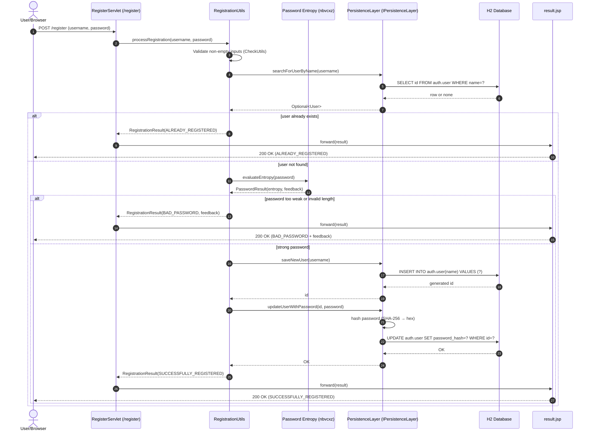
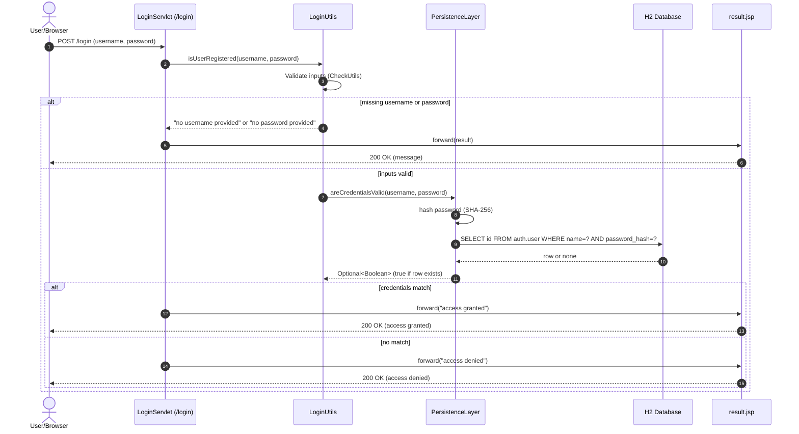
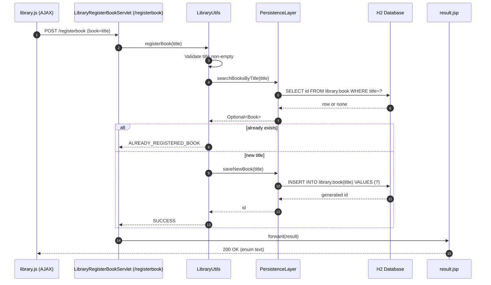
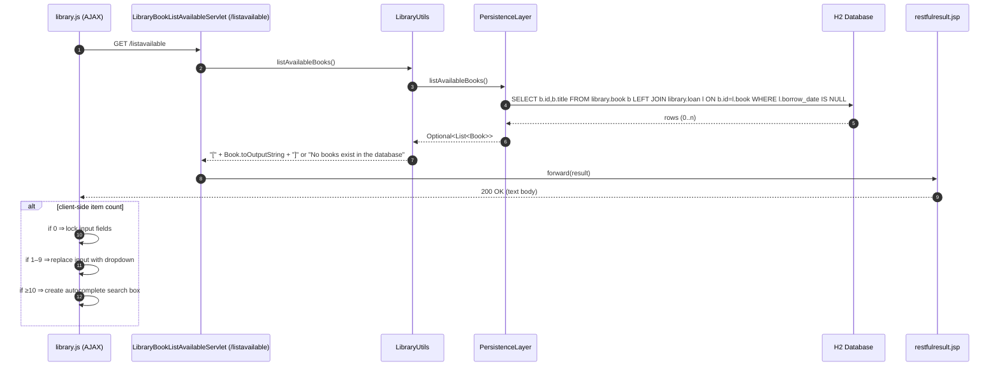
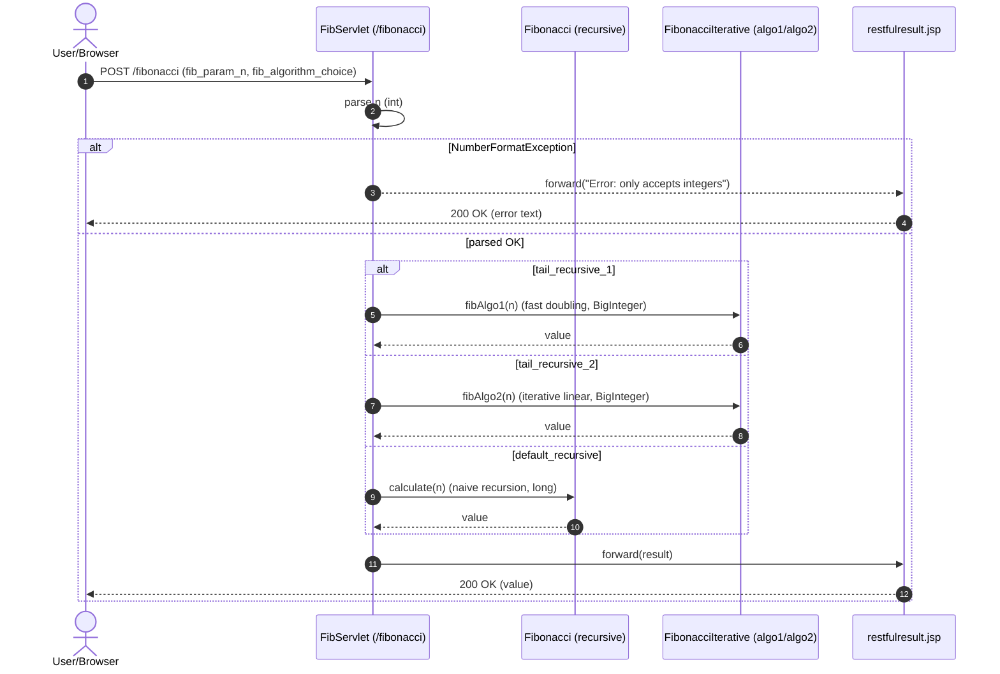
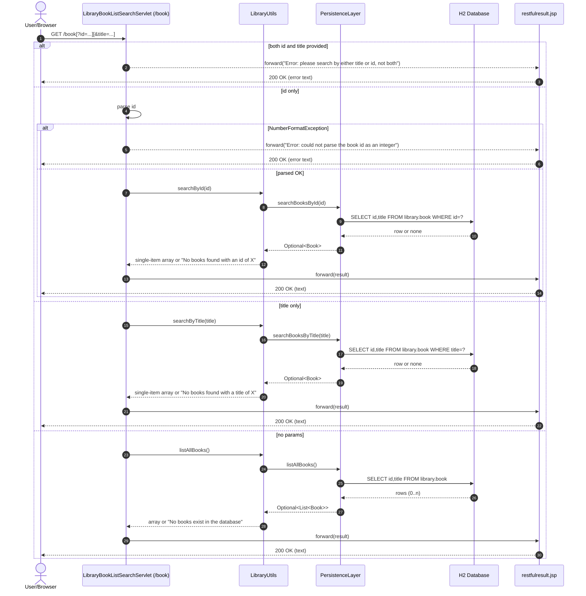
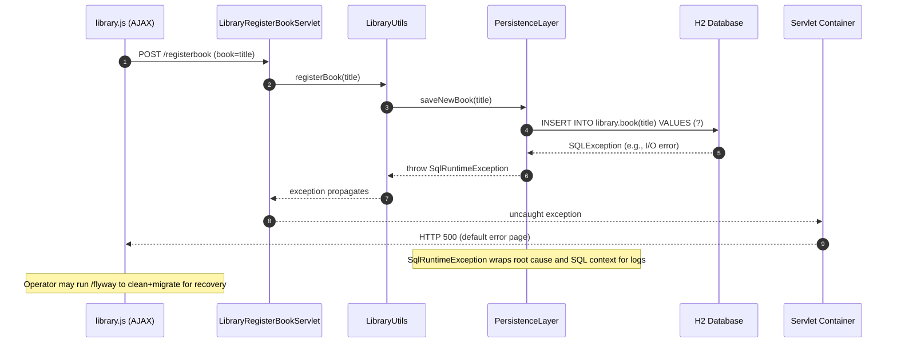
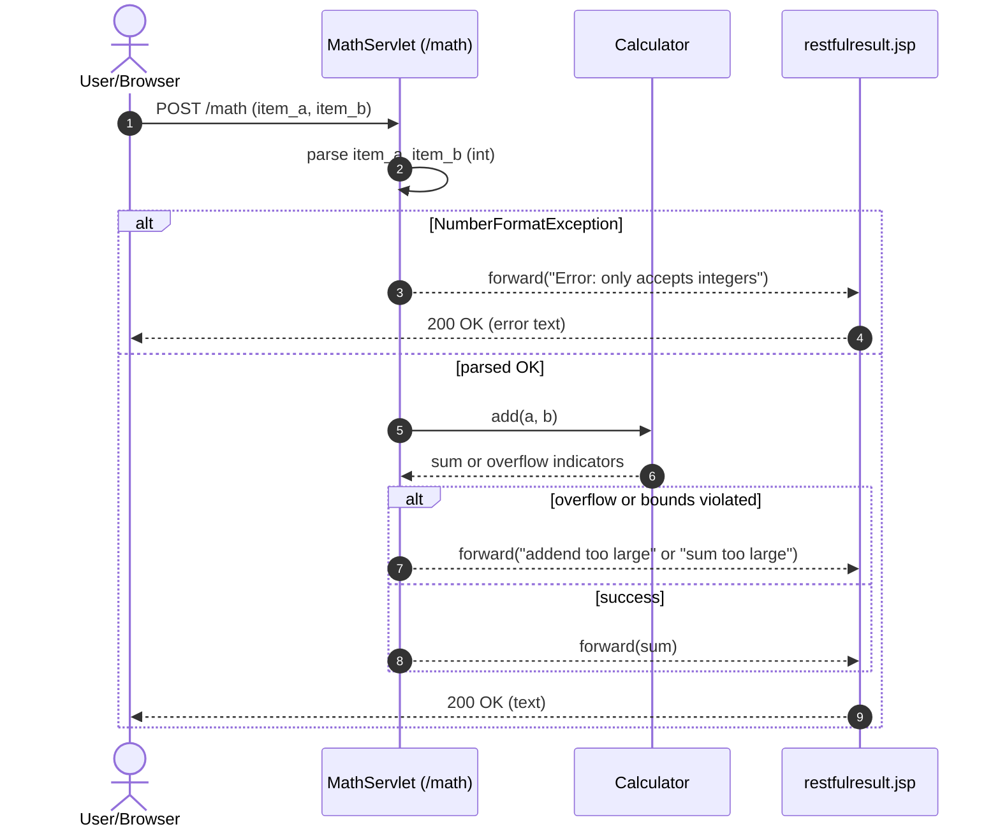

# Workflow 1: User Registration (/register)

Purpose and trigger:
- A user submits a registration form with username and password to create an account.
- Triggered by POST /register from a browser or AJAX.

Communication patterns:
- Synchronous HTTP POST (REST-like)
- In-process calls: Servlet → Business Utils → Persistence Layer
- Database transactions via JDBC (INSERT, UPDATE, SELECT)
- Rendering via JSP (result.jsp)
- External library call: nbvcxz password entropy check

Data flow:
- Input: username, password
- Persistence reads user by name; if new, inserts user and hashes password (SHA-256) before update
- Output: RegistrationResult string (success or specific failure messages)

Error handling:
- Duplicate user → ALREADY_REGISTERED
- Weak/invalid password → BAD_PASSWORD with feedback
- Validation errors (empty inputs) → EMPTY_* statuses
- SQL errors wrapped in SqlRuntimeException (bubbles up if uncaught)




# Workflow 2: User Login (/login)

Purpose and trigger:
- Authenticate an existing user with username and password.
- Triggered by POST /login.

Communication patterns:
- Synchronous HTTP POST
- In-process: Servlet → LoginUtils → PersistenceLayer
- DB SELECT with hashed password match
- JSP rendering (result.jsp)

Data flow:
- Input: username, password
- Persistence verifies hash match and returns presence
- Output: "access granted" or "access denied" or missing param messages

Error handling:
- Empty username/password → specific messages
- Non-existent user or wrong password → access denied
- SQL errors → SqlRuntimeException (uncaught → 500)




# Workflow 3: Register Book (/registerbook)

Purpose and trigger:
- Register a new book by title in the library.
- Triggered by AJAX POST from library.js or form submit.

Communication patterns:
- Synchronous HTTP POST
- In-process: Servlet → LibraryUtils → PersistenceLayer
- DB SELECT then INSERT
- JSP rendering (result.jsp)

Data flow:
- Input: title
- Output: LibraryActionResults (SUCCESS or ALREADY_REGISTERED_BOOK or NO_BOOK_TITLE_PROVIDED)

Error handling:
- Empty title → NO_BOOK_TITLE_PROVIDED
- Duplicate title → ALREADY_REGISTERED_BOOK
- SQL errors → SqlRuntimeException (uncaught → 500)




# Workflow 4: Lend Book (/lend)

Purpose and trigger:
- Lend a registered book to a registered borrower.
- Triggered by AJAX POST from library.js.

Communication patterns:
- Synchronous HTTP POST
- In-process: Servlet → LibraryUtils → PersistenceLayer
- Multiple DB lookups, then INSERT loan
- JSP rendering (result.jsp)

Data flow:
- Input: book title, borrower name
- Output: LibraryActionResults (SUCCESS, BOOK_NOT_REGISTERED, BORROWER_NOT_REGISTERED, BOOK_CHECKED_OUT)

Error handling:
- Missing inputs → NO_* PROVIDED variants
- Business rule failures return enum codes
- SQL errors → SqlRuntimeException (uncaught → 500)

```mermaid
sequenceDiagram
  autonumber
  participant JS as library.js (AJAX)
  participant LS as LibraryLendServlet (/lend)
  participant LU as LibraryUtils
  participant PL as PersistenceLayer
  participant DB as H2 Database
  participant JSP as result.jsp

  JS->>LS: POST /lend (book=title, borrower=name)
  LS->>LU: lendBook(title, name, borrowDate=now)

  LU->>PL: searchBooksByTitle(title)
  PL->>DB: SELECT id,title FROM library.book WHERE title=?
  DB-->>PL: row or none
  PL-->>LU: Optional<Book>
  alt book not found
    LU-->>LS: BOOK_NOT_REGISTERED
    LS->>JSP: forward(result)
    JSP-->>JS: 200 OK (BOOK_NOT_REGISTERED)
    return
  end

  LU->>PL: searchBorrowerDataByName(name)
  PL->>DB: SELECT id,name FROM library.borrower WHERE name=?
  DB-->>PL: row or none
  PL-->>LU: Optional<Borrower>
  alt borrower not found
    LU-->>LS: BORROWER_NOT_REGISTERED
    LS->>JSP: forward(result)
    JSP-->>JS: 200 OK (BORROWER_NOT_REGISTERED)
    return
  end

  LU->>PL: searchForLoanByBook(book)
  PL->>DB: SELECT loan.id FROM library.loan WHERE book=?
  DB-->>PL: row or none
  PL-->>LU: Optional<Loan>
  alt already on loan
    LU-->>LS: BOOK_CHECKED_OUT
  else available
    LU->>PL: createLoan(book, borrower, now)
    PL->>DB: INSERT INTO library.loan(book, borrower, borrow_date) VALUES (?,?,?)
    DB-->>PL: generated id
    PL-->>LU: id
    LU-->>LS: SUCCESS
  end

  LS->>JSP: forward(result)
  JSP-->>JS: 200 OK (enum text)
```


# Workflow 5: List Available Books + Dynamic UI Enhancement (/listavailable)

Purpose and trigger:
- Populate client-side controls with available books; library.js adapts UI based on count.
- Triggered by GET /listavailable from library.js.

Communication patterns:
- Synchronous HTTP GET (AJAX)
- In-process: Servlet → LibraryUtils → PersistenceLayer
- DB SELECT
- JSP rendering (restfulresult.jsp plain body)

Data flow:
- Output: JSON-ish list of books or "No books exist in the database"
- Client applies UI logic based on list size

Error handling:
- SQL errors → SqlRuntimeException (uncaught → 500)
- Empty DB handled as specific string




# Workflow 6: Fibonacci Calculation (/fibonacci)

Purpose and trigger:
- Compute Fibonacci(n) with algorithm selection.
- Triggered by POST /fibonacci from browser or AJAX.

Communication patterns:
- Synchronous HTTP POST
- In-process: Servlet → Algorithm classes (no DB)
- JSP rendering (restfulresult.jsp)

Data flow:
- Input: fib_param_n, fib_algorithm_choice
- Output: numeric result as text; or error message

Error handling:
- Non-integer inputs → "Error: only accepts integers"




# Workflow 7: Database Maintenance (/flyway) and Startup Migration

Purpose and trigger:
- Reset or migrate the database for testing/maintenance.
- Triggered by GET /flyway?action=... or automatically on app startup.

Communication patterns:
- Synchronous HTTP GET (admin)
- In-process: DbServlet → PersistenceLayer → Flyway → H2
- Event-driven: WebAppListener on contextInitialized

Data flow:
- Output: "cleaned", "migrated", or "cleaned and migrated" via result.jsp

Error handling:
- Flyway/SQL errors wrapped in SqlRuntimeException (uncaught → 500)

```mermaid
sequenceDiagram
  autonumber
  actor A as Admin/Tester
  participant DBS as DbServlet (/flyway)
  participant PL as PersistenceLayer
  participant DB as H2 Database
  participant JSP as result.jsp

  A->>DBS: GET /flyway?action=clean|migrate|<default>
  alt action=clean
    DBS->>PL: cleanDatabase()
    PL->>DB: Flyway.clean()
    DB-->>PL: OK
    PL-->>DBS: "cleaned"
  else action=migrate
    DBS->>PL: migrateDatabase()
    PL->>DB: Flyway.migrate()
    DB-->>PL: OK
    PL-->>DBS: "migrated"
  else default
    DBS->>PL: cleanAndMigrateDatabase()
    PL->>DB: Flyway.clean(); Flyway.migrate()
    DB-->>PL: OK
    PL-->>DBS: "cleaned and migrated"
  end
  DBS->>JSP: forward(result, return_page=library.html)
  JSP-->>A: 200 OK (HTML)

  note over PL,DB: Startup path (event-driven)
  participant WBL as WebAppListener
  WBL->>PL: on contextInitialized: cleanAndMigrateDatabase()
  PL->>DB: Flyway.clean(); Flyway.migrate()
  DB-->>PL: OK
```


# Workflow 8: Desktop Auto Insurance – Socket Automation

Purpose and trigger:
- Drive the Swing UI headlessly via a simple text-based TCP protocol for automated tests.
- Triggered by test client connecting to localhost:8000 and issuing commands.

Communication patterns:
- Synchronous TCP socket messages
- In-process: UI delegates to AutoInsuranceProcessor

Data flow:
- Inputs: set age, set claims, click calculate
- Output: label text with premium/letter/cancel status; QUIT to stop server

Error handling:
- Out-of-range inputs → createErrorResponse (isError=true), label shows error

```mermaid
sequenceDiagram
  autonumber
  participant C as AutoInsuranceScriptClient (tests)
  participant S as AutoInsuranceScriptServer (TCP :8000)
  participant UI as AutoInsuranceUI (Swing)
  participant P as AutoInsuranceProcessor

  C->>S: connect()
  C->>S: set age 22
  S->>UI: setAgeField(22)
  C->>S: set claims 1
  S->>UI: setClaimsDropdown(1)
  C->>S: click calculate
  S->>UI: clickCalculate()
  UI->>P: crunch(age=22, claims=1)
  P-->>UI: AutoInsuranceAction (+$100, LTR1, not canceled)
  UI-->>S: update label "Increase: 100; Letter: LTR1; Canceled: false"
  C->>S: get label
  S->>UI: readLabel()
  UI-->>S: "Increase: 100; Letter: LTR1; Canceled: false"
  S-->>C: response text
  C->>S: quit
  S->>S: stop loop; close socket

  alt invalid age/claims
    UI->>P: crunch(invalid)
    P-->>UI: AutoInsuranceAction(isError=true, message)
    UI-->>S: set label to error text
  end
```


# Workflow 9: Book Search (/book) with Parameter Validation

Purpose and trigger:
- Retrieve books by ID, by title, or list all. Enforce mutually exclusive query parameters.
- Triggered by GET /book with optional id or title.

Communication patterns:
- Synchronous HTTP GET
- In-process: Servlet → LibraryUtils → PersistenceLayer
- DB SELECTs as needed
- JSP rendering (restfulresult.jsp)

Data flow:
- Outputs:
  - List all: JSON-ish array or "No books exist in the database"
  - By id/title: single-element array or "No books found..." messages
  - Both params provided: "Error: please search by either title or id, not both"

Error handling:
- Non-integer id → "Error: could not parse the book id as an integer"
- SQL errors → SqlRuntimeException (uncaught → 500)




# Workflow 10: Error Handling and Recovery – SQL Failure During Book Registration

Purpose and trigger:
- Demonstrate failure path when DB operation fails (e.g., constraint violation, connectivity).

Communication patterns:
- Synchronous HTTP POST
- Exception propagation from PersistenceLayer (SqlRuntimeException)
- Servlet lacks centralized exception mapper; container returns 500

Data flow:
- Input: book title
- Output: On error, HTTP 500 default error page from container (no JSP)

Recovery patterns:
- Logs include description and SQL via SqlData.toString
- Subsequent /flyway clean+migrate can restore DB to clean state




# Workflow 11: Math Addition (/math)

Purpose and trigger:
- Sum two integers with input validation.
- Triggered by POST /math.

Communication patterns:
- Synchronous HTTP POST
- In-process: MathServlet → Calculator
- JSP rendering (restfulresult.jsp)

Data flow:
- Input: item_a, item_b
- Output: integer sum or error message

Error handling:
- Non-integer inputs → "Error: only accepts integers"
- Overflow handling messages like "addend too large" / "sum too large" (per tests)

