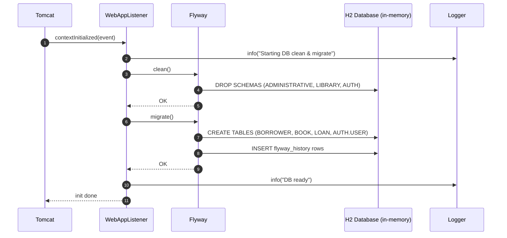
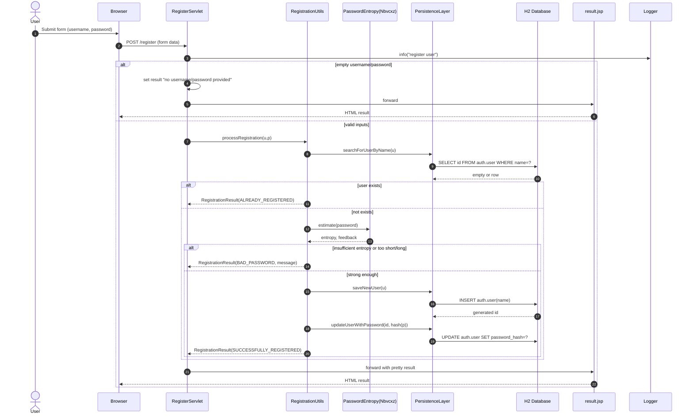
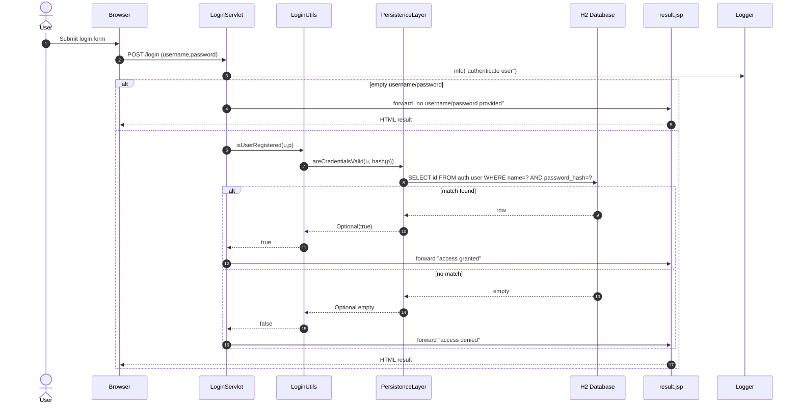
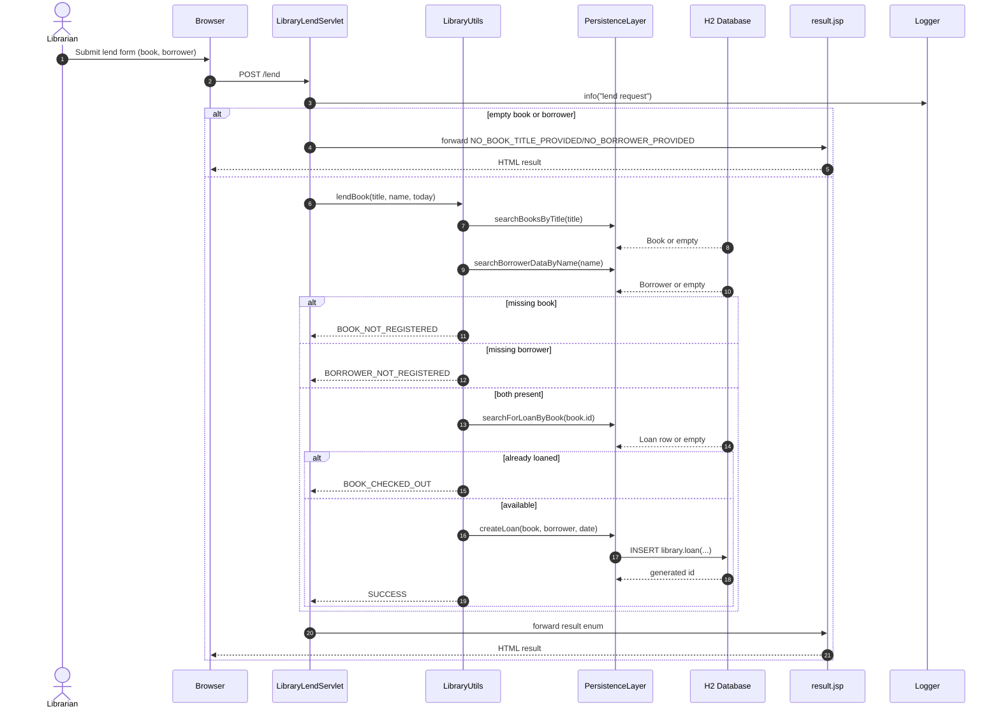
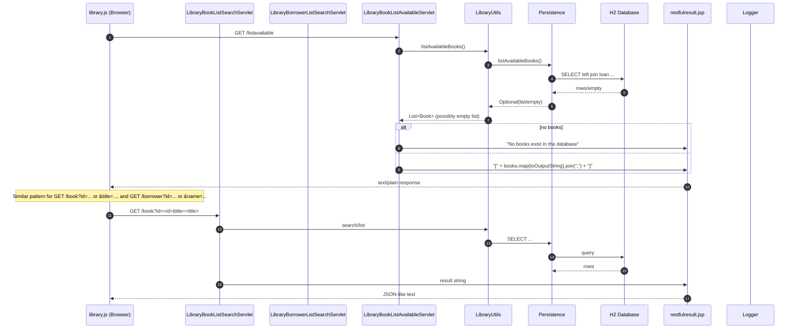
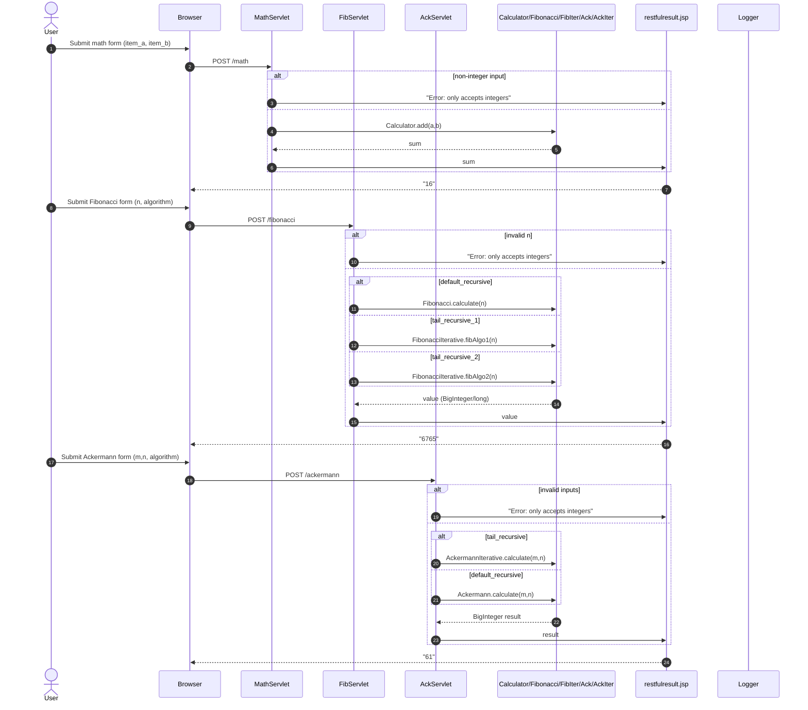

# Runtime Interaction Flows and Sequence Diagrams

Below are the key dynamic workflows of the system with their sequence diagrams, purposes, triggers, communication patterns, data and error flows.

---

## 1) Application Startup and Database Initialization

Purpose and triggers:
- Trigger: Tomcat starts the webapp; ServletContextListener (WebAppListener) initializes the H2 DB schema on startup using Flyway.
- Goal: Ensure a clean, migrated DB schema before handling requests.

Communication patterns:
- Event trigger: ServletContextListener.contextInitialized
- DB ops: Flyway clean/migrate (DDL)
- Logging via SLF4J/Log4j2



Error handling:
- Any Flyway failure throws runtime exception; Tomcat logs failures; app fails to initialize.

---

## 2) Register Librarian (POST /register)

Purpose and triggers:
- Trigger: User submits registration form on /demo/library.html or API client posts to /demo/register.
- Goal: Create a new user with a secure password.

Communication patterns:
- HTTP POST (form-encoded)
- Server-side rendering forward to result.jsp
- Business logic in RegistrationUtils
- DB access via PersistenceLayer (JDBC)

Data flow:
- Input: username, password
- Processing: check existing user, password entropy (Nbvcxz), hash password (SHA-256), insert into auth.user
- Output: RegistrationResult pretty string



Error handling:
- Input validation: empty username/password short-circuits with messages.
- Entropy check returns BAD_PASSWORD with explanation.
- SQL exceptions wrapped in SqlRuntimeException; servlet still forwards and logs.

---

## 3) Login (POST /login)

Purpose and triggers:
- Trigger: User submits login form or API client posts to /demo/login.
- Goal: Validate credentials against stored hash.

Communication patterns:
- HTTP POST
- Business logic in LoginUtils
- DB via PersistenceLayer
- Server-side forward to result.jsp

Data flow:
- Input: username, password
- Processing: hash password; query auth.user for match
- Output: "access granted" or "access denied"



Error handling:
- Empty inputs → explicit message.
- Exceptions in persistence wrapped/logged; servlet forwards with appropriate message.

---

## 4) Lend a Book (POST /lend)

Purpose and triggers:
- Trigger: Librarian submits lending form or API client posts to /demo/lend.
- Goal: Create a LOAN record if book is registered and not already loaned and borrower is registered.

Communication patterns:
- HTTP POST
- Business logic in LibraryUtils
- DB via PersistenceLayer (search & insert)

Data flow:
- Input: book title, borrower name; current date
- Processing: find book & borrower; check outstanding loan; insert loan
- Output: LibraryActionResults (SUCCESS, BOOK_CHECKED_OUT, BOOK_NOT_REGISTERED, BORROWER_NOT_REGISTERED, NO_*_PROVIDED)



Error handling:
- Missing inputs → explicit enums.
- Data constraints enforced at service level; DB exceptions wrapped.

---

## 5) Book and Borrower Listing and Search (GET /book, /borrower, /listavailable)

Purpose and triggers:
- Trigger: Browser XHR (library.js) on page load to improve UX (dropdown/autocomplete), or manual API usage.
- Goal: Return JSON-like string of books/borrowers (or error messages) for listing, search by id/name/title, and listing available books.

Communication patterns:
- HTTP GET with query params
- RESTful forward to restfulresult.jsp (text body)
- Business logic in LibraryUtils
- DB via PersistenceLayer (SELECT queries)

Data flow:
- Input: id/title for /book; id/name for /borrower; none for /listavailable
- Output: JSON-like array of objects or human-readable message



Error handling:
- If both id and title (or id and name) are provided → "Error: please search by either ...".
- Invalid id parse → error message.
- No results → "No ... found ..." messages.

Event-driven UX:
- library.js onload performs XHR calls.
- Based on result sizes, it renders:
  - locked input (no data),
  - dropdown (1–9 items),
  - autocomplete (>=10 items) with keyup listeners and click handlers.

---

## 6) Math and Algorithms (POST /math, /fibonacci, /ackermann)

Purpose and triggers:
- Trigger: From endpoint catalog forms or automated API tests.
- Goal: Compute arithmetic/Fibonacci/Ackermann values with selectable algorithms.

Communication patterns:
- HTTP POST
- RESTful forward to restfulresult.jsp
- Pure compute, no DB.



Error handling:
- NumberFormatException → user-friendly error text.

---

## 7) Desktop App Automation (Auto Insurance UI over TCP)

Purpose and triggers:
- Trigger: Test client DesktopTester/AutoInsuranceScriptClient automates Swing UI via TCP control server.
- Goal: Set inputs, click “Crunch”, read label; verify business logic via AutoInsuranceProcessor.

Communication patterns:
- TCP socket (port 8000)
- Commands: "set age X", "set claims Y", "click calculate", "get label", "quit"
- No DB; pure in-process computation.

Data flow:
- Input: age, claims
- Processing: AutoInsuranceProcessor.process(claims, age)
- Output: label with premium increase, warning letter, cancel flag

```mermaid
sequenceDiagram
    autonumber
    actor Test as DesktopTester
    participant Client as ScriptClient (TCP)
    participant Server as AutoInsuranceScriptServer
    participant UI as AutoInsuranceUI (Swing)
    participant Processor as AutoInsuranceProcessor

    Test->>Client: send("set age 22")
    Client->>Server: TCP "set age 22"
    Server->>UI: setClaimsAge("22")
    Server-->>Client: "OK"

    Test->>Client: send("set claims 1")
    Client->>Server: TCP "set claims 1"
    Server->>UI: setPreviousClaims(1)
    Server-->>Client: "OK"

    Test->>Client: send("click calculate")
    Client->>Server: TCP "click calculate"
    Server->>UI: claimsCalcButton.doClick()
    UI->>Processor: process(claims=1, age=22)
    Processor-->>UI: AutoInsuranceAction(premium=100, LTR1, false)
    UI->>UI: label.setText("Premium increase: $100 ...")
    Server-->>Client: "OK"

    Test->>Client: send("get label")
    Client->>Server: TCP "get label"
    Server->>UI: read label.getText()
    Server-->>Client: "Premium increase: $100 Warning Ltr: LTR1 is canceled: false"

    Test->>Client: send("quit")
    Client->>Server: TCP "quit"
    Server-->>Client: "OK"; stop loop
```

Error handling:
- Invalid claim selection throws InvalidClaimsException in UI; server wraps to "FAILURE".

---

## 8) UI Autocomplete/Dropdown Behavior (library.js)

Purpose and triggers:
- Trigger: On page load, JavaScript fetches data to enhance lending fields UX; user keyup/click drives live filtering and selection.
- Goal: UX improvement: locked input (no data), dropdown (1–9 items), autocomplete (≥10 items).

Communication patterns:
- Browser event-driven listeners (keyup, click, blur)
- AJAX via XMLHttpRequest: GET /listavailable and GET /borrower
- DOM manipulations (searchbox, list items, click handlers)

```mermaid
sequenceDiagram
    autonumber
    participant Browser
    participant JS as library.js
    participant Avail as /listavailable (Servlet)
    participant Borrower as /borrower (Servlet)
    participant JSP as restfulresult.jsp

    Browser->>JS: window.onload
    JS->>Avail: XHR GET
    Avail->>JSP: write books JSON-like
    JSP-->>JS: response text
    JS->>JS: parse; choose widget (lock/dropdown/autocomplete)

    JS->>Borrower: XHR GET
    Borrower->>JSP: write borrowers JSON-like
    JSP-->>JS: response text
    JS->>JS: parse; render widget

    Browser->>JS: keyup in input
    JS->>JS: filter dataset; render <li> results
    Browser->>JS: click on <li>
    JS->>Browser: set input.value to selected; close searchbox
```

Error handling:
- Failed JSON parse is ignored (input locked).
- Escape for JSON applied for embedded quotes in names/titles.

---

## 9) Database Reset API (GET /flyway)

Purpose and triggers:
- Trigger: Tests and pipeline call to reset state; library.html buttons call it too.
- Goal: Clean and/or migrate DB during tests/demo.

Communication patterns:
- HTTP GET
- DbServlet routes to PersistenceLayer.clean/migrate/cleanAndMigrate
- Forward to result.jsp with status

```mermaid
sequenceDiagram
    autonumber
    actor Tester
    participant BrowserOrTest
    participant DbServlet
    participant Persistence
    participant Flyway
    participant H2DB
    participant JSP as result.jsp

    Tester->>BrowserOrTest: Request "clean/migrate" or default
    BrowserOrTest->>DbServlet: GET /flyway?action=clean|migrate|<empty>
    alt action=clean
        DbServlet->>Persistence: cleanDatabase()
        Persistence->>Flyway: clean()
        DbServlet->>JSP: "cleaned"
    else action=migrate
        DbServlet->>Persistence: migrateDatabase()
        Persistence->>Flyway: migrate()
        DbServlet->>JSP: "migrated"
    else default
        DbServlet->>Persistence: cleanAndMigrateDatabase()
        Persistence->>Flyway: clean(); migrate()
        DbServlet->>JSP: "cleaned and migrated"
    end
    JSP-->>BrowserOrTest: HTML result
```

---

## 10) CI/CD Pipeline Orchestration (Jenkinsfile)

Purpose and triggers:
- Trigger: Push to repo (post-receive hook) or manual run.
- Goal: Build, test (unit/integration/BDD/API/UI), analyze (SonarQube, DependencyCheck), perf test (JMeter), security proxy (ZAP), mutation test (Pitest), docs, deploy.

Communication patterns:
- Jenkins pipeline stages invoking Gradle tasks
- Deploy to local Tomcat (Windows local task; app must be running for API/UI tests)
- API/UI tests via Python/Selenium (optionally through ZAP proxy)
- SonarQube analysis (sonarqube; checkQualityGate)
- ZAP report collected via HTTP through proxy
- JUnit reports published per stage

```mermaid
sequenceDiagram
    autonumber
    actor Dev as Developer
    participant Git as Git (fake central repo)
    participant Jenkins
    participant Gradle
    participant Tomcat as Test Tomcat
    participant App as Demo App
    participant Sonar as SonarQube
    participant ZAP as OWASP ZAP Proxy
    participant JMeter
    participant Reports as Reports/Artifacts

    Dev->>Git: git push
    Git-->>Jenkins: post-receive hook triggers build
    Jenkins->>Gradle: clean assemble (Build)
    Jenkins->>Gradle: test (Unit Tests)
    Jenkins->>Reports: publish JUnit

    Jenkins->>Gradle: integrate (DB Tests)
    Jenkins->>Reports: publish JUnit

    Jenkins->>Gradle: generateCucumberReports + jacocoTestReport (BDD Tests)
    Jenkins->>Reports: Cucumber + JUnit + Jacoco

    Jenkins->>Gradle: sonarqube (Static Analysis)
    Gradle->>Sonar: submit
    Jenkins->>Gradle: checkQualityGate

    Jenkins->>Gradle: deployToTestWindowsLocal (Deploy to Test)
    Gradle->>Tomcat: deploy WAR
    Tomcat->>App: start
    Jenkins->>Gradle: waitForHeartBeat
    Jenkins->>Pipenv: install py deps
    Jenkins->>ZAP: newSession via proxy
    note right of ZAP: Proxy listens on 9888

    Jenkins->>Gradle: runApiTests (Python requests)
    Gradle->>App: REST calls (via ZAP proxy if configured)
    Jenkins->>Reports: publish API JUnit

    Jenkins->>Gradle: runBehaveTests + generateCucumberReport (UI BDD)
    Gradle->>App: Selenium UI through Chrome (optionally proxied)
    Jenkins->>Reports: publish BDD UI JUnit + Cucumber

    Jenkins->>Gradle: Java UI tests
    Gradle->>App: Selenium (Chrome/HtmlUnit)
    Jenkins->>Reports: publish JUnit

    Jenkins->>Gradle: dependencyCheckAnalyze (Security)
    Jenkins->>Reports: DependencyCheck report

    Jenkins->>Gradle: runPerfTests (JMeter)
    Gradle->>JMeter: execute test plan
    Jenkins->>Reports: perf report

    Jenkins->>Gradle: pitest (Mutation)
    Jenkins->>Reports: Pitest report

    Jenkins->>Gradle: javadoc (Docs)

    Jenkins->>ZAP: fetch htmlreport via proxy
    ZAP-->>Jenkins: zap-report.html
    Jenkins->>Reports: archive

    Jenkins-->>Dev: Pipeline OK; Deploy to Prod (token sleep)
```

Error handling:
- Stage failures abort downstream stages.
- ZAP, SonarQube require services up; quality gate enforced.

---

# Notes on Communication and Error/Recovery Patterns

- Synchronous calls: All servlets invoke synchronous business logic and JDBC operations. Browser XHRs are async at the client but handled synchronously server-side.
- Asynchronous/event-driven:
  - Browser UI uses event listeners (keyup/click/blur) to render searchboxes.
  - ServletContextListener acts on app lifecycle events.
  - Jenkins pipeline orchestrates sequential stages but overall is event-triggered by Git push.
- Message flows:
  - REST endpoints return text (via restfulresult.jsp) or HTML (result.jsp).
  - Desktop automation uses raw TCP messages and plain-text responses.
- Error handling:
  - Input validation at servlet/business layers (empty strings, parsing errors).
  - Business rule violations return explicit enums/messages.
  - Persistence exceptions are wrapped as SqlRuntimeException; servlet utilities catch forward exceptions and log errors without crashing the container.
- Data flows:
  - Authentication: username/password → entropy check → SHA-256 hash → auth.user table.
  - Library: title/name lookups → book/borrower IDs → loan creation with date.
  - UI lists: server emits JSON-like strings with escaped values to be safe for parsing/rendering.