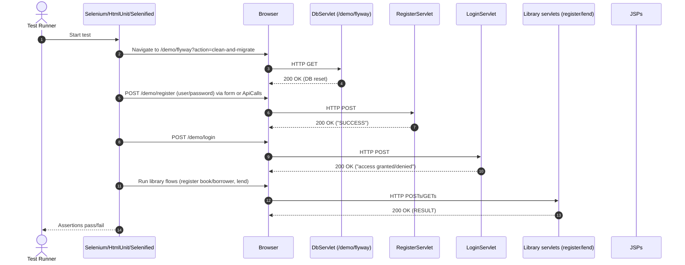

## Workflow 1: Library circulation – register book/borrower and lend book

```mermaid
sequenceDiagram
  autonumber
  actor User
  participant Browser
  participant RB as LibraryRegisterBookServlet
  participant RBr as LibraryRegisterBorrowerServlet
  participant Lend as LibraryLendServlet
  participant Svc as LibraryUtils (service)
  participant Port as IPersistenceLayer (port)
  participant Repo as PersistenceLayer (JDBC/H2)
  database DB as H2 Database
  participant View as JSP (RESULT_JSP)
  participant Fwd as ServletUtils

  rect rgb(240,240,255)
    User->>Browser: Submit "Register Book" form (POST /demo/registerbook)
    Browser->>RB: HTTP POST (book=title)
    RB->>RB: normalize / validate input
    RB->>Svc: registerBook(title)
    Svc->>Port: searchBookByTitle(title)
    Port->>Repo: searchBookByTitle
    Repo->>DB: SELECT book by title
    DB-->>Repo: 0 or 1 row
    Repo-->>Port: Optional<Book>
    alt not found
      Svc->>Port: saveBook(title)
      Port->>Repo: INSERT book
      Repo->>DB: INSERT ...; SELECT generated id
      DB-->>Repo: new id
      Repo-->>Port: Book
      Svc-->>RB: LibraryActionResults.SUCCESS
    else already exists
      Svc-->>RB: LibraryActionResults.ALREADY_REGISTERED_BOOK
    end
    RB->>Fwd: forwardToResult(request with RESULT, return_page)
    Fwd-->>View: dispatch
    View-->>Browser: 200 OK (SUCCESS/ALREADY_REGISTERED_BOOK)
  end

  rect rgb(240,240,255)
    User->>Browser: Submit "Register Borrower" form (POST /demo/registerborrower)
    Browser->>RBr: HTTP POST (borrower=name)
    RBr->>RBr: normalize / validate input
    RBr->>Svc: registerBorrower(name)
    Svc->>Port: searchBorrowerByName(name)
    Port->>Repo: SELECT borrower by name
    Repo->>DB: SELECT ...
    DB-->>Repo: 0 or 1 row
    alt not found
      Svc->>Port: saveBorrower(name)
      Port->>Repo: INSERT borrower
      Repo->>DB: INSERT ...
      Repo-->>Port: Borrower
      Svc-->>RBr: LibraryActionResults.SUCCESS
    else already exists
      Svc-->>RBr: LibraryActionResults.ALREADY_REGISTERED_BORROWER
    end
    RBr->>Fwd: forwardToResult(...)
    Fwd-->>View: dispatch
    View-->>Browser: 200 OK
  end

  rect rgb(240,255,240)
    User->>Browser: Submit "Lend Book" form (POST /demo/lend)
    Browser->>Lend: HTTP POST (book, borrower)
    Lend->>Lend: normalize / validate input; get SQL Date(now)
    Lend->>Svc: lendBook(borrowerName, bookTitle, sqlDate)
    Svc->>Port: searchBorrowerByName
    Port->>Repo: SELECT borrower
    Repo->>DB: SELECT ...
    DB-->>Repo: 0 or 1 row
    alt borrower not found
      Svc-->>Lend: LibraryActionResults.BORROWER_NOT_REGISTERED
    else borrower found
      Svc->>Port: searchBookByTitle
      Port->>Repo: SELECT book
      Repo->>DB: SELECT ...
      DB-->>Repo: 0 or 1 row
      alt book not found
        Svc-->>Lend: LibraryActionResults.BOOK_NOT_REGISTERED
      else book found
        Svc->>Port: findLoanByBook(bookId)
        Port->>Repo: SELECT loan WHERE book_id = ? AND active
        Repo->>DB: SELECT ...
        DB-->>Repo: loan or none
        alt loan exists
          Svc-->>Lend: LibraryActionResults.BOOK_CHECKED_OUT
        else available
          Svc->>Port: createLoan(bookId, borrowerId, sqlDate)
          Port->>Repo: INSERT loan
          Repo->>DB: INSERT ...
          Repo-->>Port: Loan
          Svc-->>Lend: LibraryActionResults.SUCCESS
        end
      end
    end
    Lend->>Fwd: forwardToResult(...)
    Fwd-->>View: dispatch
    View-->>Browser: 200 OK (SUCCESS or specific error)
  end
```

- Purpose and triggers: End-user registers catalog items and borrowers, then lends a book. Triggered by POSTs from HTML forms.
- Communication patterns:
  - HTTP REST-like POSTs to servlets
  - Synchronous in-process service calls (LibraryUtils)
  - Synchronous JDBC via IPersistenceLayer/PersistenceLayer to H2
  - View forwarding via ServletUtils to JSP
  - Data modeled with immutable domain objects and LibraryActionResults enums
- Error handling:
  - Input validation in servlets; missing fields return specific LibraryActionResults (e.g., NO_BOOK_TITLE_PROVIDED)
  - Conflict checks (duplicate book/borrower; book already checked out)
  - JDBC errors wrapped in SqlRuntimeException inside PersistenceLayer, not shown to UI (controllers handle with generic RESULT messaging)


## Workflow 2: Authentication – register with password policy and login

```mermaid
sequenceDiagram
  autonumber
  actor User
  participant Browser
  participant RegS as RegisterServlet
  participant RegU as RegistrationUtils
  participant Port as IPersistenceLayer
  participant Repo as PersistenceLayer
  participant Pwd as Nbvcxz (password strength)
  database DB as H2
  participant View as JSP (RESULT_JSP)
  participant Fwd as ServletUtils
  participant LogS as LoginServlet
  participant LogU as LoginUtils

  rect rgb(255,248,240)
    User->>Browser: Submit registration (POST /demo/register)
    Browser->>RegS: HTTP POST (username, password)
    RegS->>RegU: processRegistration(username, password)
    alt empty username or password
      RegU-->>RegS: RegistrationResult(EMPTY_*), PasswordResult(EMPTY_PASSWORD)
    else non-empty
      RegU->>Port: findUserByName(username)
      Port->>Repo: SELECT user by name
      Repo->>DB: SELECT ...
      DB-->>Repo: 0 or 1 row
      alt user exists
        RegU-->>RegS: RegistrationResult(ALREADY_REGISTERED)
      else new user
        RegU->>Pwd: evaluate strength/entropy
        Pwd-->>RegU: PasswordResult(SUCCESS or INSUFFICIENT_ENTROPY/TOO_SHORT/TOO_LONG)
        alt password weak
          RegU-->>RegS: RegistrationResult(BAD_PASSWORD) + PasswordResult(why)
        else strong password
          RegU->>Port: createUser(username)
          Port->>Repo: INSERT user
          Repo->>DB: INSERT ...
          Repo-->>Port: User
          RegU->>Port: setPasswordHash(userId, SHA-256(password))
          Port->>Repo: UPDATE user_password_hash
          Repo->>DB: UPDATE ...
          RegU-->>RegS: RegistrationResult(SUCCESSFULLY_REGISTERED)
        end
      end
    end
    RegS->>Fwd: forwardToResult(request attrs incl. RESULT)
    Fwd-->>View: dispatch
    View-->>Browser: 200 OK (message + status)
  end

  rect rgb(240,255,255)
    User->>Browser: Submit login (POST /demo/login)
    Browser->>LogS: HTTP POST (username, password)
    LogS->>LogU: isUserRegistered(username, password)
    LogU->>Port: areCredentialsValid(username, passwordHash)
    Port->>Repo: SELECT hash, compare SHA-256
    Repo->>DB: SELECT ...
    DB-->>Repo: hash row
    Repo-->>Port: Optional<Boolean>
    LogU-->>LogS: boolean (true/false)
    alt valid
      LogS->>Fwd: forwardToResult("access granted")
    else invalid
      LogS->>Fwd: forwardToResult("access denied")
    end
    Fwd-->>View: dispatch
    View-->>Browser: 200 OK
  end
```

- Purpose and triggers: Secure user onboarding and access control. Triggered by POSTs to /demo/register and /demo/login.
- Communication patterns:
  - HTTP POST to servlets
  - Synchronous orchestration in RegistrationUtils/LoginUtils
  - Password strength evaluation via Nbvcxz library
  - JDBC via IPersistenceLayer/PersistenceLayer (user existence, insert/update, credential checks)
  - JSP forwarding with standardized RESULT messaging
- Error handling:
  - Typed outcomes via RegistrationResult, PasswordResult, and boolean from LoginUtils
  - Weak or invalid passwords flagged with explicit PasswordResultEnums
  - Duplicate-username prevention
  - No sensitive data logged; note remediation needed to avoid putting plaintext password in request attributes


## Workflow 3: Search/list – list available books (REST-like GET)

```mermaid
sequenceDiagram
  autonumber
  actor User
  participant Browser
  participant S as LibraryBookListAvailableServlet
  participant Svc as LibraryUtils
  participant Port as IPersistenceLayer
  participant Repo as PersistenceLayer
  database DB as H2
  participant Fwd as ServletUtils
  participant View as JSP (RESTFUL_RESULT_JSP)

  User->>Browser: View available books (GET /demo/books/available)
  Browser->>S: HTTP GET
  S->>Svc: listAvailableBooks()
  Svc->>Port: listAvailableBooks()
  Port->>Repo: SELECT books LEFT JOIN loans WHERE not checked out
  Repo->>DB: SELECT ...
  DB-->>Repo: rows (0..n)
  Repo-->>Port: List<Book>
  Port-->>Svc: List<Book>
  Svc-->>S: List<Book>
  S->>S: format JSON-like output "[{Title:'..',Id:..}, ...]" or "no books available"
  S->>Fwd: forwardToRestfulResult(request.RESULT)
  Fwd-->>View: dispatch
  View-->>Browser: 200 OK (body is serialized list/message)
```

- Purpose and triggers: Read-only discovery of inventory availability; triggered by HTTP GET.
- Communication patterns: HTTP GET, synchronous service call, JDBC query, JSP forwarding to RESTFUL_RESULT_JSP.
- Error handling: Empty results mapped to a clear human-readable message; invalid query parameters are validated and surfaced via RESULT attribute in other search servlets similarly.


## Workflow 4: Database lifecycle – deterministic environment via startup listener and admin servlet

```mermaid
sequenceDiagram
  autonumber
  participant Ctx as ServletContainer
  participant L as WebAppListener
  participant Port as IPersistenceLayer
  participant Repo as PersistenceLayer
  participant Fly as Flyway
  database DB as H2

  rect rgb(245,255,245)
    Ctx-->>L: contextInitialized (startup event)
    L->>Port: cleanAndMigrateDatabase()
    Port->>Repo: cleanAndMigrateDatabase()
    Repo->>Fly: clean()
    Fly->>DB: DROP ALL OBJECTS
    DB-->>Fly: OK
    Repo->>Fly: migrate()
    Fly->>DB: APPLY migrations
    DB-->>Fly: OK
    Fly-->>Repo: Done
    Repo-->>Port: Done
  end
```

```mermaid
sequenceDiagram
  autonumber
  actor Tester
  participant Browser
  participant Admin as DbServlet (/demo/flyway)
  participant Port as IPersistenceLayer
  participant Repo as PersistenceLayer
  participant Fly as Flyway
  database DB as H2

  Tester->>Browser: Reset DB
  Browser->>Admin: HTTP GET /demo/flyway?action=clean-and-migrate
  alt action=clean
    Admin->>Port: cleanDatabase()
  else action=migrate
    Admin->>Port: migrateDatabase()
  else default/clean-and-migrate
    Admin->>Port: cleanAndMigrateDatabase()
  end
  Port->>Repo: delegate
  Repo->>Fly: run selected action(s)
  Fly->>DB: DDL/seed
  DB-->>Fly: OK
  Fly-->>Repo: OK
  Repo-->>Admin: OK
  Admin-->>Browser: 200 OK (result message)
```

- Purpose and triggers:
  - Startup: Event-driven DB reset/migration for deterministic demos/tests
  - On-demand: Manual/automated reset via /demo/flyway used by UI tests and BDD
- Communication patterns:
  - Event-driven container callback (contextInitialized)
  - HTTP GET admin endpoint to trigger Flyway actions
  - Synchronous Flyway operations against H2
- Error handling: Fail-fast in persistence layer; exceptions bubble as runtime for ops visibility; admin servlet presents simple status messages.


## Workflow 5: Mathematics – Fibonacci servlet with algorithm selection

```mermaid
sequenceDiagram
  autonumber
  actor User
  participant Browser
  participant FibS as FibServlet
  participant FibR as Fibonacci (recursive)
  participant FibI as FibonacciIterative (algo1/algo2)
  participant Fwd as ServletUtils
  participant View as JSP (RESTFUL_RESULT_JSP)

  User->>Browser: Compute Fibonacci (POST /demo/fib)
  Browser->>FibS: HTTP POST (fib_param_n, fib_algorithm_choice)
  FibS->>FibS: parse n; select algorithm
  alt choice=algo1 (fast-doubling)
    FibS->>FibI: fibAlgo1(n) : BigInteger
  else choice=algo2 (iterative)
    FibS->>FibI: fibAlgo2(n) : BigInteger
  else default
    FibS->>FibR: calculate(n) : long (small n)
  end
  FibS->>FibS: put result in request
  FibS->>Fwd: forwardToRestfulResult
  Fwd-->>View: dispatch
  View-->>Browser: 200 OK (result)
  opt invalid input
    FibS->>FibS: set RESULT to error message
    FibS->>Fwd: forwardToRestfulResult
  end
```

- Purpose and triggers: Educational compute endpoints; triggered by POST with algorithm choice parameter.
- Communication patterns: HTTP POST to servlet, in-process algorithm calls, JSP forwarding. No DB.
- Error handling: Parse failures set error messages; forwarding exceptions logged and swallowed in tests.


## Workflow 6: Auto-insurance demo – desktop UI and scriptable automation

```mermaid
sequenceDiagram
  autonumber
  actor User as Desktop User
  participant UI as AutoInsuranceUI (Swing)
  participant Proc as AutoInsuranceProcessor (pure rules)
  participant Label as UI Label
  participant Script as Script Server Thread
  participant Tester as DesktopTester
  participant Client as AutoInsuranceScriptClient
  participant TCP as TCP Socket

  par UI interaction (synchronous on EDT)
    User->>UI: Enter age/claims; click "Crunch"
    UI->>Proc: process(claims, age)
    Proc-->>UI: AutoInsuranceAction
    UI->>Label: setText("premium + warning/cancel state")
  and Scripted automation (asynchronous over TCP)
    UI->>Script: start server (background thread)
    Tester->>Client: setAge(30)
    Client->>TCP: CONNECT localhost:8000; SEND "SET_AGE 30"
    Script-->>TCP: "OK"
    Tester->>Client: setClaims(2)
    Client->>TCP: SEND "SET_CLAIMS 2"
    Script-->>TCP: "OK"
    Tester->>Client: clickCalculate()
    Client->>TCP: SEND "CRUNCH"
    Script->>Proc: process(claims, age)
    Proc-->>Script: AutoInsuranceAction
    Script-->>TCP: "LABEL Premium:+$X, Warning:LTRn, Cancel:false"
    Tester->>Client: getLabel()
    Client->>TCP: SEND "GET_LABEL"; RECEIVE label
    Tester-->>User: Assert expected label
    Tester->>Client: quit()
    Client->>TCP: SEND "QUIT"; CLOSE
  end
```

- Purpose and triggers: Demonstrate functional-core/imperative-shell via desktop UI and a scriptable automation port.
- Communication patterns:
  - In-process synchronous calls (UI -> Processor)
  - Asynchronous background thread hosting a simple TCP command server
  - TCP client/server message exchange for automation (single-line commands/responses)
- Error handling: Processor returns canonical error AutoInsuranceAction for invalid inputs; client logs network errors without propagating; UI tests assert deterministic label rendering.


## Workflow 7: Persistence execution pattern – SQL command, mapping, and error wrapping

```mermaid
sequenceDiagram
  autonumber
  participant Svc as Service (LibraryUtils/RegistrationUtils/LoginUtils)
  participant Port as IPersistenceLayer
  participant Repo as PersistenceLayer
  participant DS as DataSource
  participant Conn as JDBC Connection
  participant PS as PreparedStatement
  participant RS as ResultSet
  participant SD as SqlData (sql+params+extractor)
  database DB as H2
  participant Err as SqlRuntimeException

  Svc->>Port: someOperation(args)
  Port->>Repo: delegate
  Repo->>Repo: build SqlData(description, sql, params, extractor)
  Repo->>DS: getConnection()
  DS-->>Repo: Connection
  Repo->>Conn: prepareStatement(sql)
  Conn-->>Repo: PreparedStatement
  Repo->>SD: applyParametersToPreparedStatement(PS)
  SD-->>Repo: bound statement
  Repo->>PS: executeQuery()/executeUpdate()
  PS->>DB: run SQL
  DB-->>PS: rows/row count
  PS-->>Repo: RS / count
  alt query
    Repo->>SD: extractor.apply(RS)
    SD-->>Repo: Optional<Domain>
    Repo-->>Port: result
  else update/insert
    Repo-->>Port: Domain/count
  end
  Port-->>Svc: mapped result
  opt SQLException
    PS-->>Repo: throws SQLException
    Repo->>Repo: wrap in SqlRuntimeException
    Repo-->>Svc: throw Err
    Svc->>Svc: log + convert to enum/result as needed
  end
```

- Purpose: Show common persistence flow used by all features.
- Communication patterns: Synchronous JDBC with prepared statements and typed parameter binding; functional extractors map RS to domain objects.
- Error handling: SQLException wrapped into SqlRuntimeException; services translate to typed results or allow propagation for admin paths.


## Workflow 8: End-to-end UI automation – deterministic test runs



- Purpose and triggers: CI-friendly smoke/regression tests verify critical flows with clean state.
- Communication patterns: HTTP calls through real/headless browsers; DB reset via admin servlet; optional direct backend POSTs via thin ApiCalls helper.
- Error handling: Assertions on concise UI signals (“SUCCESS”, “access granted”); flyway endpoint ensures isolation/recovery between scenarios.