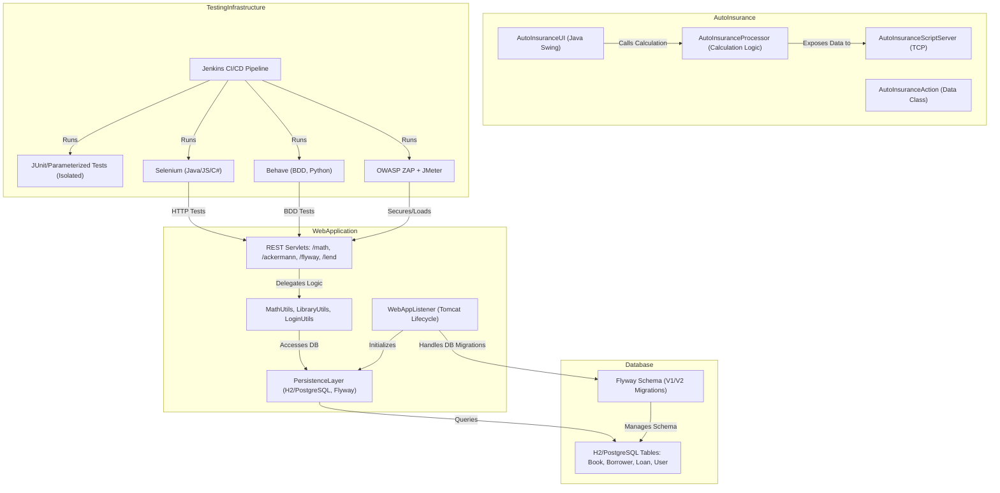

<think>
Okay, I need to generate a component-level architecture diagram using Mermaid in graph TB syntax. Let me start by identifying the key components from the codebase summary provided.

Looking at the codebase, there's the AutoInsurance application which includes UI, Processor, and a TCP server for automation. Then there's the Web Application with various REST endpoints like math, ackermann, flyway, etc. The Web Application also has a Persistence Layer and a WebAppListener. The Testing Infrastructure includes Jenkins CI/CD, Unit Tests, Integration Tests, UI Tests with Selenium, and Behave Tests. The Database involves H2/PostgreSQL with Flyway migrations. There are components for Business Logic, such as MathUtils, LibraryUtils, and LoginUtils. The core components are connected through HTTP/S and TCP interactions based on their responsibilities.

Now, to structure this in Mermaid, the components need to be nodes and the interactions as links. I should organize the components into clusters where each cluster represents a major component group. For example, the Web Application can be a cluster containing Servlets, Persistence Layer, and WebAppListener. The Testing Infrastructure can be another cluster. The AutoInsurance application and Database can be other clusters or standalone nodes.

Interactions like the Web Application using the Persistence Layer for database access should be directional arrows. The Testing Infrastructure would interact with the Web Application and AutoInsurance components through various tests. The Business Logic components would communicate with the Web Application's Servlets and the AutoInsurance components.

I need to make sure all key components and their interactions are captured. Also, labels on the arrows should indicate the nature of the communication, such as HTTP/S for REST endpoints and TCP for the UI automation server.

Let me start drafting the Mermaid diagram, ensuring that each component is properly named and grouped, and the interactions are correctly directed with appropriate labels. After that, I'll write a rationale that explains the component boundaries and communication patterns based on the diagram.
</think>

### Rationale
The component boundaries reflect functional separation between the auto insurance desktop app (with UI and business logic), the web app (REST services and database interactions), testing infrastructure, and shared persistence. Key interactions include HTTP/S-based communication between servlets and business logic, database access through Flyway-managed schemas, and testing orchestration via Jenkins. TCP communication is used in the auto insurance UI for automation, while Flyway enforces schema parity between test and prod environments.