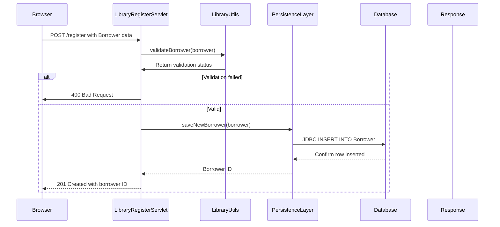

<think>
Okay, let's start by understanding the problem. The user wants a sequence diagram for a key user workflow involving the Web Application and Database components. The goal is to show how the components interact when a user registers for the library system.

First, I need to identify the key components involved in this workflow. Based on the architectural summary, the user interacts with the REST API (`/register` endpoint), which is handled by a servlet (`LibraryRegisterServlet`). This servlet would use `LibraryUtils` for business logic and the `PersistenceLayer` to interact with the database.

The database schema includes the `Borrower` table, so the step-by-step process would involve:
1. User sending a POST request to `/register`.
2. Servlet processing the request, generating a `Borrower` object.
3. Validation step (maybe using `LibraryUtils` to check for duplicate entries or password strength).
4. Using `PersistenceLayer` to insert a new borrower into the database.
5. Database committing the transaction.
6. Returning a success response to the user.

Next, I'll need to determine the communication patterns. The interaction from the browser to the servlet is HTTP (synchronous). The servlet to `LibraryUtils` is local method calls. The `PersistenceLayer` to DB uses JDBC (synchronous) and Flyway for schema management.

Now, thinking about sequences:
- The user (likely as an actor, but could be represented as an external system) sends an HTTP POST.
- The `LibraryRegisterServlet` receives the request and begins processing.
- It might call `LibraryUtils.validate()` to check the input.
- Then `PersistenceLayer.saveNewBorrower()` to insert data.
- The DB acknowledges the insert, and the servlet sends a response.

Possible error scenarios would include the persistence layer throwing exceptions if the DB transaction fails, but since the user asked for the main workflow, errors might be handled as alternatives and not included in the main sequence diagram.

For the sequence diagram in Mermaid, I need to define participants and their interactions. The main participants are the Browser, `LibraryRegisterServlet`, `LibraryUtils`, `PersistenceLayer`, and `Database`.

The flow should start with the Browser sending a POST to the servlet, then each step as messages between the components.

I'll make sure to label the HTTP methods and the nature of interactions (synchronous, JDBC call, schema management). Also, ensuring the main flow is forward and if there's any loop or error path, it's mentioned in the note.

Wait, but the user provided a codebase and expects me to generate the sequence diagram. The codebase includes REST APIs for registration, which is part of the Web Application. The architectural summary mentions the `/register` endpoint, the `PersistenceLayer` for DB operations, and Flyway for migrations. Also, the `User` model and password validation steps are part of this flow.

So, the workflow for registration would involve:
- HTTP POST to `/register`
- Servlet validation logic (e.g., checking password strength via `Nbvcxz`, ensuring unique borrower name)
- Saving to the `Borrower` table via `PersistenceLayer`
- Flyway ensuring the schema exists (but this is likely done on startup, so maybe not part of the actual workflow)

Therefore, the sequence diagram should focus on the request handling and DB insertion, not the Flyway migration step since that's a one-time setup.

Finally, I need to write the Mermaid code with the correct syntax and then the accompanying description explaining the workflow and communication patterns.
</think>

**Description**:
This workflow represents user registration for the library system via the `/register` REST endpoint. It begins with the browser submitting a `POST` request containing borrower details and password. The `LibraryRegisterServlet` validates the input using domain-specific rules (e.g., password strength via *Nbvcxz* and uniqueness checks). If validation passes, the servlet delegates to the `PersistenceLayer` to perform a JDBC transaction, inserting the new borrower into the `Borrower` table. The successful registration returns the assigned borrower ID to the client. 

**Communication Patterns**:
- **Synchronous**: Browser ↔ Servlet (HTTP POST), Servlet ↔ LibraryUtils (method call), Servlet ↔ PersistenceLayer (method call), PersistenceLayer ↔ Database (JDBC).
- **Database**: Transactional JDBC insert via `PersistenceLayer`. Flyway schema management is a one-time setup handled by `WebAppListener` on startup.