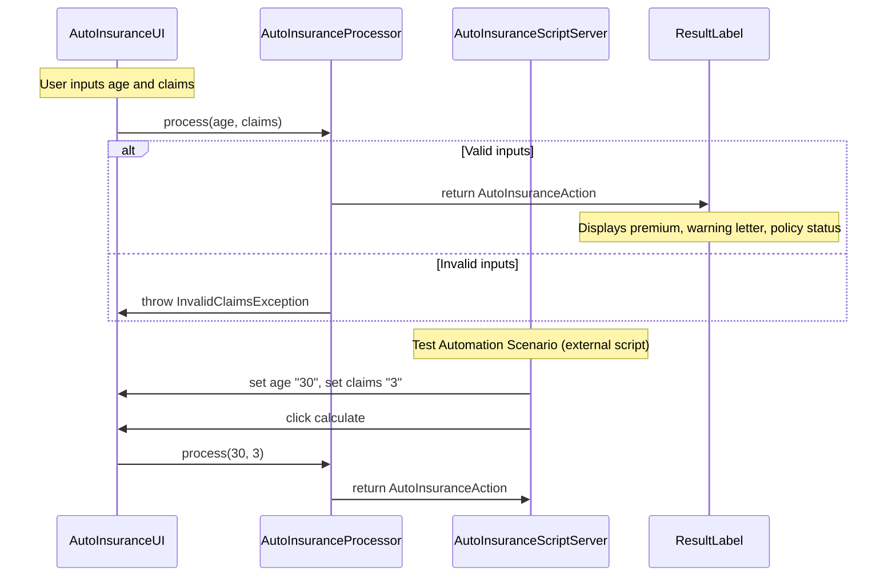
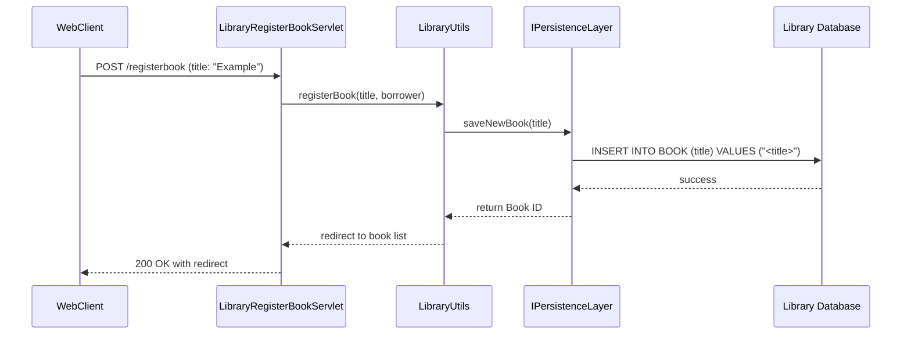
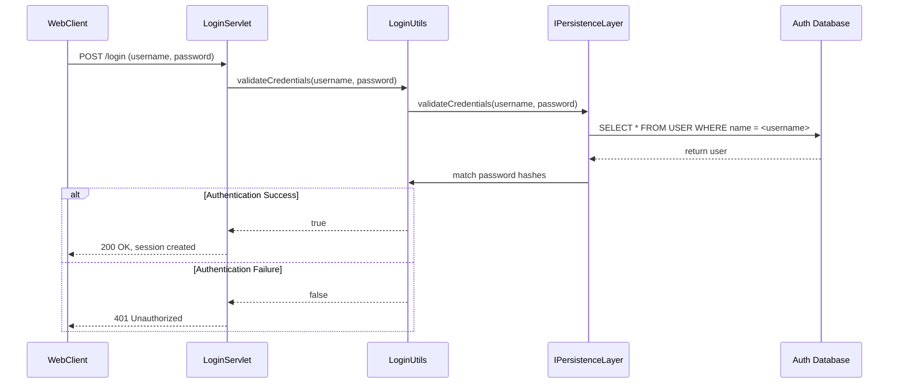
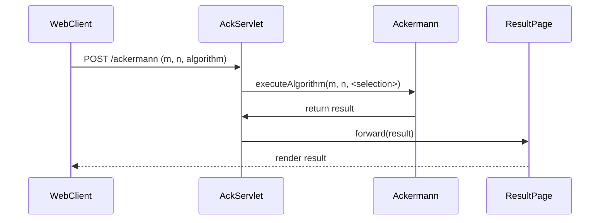
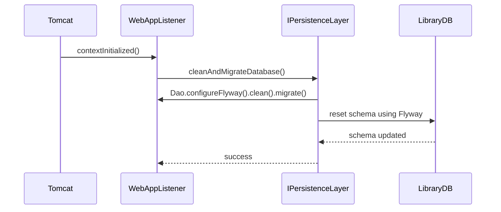
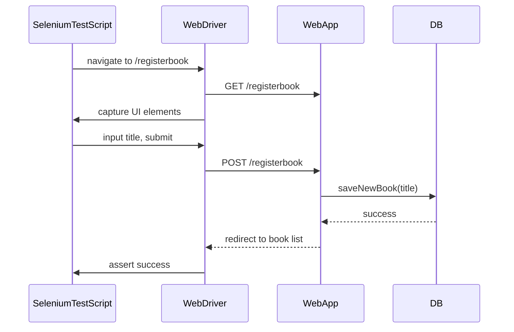
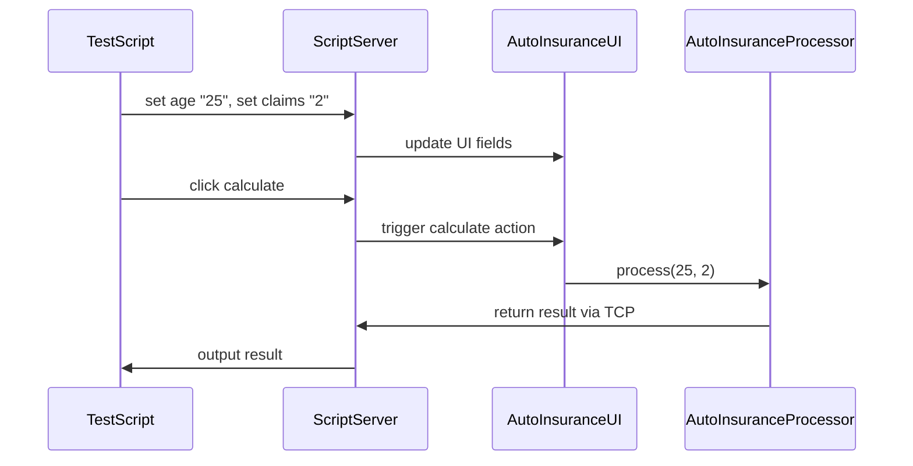

<think>
Okay, let's tackle this. I need to create dynamic interaction flows and sequence diagrams based on the provided codebase summary. The user wants key user workflows, inter-component communication patterns, data flow, event-driven interactions, error handling, etc. Alright, first, I should identify the major workflows mentioned in all the summaries.

From the first chunk, the desktop application has AutoInsuranceUI interacting with AutoInsuranceProcessor. Then there's the ScriptServer for UI testing. The second chunk talked about Jenkins pipelines with various stages and tools. The third and fourth chunks involved persistence layers, database schemas, and servlets handling math operations and library management. The fifth chunk included UI tests using Selenium and Behave.

I need to map out the key user interactions. Let's start with the insurance calculation workflow in the desktop app. The user inputs age and claims, the UI triggers the processor, which calculates the result. Then in the web application, there's the registration of a book borrower, which involves the servlet, utils, and persistence layer. Also, the math operations like Ackermann function.

For each workflow, I should define the sequence diagram, communication patterns, and data flow. Let's take the insurance calculation first. The components are UI, Processor, and the output. The communication is synchronous via method calls. Data flows from UI inputs to processor, then the result back.

Next, the book registration in the web app involves a servlet, utils, and persistence layer. The communication would be HTTP request to servlet, then synchronous calls to business logic and database. Data flows from the request to the database through these layers.

Math operations like Ackermann involve the servlet handling the HTTP POST, using business logic, and returning the result. It's similar to the insurance calculation but with different components.

Then, the testing workflows. The ScriptServer for desktop app testing and the Selenium tests for the web app. These use TCP or HTTP to send commands and receive responses. The data flow is from the test script to the server/UI, then the server/UI to the application components.

Error handling might involve exceptions in the processor or database operations. For example, invalid input in the insurance app would trigger an exception which is caught and displayed in the UI.

I need to make sure each sequence diagram captures these steps. Let's structure each major workflow with a Mermaid diagram, a description, and the communication patterns. Let me list the workflows again:

1. Insurance calculation in desktop app
2. Book registration in web app
3. User authentication in web app
4. Math operation (Ackermann) in web app
5. Database initialization on Tomcat startup
6. UI testing via Selenium for web app
7. Script-based testing for desktop app

Now, for each, I need to outline the components involved, their interactions, data flow, and communication types. Let me start drafting the first one.

For the insurance workflow, the UI component sends data to the processor. Processor does calculations and returns the result. The ScriptServer for tests sends TCP commands to manipulate the UI. Communication patterns are synchronous method calls and TCP. Data flows are the input parameters and result.

For book registration, the servlet receives an HTTP POST, delegates to the library utils, which interacts with the persistence layer. The persistence layer then communicates with the database. Synchronous calls via methods and JDBC.

The math operation is similar: HTTP POST to servlet, business logic processing, and response.

Testing workflows involve external scripts (Selenium, ScriptServer) sending commands or HTTP requests to trigger application actions and validate results.

I should also mention event-driven interactions where applicable, but the codebase summaries didn't emphasize heavy use of events, so maybe focus on REST calls, method invocations, and TCP interactions.

Now, writing the Mermaid diagrams with appropriate labels and steps. Each diagram will have actors, components, and arrows. I need to ensure that the diagrams are clear and each step is labeled correctly.

Let me also make sure to briefly describe each workflow's purpose and identify communication patterns.

Alright, I think I have a structure. Let me start writing each section with the diagram and description.
</think>

# Dynamic Interaction Flows and Sequence Diagrams

## 1. Insurance Calculation Workflow (Desktop Application)
### **Description**
**Purpose**: Calculate auto insurance premium, warning letters, and policy status based on user inputs (age and claims).
**Trigger**: User clicks "Calculate" in the Java Swing UI.

### **Sequence Diagram**

### **Communication Patterns**
- **Synchronous REST-like call**: `UI → Processor` via method invocation.
- **Test Automation**: `ScriptServer` uses TCP-based script commands to manipulate the UI.
- **Exception Handling**: Invalid inputs trigger `InvalidClaimsException`.

---

## 2. Book Registration Workflow (Web Application)
### **Description**
**Purpose**: Register a new book in the library via a servlet endpoint.
**Trigger**: User or automated script submits a `/registerbook` POST request with book data.

### **Sequence Diagram**

### **Communication Patterns**
- **Synchronous HTTP API**: `Client → Servlet` via POST.
- **Business Logic**: `Utils` encapsulates registration logic.
- **Database Transaction**: JDBC-based SQL execution via `Dao`.

---

## 3. User Authentication Workflow (Web Application)
### **Description**
**Purpose**: Validate user credentials via a servlet endpoint.
**Trigger**: User submits a `/login` POST request after registration.

### **Sequence Diagram**

### **Communication Patterns**
- **Synchronous HTTP API**: `Client → Servlet` via POST.
- **Password Hashing**: `RegistrationUtils` uses `Nbvcxz` entropy estimation for secure validation.
- **Database Security**: Passwords are hashed in the `USER` table.

---

## 4. Ackermann Math Operation Workflow (Web Application)
### **Description**
**Purpose**: Execute the Ackermann function using either recursive or iterative algorithms based on user choice.
**Trigger**: User submits a `/ackermann` POST request with parameters `m`, `n`, and `algorithm`.

### **Sequence Diagram**

### **Communication Patterns**
- **HTTP POST**: `Client → Servlet` with parameters.
- **Algorithm Logic**: Algorithm is dynamically selected via `JComboBox`.
- **JSP Rendering**: Servlet forwards results to JSP for user display.

---

## 5. Database Initialization on Tomcat Launch
### **Description**
**Purpose**: Clean and migrate the database schema on web application startup.
**Trigger**: Tomcat lifecycle event (`contextInitialized`).

### **Sequence Diagram**

### **Communication Patterns**
- **In-process Lifecycle Hook**: `Tomcat` triggers `WebAppListener`.
- **Synchronous DB Migration**: Flyway processes versioned schema scripts.

---

## 6. Selenium UI Test Workflow (Web Application)
### **Description**
**Purpose**: Trigger book registration and validate UI behavior via Selenium (Python/Java).
**Trigger**: Automated script invoking `SeleniumTests` or `basic_test.py`.

### **Sequence Diagram**

### **Communication Patterns**
- **Selenium Automation**: `TestScript ↔ WebDriver` simulates user interactions.
- **Exception Handling in Tests**: Validates failure scenarios (e.g., duplicate book titles).

---

## 7. ScriptServer UI Automation (Desktop Application)
### **Description**
**Purpose**: Automate auto insurance calculation via TCP-based commands.
**Trigger**: External script using `curl` commands.

### **Sequence Diagram**

### **Communication Patterns**
- **TCP Communication**: Lightweight server listens on port 8000 for automation commands.
- **Mocking**: `EmptyDataSource` isolates tests from real database dependencies.

---

## Key Communication Pattern Summary
| Workflow               | Synchronous/Async       | Communication Type        | Error Handling                         |
|------------------------|-------------------------|---------------------------|----------------------------------------|
| Insurance Calculation   | Synchronous              | Method Call               | Exception (`InvalidClaimsException`)   |
| Book Registration       | Synchronous              | HTTP API + JDBC           | Database Constraint Violations         |
| Authentication          | Synchronous              | HTTP API + Password Hashing | 401 Unauthorized Response              |
| Math Op (Ackermann)     | Synchronous              | HTTP API + JSP Rendering  | Stack Overflow (algorithm variants)    |
| DB Migration            | Synchronous              | In-process Hook + Flyway  | Schema Version Conflicts               |
| Selenium UI Tests       | Synchronous              | Driver ↔ WebApp ↔ DB      | Assertion Failures                     |
| ScriptServer Testing    | Synchronous              | TCP Server ↔ UI ↔ Processor | None (simulates user actions)          |